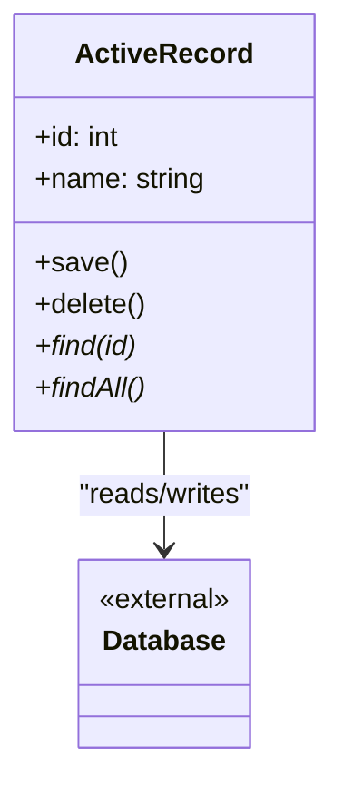

# Active Record Pattern


## Overview

The **Active Record** pattern is an architectural data access pattern where a class wraps a single row in a database table or view, encapsulates the database access, and adds domain logic to that data. An Active Record object knows how to load, save, and delete itself from the database.

**Key advantage**: It provides a highly intuitive, developer-friendly interface for simple CRUD operations, making rapid application development incredibly fast.

**Modern perspective**: Active Record is the backbone of many major web frameworks (Ruby on Rails, Laravel, Django, early TypeORM). While it is heavily criticized by proponents of pure Domain-Driven Design (DDD) for mixing persistence with business logic, it remains an incredibly effective pattern for most standard web applications where the domain model closely mirrors the database schema.

## The Problem

When building data-driven applications, if you do not use an ORM (Object-Relational Mapper) or an architectural pattern, you end up writing raw SQL scattered throughout your business logic.

```typescript
// ❌ Bad: Scattered Data Access and Business Logic
function registerUser(name: string, email: string) {
  // Business logic mixed with persistence
  const isValid = email.includes("@");
  if (!isValid) throw new Error("Invalid email");

  // Raw SQL scattered in the service layer
  database.execute("INSERT INTO users (name, email) VALUES (?, ?)", [
    name,
    email,
  ]);

  // Need the ID back? More raw SQL.
  const result = database.query("SELECT id FROM users WHERE email = ?", [
    email,
  ]);
  return result[0].id;
}
```

This leads to:

- **Code Duplication**: You write `INSERT INTO users` in five different files.
- **Leaky Abstractions**: Your controllers and services are deeply coupled to the exact names of your database columns.
- **Maintenance Nightmares**: Changing a database column name means finding and replacing strings across the entire codebase.

## The Solution

The Active Record pattern suggests creating a class that directly represents a table in the database.

- A **Class** maps to a **Database Table**.
- An **Instance** (object) maps to a **Table Row**.
- The **Properties** of the object map to the **Columns** of the table.

The class itself is given methods like `save()`, `delete()`, and static methods like `find()` or `create()`.

```typescript
// ✅ Good: Active Record encapsulates persistence
const user = new User({ name: "John", email: "john@example.com" });
user.save(); // Internally executes the INSERT statement
```

## Structure



## Flow

1. **Creating**: The client instantiates an Active Record object. Calling `.save()` inserts it into the database and populates the generated ID.
2. **Reading**: The client calls a static method like `User.find(1)`. The Active Record class executes the `SELECT` query, maps the row data to an object, and returns it.
3. **Updating**: The client modifies properties on an existing object and calls `.save()`. The object executes an `UPDATE` statement.
4. **Deleting**: The client calls `.delete()`, which executes a `DELETE` statement.

## Real-World Analogy

Think of an **Employee ID Badge**.
The badge contains your data (Name, Role, Photo). But the badge also acts as your access key to enter the building. The data (who you are) and the behavior/persistence (allowing you through the turnstile) are bundled into the exact same physical object. You don't hand your badge to a separate "Door Unlocking Service"; you just tap the badge itself.

## Step-by-Step Implementation

1. **Define the Base Class**: Often, frameworks provide an `ActiveRecord` base class or `Model` class that handles the raw SQL generation.
2. **Create the Entity Class**: Extend the base class. Define properties that match the database columns.
3. **Add Business Logic**: Add methods to the entity class that operate on the data (e.g., `updatePassword()`, `getFullName()`).
4. **Implement Static Finders**: Add class-level methods for querying (`findById`, `findByEmail`).
5. **Implement Persistence**: Implement `save()` to either INSERT (if no ID exists) or UPDATE (if ID exists), and `delete()` to REMOVE.

## Code Examples

We will build a simple Active Record for a `User` entity, simulating the behavior you would get from a framework like Laravel Eloquent or Ruby on Rails ActiveRecord.

::: code-group

```typescript [TypeScript]
// Mock Database connection
const db = {
  execute: (sql: string, params: any[] = []) =>
    console.log(`[DB EXECUTE] ${sql} | Params:`, params),
  query: (sql: string, params: any[] = []) => {
    console.log(`[DB QUERY] ${sql} | Params:`, params);
    return [{ id: 1, name: "John Doe", email: "john@test.com", is_active: 1 }];
  },
};

// 1. The Active Record Class
class User {
  public id: number | null = null;
  public name: string;
  public email: string;
  public isActive: boolean;

  constructor(name: string, email: string, isActive: boolean = true) {
    this.name = name;
    this.email = email;
    this.isActive = isActive;
  }

  // --- Business Logic ---
  public deactivate(): void {
    this.isActive = false;
    this.save();
  }

  public getDisplayName(): string {
    return `${this.name} (${this.email})`;
  }

  // --- Persistence Logic (Instance Methods) ---
  public save(): void {
    if (this.id === null) {
      // Create (INSERT)
      db.execute(
        "INSERT INTO users (name, email, is_active) VALUES (?, ?, ?)",
        [this.name, this.email, this.isActive ? 1 : 0],
      );
      this.id = 1; // Simulate generated ID
      console.log(`✅ User inserted with ID: ${this.id}`);
    } else {
      // Update (UPDATE)
      db.execute(
        "UPDATE users SET name = ?, email = ?, is_active = ? WHERE id = ?",
        [this.name, this.email, this.isActive ? 1 : 0, this.id],
      );
      console.log(`✅ User ${this.id} updated.`);
    }
  }

  public delete(): void {
    if (this.id !== null) {
      db.execute("DELETE FROM users WHERE id = ?", [this.id]);
      this.id = null;
      console.log("✅ User deleted.");
    }
  }

  // --- Static Finders (Class Methods) ---
  public static findById(id: number): User | null {
    const rows = db.query("SELECT * FROM users WHERE id = ? LIMIT 1", [id]);
    if (rows.length === 0) return null;

    const row = rows[0];
    const user = new User(row.name, row.email, row.is_active === 1);
    user.id = row.id;
    return user;
  }
}

// 2. Client Code
console.log("--- Creating User ---");
const user = new User("Alice", "alice@example.com");
user.save(); // INSERTS

console.log("\n--- Updating User ---");
user.name = "Alice Smith";
user.save(); // UPDATES

console.log("\n--- Finding User ---");
const loadedUser = User.findById(1);
if (loadedUser) {
  console.log(`Found: ${loadedUser.getDisplayName()}`);
  loadedUser.deactivate(); // Business logic + UPDATE
}
```

```python [Python]
class MockDB:
    @staticmethod
    def execute(sql: str, params: tuple = ()) -> None:
        print(f"[DB EXECUTE] {sql} | Params: {params}")

    @staticmethod
    def query(sql: str, params: tuple = ()) -> list:
        print(f"[DB QUERY] {sql} | Params: {params}")
        # Mocking a returned row
        return [{"id": 1, "name": "John Doe", "email": "john@test.com", "is_active": 1}]

# 1. The Active Record Class
class User:
    def __init__(self, name: str, email: str, is_active: bool = True):
        self.id = None
        self.name = name
        self.email = email
        self.is_active = is_active

    # --- Business Logic ---
    def deactivate(self) -> None:
        self.is_active = False
        self.save()

    def get_display_name(self) -> str:
        return f"{self.name} ({self.email})"

    # --- Persistence Logic (Instance Methods) ---
    def save(self) -> None:
        if self.id is None:
            # Create (INSERT)
            MockDB.execute(
                "INSERT INTO users (name, email, is_active) VALUES (?, ?, ?)",
                (self.name, self.email, 1 if self.is_active else 0)
            )
            self.id = 1  # Simulate generated ID
            print(f"✅ User inserted with ID: {self.id}")
        else:
            # Update (UPDATE)
            MockDB.execute(
                "UPDATE users SET name = ?, email = ?, is_active = ? WHERE id = ?",
                (self.name, self.email, 1 if self.is_active else 0, self.id)
            )
            print(f"✅ User {self.id} updated.")

    def delete(self) -> None:
        if self.id is not None:
            MockDB.execute("DELETE FROM users WHERE id = ?", (self.id,))
            self.id = None
            print("✅ User deleted.")

    # --- Static Finders (Class Methods) ---
    @classmethod
    def find_by_id(cls, user_id: int) -> 'User':
        rows = MockDB.query("SELECT * FROM users WHERE id = ? LIMIT 1", (user_id,))
        if not rows:
            return None

        row = rows[0]
        user = cls(row["name"], row["email"], bool(row["is_active"]))
        user.id = row["id"]
        return user

# 2. Client Code
if __name__ == "__main__":
    print("--- Creating User ---")
    user = User("Alice", "alice@example.com")
    user.save() # INSERTS

    print("\n--- Updating User ---")
    user.name = "Alice Smith"
    user.save() # UPDATES

    print("\n--- Finding User ---")
    loaded_user = User.find_by_id(1)
    if loaded_user:
        print(f"Found: {loaded_user.get_display_name()}")
        loaded_user.deactivate() # Business logic + UPDATE
```

```java [Java]
import java.util.List;

// Mock DB
class MockDB {
    public static void execute(String sql, Object... params) {
        System.out.printf("[DB EXECUTE] %s | Params count: %d%n", sql, params.length);
    }

    public static Object[] queryRow(String sql, Object... params) {
        System.out.printf("[DB QUERY] %s%n", sql);
        // Mock row data
        return new Object[]{1, "John Doe", "john@test.com", true};
    }
}

// 1. The Active Record Class
class User {
    private Integer id = null;
    private String name;
    private String email;
    private boolean isActive;

    public User(String name, String email, boolean isActive) {
        this.name = name;
        this.email = email;
        this.isActive = isActive;
    }

    public Integer getId() { return id; }
    public void setName(String name) { this.name = name; }
    public String getName() { return name; }

    // --- Business Logic ---
    public void deactivate() {
        this.isActive = false;
        this.save();
    }

    public String getDisplayName() {
        return name + " (" + email + ")";
    }

    // --- Persistence Logic ---
    public void save() {
        if (this.id == null) {
            // INSERT
            MockDB.execute("INSERT INTO users (name, email, is_active) VALUES (?, ?, ?)",
                           name, email, isActive);
            this.id = 1; // Simulate generated ID
            System.out.println("✅ User inserted with ID: " + this.id);
        } else {
            // UPDATE
            MockDB.execute("UPDATE users SET name = ?, email = ?, is_active = ? WHERE id = ?",
                           name, email, isActive, id);
            System.out.println("✅ User " + this.id + " updated.");
        }
    }

    public void delete() {
        if (this.id != null) {
            MockDB.execute("DELETE FROM users WHERE id = ?", id);
            this.id = null;
            System.out.println("✅ User deleted.");
        }
    }

    // --- Static Finders ---
    public static User findById(int searchId) {
        Object[] row = MockDB.queryRow("SELECT * FROM users WHERE id = ? LIMIT 1", searchId);
        if (row == null) return null;

        User user = new User((String)row[1], (String)row[2], (Boolean)row[3]);
        user.id = (Integer)row[0];
        return user;
    }
}

// 2. Client Code
public class ActiveRecordDemo {
    public static void main(String[] args) {
        System.out.println("--- Creating User ---");
        User user = new User("Alice", "alice@example.com", true);
        user.save(); // INSERTS

        System.out.println("\n--- Updating User ---");
        user.setName("Alice Smith");
        user.save(); // UPDATES

        System.out.println("\n--- Finding User ---");
        User loadedUser = User.findById(1);
        if (loadedUser != null) {
            System.out.println("Found: " + loadedUser.getDisplayName());
            loadedUser.deactivate(); // Business logic + UPDATE
        }
    }
}
```

```go [Go]
package main

import (
	"fmt"
)

// Mock DB
var MockDB = struct {
	Execute func(sql string, params ...interface{})
	Query   func(sql string, params ...interface{}) map[string]interface{}
}{
	Execute: func(sql string, params ...interface{}) {
		fmt.Printf("[DB EXECUTE] %s | Params: %v\n", sql, params)
	},
	Query: func(sql string, params ...interface{}) map[string]interface{} {
		fmt.Printf("[DB QUERY] %s | Params: %v\n", sql, params)
		return map[string]interface{}{
			"id":        1,
			"name":      "John Doe",
			"email":     "john@test.com",
			"is_active": true,
		}
	},
}

// 1. The Active Record Struct
// In Go, we attach methods to a struct instead of a class.
type User struct {
	ID       *int
	Name     string
	Email    string
	IsActive bool
}

func NewUser(name, email string) *User {
	return &User{
		Name:     name,
		Email:    email,
		IsActive: true,
	}
}

// --- Business Logic ---
func (u *User) Deactivate() {
	u.IsActive = false
	u.Save()
}

func (u *User) GetDisplayName() string {
	return fmt.Sprintf("%s (%s)", u.Name, u.Email)
}

// --- Persistence Logic ---
func (u *User) Save() {
	if u.ID == nil {
		// INSERT
		MockDB.Execute("INSERT INTO users (name, email, is_active) VALUES (?, ?, ?)", u.Name, u.Email, u.IsActive)
		id := 1
		u.ID = &id // Simulate generated ID
		fmt.Printf("✅ User inserted with ID: %d\n", *u.ID)
	} else {
		// UPDATE
		MockDB.Execute("UPDATE users SET name = ?, email = ?, is_active = ? WHERE id = ?", u.Name, u.Email, u.IsActive, *u.ID)
		fmt.Printf("✅ User %d updated.\n", *u.ID)
	}
}

func (u *User) Delete() {
	if u.ID != nil {
		MockDB.Execute("DELETE FROM users WHERE id = ?", *u.ID)
		u.ID = nil
		fmt.Println("✅ User deleted.")
	}
}

// --- Finders (Top-level functions in Go) ---
func FindUserByID(id int) *User {
	row := MockDB.Query("SELECT * FROM users WHERE id = ? LIMIT 1", id)
	if row == nil {
		return nil
	}

	userId := row["id"].(int)
	return &User{
		ID:       &userId,
		Name:     row["name"].(string),
		Email:    row["email"].(string),
		IsActive: row["is_active"].(bool),
	}
}

// 2. Client Code
func main() {
	fmt.Println("--- Creating User ---")
	user := NewUser("Alice", "alice@example.com")
	user.Save()

	fmt.Println("\n--- Updating User ---")
	user.Name = "Alice Smith"
	user.Save()

	fmt.Println("\n--- Finding User ---")
	loadedUser := FindUserByID(1)
	if loadedUser != nil {
		fmt.Printf("Found: %s\n", loadedUser.GetDisplayName())
		loadedUser.Deactivate()
	}
}
```

```rust [Rust]
use std::cell::RefCell;
use std::collections::HashMap;

// Mock DB context
struct MockDB;
impl MockDB {
    fn execute(sql: &str, params: &[&str]) {
        println!("[DB EXECUTE] {} | Params: {:?}", sql, params);
    }

    fn query(sql: &str, _params: &[&str]) -> Option<HashMap<&'static str, &'static str>> {
        println!("[DB QUERY] {}", sql);
        let mut row = HashMap::new();
        row.insert("id", "1");
        row.insert("name", "John Doe");
        row.insert("email", "john@test.com");
        row.insert("is_active", "1");
        Some(row)
    }
}

// 1. The Active Record Struct
pub struct User {
    pub id: Option<i32>,
    pub name: String,
    pub email: String,
    pub is_active: bool,
}

impl User {
    pub fn new(name: &str, email: &str) -> Self {
        Self {
            id: None,
            name: name.to_string(),
            email: email.to_string(),
            is_active: true,
        }
    }

    // --- Business Logic ---
    pub fn deactivate(&mut self) {
        self.is_active = false;
        self.save();
    }

    pub fn get_display_name(&self) -> String {
        format!("{} ({})", self.name, self.email)
    }

    // --- Persistence Logic ---
    pub fn save(&mut self) {
        let active_str = if self.is_active { "1" } else { "0" };

        if self.id.is_none() {
            // INSERT
            MockDB::execute(
                "INSERT INTO users (name, email, is_active) VALUES (?, ?, ?)",
                &[&self.name, &self.email, active_str]
            );
            self.id = Some(1); // Simulate generated ID
            println!("✅ User inserted with ID: 1");
        } else {
            // UPDATE
            let id_str = self.id.unwrap().to_string();
            MockDB::execute(
                "UPDATE users SET name = ?, email = ?, is_active = ? WHERE id = ?",
                &[&self.name, &self.email, active_str, &id_str]
            );
            println!("✅ User {} updated.", self.id.unwrap());
        }
    }

    pub fn delete(&mut self) {
        if let Some(id) = self.id {
            let id_str = id.to_string();
            MockDB::execute("DELETE FROM users WHERE id = ?", &[&id_str]);
            self.id = None;
            println!("✅ User deleted.");
        }
    }

    // --- Static Finders ---
    pub fn find_by_id(id: i32) -> Option<User> {
        let id_str = id.to_string();
        let row_opt = MockDB::query("SELECT * FROM users WHERE id = ? LIMIT 1", &[&id_str]);

        if let Some(row) = row_opt {
            Some(User {
                id: Some(row.get("id")?.parse().unwrap()),
                name: row.get("name")?.to_string(),
                email: row.get("email")?.to_string(),
                is_active: row.get("is_active")? == &"1",
            })
        } else {
            None
        }
    }
}

// 2. Client Code
fn main() {
    println!("--- Creating User ---");
    let mut user = User::new("Alice", "alice@example.com");
    user.save(); // INSERTS

    println!("\n--- Updating User ---");
    user.name = "Alice Smith".to_string();
    user.save(); // UPDATES

    println!("\n--- Finding User ---");
    if let Some(mut loaded_user) = User::find_by_id(1) {
        println!("Found: {}", loaded_user.get_display_name());
        loaded_user.deactivate(); // Business logic + UPDATE
    }
}
```

:::

## Pros and Cons

### Advantages

- **Unbeatable Simplicity**: For standard CRUD operations, no pattern gets an application up and running faster.
- **Intuitive API**: Calling `user.save()` is incredibly easy to read and understand.
- **Convention over Configuration**: Active Record frameworks usually infer database tables, foreign keys, and relationships, saving massive amounts of boilerplate code.
- **Everything in One Place**: You don't have to navigate between Repositories, Domain Entities, and Mappers to understand how a single database table behaves.

### Disadvantages

- **Violation of the Single Responsibility Principle**: The class handles both complex domain business logic AND database connection/querying logic.
- **Testing Difficulties**: Because objects interact directly with the database, unit testing business logic usually requires a running database or complex mocking tools.
- **Rigid Schema Coupling**: Your domain model is forced to look exactly like your database schema. If the database schema is highly denormalized or heavily normalized for performance, your business objects must reflect that, leading to awkward APIs.

## When to Use

- **Rapid Application Development (RAD)**: Startups, MVPs, and internal tools where getting to market quickly is more important than achieving perfect architectural purity.
- **CRUD-Heavy Applications**: If your application is essentially forms mapping directly to database tables without massive amounts of complex workflow logic.
- **Small to Medium Complexity Domains**: Where a `User` class is just a User, and an `Order` class is just an Order.

## When NOT to Use

- **Complex Domain-Driven Design (DDD)**: If your domain model requires complex aggregates, deep validation rules, and objects that do not map cleanly 1:1 with database tables, Active Record will become an unmaintainable anti-pattern.
- **High-Scale Enterprise Architectures**: When the database schema must be heavily optimized in ways that shouldn't impact the business logic layer.
- **Microservices separating Read and Write models**: If you are using CQRS (Command Query Responsibility Segregation), Active Record tightly couples reads and writes together.

## Common Mistakes

### 1. The "Fat Model" Anti-Pattern

Because everything goes into the Active Record class, developers often end up with 3,000-line `User.php` or `user.rb` files containing everything from password hashing to sending welcome emails to triggering Stripe payments. _Solution: Keep models focused on persistence and core validation; move complex operations to Service classes or Event Handlers._

### 2. N+1 Query Problem

Looping over an array of Active Records and accessing a related property (e.g., `user.posts`) often triggers a separate `SELECT` query for _every single item in the loop_, crushing database performance. Ensure your implementation supports Eager Loading (e.g., `User.with('posts').findAll()`).

## Related Patterns

- **Data Mapper**: The philosophical opposite of Active Record. Separates the Domain Object from the persistence logic.
- **Repository**: Often used as an abstraction layer above Active Record (or Data Mapper) to provide a collection-like interface for accessing objects.
- **Unit of Work**: Manages multiple Active Record operations in a single database transaction.

## Interview Insights

- **Question**: "What is the primary architectural difference between Active Record and Data Mapper?"
  - **Answer**: "In Active Record, the domain entity knows about the database. It contains `save()` and `delete()` methods. In Data Mapper, the domain entity is a Plain Old Object (POJO/POCO) that has absolutely no knowledge of the database. A separate Data Mapper or Repository class handles moving data between the database and the entity."
- **Question**: "Why do Domain-Driven Design (DDD) practitioners dislike Active Record?"
  - **Answer**: "Because it violates the Single Responsibility Principle and couples the domain model to the database schema. In DDD, the domain model should dictate business rules purely in memory, unconstrained by how data is persisted."

## Modern Alternatives

- **Data Mapper ORMs**: Modern ecosystems often favor Data Mapper ORMs (like TypeORM in its Data Mapper mode, Prisma, or Hibernate) for complex enterprise apps to keep the domain clean.
- **Query Builders**: Instead of mapping rows to objects at all, developers in high-performance or functional contexts often use query builders (like Knex.js or Kysely) to just return raw structs/interfaces, skipping the overhead of instantiating "smart" Active Record objects.
