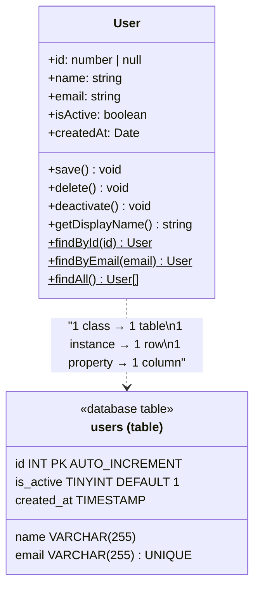
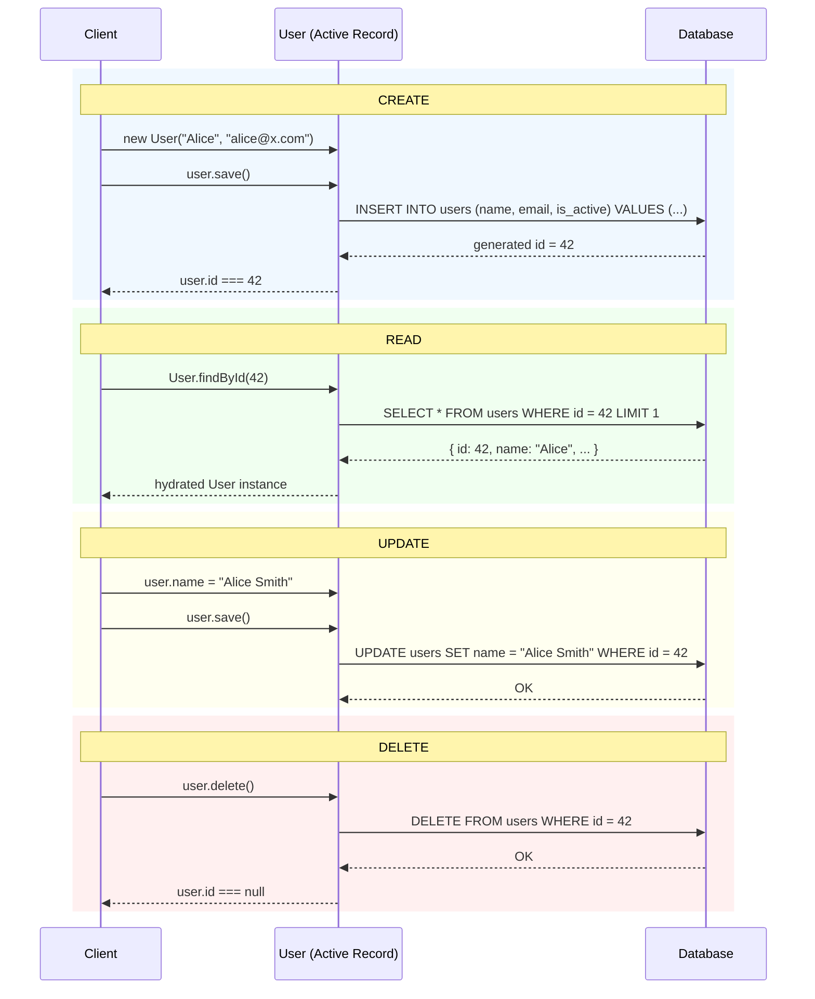
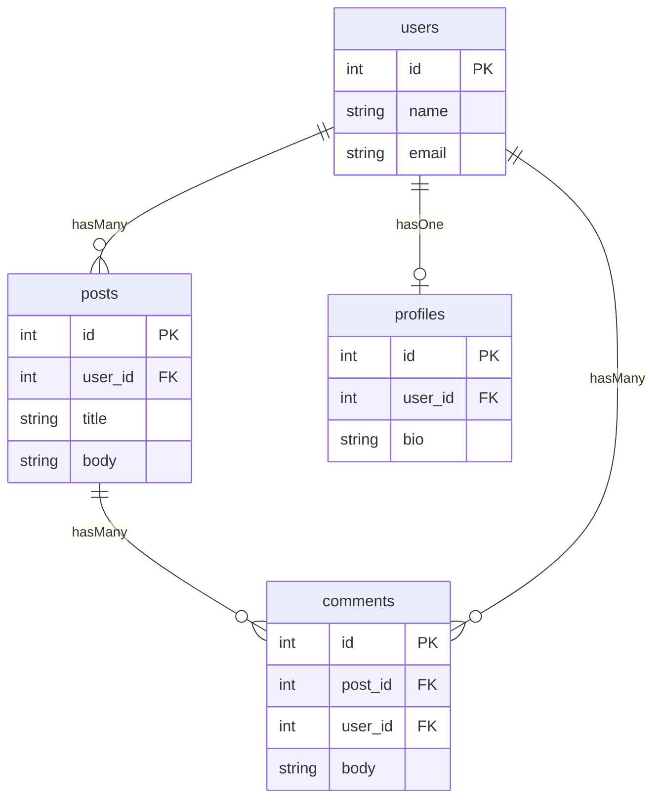
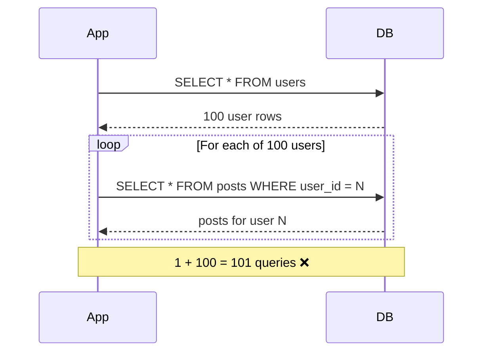
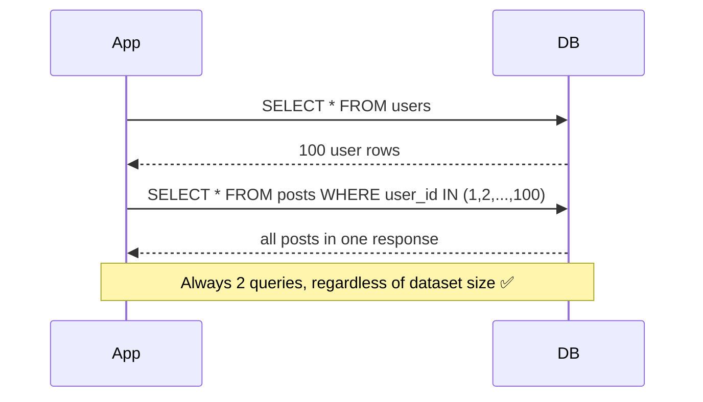
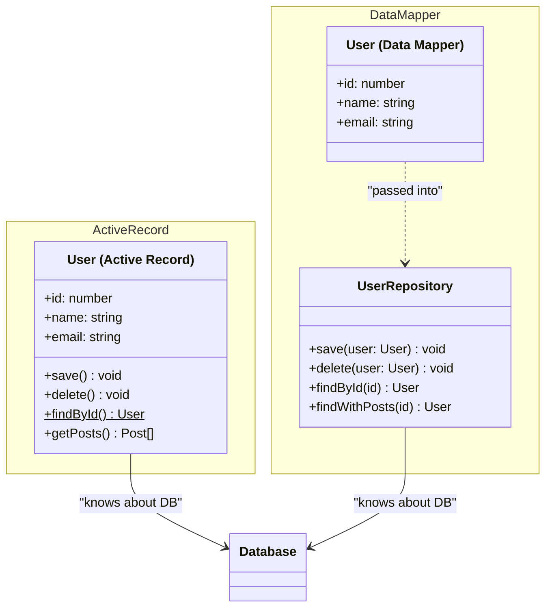
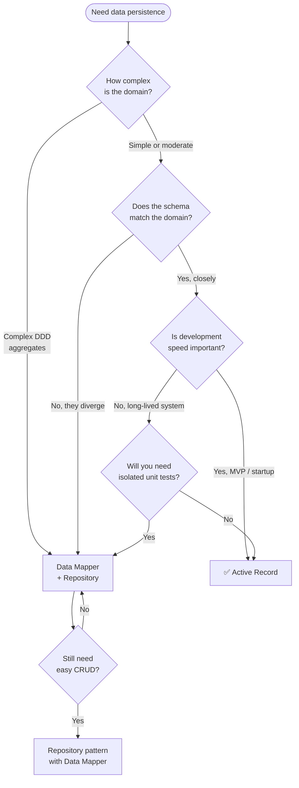

# Active Record Pattern

<CoverImage src="/covers/architectural/active-record.png" alt="Cover">
  <h1>Active Record</h1>
  <p>A funny file folder with giant, muscular cartoon arms and legs, carrying its own data sheets while confidently stomping towards a neat filing cabinet to file itself.</p>
</CoverImage>

## Overview

The **Active Record** pattern wraps a single database row inside an object that also knows how to persist itself. The class maps to a table, an instance maps to a row, and properties map to columns. Persistence — `save()`, `delete()`, and static finders — lives directly on the domain object alongside business logic.

This is the backbone of many major web frameworks: Ruby on Rails' `ActiveRecord`, Laravel's `Eloquent`, and Django's ORM all implement it. The pattern is criticized by Domain-Driven Design (DDD) practitioners for violating the Single Responsibility Principle, and that criticism is fair in complex domains. But Active Record is extraordinarily productive for the large class of applications where the domain model closely mirrors the database schema and speed of development matters more than architectural purity.

Understand its strengths and its failure modes, and you will know exactly when to reach for it — and when to reach for [Data Mapper](/architectural/data-mapper) instead.

## Real-World Analogy

Imagine a **self-filing document**. Most documents are passive — you write data on them, and then a separate filing clerk picks them up and decides where to store them. An Active Record document is different: it knows its own filing rules. Write your data on it, and it walks itself to the correct cabinet, opens the right drawer, and slots itself in. It can also retrieve itself later if you ask, and shred itself when it is no longer needed.

The document's data and its filing behavior are inseparable — they travel together. That bundling is both the appeal and the architectural trade-off of Active Record.

## The Problem

Without an organized data access pattern, SQL leaks into business logic, creating code that is hard to test, hard to maintain, and impossible to refactor safely.

```typescript
// ❌ Raw SQL scattered through business logic
function registerUser(name: string, email: string): number {
  // Validation tangled with persistence
  if (!email.includes("@")) throw new Error("Invalid email");

  database.execute(
    "INSERT INTO users (name, email, is_active) VALUES (?, ?, 1)",
    [name, email],
  );

  // Need the generated ID? Another query.
  const result = database.query("SELECT id FROM users WHERE email = ?", [
    email,
  ]);
  return result[0].id;
}
```

**What goes wrong:**

- `INSERT INTO users` gets written in five different service files.
- Renaming a database column means a grep-and-pray across the whole codebase.
- Unit testing this function requires a running database.
- The caller has no idea this function touches a database at all.

## The Solution

Move all persistence knowledge into the class that owns the data. The class itself becomes the authoritative place for CRUD operations, and callers never write SQL.

```typescript
// ✅ Active Record: data and persistence in one place
const user = new User("Alice", "alice@example.com");
user.save(); // Executes INSERT — caller doesn't know or care

const existing = User.findById(1); // Executes SELECT — returns a typed object
existing.name = "Alice Smith";
existing.save(); // Executes UPDATE — same call, different SQL path
```

The calling code is readable, self-documenting, and decoupled from SQL syntax.

## How the Mapping Works



### Participants

| Participant                      | Role                                                                                                                                             |
| -------------------------------- | ------------------------------------------------------------------------------------------------------------------------------------------------ |
| **Active Record class** (`User`) | Maps to a database table. Holds properties for each column, instance methods for persistence and business logic, and static methods for queries. |
| **Active Record instance**       | Represents a single database row. Calling `save()` either inserts or updates depending on whether an ID exists.                                  |
| **Database**                     | The underlying persistence store. The Active Record class knows how to talk to it directly.                                                      |

## CRUD Lifecycle



The `save()` method's dual role — INSERT for new records, UPDATE for existing ones — is one of Active Record's most ergonomic features. The caller never has to decide which SQL statement to use.

## Implementation

### Core Steps

1. Create a base class (or extend your framework's provided one) that holds database connection logic and generic `save()` / `delete()` / `find()` implementations.
2. Create an entity class that extends the base. Declare properties matching the table columns.
3. Add business logic as instance methods directly on the entity class.
4. Add static finder methods that execute `SELECT` queries and return hydrated instances.
5. Implement `save()` to branch on whether `id` is null (INSERT) or set (UPDATE).

::: code-group

```typescript [TypeScript]
// Mock database
const db = {
  execute: (sql: string, params: unknown[] = []) =>
    console.log(`[DB] ${sql}`, params),
  query: (sql: string, params: unknown[] = []) => {
    console.log(`[DB] ${sql}`, params);
    return [{ id: 1, name: "John Doe", email: "john@test.com", is_active: 1 }];
  },
};

class User {
  public id: number | null = null;
  public name: string;
  public email: string;
  public isActive: boolean;
  public createdAt: Date = new Date();

  constructor(name: string, email: string, isActive = true) {
    this.name = name;
    this.email = email;
    this.isActive = isActive;
  }

  // ── Business Logic ────────────────────────────────────────────────────────

  deactivate(): void {
    this.isActive = false;
    this.save();
  }

  getDisplayName(): string {
    return `${this.name} <${this.email}>`;
  }

  // ── Persistence ───────────────────────────────────────────────────────────

  save(): void {
    if (this.id === null) {
      db.execute(
        "INSERT INTO users (name, email, is_active) VALUES (?, ?, ?)",
        [this.name, this.email, this.isActive ? 1 : 0],
      );
      this.id = 1; // In production: db.lastInsertId()
    } else {
      db.execute(
        "UPDATE users SET name = ?, email = ?, is_active = ? WHERE id = ?",
        [this.name, this.email, this.isActive ? 1 : 0, this.id],
      );
    }
  }

  delete(): void {
    if (this.id === null) return;
    db.execute("DELETE FROM users WHERE id = ?", [this.id]);
    this.id = null;
  }

  // ── Finders ───────────────────────────────────────────────────────────────

  static findById(id: number): User | null {
    const rows = db.query("SELECT * FROM users WHERE id = ? LIMIT 1", [id]);
    if (!rows.length) return null;
    return User.hydrate(rows[0]);
  }

  static findByEmail(email: string): User | null {
    const rows = db.query("SELECT * FROM users WHERE email = ? LIMIT 1", [
      email,
    ]);
    if (!rows.length) return null;
    return User.hydrate(rows[0]);
  }

  static findAllActive(): User[] {
    const rows = db.query("SELECT * FROM users WHERE is_active = 1");
    return rows.map(User.hydrate);
  }

  private static hydrate(row: Record<string, unknown>): User {
    const user = new User(
      row.name as string,
      row.email as string,
      row.is_active === 1,
    );
    user.id = row.id as number;
    return user;
  }
}

// ── Usage ─────────────────────────────────────────────────────────────────

const user = new User("Alice", "alice@example.com");
user.save(); // INSERT

user.name = "Alice Smith";
user.save(); // UPDATE

const found = User.findById(1);
found?.deactivate(); // business logic + UPDATE

found?.delete(); // DELETE
```

```python [Python]
from datetime import datetime

class MockDB:
    @staticmethod
    def execute(sql: str, params: tuple = ()) -> None:
        print(f"[DB] {sql} | {params}")

    @staticmethod
    def query(sql: str, params: tuple = ()) -> list[dict]:
        print(f"[DB] {sql} | {params}")
        return [{"id": 1, "name": "John Doe", "email": "john@test.com", "is_active": 1}]


class User:
    def __init__(self, name: str, email: str, is_active: bool = True):
        self.id: int | None = None
        self.name = name
        self.email = email
        self.is_active = is_active
        self.created_at = datetime.now()

    # ── Business Logic ────────────────────────────────────────────────────────

    def deactivate(self) -> None:
        self.is_active = False
        self.save()

    def get_display_name(self) -> str:
        return f"{self.name} <{self.email}>"

    # ── Persistence ───────────────────────────────────────────────────────────

    def save(self) -> None:
        if self.id is None:
            MockDB.execute(
                "INSERT INTO users (name, email, is_active) VALUES (?, ?, ?)",
                (self.name, self.email, int(self.is_active))
            )
            self.id = 1  # In production: db.lastrowid
        else:
            MockDB.execute(
                "UPDATE users SET name = ?, email = ?, is_active = ? WHERE id = ?",
                (self.name, self.email, int(self.is_active), self.id)
            )

    def delete(self) -> None:
        if self.id is not None:
            MockDB.execute("DELETE FROM users WHERE id = ?", (self.id,))
            self.id = None

    # ── Finders ───────────────────────────────────────────────────────────────

    @classmethod
    def find_by_id(cls, user_id: int) -> "User | None":
        rows = MockDB.query("SELECT * FROM users WHERE id = ? LIMIT 1", (user_id,))
        return cls._hydrate(rows[0]) if rows else None

    @classmethod
    def find_all_active(cls) -> list["User"]:
        rows = MockDB.query("SELECT * FROM users WHERE is_active = 1")
        return [cls._hydrate(row) for row in rows]

    @classmethod
    def _hydrate(cls, row: dict) -> "User":
        user = cls(row["name"], row["email"], bool(row["is_active"]))
        user.id = row["id"]
        return user


# ── Usage ─────────────────────────────────────────────────────────────────

user = User("Alice", "alice@example.com")
user.save()             # INSERT

user.name = "Alice Smith"
user.save()             # UPDATE

found = User.find_by_id(1)
if found:
    print(found.get_display_name())
    found.deactivate()  # business logic + UPDATE
    found.delete()      # DELETE
```

```java [Java]
import java.time.LocalDateTime;

class MockDB {
    static void execute(String sql, Object... params) {
        System.out.printf("[DB] %s%n", sql);
    }
    static Object[] queryRow(String sql, Object... params) {
        System.out.printf("[DB] %s%n", sql);
        return new Object[]{1, "John Doe", "john@test.com", true};
    }
}

class User {
    private Integer id;
    private String name;
    private String email;
    private boolean active;
    private LocalDateTime createdAt = LocalDateTime.now();

    public User(String name, String email) {
        this.name = name;
        this.email = email;
        this.active = true;
    }

    // ── Business Logic ────────────────────────────────────────────────────────

    public void deactivate() {
        this.active = false;
        this.save();
    }

    public String getDisplayName() {
        return name + " <" + email + ">";
    }

    // ── Persistence ───────────────────────────────────────────────────────────

    public void save() {
        if (id == null) {
            MockDB.execute(
                "INSERT INTO users (name, email, is_active) VALUES (?, ?, ?)",
                name, email, active
            );
            this.id = 1; // In production: Statement.RETURN_GENERATED_KEYS
        } else {
            MockDB.execute(
                "UPDATE users SET name = ?, email = ?, is_active = ? WHERE id = ?",
                name, email, active, id
            );
        }
    }

    public void delete() {
        if (id != null) {
            MockDB.execute("DELETE FROM users WHERE id = ?", id);
            this.id = null;
        }
    }

    // ── Finders ───────────────────────────────────────────────────────────────

    public static User findById(int searchId) {
        Object[] row = MockDB.queryRow(
            "SELECT * FROM users WHERE id = ? LIMIT 1", searchId
        );
        if (row == null) return null;
        User user = new User((String) row[1], (String) row[2]);
        user.id = (Integer) row[0];
        user.active = (Boolean) row[3];
        return user;
    }

    public Integer getId() { return id; }
    public void setName(String name) { this.name = name; }
}

// ── Usage ─────────────────────────────────────────────────────────────────

// In main():
User user = new User("Alice", "alice@example.com");
user.save();

user.setName("Alice Smith");
user.save();

User found = User.findById(1);
if (found != null) {
    System.out.println(found.getDisplayName());
    found.deactivate();
    found.delete();
}
```

```go [Go]
package main

import "fmt"

// MockDB simulates a database
var db = struct {
    Execute func(sql string, params ...any)
    Query   func(sql string, params ...any) map[string]any
}{
    Execute: func(sql string, params ...any) {
        fmt.Printf("[DB] %s %v\n", sql, params)
    },
    Query: func(sql string, params ...any) map[string]any {
        fmt.Printf("[DB] %s %v\n", sql, params)
        return map[string]any{
            "id": 1, "name": "John Doe",
            "email": "john@test.com", "is_active": true,
        }
    },
}

// User is the Active Record struct
type User struct {
    ID       *int
    Name     string
    Email    string
    IsActive bool
}

func NewUser(name, email string) *User {
    return &User{Name: name, Email: email, IsActive: true}
}

// ── Business Logic ────────────────────────────────────────────────────────

func (u *User) Deactivate() {
    u.IsActive = false
    u.Save()
}

func (u *User) GetDisplayName() string {
    return fmt.Sprintf("%s <%s>", u.Name, u.Email)
}

// ── Persistence ───────────────────────────────────────────────────────────

func (u *User) Save() {
    if u.ID == nil {
        db.Execute(
            "INSERT INTO users (name, email, is_active) VALUES (?, ?, ?)",
            u.Name, u.Email, u.IsActive,
        )
        id := 1
        u.ID = &id
    } else {
        db.Execute(
            "UPDATE users SET name = ?, email = ?, is_active = ? WHERE id = ?",
            u.Name, u.Email, u.IsActive, *u.ID,
        )
    }
}

func (u *User) Delete() {
    if u.ID != nil {
        db.Execute("DELETE FROM users WHERE id = ?", *u.ID)
        u.ID = nil
    }
}

// ── Finders ───────────────────────────────────────────────────────────────

func FindUserByID(id int) *User {
    row := db.Query("SELECT * FROM users WHERE id = ? LIMIT 1", id)
    if row == nil {
        return nil
    }
    uid := row["id"].(int)
    return &User{
        ID:       &uid,
        Name:     row["name"].(string),
        Email:    row["email"].(string),
        IsActive: row["is_active"].(bool),
    }
}

// ── Usage ─────────────────────────────────────────────────────────────────

func main() {
    user := NewUser("Alice", "alice@example.com")
    user.Save()

    user.Name = "Alice Smith"
    user.Save()

    found := FindUserByID(1)
    if found != nil {
        fmt.Println(found.GetDisplayName())
        found.Deactivate()
        found.Delete()
    }
}
```

```rust [Rust]
use std::collections::HashMap;

struct MockDB;
impl MockDB {
    fn execute(sql: &str, params: &[&str]) {
        println!("[DB] {} {:?}", sql, params);
    }
    fn query(sql: &str, _params: &[&str]) -> Option<HashMap<&'static str, &'static str>> {
        println!("[DB] {}", sql);
        Some(HashMap::from([
            ("id", "1"), ("name", "John Doe"),
            ("email", "john@test.com"), ("is_active", "1"),
        ]))
    }
}

pub struct User {
    pub id: Option<i32>,
    pub name: String,
    pub email: String,
    pub is_active: bool,
}

impl User {
    pub fn new(name: &str, email: &str) -> Self {
        Self { id: None, name: name.into(), email: email.into(), is_active: true }
    }

    // ── Business Logic ────────────────────────────────────────────────────────

    pub fn deactivate(&mut self) {
        self.is_active = false;
        self.save();
    }

    pub fn get_display_name(&self) -> String {
        format!("{} <{}>", self.name, self.email)
    }

    // ── Persistence ───────────────────────────────────────────────────────────

    pub fn save(&mut self) {
        let active = if self.is_active { "1" } else { "0" };
        if self.id.is_none() {
            MockDB::execute(
                "INSERT INTO users (name, email, is_active) VALUES (?, ?, ?)",
                &[&self.name, &self.email, active],
            );
            self.id = Some(1);
        } else {
            let id_str = self.id.unwrap().to_string();
            MockDB::execute(
                "UPDATE users SET name = ?, email = ?, is_active = ? WHERE id = ?",
                &[&self.name, &self.email, active, &id_str],
            );
        }
    }

    pub fn delete(&mut self) {
        if let Some(id) = self.id {
            MockDB::execute("DELETE FROM users WHERE id = ?", &[&id.to_string()]);
            self.id = None;
        }
    }

    // ── Finders ───────────────────────────────────────────────────────────────

    pub fn find_by_id(id: i32) -> Option<User> {
        let row = MockDB::query(
            "SELECT * FROM users WHERE id = ? LIMIT 1",
            &[&id.to_string()],
        )?;
        Some(User {
            id: Some(row["id"].parse().unwrap()),
            name: row["name"].to_string(),
            email: row["email"].to_string(),
            is_active: row["is_active"] == "1",
        })
    }
}

fn main() {
    let mut user = User::new("Alice", "alice@example.com");
    user.save();

    user.name = "Alice Smith".into();
    user.save();

    if let Some(mut found) = User::find_by_id(1) {
        println!("{}", found.get_display_name());
        found.deactivate();
        found.delete();
    }
}
```

:::

## Associations

One of Active Record's most powerful features is association declarations — `hasMany`, `belongsTo`, `hasOne` — that generate the join queries automatically. This is where frameworks like Rails and Laravel really shine, and it's also where the pattern's hidden costs start to appear.

### Types of Associations



```typescript
// TypeScript: manual association loading (no framework magic)
class Post {
  public id: number | null = null;
  public userId: number;
  public title: string;
  public body: string;

  constructor(userId: number, title: string, body: string) {
    this.userId = userId;
    this.title = title;
    this.body = body;
  }

  // hasMany: a post has many comments
  getComments(): Comment[] {
    const rows = db.query("SELECT * FROM comments WHERE post_id = ?", [
      this.id,
    ]);
    return rows.map(Comment.hydrate);
  }

  // belongsTo: a post belongs to a user
  getAuthor(): User | null {
    return User.findById(this.userId);
  }

  save(): void {
    /* INSERT or UPDATE */
  }

  static findById(id: number): Post | null {
    /* SELECT */ return null;
  }
  static hydrate(row: Record<string, unknown>): Post {
    const post = new Post(
      row.user_id as number,
      row.title as string,
      row.body as string,
    );
    post.id = row.id as number;
    return post;
  }
}

// Usage: loading a user's posts with authors
const posts = Post.findByUserId(1);
posts.forEach((post) => {
  const author = post.getAuthor(); // ⚠️ One extra query per post — N+1!
  console.log(`${author?.name}: ${post.title}`);
});
```

In framework implementations (Rails, Eloquent), you would declare these associations declaratively:

```ruby
# Ruby on Rails — Active Record associations
class User < ApplicationRecord
  has_many :posts
  has_one  :profile
  has_many :comments, through: :posts
end

class Post < ApplicationRecord
  belongs_to :user
  has_many   :comments
end

# Rails loads all posts + authors in 2 queries (eager loading)
User.includes(:posts).find(1).posts.each do |post|
  puts post.title
end
```

```php
// Laravel Eloquent — same concept
class User extends Model {
    public function posts() {
        return $this->hasMany(Post::class);
    }
}

// Eager load to avoid N+1
User::with('posts')->find(1)->posts->each(fn($p) => dump($p->title));
```

## The N+1 Query Problem

This is the most common and damaging performance mistake in Active Record codebases. It occurs when you load a list of records and then access an association on each one inside a loop — triggering one query per iteration.

### The Problem



```typescript
// ❌ N+1 — looks innocent, performs terribly
const users = User.findAllActive(); // 1 query: SELECT * FROM users

users.forEach((user) => {
  // This triggers a new SELECT for every user in the loop
  const posts = user.getPosts(); // N queries: SELECT * FROM posts WHERE user_id = ?
  console.log(`${user.name} has ${posts.length} posts`);
});
// Total: 1 + N queries
```

### The Fix: Eager Loading



```typescript
// ✅ Eager loading — tell the query what you'll need upfront
const users = User.findAllWithPosts(); // 2 queries total, regardless of count

// Framework syntax (Rails / Eloquent style):
// User.includes(:posts).where(is_active: true)
// User::with('posts')->where('is_active', 1)->get()

users.forEach((user) => {
  // posts are already in memory — no extra queries
  console.log(`${user.name} has ${user.posts.length} posts`);
});
```

::: warning Always think one level ahead
Before iterating over a collection and accessing any property that could trigger a query, ask: "Is this going to fire a SELECT for every row?" If yes, use eager loading. This single habit prevents the majority of Active Record performance problems.
:::

## Active Record vs. Data Mapper

This is one of the most common architectural decision points in backend development. The choice shapes your entire persistence layer.



| Dimension                   | Active Record                 | Data Mapper                           |
| --------------------------- | ----------------------------- | ------------------------------------- |
| **Database knowledge**      | Lives in the entity           | Lives in a separate mapper/repository |
| **Domain object purity**    | Coupled to schema             | Pure — no persistence concern         |
| **Unit testing**            | Requires DB or complex mocks  | Test domain objects in pure memory    |
| **Schema flexibility**      | Model must mirror the DB      | Model and DB can diverge              |
| **Associations**            | Declarative, built-in         | Explicit, more control                |
| **Development speed**       | Very fast for CRUD            | Slower initial setup                  |
| **Code navigation**         | One class for everything      | Separate domain + persistence layers  |
| **Best framework examples** | Rails, Eloquent, Django ORM   | TypeORM (data mapper mode), Hibernate |
| **Ideal for**               | CRUD apps, MVPs, standard web | DDD, complex domains, microservices   |

The decision is not about which is "better" — it is about which fits your domain complexity and team priorities.

## Advantages and Disadvantages

### ✅ Advantages

- **Developer speed**: The fastest path from database schema to working CRUD operations in any pattern.
- **Readable call sites**: `user.save()` communicates intent clearly. No repositories, factories, or mappers to navigate.
- **Convention over configuration**: Frameworks infer table names, foreign keys, and join conditions, eliminating boilerplate.
- **Colocation**: Business logic and persistence live together. For simple domains, this reduces the cognitive cost of context-switching between files.
- **Rich association support**: `has_many`, `belongs_to`, and `through` associations are first-class citizens in every major framework implementation.

### ❌ Disadvantages

- **Single Responsibility Principle violation**: A `User` class that validates passwords, sends email, and executes SQL is doing too many things.
- **Testing complexity**: Business logic tests often require a running database, dramatically increasing test suite time and fragility.
- **Schema coupling**: The domain model is constrained to mirror the database schema. Normalizing for performance or denormalizing for reads forces awkward domain APIs.
- **Fat model creep**: Without discipline, entity classes grow to thousands of lines as every team member adds "one more method" to the convenient central class.
- **N+1 query risk**: Easy to introduce silently in association-heavy code with no static analysis to catch it.

## When to Use

::: tip Use Active Record when...

- **Rapid development is the priority**: Startups, MVPs, and internal tools where time-to-market outweighs long-term architectural concerns.
- **Your domain is CRUD-heavy**: If most operations are creating, reading, updating, and deleting records without complex multi-aggregate workflows.
- **The schema mirrors the domain**: When a `User` table maps cleanly to a `User` object with no awkward transformation in between.
- **Your team is small**: Active Record's colocation of concerns is a feature when everyone can hold the whole model in their head.

:::

::: warning Avoid Active Record when...

- **You need pure domain models**: If your domain logic should run without any database infrastructure (strict DDD, hexagonal architecture), use Data Mapper.
- **Your schema and domain diverge**: Heavily normalized read models, sharded tables, or schemas owned by a separate team make Active Record a poor fit.
- **You use CQRS**: Active Record tightly couples reads and writes. CQRS demands they be separate.
- **Complex aggregates span multiple tables**: When an "Order" means coordinating across `orders`, `order_items`, `inventory`, and `invoices`, the single-class model breaks down.
- **Test speed is critical**: Large test suites that depend on database state become slow and brittle.

:::

## Should I Use Active Record?



## Common Mistakes

### ❌ The Fat Model

The biggest long-term failure mode. Because everything lives in one class, every developer adds their feature to the `User` class because it is the obvious place.

```typescript
// ❌ After 18 months of a growing team
class User {
  // Core data
  id: number;
  name: string;
  email: string;

  // Authentication
  hashPassword(pw: string): string {
    /* ... */
  }
  validatePassword(pw: string): boolean {
    /* ... */
  }
  generateJWT(): string {
    /* ... */
  }

  // Emails
  sendWelcomeEmail(): void {
    /* ... */
  }
  sendPasswordResetEmail(): void {
    /* ... */
  }
  sendWeeklyDigest(): void {
    /* ... */
  }

  // Billing
  createStripeCustomer(): void {
    /* ... */
  }
  charge(amount: number): void {
    /* ... */
  }
  cancelSubscription(): void {
    /* ... */
  }

  // Persistence
  save(): void {
    /* ... */
  }
  delete(): void {
    /* ... */
  }
  static findById(id: number): User {
    /* ... */
  }
  // ... 2,400 more lines
}
```

```typescript
// ✅ Keep the model focused. Move concerns to service classes.
class User {
  id: number;
  name: string;
  email: string;
  deactivate(): void {
    /* core domain logic only */
  }
  save(): void {
    /* persistence */
  }
}

class AuthService {
  hashPassword(pw: string): string {
    /* ... */
  }
  generateJWT(user: User): string {
    /* ... */
  }
}

class BillingService {
  createCustomer(user: User): void {
    /* ... */
  }
  charge(user: User, amount: number): void {
    /* ... */
  }
}
```

### ❌ The N+1 Query Problem

Covered in detail above. The short version: any time you loop over Active Record objects and call an association method inside the loop, you are firing N+1 queries unless you have eagerly loaded the association beforehand.

### ❌ Calling `save()` in a Loop

Each `save()` call is a round-trip to the database. Importing 10,000 records one by one can take minutes; a bulk insert takes seconds.

```typescript
// ❌ 10,000 individual INSERT statements
for (const row of csvData) {
  const user = new User(row.name, row.email);
  user.save(); // one DB round-trip per row
}

// ✅ Bulk insert in one statement
User.insertMany(csvData.map((r) => ({ name: r.name, email: r.email })));
// INSERT INTO users (name, email) VALUES (?, ?), (?, ?), ...
```

### ❌ Ignoring Transactions

When multiple Active Record operations must succeed or fail together, you need an explicit transaction. Without one, a failure halfway through leaves the database in an inconsistent state.

```typescript
// ❌ If createProfile() throws, the User was already saved
const user = new User("Alice", "alice@example.com");
user.save();
const profile = new Profile(user.id!, "Software Engineer");
profile.save(); // what if this fails?

// ✅ Wrap in a transaction
await db.transaction(async () => {
  const user = new User("Alice", "alice@example.com");
  user.save();
  const profile = new Profile(user.id!, "Software Engineer");
  profile.save();
  // Both succeed or both roll back
});
```

### ❌ Treating Active Record Objects as DTOs

Active Record objects are not safe to pass across layer boundaries. They carry a live database connection context, lazy-loaded associations, and change-tracking state. Serializing them directly into API responses can expose columns you didn't intend to include.

```typescript
// ❌ Exposes is_active, created_at, internal fields
app.get("/users/:id", (req, res) => {
  const user = User.findById(Number(req.params.id));
  res.json(user); // serializes the entire object including DB state
});

// ✅ Map to a plain DTO before returning
app.get("/users/:id", (req, res) => {
  const user = User.findById(Number(req.params.id));
  res.json({ id: user.id, name: user.name, email: user.email });
});
```

## Active Record in Real Frameworks

All of these are Active Record implementations with slight variations. Understanding how the pattern appears in the wild helps when moving between ecosystems.

| Framework                | Language       | Notes                                                                       |
| ------------------------ | -------------- | --------------------------------------------------------------------------- |
| **Rails ActiveRecord**   | Ruby           | The canonical implementation. Conventions are strict and powerful.          |
| **Laravel Eloquent**     | PHP            | Closest to Rails in feel. Rich association and scope API.                   |
| **Django ORM**           | Python         | Technically Data Mapper but feels like Active Record due to `Model.save()`. |
| **TypeORM (AR mode)**    | TypeScript     | Supports both Active Record and Data Mapper modes in the same library.      |
| **Sequelize**            | JavaScript     | Active Record with explicit model definitions.                              |
| **GORM**                 | Go             | Active Record-style with struct tags for column mapping.                    |
| **ActiveAndroid / Room** | Android/Kotlin | Mobile adaptations of the pattern for SQLite.                               |

## Related Patterns

- **[Data Mapper](/architectural/data-mapper)** — the architectural opposite. Domain objects have no knowledge of the database; a separate mapper handles persistence. Use this when the domain is complex or must be tested in isolation.
- **[Repository](/architectural/repository)** — an abstraction layer that can sit above either Active Record or Data Mapper, providing a collection-like interface for querying objects.
- **[Unit of Work](/architectural/unit-of-work)** — coordinates multiple Active Record operations into a single atomic database transaction.
- **[Identity Map](/architectural/identity-map)** — ensures each database row is hydrated into memory only once per request, preventing stale duplicate objects when the same row is loaded multiple times.

## Interview Insights

::: details What is the primary architectural difference between Active Record and Data Mapper?

In Active Record, the domain entity knows about the database — it carries `save()`, `delete()`, and finder methods. In Data Mapper, the entity is a plain object with no persistence logic; a separate mapper or repository class is responsible for translating between the in-memory object and the database row.

The consequence: an Active Record `User` cannot be unit-tested without a database (or heavy mocking). A Data Mapper `User` is a plain object that can be instantiated, mutated, and asserted on in a test with no database at all.

:::

::: details Why do DDD practitioners dislike Active Record?

Domain-Driven Design requires that the domain model express business rules purely in memory, unconstrained by persistence details. Active Record violates this in two ways:

1. **Schema coupling** — the domain model must mirror the database structure, which is an infrastructure concern.
2. **Responsibility mixing** — business logic and SQL generation live in the same class, making the domain logic harder to test and harder to reason about independently.

For simple CRUD apps, these trade-offs are acceptable. For complex domains with aggregates, value objects, and invariants that span multiple tables, they become architectural liabilities.

:::

::: details How would you handle a case where Active Record is causing N+1 queries?

First, identify the problem — database query logs or an APM tool (New Relic, Datadog) showing 100+ nearly-identical queries on a single request is the signature.

The fix is eager loading: declare upfront which associations you need before iterating. In Rails: `User.includes(:posts)`. In Eloquent: `User::with('posts')`. In TypeORM: `userRepo.find({ relations: ['posts'] })`.

If the association is conditionally needed or the query builder doesn't support it cleanly, fall back to a manual JOIN query on the finder method.

:::

::: details When would you migrate from Active Record to Data Mapper?

The signals that it is time to move:

- Unit tests require a running database and run slowly.
- The domain model has complex aggregates that span multiple tables with non-trivial mapping logic.
- The database schema and the domain model need to diverge (e.g., the DB is heavily normalized for write performance but the domain object is denormalized).
- The team is implementing CQRS and needs separate read and write models.

Migration is gradual: introduce a Repository interface over the existing Active Record classes first, then replace the implementation with a Data Mapper underneath without changing callers.

:::

::: details What is the "fat model" problem and how do you address it?

Active Record encourages placing all logic related to an entity in a single class. Over time, as features are added, that class becomes a catch-all with authentication logic, email sending, billing, and persistence mixed together — sometimes exceeding thousands of lines.

The fix is **service decomposition**: keep the model focused on its core data invariants and persistence, and move distinct operations (authentication, notifications, billing) into dedicated service classes that accept a domain object as input. This also dramatically improves testability since each service can be tested independently with a mock or stub object.

:::
