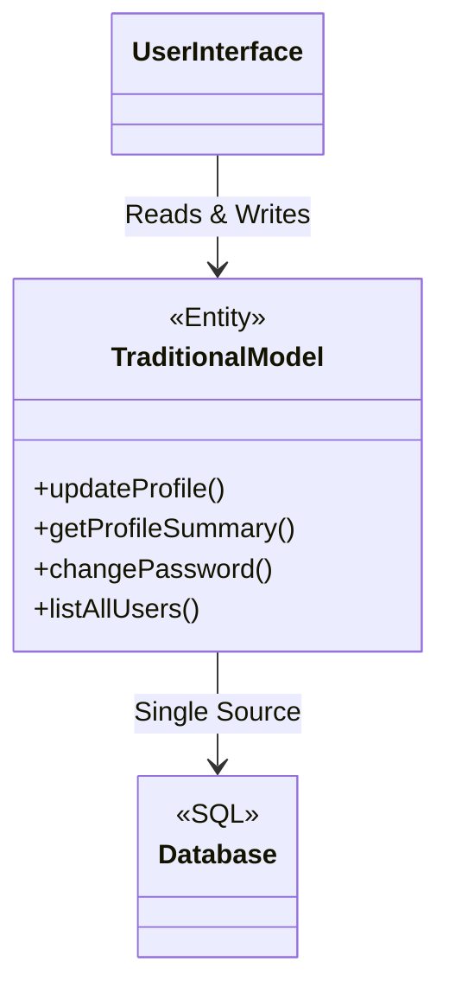
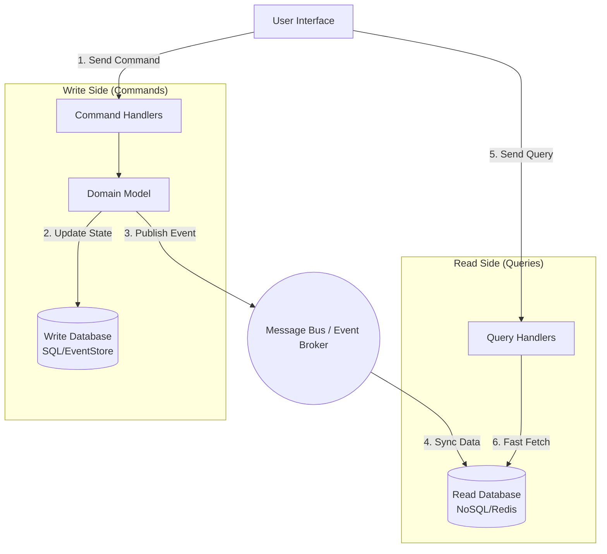

# Command Query Responsibility Segregation (CQRS)

<CoverImage src="/covers/architectural/cqrs.png" alt="Cover">
  <h1>CQRS</h1>
  <p>A double-sided workstation: the left side is a heavy-duty mechanical workshop with a giant hammer building objects (Write), and the right side is a clean, glass desk with a glowing magnifying glass displaying neat, pre-read sheets (Read).</p>
</CoverImage>

## Overview

**Command Query Responsibility Segregation (CQRS)** is an advanced architectural pattern that splits the conceptual model of your application into two distinct parts:
- **Command Side (Writes)**: Handles actions that change state (Mutations). It enforces complex business rules and validations.
- **Query Side (Reads)**: Handles actions that return state (Retrievals). It bypasses complex domain logic and returns flat, optimized data structures directly to the UI.

By strictly separating these two responsibilities, you can optimize, scale, and secure your read and write paths completely independently.

## The Problem

In a traditional N-Tier or CRUD (Create, Read, Update, Delete) architecture, you use the exact same Domain Model and Database for both reading and writing data. 



This creates severe bottlenecks as the application scales:
1. **Asymmetrical Load**: In most systems (like Twitter or E-Commerce), there are 1,000 reads for every 1 write. Scaling the entire monolithic database just to support massive read traffic is incredibly expensive.
2. **Conflicting Optimizations**: 
   - *Writes* want normalized data (3NF) to ensure integrity and avoid anomalies.
   - *Reads* want heavily denormalized data (JSON blobs, NoSQL) to avoid slow SQL `JOIN` operations.
3. **Complex Queries**: Returning a dashboard view might require joining 8 different tables, resulting in horrible SQL performance and complex ORM mapping code.

## The Solution

CQRS splits the architecture. 

1. The user sends a **Command** (e.g., `UpdateUserProfileCommand`).
2. The Command Handler executes business logic, updates the **Write Database**, and emits an **Event** (`UserProfileUpdated`).
3. An Event Listener catches that event and updates a heavily denormalized **Read Database** (e.g., ElasticSearch, Redis, or a flattened SQL table).
4. The user sends a **Query** (e.g., `GetUserProfileQuery`).
5. The Query Handler bypasses the domain model completely, fetches the pre-calculated data from the Read Database, and returns it instantly.



## Real-World Analogy

Think of a **Newspaper Agency**.
- **The Command Side (Journalists and Editors)**: They research, verify facts, apply strict editorial guidelines (business logic), and write the article. This is a slow, careful process.
- **The Event Broker (The Printing Press)**: Once the article is finalized, it is printed onto thousands of papers.
- **The Query Side (The Newsstands)**: Customers just walk up, grab the pre-printed paper, and read it instantly. They do not talk to the journalists. 

The process of *creating* the news is completely separated from the process of *consuming* the news.

## Step-by-Step Implementation

1. **Define Commands & Queries**: Create plain data objects representing the user's intent.
2. **Separate Handlers**: Create dedicated classes for handling Commands (writes) and Queries (reads).
3. **(Optional but Common) Separate Databases**: Write to a relational DB (PostgreSQL) and project the data to a fast read store (Redis, MongoDB, or ElasticSearch).

## Code Examples

We will implement a simple CQRS setup. Notice how the Query side completely ignores the Domain model and just returns flat Data Transfer Objects (DTOs).

::: code-group

```typescript [TypeScript (NestJS Style)]
// --- 1. COMMAND SIDE (Writes) ---

class CreateUserCommand {
  constructor(public email: string, public age: number) {}
}

class CreateUserCommandHandler {
  constructor(
    private writeRepo: UserWriteRepository,
    private eventBus: EventBus
  ) {}

  async execute(command: CreateUserCommand): Promise<void> {
    // Enforce Business Rules
    if (command.age < 18) throw new Error("User must be 18+");
    
    const userId = generateId();
    await this.writeRepo.save({ id: userId, email: command.email, age: command.age });
    
    // Publish Event
    await this.eventBus.publish(new UserCreatedEvent(userId, command.email));
  }
}

// --- 2. BRIDGE ---

class UserCreatedEventHandler {
  constructor(private readRepo: UserReadRepository) {}

  async handle(event: UserCreatedEvent) {
    // Project into a fast read format (e.g., Redis)
    const readModel = {
      id: event.userId,
      displayEmail: event.email.toLowerCase(),
    };
    await this.readRepo.save(readModel);
  }
}

// --- 3. QUERY SIDE (Reads) ---

class GetUserQuery {
  constructor(public userId: string) {}
}

class GetUserQueryHandler {
  constructor(private readRepo: UserReadRepository) {}

  async execute(query: GetUserQuery): Promise<UserReadDto> {
    // Direct, lightning-fast fetch. No business logic.
    const data = await this.readRepo.findById(query.userId);
    return new UserReadDto(data.id, data.displayEmail);
  }
}
```

```python [Python (FastAPI Style)]
# --- 1. COMMAND SIDE (Writes) ---
from dataclasses import dataclass

@dataclass
class CreateUserCommand:
    email: str
    age: int

class CreateUserCommandHandler:
    def __init__(self, write_db, event_bus):
        self.write_db = write_db
        self.event_bus = event_bus

    def execute(self, command: CreateUserCommand):
        if command.age < 18:
            raise ValueError("Must be 18+")
            
        user_id = "uuid-123"
        self.write_db.save({"id": user_id, "email": command.email, "age": command.age})
        
        self.event_bus.publish(UserCreatedEvent(user_id, command.email))

# --- 2. BRIDGE ---
class UserCreatedEventHandler:
    def __init__(self, read_db):
        self.read_db = read_db

    def handle(self, event):
        # Project data for fast reads
        self.read_db.save_view({
            "id": event.user_id,
            "display": event.email.lower()
        })

# --- 3. QUERY SIDE (Reads) ---
@dataclass
class GetUserQuery:
    user_id: str

class GetUserQueryHandler:
    def __init__(self, read_db):
        self.read_db = read_db

    def execute(self, query: GetUserQuery) -> dict:
        # Bypass domain, fetch projection instantly
        return self.read_db.get_view(query.user_id)
```

```java [Java (Spring Boot Style)]
// --- 1. COMMAND SIDE (Writes) ---
record CreateUserCommand(String email, int age) {}

@Service
class CreateUserCommandHandler {
    private final WriteRepository writeRepo;
    private final ApplicationEventPublisher publisher;

    public CreateUserCommandHandler(WriteRepository writeRepo, ApplicationEventPublisher publisher) {
        this.writeRepo = writeRepo;
        this.publisher = publisher;
    }

    @Transactional
    public void handle(CreateUserCommand command) {
        if (command.age() < 18) throw new IllegalArgumentException("Must be 18+");
        
        String userId = UUID.randomUUID().toString();
        writeRepo.save(new UserEntity(userId, command.email(), command.age()));
        
        publisher.publishEvent(new UserCreatedEvent(userId, command.email()));
    }
}

// --- 2. BRIDGE ---
@Component
class UserProjector {
    private final ReadRepository readRepo;
    public UserProjector(ReadRepository readRepo) { this.readRepo = readRepo; }

    @EventListener
    public void onUserCreated(UserCreatedEvent event) {
        // Save to Redis / ElasticSearch
        readRepo.save(new UserReadModel(event.id(), event.email().toLowerCase()));
    }
}

// --- 3. QUERY SIDE (Reads) ---
record GetUserQuery(String userId) {}

@Service
class GetUserQueryHandler {
    private final ReadRepository readRepo;
    public GetUserQueryHandler(ReadRepository readRepo) { this.readRepo = readRepo; }

    public UserReadModel handle(GetUserQuery query) {
        return readRepo.findById(query.userId());
    }
}
```

```go [Go]
package main

import (
	"errors"
	"fmt"
)

// --- 1. COMMAND SIDE ---
type CreateUserCommand struct {
	Email string
	Age   int
}

type CommandHandler struct {
	writeDB  *WriteDatabase
	eventBus *EventBus
}

func (h *CommandHandler) HandleCreateUser(cmd CreateUserCommand) error {
	if cmd.Age < 18 {
		return errors.New("must be 18+")
	}

	userId := "usr_123"
	h.writeDB.Save(userId, cmd.Email, cmd.Age)
	
	h.eventBus.Publish(UserCreatedEvent{UserId: userId, Email: cmd.Email})
	return nil
}

// --- 2. EVENT & BRIDGE ---
type UserCreatedEvent struct {
	UserId string
	Email  string
}

type EventBus struct {
	readDB *ReadDatabase
}

func (bus *EventBus) Publish(event UserCreatedEvent) {
	// Project to Read DB
	bus.readDB.SaveView(event.UserId, event.Email)
}

// --- 3. QUERY SIDE ---
type GetUserQuery struct {
	UserId string
}

type QueryHandler struct {
	readDB *ReadDatabase
}

func (h *QueryHandler) HandleGetUser(query GetUserQuery) string {
	return h.readDB.GetUserView(query.UserId)
}

// Mock DBs
type WriteDatabase struct{}
func (db *WriteDatabase) Save(id string, email string, age int) { fmt.Println("Saved to Write DB (SQL)") }

type ReadDatabase struct{}
func (db *ReadDatabase) SaveView(id string, email string) { fmt.Println("Projected to Read DB (Redis)") }
func (db *ReadDatabase) GetUserView(id string) string { return "Fast JSON View for UI" }
```

```rust [Rust]
use std::sync::{Arc, Mutex};

// --- 1. COMMAND SIDE ---
struct CreateUserCommand {
    email: String,
    age: u8,
}

struct CommandHandler {
    write_db: Arc<Mutex<WriteDatabase>>,
    event_bus: Arc<Mutex<EventBus>>,
}

impl CommandHandler {
    fn handle(&self, cmd: CreateUserCommand) -> Result<(), &'static str> {
        if cmd.age < 18 {
            return Err("must be 18+");
        }

        let user_id = "usr_123".to_string();
        self.write_db.lock().unwrap().save(&user_id, &cmd.email, cmd.age);
        
        self.event_bus.lock().unwrap().publish(UserCreatedEvent {
            user_id,
            email: cmd.email,
        });
        
        Ok(())
    }
}

// --- 2. BRIDGE ---
struct UserCreatedEvent {
    user_id: String,
    email: String,
}

struct EventBus {
    read_db: Arc<Mutex<ReadDatabase>>,
}

impl EventBus {
    fn publish(&self, event: UserCreatedEvent) {
        self.read_db.lock().unwrap().save_view(&event.user_id, &event.email);
    }
}

// --- 3. QUERY SIDE ---
struct GetUserQuery {
    user_id: String,
}

struct QueryHandler {
    read_db: Arc<Mutex<ReadDatabase>>,
}

impl QueryHandler {
    fn handle(&self, query: GetUserQuery) -> String {
        self.read_db.lock().unwrap().get_view(&query.user_id)
    }
}

// Mock DBs
struct WriteDatabase;
impl WriteDatabase {
    fn save(&self, id: &str, email: &str, age: u8) { println!("Saved to Write DB (SQL)"); }
}

struct ReadDatabase;
impl ReadDatabase {
    fn save_view(&self, id: &str, email: &str) { println!("Projected to Read DB (Redis)"); }
    fn get_view(&self, id: &str) -> String { "Fast JSON View".to_string() }
}
```

:::

## Eventual Consistency (The Tradeoff)

If you separate your Read and Write databases, you introduce **Eventual Consistency**. 
When a user updates their profile (Command), it takes a few milliseconds for the Event Bus to update the Read Database. If the user immediately refreshes the page (Query), they might see their *old* profile data for a split second.

You must design your UI to handle this (e.g., optimistic UI updates, or polling).

## Pros and Cons

### Advantages
- **Independent Scaling**: If your app gets crushed by read traffic (e.g., Black Friday), you can scale up your Read Database (Redis instances) without touching your Write Database.
- **Performance Optimization**: You can project data into the exact format the UI needs. No more complex SQL `JOIN`s on read.
- **Simpler Security**: Commands mutate state and require heavy authorization. Queries just return data. Separating them makes security audits much easier.

### Disadvantages
- **Extreme Complexity**: CQRS triples the amount of code. For every feature, you need a Command, CommandHandler, Event, EventHandler, Query, and QueryHandler.
- **Eventual Consistency**: Developers and UI designers must learn how to build systems where data isn't instantly available after a write.
- **Infrastructure Overhead**: You now have to maintain two different database technologies and a message broker (e.g., Kafka or RabbitMQ).

## When to Use

- **High-Performance Microservices**: Systems with massive read/write disparity (e.g., Twitter, Netflix, Amazon).
- **Task-Based UIs**: UIs that focus on specific user intents ("Change Password", "Upgrade Subscription") rather than generic CRUD forms.
- **Combined with Event Sourcing**: CQRS is almost mandatory if you are using Event Sourcing, as reading from an append-only event stream is too slow for UI queries.

## When NOT to Use

- **Simple CRUD Applications**: If your app is just an admin panel for updating records, CQRS is massive over-engineering. Stick to MVC or Active Record.
- **Strict Consistency Requirements**: If the business requires that a read *must absolutely* reflect the exact millisecond state of a write (e.g., strict financial trading algorithms), eventual consistency will break your system.

## Common Mistakes

- **Commanding on Queries**: Accidentally making state mutations inside a QueryHandler. Queries MUST be side-effect free.
- **Querying on Commands**: Having a CommandHandler return complex data structures to display to the UI. A Command should typically only return `void`, an ID, or an error.

## Related Patterns

- **Event Sourcing**: CQRS is almost always paired with Event Sourcing. The "Write DB" becomes an append-only Event Store.
- **Unit of Work / Repository**: Often used inside the Command Handler to ensure the write operation and event publication succeed atomically.
- **Mediator**: In monolithic CQRS implementations (like C#'s MediatR), the Mediator pattern is used to route Commands and Queries to their respective handlers without tight coupling.
