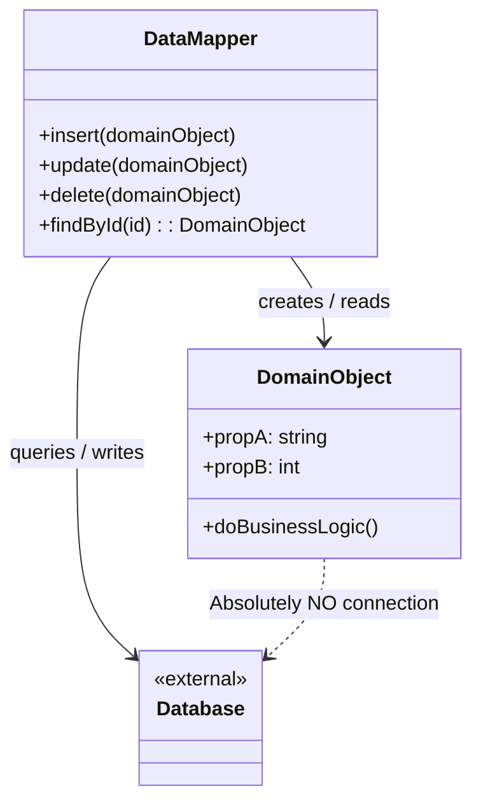

# Data Mapper Pattern

## Overview

The **Data Mapper** pattern is an architectural data access pattern that moves all database interaction out of the domain objects and into a separate, dedicated layer. The domain objects become completely unaware that a database even exists.

**Key advantage**: It enforces strict separation of concerns, ensuring that your core business logic is not polluted by SQL statements, ORM syntax, or database schema limitations.

**Modern perspective**: Data Mapper is the architectural foundation of enterprise-grade ORMs (like Hibernate/JPA in Java, Doctrine in PHP, Entity Framework in .NET, and TypeORM/MikroORM in Node.js). It is considered the gold standard for Domain-Driven Design (DDD) because it allows developers to model complex business rules purely in memory, mapping them to the database only when necessary.

## The Problem

When you use the Active Record pattern, your database schema dictates your object design.

```typescript
// ❌ Bad: The domain object is tied to the database schema
class Order extends ActiveRecord {
  // These properties must exactly match database columns
  public id: number;
  public customer_db_id: number; // Awkward naming forced by the DB schema
  public status_varchar: string; // Leaking database types into the domain

  public ship() {
    this.status_varchar = "SHIPPED";
    this.save(); // Tied directly to the database
  }
}
```

This creates severe limitations:

1. **Testing is a nightmare**: To test the `ship()` logic, you have to mock the entire database connection because calling `save()` triggers SQL.
2. **Schema Mismatches**: What if you want to store the Order in a normalized SQL database, but the domain logic requires the Order object to be a deeply nested, rich object graph? Active Record forces a 1:1 map, which makes complex mapping impossible.
3. **Database Migrations break Business Logic**: If the DBA renames `status_varchar` to `order_state`, you have to modify your core business logic.

## The Solution

The Data Mapper pattern introduces a mediator class—the Mapper—that sits between the pure Domain Object and the Database.

1. **Domain Object**: A Plain Old Object (POJO, POCO, etc.). It contains business logic but _no_ database logic. It does not extend any framework base classes.
2. **Data Mapper**: A separate class responsible for taking a Domain Object, extracting its data, and generating the necessary SQL `INSERT/UPDATE` statements. It also handles querying the database and hydrating fresh Domain Objects from the raw database rows.

```typescript
// ✅ Good: Pure Domain Object
const order = new Order("cust-123");
order.ship(); // Pure business logic. No database calls.

// ✅ Good: The Mapper handles the persistence
orderMapper.save(order);
```

## Structure



## Flow

1. **Creating/Updating**: The client creates or modifies a pure Domain Object in memory. When finished, the client passes the object to the `DataMapper.save(obj)` method. The Mapper maps the object's properties to database columns and executes the SQL.
2. **Reading**: The client calls `DataMapper.findById(1)`. The Mapper queries the database, receives raw row data, instantiates a pure Domain Object, populates it, and returns it.

## Real-World Analogy

Think of **Translators at the United Nations**.
You have a French diplomat (the Domain Object) and a Japanese diplomat (the Database). They do not speak the same language, and neither is willing to learn the other's language.

Instead of forcing the French diplomat to learn Japanese (Active Record), you introduce a professional Translator (the Data Mapper). The French diplomat just speaks pure French (Business Logic). The Translator listens, maps the concepts, and speaks Japanese to the other diplomat. Neither diplomat knows how the translation happened.

## Step-by-Step Implementation

1. **Create Pure Domain Objects**: Create classes that represent your business entities. Do not import any database libraries into these files.
2. **Create the Data Mapper**: Create a class (e.g., `UserMapper`) that handles the persistence for that specific entity.
3. **Implement Hydration (Row to Object)**: Write a method in the Mapper that takes a raw database row (Dictionary, JSON, or struct) and instantiates a Domain Object.
4. **Implement Extraction (Object to Row)**: Write a method in the Mapper that reads the properties of the Domain Object and creates SQL parameters.
5. **Implement Persistence Operations**: Implement `insert`, `update`, `delete`, and `find` methods in the Mapper.

## Code Examples

We will build a simple `User` Domain Object and a `UserMapper` that handles the database interactions.

::: code-group

```typescript [TypeScript]
// 1. Pure Domain Object (Notice: No DB imports, no save() method)
class User {
  constructor(
    public id: string | null,
    public firstName: string,
    public lastName: string,
    public email: string,
  ) {}

  // Pure business logic
  public getFullName(): string {
    return `${this.firstName} ${this.lastName}`;
  }

  public changeEmail(newEmail: string): void {
    if (!newEmail.includes("@")) throw new Error("Invalid email");
    this.email = newEmail;
  }
}

// Mock Database Connection
const db = {
  execute: (sql: string, params: any[]) =>
    console.log(`[DB EXECUTE] ${sql} | Params:`, params),
  query: (sql: string, params: any[]) => {
    console.log(`[DB QUERY] ${sql} | Params:`, params);
    // Returning raw DB row (notice the snake_case naming)
    return [
      {
        user_id: "uuid-1",
        first_name: "John",
        last_name: "Doe",
        email_address: "john@test.com",
      },
    ];
  },
};

// 2. The Data Mapper
class UserMapper {
  // Translates a DB Row into a Domain Object
  private toDomain(row: any): User {
    return new User(
      row.user_id,
      row.first_name, // Mapping DB 'first_name' to Object 'firstName'
      row.last_name,
      row.email_address,
    );
  }

  // Translates a Domain Object into a DB Row / SQL execution
  public save(user: User): void {
    if (user.id === null) {
      user.id = "uuid-" + Math.floor(Math.random() * 1000); // Generate ID
      db.execute(
        "INSERT INTO users (user_id, first_name, last_name, email_address) VALUES (?, ?, ?, ?)",
        [user.id, user.firstName, user.lastName, user.email],
      );
    } else {
      db.execute(
        "UPDATE users SET first_name = ?, last_name = ?, email_address = ? WHERE user_id = ?",
        [user.firstName, user.lastName, user.email, user.id],
      );
    }
  }

  public findById(id: string): User | null {
    const rows = db.query("SELECT * FROM users WHERE user_id = ?", [id]);
    if (rows.length === 0) return null;
    return this.toDomain(rows[0]);
  }
}

// 3. Client Code
const mapper = new UserMapper();

// Create and manipulate the domain object purely in memory
const user = new User(null, "Alice", "Smith", "alice@example.com");
user.changeEmail("alice.smith@example.com");

// Persist the changes via the Mapper
console.log("--- Saving User ---");
mapper.save(user);

// Retrieve via the Mapper
console.log("\n--- Finding User ---");
const loadedUser = mapper.findById("uuid-1");
if (loadedUser) {
  console.log(`Found Domain Object: ${loadedUser.getFullName()}`);
}
```

```python [Python]
from typing import Optional, Dict, Any

# Mock Database Connection
class MockDB:
    @staticmethod
    def execute(sql: str, params: tuple) -> None:
        print(f"[DB EXECUTE] {sql} | Params: {params}")

    @staticmethod
    def query(sql: str, params: tuple) -> list:
        print(f"[DB QUERY] {sql} | Params: {params}")
        # Raw DB row with snake_case
        return [{"user_id": "uuid-1", "first_name": "John", "last_name": "Doe", "email_address": "john@test.com"}]

# 1. Pure Domain Object
class User:
    def __init__(self, user_id: Optional[str], first_name: str, last_name: str, email: str):
        self.id = user_id
        self.first_name = first_name
        self.last_name = last_name
        self.email = email

    # Pure business logic
    def get_full_name(self) -> str:
        return f"{self.first_name} {self.last_name}"

    def change_email(self, new_email: str) -> None:
        if "@" not in new_email:
            raise ValueError("Invalid email")
        self.email = new_email

# 2. The Data Mapper
class UserMapper:
    def _to_domain(self, row: Dict[str, Any]) -> User:
        return User(
            user_id=row["user_id"],
            first_name=row["first_name"], # Mapping db naming to object naming
            last_name=row["last_name"],
            email=row["email_address"]
        )

    def save(self, user: User) -> None:
        if user.id is None:
            user.id = "uuid-999" # Generate ID
            MockDB.execute(
                "INSERT INTO users (user_id, first_name, last_name, email_address) VALUES (?, ?, ?, ?)",
                (user.id, user.first_name, user.last_name, user.email)
            )
        else:
            MockDB.execute(
                "UPDATE users SET first_name = ?, last_name = ?, email_address = ? WHERE user_id = ?",
                (user.first_name, user.last_name, user.email, user.id)
            )

    def find_by_id(self, user_id: str) -> Optional[User]:
        rows = MockDB.query("SELECT * FROM users WHERE user_id = ?", (user_id,))
        if not rows:
            return None
        return self._to_domain(rows[0])

# 3. Client Code
if __name__ == "__main__":
    mapper = UserMapper()

    # Domain logic in memory
    user = User(None, "Alice", "Smith", "alice@example.com")
    user.change_email("alice.smith@example.com")

    # Persist
    print("--- Saving User ---")
    mapper.save(user)

    # Retrieve
    print("\n--- Finding User ---")
    loaded_user = mapper.find_by_id("uuid-1")
    if loaded_user:
        print(f"Found Domain Object: {loaded_user.get_full_name()}")
```

```java [Java]
import java.util.UUID;

// Mock DB
class MockDB {
    public static void execute(String sql, Object... params) {
        System.out.printf("[DB EXECUTE] %s%n", sql);
    }

    public static Object[] queryRow(String sql, Object... params) {
        System.out.printf("[DB QUERY] %s%n", sql);
        // Returns raw DB row
        return new Object[]{"uuid-1", "John", "Doe", "john@test.com"};
    }
}

// 1. Pure Domain Object
class User {
    private String id;
    private String firstName;
    private String lastName;
    private String email;

    public User(String id, String firstName, String lastName, String email) {
        this.id = id;
        this.firstName = firstName;
        this.lastName = lastName;
        this.email = email;
    }

    // Getters and Setters omitted for brevity
    public String getId() { return id; }
    public void setId(String id) { this.id = id; }
    public String getFirstName() { return firstName; }
    public String getLastName() { return lastName; }
    public String getEmail() { return email; }

    // Pure business logic
    public String getFullName() {
        return firstName + " " + lastName;
    }

    public void changeEmail(String newEmail) {
        if (!newEmail.contains("@")) throw new IllegalArgumentException("Invalid email");
        this.email = newEmail;
    }
}

// 2. The Data Mapper
class UserMapper {
    private User toDomain(Object[] row) {
        return new User(
            (String)row[0], // user_id
            (String)row[1], // first_name
            (String)row[2], // last_name
            (String)row[3]  // email_address
        );
    }

    public void save(User user) {
        if (user.getId() == null) {
            user.setId(UUID.randomUUID().toString());
            MockDB.execute(
                "INSERT INTO users (user_id, first_name, last_name, email_address) VALUES (?, ?, ?, ?)",
                user.getId(), user.getFirstName(), user.getLastName(), user.getEmail()
            );
        } else {
            MockDB.execute(
                "UPDATE users SET first_name = ?, last_name = ?, email_address = ? WHERE user_id = ?",
                user.getFirstName(), user.getLastName(), user.getEmail(), user.getId()
            );
        }
    }

    public User findById(String id) {
        Object[] row = MockDB.queryRow("SELECT * FROM users WHERE user_id = ?", id);
        if (row == null) return null;
        return toDomain(row);
    }
}

// 3. Client Code
public class DataMapperDemo {
    public static void main(String[] args) {
        UserMapper mapper = new UserMapper();

        // Memory domain operations
        User user = new User(null, "Alice", "Smith", "alice@example.com");
        user.changeEmail("alice.smith@example.com");

        System.out.println("--- Saving User ---");
        mapper.save(user);

        System.out.println("\n--- Finding User ---");
        User loadedUser = mapper.findById("uuid-1");
        if (loadedUser != null) {
            System.out.println("Found Domain Object: " + loadedUser.getFullName());
        }
    }
}
```

```go [Go]
package main

import (
	"fmt"
	"strings"
)

// Mock DB
var MockDB = struct {
	Execute func(sql string, params ...interface{})
	Query   func(sql string, params ...interface{}) map[string]interface{}
}{
	Execute: func(sql string, params ...interface{}) {
		fmt.Printf("[DB EXECUTE] %s | Params: %v\n", sql, params)
	},
	Query: func(sql string, params ...interface{}) map[string]interface{} {
		fmt.Printf("[DB QUERY] %s | Params: %v\n", sql, params)
		return map[string]interface{}{
			"user_id":       "uuid-1",
			"first_name":    "John",
			"last_name":     "Doe",
			"email_address": "john@test.com",
		}
	},
}

// 1. Pure Domain Object (Struct)
type User struct {
	ID        *string
	FirstName string
	LastName  string
	Email     string
}

func NewUser(firstName, lastName, email string) *User {
	return &User{
		FirstName: firstName,
		LastName:  lastName,
		Email:     email,
	}
}

// Pure business logic
func (u *User) GetFullName() string {
	return fmt.Sprintf("%s %s", u.FirstName, u.LastName)
}

func (u *User) ChangeEmail(newEmail string) error {
	if !strings.Contains(newEmail, "@") {
		return fmt.Errorf("invalid email")
	}
	u.Email = newEmail
	return nil
}

// 2. The Data Mapper
type UserMapper struct{}

func (m *UserMapper) toDomain(row map[string]interface{}) *User {
	id := row["user_id"].(string)
	return &User{
		ID:        &id,
		FirstName: row["first_name"].(string),
		LastName:  row["last_name"].(string),
		Email:     row["email_address"].(string),
	}
}

func (m *UserMapper) Save(u *User) {
	if u.ID == nil {
		id := "uuid-999" // Mock ID generation
		u.ID = &id
		MockDB.Execute(
			"INSERT INTO users (user_id, first_name, last_name, email_address) VALUES (?, ?, ?, ?)",
			*u.ID, u.FirstName, u.LastName, u.Email,
		)
	} else {
		MockDB.Execute(
			"UPDATE users SET first_name = ?, last_name = ?, email_address = ? WHERE user_id = ?",
			u.FirstName, u.LastName, u.Email, *u.ID,
		)
	}
}

func (m *UserMapper) FindByID(id string) *User {
	row := MockDB.Query("SELECT * FROM users WHERE user_id = ?", id)
	if row == nil {
		return nil
	}
	return m.toDomain(row)
}

// 3. Client Code
func main() {
	mapper := &UserMapper{}

	user := NewUser("Alice", "Smith", "alice@example.com")
	user.ChangeEmail("alice.smith@example.com")

	fmt.Println("--- Saving User ---")
	mapper.Save(user)

	fmt.Println("\n--- Finding User ---")
	loadedUser := mapper.FindByID("uuid-1")
	if loadedUser != nil {
		fmt.Printf("Found Domain Object: %s\n", loadedUser.GetFullName())
	}
}
```

```rust [Rust]
use std::collections::HashMap;

// Mock DB context
struct MockDB;
impl MockDB {
    fn execute(sql: &str, params: &[&str]) {
        println!("[DB EXECUTE] {} | Params: {:?}", sql, params);
    }

    fn query(sql: &str, _params: &[&str]) -> Option<HashMap<&'static str, &'static str>> {
        println!("[DB QUERY] {}", sql);
        let mut row = HashMap::new();
        row.insert("user_id", "uuid-1");
        row.insert("first_name", "John");
        row.insert("last_name", "Doe");
        row.insert("email_address", "john@test.com");
        Some(row)
    }
}

// 1. Pure Domain Object
pub struct User {
    pub id: Option<String>,
    pub first_name: String,
    pub last_name: String,
    pub email: String,
}

impl User {
    pub fn new(first_name: &str, last_name: &str, email: &str) -> Self {
        Self {
            id: None,
            first_name: first_name.to_string(),
            last_name: last_name.to_string(),
            email: email.to_string(),
        }
    }

    pub fn get_full_name(&self) -> String {
        format!("{} {}", self.first_name, self.last_name)
    }

    pub fn change_email(&mut self, new_email: &str) -> Result<(), &'static str> {
        if !new_email.contains('@') {
            return Err("Invalid email");
        }
        self.email = new_email.to_string();
        Ok(())
    }
}

// 2. The Data Mapper
pub struct UserMapper;

impl UserMapper {
    fn to_domain(row: HashMap<&str, &str>) -> User {
        User {
            id: Some(row.get("user_id").unwrap().to_string()),
            first_name: row.get("first_name").unwrap().to_string(),
            last_name: row.get("last_name").unwrap().to_string(),
            email: row.get("email_address").unwrap().to_string(),
        }
    }

    pub fn save(&self, user: &mut User) {
        if user.id.is_none() {
            user.id = Some("uuid-999".to_string());
            MockDB::execute(
                "INSERT INTO users (user_id, first_name, last_name, email_address) VALUES (?, ?, ?, ?)",
                &[
                    user.id.as_ref().unwrap().as_str(),
                    &user.first_name,
                    &user.last_name,
                    &user.email
                ]
            );
        } else {
            MockDB::execute(
                "UPDATE users SET first_name = ?, last_name = ?, email_address = ? WHERE user_id = ?",
                &[
                    &user.first_name,
                    &user.last_name,
                    &user.email,
                    user.id.as_ref().unwrap().as_str()
                ]
            );
        }
    }

    pub fn find_by_id(&self, id: &str) -> Option<User> {
        if let Some(row) = MockDB::query("SELECT * FROM users WHERE user_id = ?", &[id]) {
            Some(Self::to_domain(row))
        } else {
            None
        }
    }
}

// 3. Client Code
fn main() {
    let mapper = UserMapper;

    let mut user = User::new("Alice", "Smith", "alice@example.com");
    user.change_email("alice.smith@example.com").unwrap();

    println!("--- Saving User ---");
    mapper.save(&mut user);

    println!("\n--- Finding User ---");
    if let Some(loaded_user) = mapper.find_by_id("uuid-1") {
        println!("Found Domain Object: {}", loaded_user.get_full_name());
    }
}
```

:::

## Pros and Cons

### Advantages

- **Strict Separation of Concerns**: Core business rules are isolated from database schemas and SQL nuances.
- **Testability**: Domain Objects can be unit tested instantly without mocking the database, as they contain zero persistence logic.
- **Complex Modeling**: You can map a single complex Domain Object to multiple tables, or map multiple tables into a single Domain Object. You aren't constrained by a 1:1 table-to-class mapping.
- **Immune to Schema Changes**: If the database changes, you only update the Mapper. The rest of the application remains completely untouched.

### Disadvantages

- **Steep Learning Curve**: Requires understanding architectural layers, Dependency Injection, and careful state tracking.
- **Boilerplate**: Creating a dedicated Mapper for every single entity involves writing significantly more code than Active Record.
- **Performance Overhead**: Hydrating (mapping database rows to objects) creates intermediate data structures and reflections (in full ORMs) which can consume high amounts of CPU and memory compared to returning raw SQL structs.

## When to Use

- **Enterprise Applications**: Large, long-lasting applications where the domain logic is highly complex and expected to outlive the database technology.
- **Domain-Driven Design (DDD)**: When practicing DDD, Domain Entities MUST be pure. Data Mapper is mandatory in this architecture.
- **Legacy Database Integration**: When you have to build a new, clean application on top of an awful, 20-year-old legacy database schema. The Data Mapper hides the terrible schema from your clean domain objects.

## When NOT to Use

- **Rapid Prototypes / Simple CRUD**: If your app is just mapping web forms directly to database tables, the massive overhead of writing Mappers is a waste of time. Use Active Record.
- **Microservices with Simple Domains**: In a microservice that just does one tiny thing, setting up a full Data Mapper architecture is likely overkill.

## Common Mistakes

### 1. Putting Business Logic in the Mapper

The Mapper should _only_ translate data back and forth. If you find calculations, validations, or business rules in the Mapper's `save()` method, you are leaking Domain Logic into your persistence layer.

### 2. The N+1 Query Problem (Hydration)

When mapping objects that contain collections of other objects (e.g., an Order with many OrderItems), poorly written Mappers will execute an SQL query for the Order, and then a separate SQL query for _each_ OrderItem during hydration. Full ORMs solve this with "Eager Loading."

## Related Patterns

- **Active Record**: The philosophical opposite. Blends the domain object and the database logic into a single class.
- **Repository**: Often used to wrap Data Mappers. While a Mapper handles mapping a single entity, a Repository uses the Mapper to provide a collection-like interface (e.g., `repository.findAll()`).
- **Unit of Work**: In heavy Data Mapper ORMs (like Hibernate/Entity Framework), the Unit of Work pattern tracks all the Domain Objects you loaded in memory, determines which ones you modified, and sends them to the Data Mapper to be saved all at once.

## Interview Insights

- **Question**: "If I use a Data Mapper, how does the Mapper know a Domain Object was updated if the Domain Object doesn't know the Mapper exists?"
  - **Answer**: "There are two ways. 1) The client code manually calls `mapper.update(domainObject)` when it finishes modifying it. 2) Advanced ORMs use the **Unit of Work** pattern, which wraps domain properties in proxies or tracks their original state, automatically sending changed objects to the mapper at the end of the transaction."
- **Question**: "Can Data Mapper improve database performance?"
  - **Answer**: "Not inherently. In fact, mapping rows to objects adds CPU overhead. However, it _allows_ for performance improvements because you can completely swap the underlying persistence strategy (e.g., switching from MySQL to Redis) without changing a single line of business logic."

## Modern Alternatives

- **Repository Pattern combined with Query Builders**: Instead of building heavy manual Data Mappers or using massive ORMs (which often abstract _too_ much), modern backend development often uses pure Query Builders (like Knex.js or sqlc in Go) wrapped in a lightweight Repository that maps raw rows directly to Data Transfer Objects (DTOs), skipping the "Stateful Domain Object" entirely.
