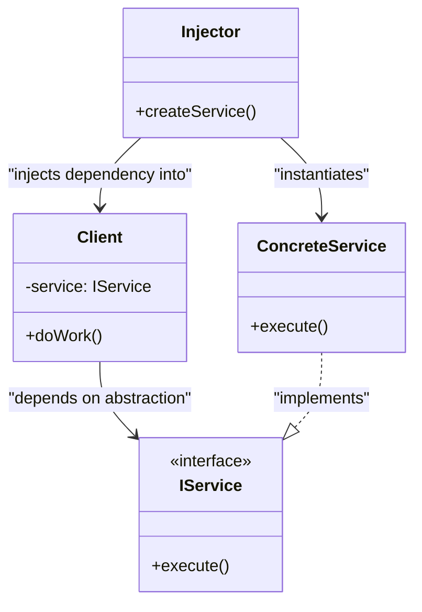

# Dependency Injection Pattern

<CoverImage src="/covers/architectural/dependency-injection.png" alt="Cover">
  <h1>Dependency Injection</h1>
  <p>A cute little robot with an open slot in its chest, and a giant mechanical hand is carefully inserting a fully-charged glowing power pack directly into the slot from the outside.</p>
</CoverImage>

## Overview

**Dependency Injection (DI)** is a fundamental architectural pattern where an object or function receives the objects it depends on (its dependencies) from the outside, rather than creating them internally.

**Key advantage**: It completely decouples the creation of an object from the behavior of the object. This is the cornerstone of writing modular, highly testable, and maintainable code.

**Modern perspective**: Dependency Injection is no longer just a "pattern"; it is a mandatory architectural principle in modern software engineering. It is the core concept behind "Inversion of Control" (IoC) and is heavily enforced by almost every modern enterprise framework (Spring Boot in Java, NestJS/Angular in TypeScript, ASP.NET Core in C#).

## The Problem

When a class instantiates its own dependencies, it becomes permanently and tightly coupled to those exact implementations.

```typescript
// ❌ Bad: The service creates its own dependencies
class UserService {
  private db: PostgresDatabase;
  private logger: FileLogger;

  constructor() {
    // Tightly coupled to specific concrete classes
    this.db = new PostgresDatabase("localhost:5432");
    this.logger = new FileLogger("/var/log/app.log");
  }

  public createUser(name: string) {
    this.logger.log(`Creating user ${name}`);
    this.db.query("INSERT INTO users...");
  }
}
```

This creates severe architectural flaws:

1. **Impossible to Unit Test**: You cannot test `UserService` without a running Postgres database and file system access.
2. **Violation of the Single Responsibility Principle**: `UserService` is now responsible for knowing how to connect to a database and where log files are stored.
3. **Rigid**: If you want to use a `MockDatabase` for testing or a `ConsoleLogger` in development, you have to modify the `UserService` code.

## The Solution

Instead of creating dependencies, the class should **ask** for them. Ideally, it should ask for _Interfaces_, not concrete classes.

```typescript
// ✅ Good: Dependencies are injected via the constructor
class UserService {
  // Depends on Interfaces, not concrete classes
  constructor(
    private db: IDatabase,
    private logger: ILogger,
  ) {}

  public createUser(name: string) {
    this.logger.log(`Creating user ${name}`);
    this.db.query("INSERT INTO users...");
  }
}

// In Production:
const service = new UserService(new PostgresDatabase(), new FileLogger());

// In Testing:
const service = new UserService(new MockDatabase(), new ConsoleLogger());
```

## Types of Dependency Injection

1. **Constructor Injection** (Recommended): Dependencies are passed through the class constructor. Ensures the object is always in a valid state when created.
2. **Setter Injection**: Dependencies are passed via public setter methods (`service.setLogger(logger)`). Useful for optional dependencies.
3. **Interface Injection**: The dependency provides an injector method that will inject the dependency into any client passed to it. (Rarely used).

## Structure



## Flow

1. **Definition**: Define an interface for the dependency (e.g., `ILogger`).
2. **Implementation**: Create concrete classes implementing the interface (`ConsoleLogger`, `FileLogger`).
3. **Injection Target**: Ensure the Client class accepts the interface via its constructor.
4. **Resolution**: An external entity (the `main` function or an IoC Container) instantiates the concrete dependency and passes it into the Client.

## Real-World Analogy

Think of a **Surgeon in an Operating Room**.
The Surgeon does not manufacture their own scalpels, nor do they walk to a cabinet to fetch them while operating. Doing so would break their focus and sterilization.

Instead, a Scrub Nurse (the Injector) hands the exact instrument needed directly into the Surgeon's hand (Dependency Injection). The Surgeon only needs to know _how to use_ a scalpel (the Interface), not how it was made or where it was stored.

## Step-by-Step Implementation

1. **Extract Interfaces**: Identify the dependencies a class needs and define interfaces for them.
2. **Modify the Constructor**: Update the target class to accept these interfaces through its constructor.
3. **Remove `new` keywords**: Delete all instantiation of dependencies inside the target class.
4. **Wire it together (Composition Root)**: At the very entry point of your application (e.g., `main.ts`, `Program.cs`), instantiate all dependencies and pass them into your services. Alternatively, configure a DI Container to do this automatically.

## Code Examples

We will build an application that requires a `Database` and a `Logger`. We will demonstrate manual dependency injection (wiring it together in the `main` method).

::: code-group

```typescript [TypeScript]
// 1. Define Interfaces
interface ILogger {
  log(message: string): void;
}

interface IDatabase {
  save(data: string): void;
}

// 2. Concrete Implementations
class ConsoleLogger implements ILogger {
  log(message: string): void {
    console.log(`[CONSOLE] ${message}`);
  }
}

class PostgresDatabase implements IDatabase {
  save(data: string): void {
    console.log(`[POSTGRES] Saving '${data}' to database...`);
  }
}

class MockDatabase implements IDatabase {
  save(data: string): void {
    console.log(`[MOCK DB] Pretending to save '${data}'...`);
  }
}

// 3. The Client (Service) - Uses Constructor Injection
class UserService {
  // Receives interfaces, strictly unaware of concrete implementations
  constructor(
    private readonly db: IDatabase,
    private readonly logger: ILogger,
  ) {}

  public processUser(name: string): void {
    this.logger.log(`Processing user: ${name}`);
    this.db.save(name);
  }
}

// 4. The Composition Root (Manual DI)
function main() {
  console.log("--- Production Configuration ---");
  // The 'main' function is responsible for wiring dependencies
  const prodLogger = new ConsoleLogger();
  const prodDb = new PostgresDatabase();
  const prodService = new UserService(prodDb, prodLogger);

  prodService.processUser("Alice");

  console.log("\n--- Testing Configuration ---");
  // Instantly swap the database implementation without touching UserService
  const testDb = new MockDatabase();
  const testService = new UserService(testDb, prodLogger);

  testService.processUser("Bob");
}

main();
```

```python [Python]
from abc import ABC, abstractmethod

# 1. Define Interfaces (Abstract Base Classes)
class ILogger(ABC):
    @abstractmethod
    def log(self, message: str) -> None:
        pass

class IDatabase(ABC):
    @abstractmethod
    def save(self, data: str) -> None:
        pass

# 2. Concrete Implementations
class ConsoleLogger(ILogger):
    def log(self, message: str) -> None:
        print(f"[CONSOLE] {message}")

class PostgresDatabase(IDatabase):
    def save(self, data: str) -> None:
        print(f"[POSTGRES] Saving '{data}' to database...")

class MockDatabase(IDatabase):
    def save(self, data: str) -> None:
        print(f"[MOCK DB] Pretending to save '{data}'...")

# 3. The Client (Service) - Uses Constructor Injection
class UserService:
    def __init__(self, db: IDatabase, logger: ILogger):
        self._db = db
        self._logger = logger

    def process_user(self, name: str) -> None:
        self._logger.log(f"Processing user: {name}")
        self._db.save(name)

# 4. The Composition Root (Manual DI)
if __name__ == "__main__":
    print("--- Production Configuration ---")
    prod_logger = ConsoleLogger()
    prod_db = PostgresDatabase()
    prod_service = UserService(prod_db, prod_logger)

    prod_service.process_user("Alice")

    print("\n--- Testing Configuration ---")
    # Instantly swap the database implementation without touching UserService
    test_db = MockDatabase()
    test_service = UserService(test_db, prod_logger)

    test_service.process_user("Bob")
```

```java [Java]
// 1. Define Interfaces
interface ILogger {
    void log(String message);
}

interface IDatabase {
    void save(String data);
}

// 2. Concrete Implementations
class ConsoleLogger implements ILogger {
    @Override
    public void log(String message) {
        System.out.println("[CONSOLE] " + message);
    }
}

class PostgresDatabase implements IDatabase {
    @Override
    public void save(String data) {
        System.out.println("[POSTGRES] Saving '" + data + "' to database...");
    }
}

class MockDatabase implements IDatabase {
    @Override
    public void save(String data) {
        System.out.println("[MOCK DB] Pretending to save '" + data + "'...");
    }
}

// 3. The Client (Service) - Uses Constructor Injection
class UserService {
    private final IDatabase db;
    private final ILogger logger;

    // Receives interfaces, strictly unaware of concrete implementations
    public UserService(IDatabase db, ILogger logger) {
        this.db = db;
        this.logger = logger;
    }

    public void processUser(String name) {
        logger.log("Processing user: " + name);
        db.save(name);
    }
}

// 4. The Composition Root (Manual DI)
public class DependencyInjectionDemo {
    public static void main(String[] args) {
        System.out.println("--- Production Configuration ---");
        ILogger prodLogger = new ConsoleLogger();
        IDatabase prodDb = new PostgresDatabase();
        UserService prodService = new UserService(prodDb, prodLogger);

        prodService.processUser("Alice");

        System.out.println("\n--- Testing Configuration ---");
        // Instantly swap the database implementation without touching UserService
        IDatabase testDb = new MockDatabase();
        UserService testService = new UserService(testDb, prodLogger);

        testService.processUser("Bob");
    }
}
```

```go [Go]
package main

import "fmt"

// 1. Define Interfaces
type ILogger interface {
	Log(message string)
}

type IDatabase interface {
	Save(data string)
}

// 2. Concrete Implementations
type ConsoleLogger struct{}

func (l *ConsoleLogger) Log(message string) {
	fmt.Printf("[CONSOLE] %s\n", message)
}

type PostgresDatabase struct{}

func (db *PostgresDatabase) Save(data string) {
	fmt.Printf("[POSTGRES] Saving '%s' to database...\n", data)
}

type MockDatabase struct{}

func (db *MockDatabase) Save(data string) {
	fmt.Printf("[MOCK DB] Pretending to save '%s'...\n", data)
}

// 3. The Client (Service) - Uses Constructor Injection
type UserService struct {
	db     IDatabase
	logger ILogger
}

func NewUserService(db IDatabase, logger ILogger) *UserService {
	return &UserService{
		db:     db,
		logger: logger,
	}
}

func (s *UserService) ProcessUser(name string) {
	s.logger.Log(fmt.Sprintf("Processing user: %s", name))
	s.db.Save(name)
}

// 4. The Composition Root (Manual DI)
func main() {
	fmt.Println("--- Production Configuration ---")
	prodLogger := &ConsoleLogger{}
	prodDb := &PostgresDatabase{}
	prodService := NewUserService(prodDb, prodLogger)

	prodService.ProcessUser("Alice")

	fmt.Println("\n--- Testing Configuration ---")
	// Instantly swap the database implementation without touching UserService
	testDb := &MockDatabase{}
	testService := NewUserService(testDb, prodLogger)

	testService.ProcessUser("Bob")
}
```

```rust [Rust]
// 1. Define Traits (Interfaces)
pub trait ILogger {
    fn log(&self, message: &str);
}

pub trait IDatabase {
    fn save(&self, data: &str);
}

// 2. Concrete Implementations
pub struct ConsoleLogger;

impl ILogger for ConsoleLogger {
    fn log(&self, message: &str) {
        println!("[CONSOLE] {}", message);
    }
}

pub struct PostgresDatabase;

impl IDatabase for PostgresDatabase {
    fn save(&self, data: &str) {
        println!("[POSTGRES] Saving '{}' to database...", data);
    }
}

pub struct MockDatabase;

impl IDatabase for MockDatabase {
    fn save(&self, data: &str) {
        println!("[MOCK DB] Pretending to save '{}'...", data);
    }
}

// 3. The Client (Service) - Uses Constructor Injection
// In Rust, we use dynamic dispatch (dyn Trait) or static dispatch (Generics).
// Here we use dynamic dispatch for flexibility similar to OOP languages.
pub struct UserService {
    db: Box<dyn IDatabase>,
    logger: Box<dyn ILogger>,
}

impl UserService {
    pub fn new(db: Box<dyn IDatabase>, logger: Box<dyn ILogger>) -> Self {
        Self { db, logger }
    }

    pub fn process_user(&self, name: &str) {
        self.logger.log(&format!("Processing user: {}", name));
        self.db.save(name);
    }
}

// 4. The Composition Root (Manual DI)
fn main() {
    println!("--- Production Configuration ---");
    let prod_logger = Box::new(ConsoleLogger);
    let prod_db = Box::new(PostgresDatabase);
    let prod_service = UserService::new(prod_db, prod_logger);

    prod_service.process_user("Alice");

    println!("\n--- Testing Configuration ---");
    let test_logger = Box::new(ConsoleLogger);
    let test_db = Box::new(MockDatabase);
    let test_service = UserService::new(test_db, test_logger);

    test_service.process_user("Bob");
}
```

:::

## Pros and Cons

### Advantages

- **Testability**: The absolute biggest advantage. You can inject mock databases or mock loggers instantly.
- **Loose Coupling**: The class knows nothing about _how_ its dependencies work, only the API they expose.
- **Flexibility**: Swapping from a local MySQL database to a cloud REST API requires changing exactly zero lines of code in your core business logic.
- **Adherence to SOLID**: Directly enforces the Dependency Inversion Principle (D) and Single Responsibility Principle (S).

### Disadvantages

- **Complexity in Setup**: Creating deeply nested objects requires passing dependencies all the way down the chain.
- **Boilerplate**: Without a DI Container, the "Composition Root" (the place where you wire everything together) can become massive and tedious to maintain.

## When to Use

- **Always**: In modern application development, constructor-based Dependency Injection should be the default way you build services, repositories, and controllers.
- **Unit Testing**: Whenever you have a class that relies on external I/O (Database, Network, File System, System Clock) and you want to test the class in isolation.

## When NOT to Use

- **Simple Scripts**: If you are writing a 50-line python script, creating interfaces and dependency injection is a massive waste of time.
- **Data Transfer Objects (DTOs)**: Simple data objects (like a `User` struct) do not need dependencies injected. They just hold data.

## Common Mistakes

### 1. Partial Injection

Creating some dependencies internally, but injecting others. _Solution: If a class relies on an external service or state, it MUST be injected._

### 2. Over-Injection (Constructor Over-injection)

If your constructor requires 15 different dependencies, DI is not your problem—your class violates the Single Responsibility Principle and is doing way too much. Break the class down into smaller components.

## Related Patterns

- **Service Locator**: An anti-pattern alternative to DI where classes "ask" a global registry for their dependencies.
- **IoC Container**: A framework pattern that automates Dependency Injection. You register your classes, and the container automatically instantiates the graph of dependencies for you using reflection or code generation.
- **Factory**: Often used alongside DI to create objects that require dependencies but whose lifetimes aren't managed by the DI container.
