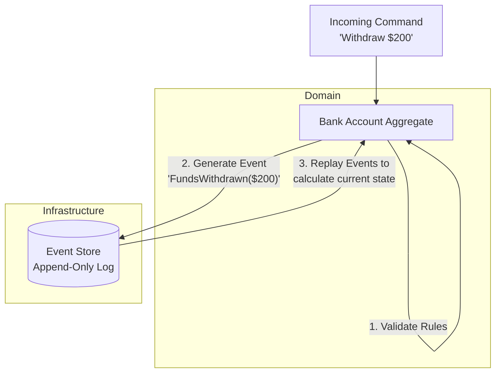

# Event Sourcing

<CoverImage src="/covers/architectural/event-sourcing.png" alt="Cover">
  <h1>Event Sourcing</h1>
  <p>A neat, glowing ledger book where each page lists a simple transactional event ("+1 Apple", "-2 Apples", "+5 Apples"), and next to it, a basket of apples updates automatically as a robot plays back the pages.</p>
</CoverImage>

## Overview

**Event Sourcing** is a radical departure from traditional data storage. Instead of storing the *current state* of an entity in a database table, Event Sourcing stores **every state-changing event** that has ever occurred to that entity in an append-only log.

To get the current state of an entity, you read all the events from the log and "replay" them in order.

Key concepts:
- **Events**: Immutable records of something that happened in the past (e.g., `FundsDeposited`, `AddressChanged`).
- **Event Store**: An append-only database specifically optimized for storing sequences of events.
- **Projections**: Read-models that listen to the Event Store and build a queryable representation of the current state (closely tied to CQRS).
- **Snapshots**: Because replaying 10,000 events takes time, the system periodically saves a "Snapshot" of the state at a specific point in time.

## The Problem

Traditional CRUD databases only store the *current* state of the world. 

```sql
-- ❌ Traditional CRUD: Information is destroyed!
UPDATE BankAccount SET balance = 500 WHERE id = 123;
```

When you overwrite a row in a relational database, the previous data is permanently destroyed. This creates massive business problems:
1. **No True Audit Trail**: If a bank balance suddenly drops by $10,000, you can't reliably prove *why* or *when* it happened using just the current row. (Audit tables are often hacked on later as an afterthought).
2. **Lost Business Value**: Data analysts love historical data. Overwriting data destroys the ability to analyze user behavior over time.
3. **Difficult Debugging**: If your system enters an invalid state, you cannot "rewind" the database to see exactly what sequence of operations caused the bug.

## The Solution

In Event Sourcing, the database is just a list of events. **You never UPDATE or DELETE data.** You only APPEND.

```text
✅ Event Sourcing (The Bank Account Ledger)
1. AccountCreated (balance: $0)
2. FundsDeposited (amount: $1000)
3. FundsWithdrawn (amount: $200)
4. AddressChanged (new_city: "New York")
5. FundsWithdrawn (amount: $300)
```

To know the current balance, the system loads the events and applies them: `$0 + $1000 - $200 - $300 = $500`. 
If you want to know what the user's balance was last Tuesday, you simply replay the events up until last Tuesday.



## Real-World Analogy

Think of your **Bank Account Statement**. 
Your bank does not store a single sticky note with your current balance on it. They store a ledger of every single deposit, withdrawal, and fee that has ever occurred. 
Your "current balance" is simply a projection calculated by summing all the transactions in the ledger. If you dispute a charge, the bank can look at the exact historical sequence of events. Event Sourcing applies this financial ledger concept to software architecture.

## Step-by-Step Implementation

1. **Define Domain Events**: Create immutable classes representing things that happened in the past (must be named in past tense).
2. **Create the Aggregate Root**: The core entity that receives commands, validates them against its current state, and emits new events.
3. **Implement Apply Methods**: The Aggregate must have methods to mutate its own internal state when an event is replayed.
4. **Implement the Repository**: A class that fetches events from the Event Store, creates a blank Aggregate, and feeds the events into it to reconstruct state.

## Code Examples

We will implement a Bank Account aggregate. Notice how the `withdraw` command doesn't change the state directly—it just creates an event. The state only changes inside the `apply` method.

::: code-group

```typescript [TypeScript]
// 1. Define Events (Immutable, Past Tense)
interface DomainEvent { type: string; timestamp: Date; }

class AccountCreated implements DomainEvent {
  type = 'AccountCreated';
  constructor(public accountId: string, public timestamp = new Date()) {}
}

class FundsDeposited implements DomainEvent {
  type = 'FundsDeposited';
  constructor(public amount: number, public timestamp = new Date()) {}
}

class FundsWithdrawn implements DomainEvent {
  type = 'FundsWithdrawn';
  constructor(public amount: number, public timestamp = new Date()) {}
}

// 2. The Aggregate Root
class BankAccount {
  public id: string = '';
  public balance: number = 0;
  private uncommittedEvents: DomainEvent[] = [];

  // Replay historical events to rebuild state
  public loadFromHistory(history: DomainEvent[]) {
    history.forEach(event => this.apply(event));
  }

  // --- COMMANDS (Business Logic & Validation) ---
  
  public createAccount(id: string) {
    if (this.id) throw new Error("Account already exists");
    this.recordThat(new AccountCreated(id));
  }

  public deposit(amount: number) {
    if (amount <= 0) throw new Error("Deposit must be positive");
    this.recordThat(new FundsDeposited(amount));
  }

  public withdraw(amount: number) {
    if (this.balance < amount) throw new Error("Insufficient funds");
    this.recordThat(new FundsWithdrawn(amount));
  }

  // --- STATE MUTATION (Only happens via Events) ---

  private recordThat(event: DomainEvent) {
    this.uncommittedEvents.push(event); // Save to commit later
    this.apply(event);                  // Mutate current state
  }

  private apply(event: DomainEvent) {
    switch (event.type) {
      case 'AccountCreated':
        this.id = (event as AccountCreated).accountId;
        break;
      case 'FundsDeposited':
        this.balance += (event as FundsDeposited).amount;
        break;
      case 'FundsWithdrawn':
        this.balance -= (event as FundsWithdrawn).amount;
        break;
    }
  }

  public getUncommittedEvents() { return this.uncommittedEvents; }
  public clearUncommittedEvents() { this.uncommittedEvents = []; }
}

// Execution
const account = new BankAccount();

// Process Commands
account.createAccount("acc_123");
account.deposit(500);
account.withdraw(200);

console.log("Current Balance:", account.balance); // 300

// Later, rebuilding from the database:
const historyFromDb = account.getUncommittedEvents(); 
const rebuiltAccount = new BankAccount();
rebuiltAccount.loadFromHistory(historyFromDb);
console.log("Rebuilt Balance:", rebuiltAccount.balance); // 300
```

```python [Python]
from datetime import datetime
from typing import List

# 1. Events
class DomainEvent:
    def __init__(self):
        self.timestamp = datetime.now()

class AccountCreated(DomainEvent):
    def __init__(self, account_id: str):
        super().__init__()
        self.account_id = account_id

class FundsDeposited(DomainEvent):
    def __init__(self, amount: float):
        super().__init__()
        self.amount = amount

class FundsWithdrawn(DomainEvent):
    def __init__(self, amount: float):
        super().__init__()
        self.amount = amount

# 2. Aggregate
class BankAccount:
    def __init__(self):
        self.id = None
        self.balance = 0.0
        self.uncommitted_events: List[DomainEvent] = []

    def load_from_history(self, history: List[DomainEvent]):
        for event in history:
            self._apply(event)

    # Commands
    def create_account(self, account_id: str):
        if self.id: raise ValueError("Already exists")
        self._record_that(AccountCreated(account_id))

    def deposit(self, amount: float):
        if amount <= 0: raise ValueError("Must be positive")
        self._record_that(FundsDeposited(amount))

    def withdraw(self, amount: float):
        if self.balance < amount: raise ValueError("Insufficient funds")
        self._record_that(FundsWithdrawn(amount))

    # Internal State Application
    def _record_that(self, event: DomainEvent):
        self.uncommitted_events.append(event)
        self._apply(event)

    def _apply(self, event: DomainEvent):
        if isinstance(event, AccountCreated):
            self.id = event.account_id
        elif isinstance(event, FundsDeposited):
            self.balance += event.amount
        elif isinstance(event, FundsWithdrawn):
            self.balance -= event.amount

# Execution
account = BankAccount()
account.create_account("acc_123")
account.deposit(500)
account.withdraw(200)

print(f"Current Balance: {account.balance}") # 300

# Rebuilding
history = account.uncommitted_events
rebuilt = BankAccount()
rebuilt.load_from_history(history)
print(f"Rebuilt Balance: {rebuilt.balance}") # 300
```

```java [Java]
import java.util.ArrayList;
import java.util.List;

// 1. Events
abstract class DomainEvent {}

class AccountCreated extends DomainEvent {
    public final String accountId;
    public AccountCreated(String id) { this.accountId = id; }
}

class FundsDeposited extends DomainEvent {
    public final double amount;
    public FundsDeposited(double amount) { this.amount = amount; }
}

class FundsWithdrawn extends DomainEvent {
    public final double amount;
    public FundsWithdrawn(double amount) { this.amount = amount; }
}

// 2. Aggregate
class BankAccount {
    private String id;
    private double balance = 0;
    private List<DomainEvent> uncommittedEvents = new ArrayList<>();

    public void loadFromHistory(List<DomainEvent> history) {
        for (DomainEvent e : history) apply(e);
    }

    // Commands
    public void createAccount(String accountId) {
        if (this.id != null) throw new IllegalStateException("Already exists");
        recordThat(new AccountCreated(accountId));
    }

    public void deposit(double amount) {
        if (amount <= 0) throw new IllegalArgumentException("Must be positive");
        recordThat(new FundsDeposited(amount));
    }

    public void withdraw(double amount) {
        if (this.balance < amount) throw new IllegalStateException("Insufficient funds");
        recordThat(new FundsWithdrawn(amount));
    }

    // State Mutation
    private void recordThat(DomainEvent event) {
        uncommittedEvents.add(event);
        apply(event);
    }

    private void apply(DomainEvent event) {
        if (event instanceof AccountCreated e) {
            this.id = e.accountId;
        } else if (event instanceof FundsDeposited e) {
            this.balance += e.amount;
        } else if (event instanceof FundsWithdrawn e) {
            this.balance -= e.amount;
        }
    }

    public double getBalance() { return balance; }
    public List<DomainEvent> getUncommittedEvents() { return uncommittedEvents; }
}

public class EventSourcingDemo {
    public static void main(String[] args) {
        BankAccount account = new BankAccount();
        account.createAccount("acc_123");
        account.deposit(500);
        account.withdraw(200);
        
        System.out.println("Balance: " + account.getBalance());

        // Rebuilding
        List<DomainEvent> history = account.getUncommittedEvents();
        BankAccount rebuilt = new BankAccount();
        rebuilt.loadFromHistory(history);
        System.out.println("Rebuilt Balance: " + rebuilt.getBalance());
    }
}
```

```go [Go]
package main

import (
	"errors"
	"fmt"
)

// 1. Events
type DomainEvent interface {
	EventType() string
}

type AccountCreated struct { AccountId string }
func (e AccountCreated) EventType() string { return "AccountCreated" }

type FundsDeposited struct { Amount float64 }
func (e FundsDeposited) EventType() string { return "FundsDeposited" }

type FundsWithdrawn struct { Amount float64 }
func (e FundsWithdrawn) EventType() string { return "FundsWithdrawn" }

// 2. Aggregate
type BankAccount struct {
	ID                string
	Balance           float64
	uncommittedEvents []DomainEvent
}

func (a *BankAccount) LoadFromHistory(history []DomainEvent) {
	for _, e := range history {
		a.apply(e)
	}
}

// Commands
func (a *BankAccount) CreateAccount(id string) error {
	if a.ID != "" { return errors.New("already exists") }
	a.recordThat(AccountCreated{AccountId: id})
	return nil
}

func (a *BankAccount) Deposit(amount float64) error {
	if amount <= 0 { return errors.New("must be positive") }
	a.recordThat(FundsDeposited{Amount: amount})
	return nil
}

func (a *BankAccount) Withdraw(amount float64) error {
	if a.Balance < amount { return errors.New("insufficient funds") }
	a.recordThat(FundsWithdrawn{Amount: amount})
	return nil
}

// State Mutation
func (a *BankAccount) recordThat(event DomainEvent) {
	a.uncommittedEvents = append(a.uncommittedEvents, event)
	a.apply(event)
}

func (a *BankAccount) apply(event DomainEvent) {
	switch e := event.(type) {
	case AccountCreated:
		a.ID = e.AccountId
	case FundsDeposited:
		a.Balance += e.Amount
	case FundsWithdrawn:
		a.Balance -= e.Amount
	}
}

func main() {
	account := &BankAccount{}
	account.CreateAccount("acc_123")
	account.Deposit(500)
	account.Withdraw(200)

	fmt.Printf("Balance: %.2f\n", account.Balance)

	// Rebuilding
	history := account.uncommittedEvents
	rebuilt := &BankAccount{}
	rebuilt.LoadFromHistory(history)
	fmt.Printf("Rebuilt Balance: %.2f\n", rebuilt.Balance)
}
```

```rust [Rust]
// 1. Events
#[derive(Clone, Debug)]
enum DomainEvent {
    AccountCreated { account_id: String },
    FundsDeposited { amount: f64 },
    FundsWithdrawn { amount: f64 },
}

// 2. Aggregate
struct BankAccount {
    id: Option<String>,
    balance: f64,
    uncommitted_events: Vec<DomainEvent>,
}

impl BankAccount {
    fn new() -> Self {
        BankAccount {
            id: None,
            balance: 0.0,
            uncommitted_events: Vec::new(),
        }
    }

    fn load_from_history(&mut self, history: &[DomainEvent]) {
        for event in history {
            self.apply(event);
        }
    }

    // Commands
    fn create_account(&mut self, account_id: String) -> Result<(), &'static str> {
        if self.id.is_some() { return Err("Already exists"); }
        self.record_that(DomainEvent::AccountCreated { account_id });
        Ok(())
    }

    fn deposit(&mut self, amount: f64) -> Result<(), &'static str> {
        if amount <= 0.0 { return Err("Must be positive"); }
        self.record_that(DomainEvent::FundsDeposited { amount });
        Ok(())
    }

    fn withdraw(&mut self, amount: f64) -> Result<(), &'static str> {
        if self.balance < amount { return Err("Insufficient funds"); }
        self.record_that(DomainEvent::FundsWithdrawn { amount });
        Ok(())
    }

    // State Mutation
    fn record_that(&mut self, event: DomainEvent) {
        self.apply(&event);
        self.uncommitted_events.push(event);
    }

    fn apply(&mut self, event: &DomainEvent) {
        match event {
            DomainEvent::AccountCreated { account_id } => {
                self.id = Some(account_id.clone());
            }
            DomainEvent::FundsDeposited { amount } => {
                self.balance += amount;
            }
            DomainEvent::FundsWithdrawn { amount } => {
                self.balance -= amount;
            }
        }
    }
}

fn main() {
    let mut account = BankAccount::new();
    let _ = account.create_account("acc_123".to_string());
    let _ = account.deposit(500.0);
    let _ = account.withdraw(200.0);

    println!("Balance: {}", account.balance); // 300

    // Rebuilding
    let history = account.uncommitted_events.clone();
    let mut rebuilt = BankAccount::new();
    rebuilt.load_from_history(&history);
    
    println!("Rebuilt Balance: {}", rebuilt.balance); // 300
}
```

:::

## Pros and Cons

### Advantages
- **Perfect Audit Trail**: Guaranteed, 100% accurate history of every change that ever happened in the system. It is cryptographically verifiable.
- **Time-Travel Debugging**: If a bug corrupts a user's state, you can delete the corrupted projection, fix the code in the `apply` method, and replay the event stream from the beginning to instantly fix their data.
- **Business Value**: You can retroactively generate new insights. If marketing asks "How many users deposited money and withdrew it on the same day last year?", you can write a script to replay the historical events to find out, even if you never tracked that specific metric before.

### Disadvantages
- **Incredibly Difficult**: Event Sourcing fundamentally changes how you think about databases, validation, and consistency. It has an immense learning curve.
- **Event Evolution**: If you change the shape of an event (e.g., adding a new required field), you still have to be able to deserialize the millions of old events that were saved in the old format. "Event Upcasting" is notoriously difficult.
- **Performance Constraints on Reads**: Replaying 100,000 events just to get a user's name is too slow. You *must* implement CQRS to project these events into a standard queryable database, drastically increasing system complexity.

## When to Use

- **Financial and Healthcare Systems**: Where an immutable audit trail is legally required and must never be altered.
- **High-Value Enterprise Domains**: Core domains where the *history of changes* is just as important as the *current state* (e.g., Shopping Cart abandonment analysis, Order tracking).
- **Collaborative Systems**: Where multiple users edit the same entity simultaneously (e.g., Google Docs uses a form of Event Sourcing called Operational Transformation).

## When NOT to Use

- **Standard Web Apps**: Blogs, content management systems, or simple internal admin panels. If your app is basically a UI over a SQL table, Event Sourcing will destroy your productivity.
- **Low-Skill Teams**: If your team struggles with standard MVC/DDD architectures, adopting Event Sourcing will cause the project to fail.

## Common Mistakes

- **Putting Side Effects in the `apply` Method**: `apply` methods run every time an event is replayed. If your `apply` method sends an email, it will send 10,000 emails every time you rebuild the aggregate from the database! *Solution: `apply` must only mutate memory. Side effects belong in Event Handlers.*
- **Saving State in the Event**: An event should only contain the delta (what changed). Don't save the entire entity state inside the event payload.

## Related Patterns

- **CQRS (Command Query Responsibility Segregation)**: Almost universally paired with Event Sourcing to provide fast read access.
- **Snapshot Pattern**: Used to periodically save the state of an aggregate so you only have to replay the last 50 events instead of 50,000.
- **Observer Pattern**: The underlying mechanism used to publish events from the Event Store to the Read Projections.
