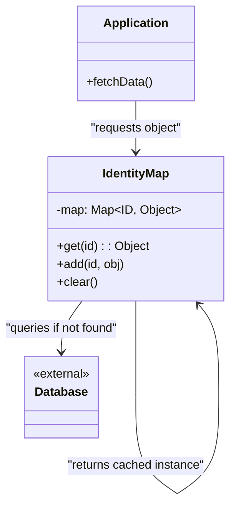

# Identity Map Pattern

<CoverImage src="/covers/architectural/identity-map.png" alt="Cover">
  <h1>Identity Map</h1>
  <p>A smart librarian robot sitting at a desk; when a patron asks for a book, the librarian checks a small desk organizer (cache) first to see if it's already there before running to the deep shelves.</p>
</CoverImage>

## Overview

The **Identity Map** pattern is a critical architectural pattern that ensures that every row loaded from a database is instantiated into exactly **one** object in memory. It acts as an internal cache—a map—where the keys are the database IDs, and the values are the in-memory object instances.

**Key advantage**: It prevents the application from creating two separate objects that represent the exact same database row, effectively eliminating inconsistent data mutations ("lost updates").

**Modern perspective**: Identity Maps are an invisible necessity in modern backend engineering. If you use a heavy ORM (like Hibernate, Entity Framework, or TypeORM), it uses an Identity Map inside its Unit of Work/Session to track objects. Understanding this pattern is essential for debugging why an ORM sometimes returns stale data, or why querying the same user twice doesn't hit the database the second time.

## The Problem

When you retrieve data from a database without an Identity Map, every query instantiates a brand new object in memory. 

```typescript
// ❌ Bad: Multiple objects for the same database record
const userInstanceA = await userRepository.findById(1);
const userInstanceB = await userRepository.findById(1);

console.log(userInstanceA === userInstanceB); // false! They are different objects.

// The "Lost Update" Problem:
userInstanceA.name = "Alice";
userInstanceB.name = "Bob";

await userRepository.save(userInstanceA); // Saves "Alice" to DB
await userRepository.save(userInstanceB); // Saves "Bob" to DB, overwriting "Alice"!
```

This creates severe issues:
1. **Lost Updates**: Because `userInstanceA` and `userInstanceB` are unaware of each other, whichever is saved last silently overwrites the other.
2. **Memory Bloat**: If you load a `Post` with 100 `Comments`, and each `Comment` has an `Author`, and 80 of those comments are written by the *same* Author, you will instantiate 80 identical `User` objects in memory instead of just 1.
3. **Database Thrashing**: Querying for the same record multiple times triggers redundant, identical SQL queries.

## The Solution

An Identity Map is placed between the Repository and the Database. When you request a record, the map is checked first. If the object exists, the exact memory reference is returned. If it doesn't exist, the database is queried, the object is instantiated, and it is stored in the map before being returned.

```typescript
// ✅ Good: The Identity Map ensures only one object exists
const map = new IdentityMap();

const userA = map.get(1) || await db.query(1); // Hits DB, stores in Map
const userB = map.get(1) || await db.query(1); // Hits Map, DB is ignored

console.log(userA === userB); // true! They share the exact same memory reference.

userA.name = "Alice";
console.log(userB.name); // "Alice". Changes are instantly synced everywhere.
```

## Structure



## Flow

1. **Request**: The application requests an object by its primary key (e.g., ID: 123).
2. **Check Map**: The Identity Map is checked for key `123`.
3. **Cache Hit**: If found, the existing object reference is returned immediately. No SQL is executed.
4. **Cache Miss**: If not found, a query is sent to the database. The resulting object is created, added to the Identity Map under key `123`, and then returned.

## Real-World Analogy

Think of a **Hospital Patient Registry**.
When Patient John Doe arrives, the receptionist checks the central registry. If John is already checked in and in Room 4B, the receptionist directs the doctor to Room 4B. 

Without this registry (Identity Map), the hospital might mistakenly check John Doe in a second time, assign him to Room 7A, and suddenly two different doctors are treating two different instances of "John Doe" with conflicting medications. 

## Step-by-Step Implementation

1. **Create the Map**: Create an internal dictionary/hash map.
2. **Create Get/Set Methods**: Implement methods to retrieve and store objects by their unique identifiers.
3. **Integrate with Repository**: Modify your Repository/Data Mapper to always check the Identity Map before querying the database, and to always add new objects to the map after querying.
4. **Scoping**: Ensure the Identity Map is scoped correctly (usually bound to a single HTTP Request or Unit of Work), *not* globally across the entire application.

## Code Examples

::: code-group

```typescript [TypeScript]
// 1. Domain Entity
class User {
  constructor(public id: number, public name: string) {}
}

// 2. The Identity Map
class IdentityMap {
  // Key: Entity name + ID (e.g., "User:1"), Value: Entity instance
  private map: Map<string, any> = new Map();

  public get<T>(entityName: string, id: number): T | null {
    const key = `${entityName}:${id}`;
    return this.map.get(key) || null;
  }

  public add(entityName: string, id: number, entity: any): void {
    const key = `${entityName}:${id}`;
    this.map.set(key, entity);
  }

  public clear(): void {
    this.map.clear();
  }
}

// 3. Repository integrating the Identity Map
class UserRepository {
  constructor(private identityMap: IdentityMap) {}

  public async findById(id: number): Promise<User> {
    // Check Identity Map first
    const cachedUser = this.identityMap.get<User>("User", id);
    if (cachedUser) {
      console.log(`[Cache Hit] Returning existing memory reference for User ${id}`);
      return cachedUser;
    }

    // Simulate DB Query (Cache Miss)
    console.log(`[DB Query] SELECT * FROM users WHERE id = ${id}`);
    const userFromDb = new User(id, `User ${id}`);
    
    // Store in Identity Map for future requests
    this.identityMap.add("User", id, userFromDb);
    return userFromDb;
  }
}

// Client Code
async function run() {
  const map = new IdentityMap();
  const repo = new UserRepository(map);

  console.log("--- First Request ---");
  const user1 = await repo.findById(1);

  console.log("\n--- Second Request ---");
  const user2 = await repo.findById(1);

  console.log("\n--- Identity Check ---");
  console.log("Are they the exact same object?", user1 === user2); // true!

  // Mutating one mutates the other
  user1.name = "Alice";
  console.log("user2 name is now:", user2.name); // Alice
}
run();
```

```python [Python]
from typing import Dict, Optional, Any

# 1. Domain Entity
class User:
    def __init__(self, id_val: int, name: str):
        self.id = id_val
        self.name = name

# 2. The Identity Map
class IdentityMap:
    def __init__(self):
        # Key: "EntityName:ID", Value: Entity Instance
        self._map: Dict[str, Any] = {}

    def get(self, entity_name: str, id_val: int) -> Optional[Any]:
        key = f"{entity_name}:{id_val}"
        return self._map.get(key)

    def add(self, entity_name: str, id_val: int, entity: Any) -> None:
        key = f"{entity_name}:{id_val}"
        self._map[key] = entity

    def clear(self) -> None:
        self._map.clear()

# 3. Repository
class UserRepository:
    def __init__(self, identity_map: IdentityMap):
        self.identity_map = identity_map

    def find_by_id(self, id_val: int) -> User:
        # Check Identity Map first
        cached_user = self.identity_map.get("User", id_val)
        if cached_user:
            print(f"[Cache Hit] Returning existing memory reference for User {id_val}")
            return cached_user

        # Simulate DB Query (Cache Miss)
        print(f"[DB Query] SELECT * FROM users WHERE id = {id_val}")
        user_from_db = User(id_val, f"User {id_val}")
        
        # Store in Map
        self.identity_map.add("User", id_val, user_from_db)
        return user_from_db

# Client Code
if __name__ == "__main__":
    imap = IdentityMap()
    repo = UserRepository(imap)

    print("--- First Request ---")
    u1 = repo.find_by_id(1)

    print("\n--- Second Request ---")
    u2 = repo.find_by_id(1)

    print("\n--- Identity Check ---")
    print(f"Are they the exact same object? {u1 is u2}") # True!

    # Mutating one affects all references
    u1.name = "Alice"
    print(f"u2 name is now: {u2.name}") # Alice
```

```java [Java]
import java.util.HashMap;
import java.util.Map;

// 1. Domain Entity
class User {
    public int id;
    public String name;
    public User(int id, String name) { this.id = id; this.name = name; }
}

// 2. The Identity Map
class IdentityMap {
    private Map<String, Object> map = new HashMap<>();

    public Object get(String entityName, int id) {
        return map.get(entityName + ":" + id);
    }

    public void add(String entityName, int id, Object entity) {
        map.put(entityName + ":" + id, entity);
    }

    public void clear() {
        map.clear();
    }
}

// 3. Repository
class UserRepository {
    private IdentityMap identityMap;

    public UserRepository(IdentityMap identityMap) {
        this.identityMap = identityMap;
    }

    public User findById(int id) {
        // Check map
        User cached = (User) identityMap.get("User", id);
        if (cached != null) {
            System.out.println("[Cache Hit] Returning existing memory reference for User " + id);
            return cached;
        }

        // DB Query
        System.out.println("[DB Query] SELECT * FROM users WHERE id = " + id);
        User user = new User(id, "User " + id);
        
        // Store
        identityMap.add("User", id, user);
        return user;
    }
}

// Client Code
public class IdentityMapDemo {
    public static void main(String[] args) {
        IdentityMap imap = new IdentityMap();
        UserRepository repo = new UserRepository(imap);

        System.out.println("--- First Request ---");
        User u1 = repo.findById(1);

        System.out.println("\n--- Second Request ---");
        User u2 = repo.findById(1);

        System.out.println("\n--- Identity Check ---");
        System.out.println("Are they the exact same object? " + (u1 == u2)); // true!

        u1.name = "Alice";
        System.out.println("u2 name is now: " + u2.name); // Alice
    }
}
```

```go [Go]
package main

import (
	"fmt"
)

// 1. Domain Entity
type User struct {
	ID   int
	Name string
}

// 2. The Identity Map
type IdentityMap struct {
	// Using map of string keys "Entity:ID" to pointers
	m map[string]interface{}
}

func NewIdentityMap() *IdentityMap {
	return &IdentityMap{m: make(map[string]interface{})}
}

func (im *IdentityMap) Get(entityName string, id int) interface{} {
	key := fmt.Sprintf("%s:%d", entityName, id)
	if val, ok := im.m[key]; ok {
		return val
	}
	return nil
}

func (im *IdentityMap) Add(entityName string, id int, entity interface{}) {
	key := fmt.Sprintf("%s:%d", entityName, id)
	im.m[key] = entity
}

// 3. Repository
type UserRepository struct {
	identityMap *IdentityMap
}

func NewUserRepository(im *IdentityMap) *UserRepository {
	return &UserRepository{identityMap: im}
}

func (r *UserRepository) FindByID(id int) *User {
	// Check Map
	if cached := r.identityMap.Get("User", id); cached != nil {
		fmt.Printf("[Cache Hit] Returning existing memory reference for User %d\n", id)
		return cached.(*User) // Type assertion
	}

	// Mock DB Query
	fmt.Printf("[DB Query] SELECT * FROM users WHERE id = %d\n", id)
	user := &User{ID: id, Name: fmt.Sprintf("User %d", id)}
	
	// Store in Map
	r.identityMap.Add("User", id, user)
	return user
}

// Client Code
func main() {
	imap := NewIdentityMap()
	repo := NewUserRepository(imap)

	fmt.Println("--- First Request ---")
	u1 := repo.FindByID(1)

	fmt.Println("\n--- Second Request ---")
	u2 := repo.FindByID(1)

	fmt.Println("\n--- Identity Check ---")
	// Comparing pointers in Go
	fmt.Printf("Are they the exact same object pointer? %v\n", u1 == u2)

	u1.Name = "Alice"
	fmt.Printf("u2 name is now: %s\n", u2.Name)
}
```

```rust [Rust]
use std::cell::RefCell;
use std::collections::HashMap;
use std::rc::Rc;

// 1. Domain Entity
#[derive(Debug)]
pub struct User {
    pub id: i32,
    pub name: String,
}

// 2. The Identity Map
// In Rust, sharing mutable ownership requires Rc and RefCell
pub struct IdentityMap {
    map: HashMap<String, Rc<RefCell<User>>>,
}

impl IdentityMap {
    pub fn new() -> Self {
        Self { map: HashMap::new() }
    }

    pub fn get(&self, entity_name: &str, id: i32) -> Option<Rc<RefCell<User>>> {
        let key = format!("{}:{}", entity_name, id);
        self.map.get(&key).cloned()
    }

    pub fn add(&mut self, entity_name: &str, id: i32, entity: Rc<RefCell<User>>) {
        let key = format!("{}:{}", entity_name, id);
        self.map.insert(key, entity);
    }
}

// 3. Repository
pub struct UserRepository<'a> {
    // Repository holds a mutable reference to the map
    identity_map: &'a mut IdentityMap,
}

impl<'a> UserRepository<'a> {
    pub fn new(identity_map: &'a mut IdentityMap) -> Self {
        Self { identity_map }
    }

    pub fn find_by_id(&mut self, id: i32) -> Rc<RefCell<User>> {
        if let Some(cached) = self.identity_map.get("User", id) {
            println!("[Cache Hit] Returning existing memory reference for User {}", id);
            return cached;
        }

        println!("[DB Query] SELECT * FROM users WHERE id = {}", id);
        let user = Rc::new(RefCell::new(User {
            id,
            name: format!("User {}", id),
        }));

        self.identity_map.add("User", id, Rc::clone(&user));
        user
    }
}

// Client Code
fn main() {
    let mut imap = IdentityMap::new();
    
    // Block to control mutable borrow scopes
    {
        let mut repo = UserRepository::new(&mut imap);

        println!("--- First Request ---");
        let u1 = repo.find_by_id(1);

        println!("\n--- Second Request ---");
        let u2 = repo.find_by_id(1);

        println!("\n--- Identity Check ---");
        // Check if both Rc pointers point to the same allocation
        println!("Are they the exact same object? {}", Rc::ptr_eq(&u1, &u2));

        // Mutating through interior mutability
        u1.borrow_mut().name = "Alice".to_string();
        println!("u2 name is now: {}", u2.borrow().name);
    }
}
```

:::

## Pros and Cons

### Advantages
- **Guaranteed Consistency**: Eliminates "lost update" bugs. If part A of your code changes an object, part B sees the changes instantly.
- **Drastically Improves Performance**: Caching objects avoids costly and redundant network calls to the database.
- **Fixes Circular References**: When loading a `Post` that has an `Author`, and the `Author` has a list of `Posts`, the Identity Map prevents infinite recursion loops during hydration.

### Disadvantages
- **The Stale Data Problem**: If another server modifies the database record, the Identity Map doesn't know. The application will continue serving the outdated object from memory instead of querying the database.
- **Memory Leaks**: If an Identity Map is accidentally instantiated globally (e.g., at the application startup) rather than locally (e.g., per HTTP Request), it will cache every object ever loaded until the server crashes with an Out Of Memory (OOM) error.

## When to Use

- **Web Requests**: Tie the lifecycle of the Identity Map to a single HTTP request. This provides safety and caching during the request, but discards it at the end to prevent memory bloat.
- **Complex Domain Models**: Anytime your database tables have heavy relationships (One-to-Many, Many-to-Many), Identity Map is crucial to resolve the graph without instantiating duplicates.
- **Using Unit of Work**: Identity Maps are an absolute prerequisite for a functioning Unit of Work.

## When NOT to Use

- **Global Application State**: Never use an Identity Map globally across all users/requests in a web backend. You will serve stale data and crash your server.
- **Reporting & Analytics**: When you are fetching 100,000 records to calculate an average or render a CSV, caching them in an Identity Map is a catastrophic waste of RAM. Bypass it.

## Common Mistakes

### 1. The Global Identity Map (Memory Leak)
In Node.js, storing the Identity Map in a global variable means all HTTP requests share the same map. Within minutes, the map grows to gigabytes in size. *Solution: Always scope the Identity Map/Unit of Work to the specific incoming request context (e.g., AsyncLocalStorage in Node.js, or scoped Dependency Injection).*

### 2. Forgetting to Evict
If you execute a raw SQL `UPDATE` statement that bypasses the ORM, the Identity Map will still hold the old values. You must manually clear/evict the Identity Map so subsequent queries fetch the fresh data.

## Related Patterns

- **Unit of Work**: Closely coupled. The Unit of Work uses the Identity Map to track which objects it is currently managing.
- **Data Mapper**: Uses the Identity Map to check if it needs to execute a SELECT statement or if it can just return a cached reference.
- **Repository**: Often hides the implementation of the Identity Map from the business logic layer.
