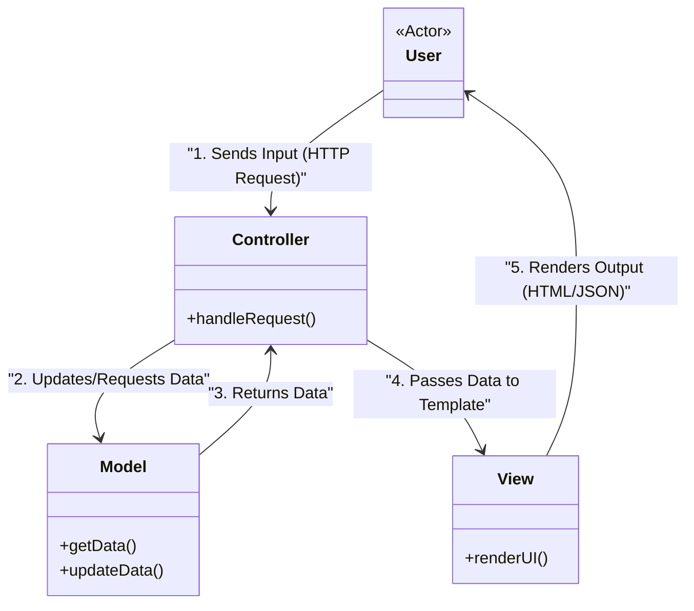

# Model-View-Controller (MVC)

## Overview

The **Model-View-Controller (MVC)** pattern is arguably the most famous architectural pattern in software engineering. Created in the 1970s for early graphical user interfaces (Smalltalk), it has since become the dominant architecture for backend web frameworks (Ruby on Rails, Spring Boot, ASP.NET MVC, Laravel).

It divides an application into three distinct responsibilities:
- **Model**: Manages the data, business rules, and database interactions.
- **View**: Generates the UI (HTML/JSON) presented to the user.
- **Controller**: Listens to user inputs (HTTP Requests), manipulates the Model, and chooses which View to render.

**Modern perspective**: While originally designed for desktop UIs where the View and Model constantly talked to each other, modern web development uses a linear "Request/Response" MVC. The frontend (React/Vue) is now entirely separate, and backend MVCs usually just return JSON, blurring the line of the "View".

## The Problem

Before MVC, developers wrote "Spaghetti Code" where database queries, business logic, and HTML markup were all mixed into a single file (like early PHP or Classic ASP).

```php
<!-- ❌ Bad: Classic "Spaghetti" Code -->
<?php
  // Database connection mixed with HTML
  $conn = new mysqli("localhost", "user", "pass", "db");
  $result = $conn->query("SELECT * FROM users");
?>
<html>
  <body>
    <h1>User List</h1>
    <?php while($row = $result->fetch_assoc()): ?>
      <!-- Logic mixed with markup -->
      <?php if($row['age'] >= 18): ?>
        <p><?= $row['name'] ?> (Adult)</p>
      <?php else: ?>
        <p><?= $row['name'] ?> (Minor)</p>
      <?php endif; ?>
    <?php endwhile; ?>
  </body>
</html>
```

This creates severe issues:
1. **Unmaintainable**: Changing the database schema breaks the HTML. Changing the CSS might accidentally break the SQL query.
2. **Untestable**: You cannot write an automated test to check the "Adult vs Minor" logic without spinning up a real database and parsing the HTML output.
3. **Impossible Collaboration**: A frontend designer and a backend database engineer cannot work on this file at the same time.

## The Solution

MVC forces a strict separation of concerns.



**Flow:**
1. **Controller**: Receives an HTTP GET request to `/users`. It asks the Model for all users.
2. **Model**: Executes the database query, applies the "Adult/Minor" logic, and returns a clean array of `User` objects to the Controller.
3. **Controller**: Takes the array of users and passes it to the `UserListView`.
4. **View**: Loops over the array and renders purely the HTML.

## Real-World Analogy

Think of a **Restaurant**.
- **The Customer (User)**: Looks at the menu and places an order.
- **The Waiter (Controller)**: Takes the order, validates it, and brings it to the kitchen. Later, brings the finished food back to the table.
- **The Chef (Model)**: Knows the recipes (business logic), fetches ingredients from the fridge (database), and cooks the food.
- **The Plating / Presentation (View)**: The visual arrangement of the food on the plate.

The Waiter doesn't cook the food. The Chef doesn't talk to the Customer. The responsibilities are strictly separated.

## Step-by-Step Implementation (Backend Web API)

In a modern context, we will build a backend API where the "View" is just JSON rendering.

1. **The Model**: Create a class representing the core data and business logic.
2. **The Controller**: Create a class with methods (endpoints) that handle HTTP requests.
3. **The View (Optional for APIs)**: In APIs, the framework's JSON serializer acts as the View. In older web apps, this would be an HTML template.

## Code Examples

::: code-group

```typescript [TypeScript (Express)]
import express, { Request, Response } from 'express';

// 1. Model: Handles data and business logic
class UserModel {
  private users = [
    { id: 1, name: "Alice", age: 25 },
    { id: 2, name: "Bob", age: 17 }
  ];

  public getAllAdults() {
    // Business Logic lives here, not in the controller
    return this.users.filter(u => u.age >= 18);
  }

  public createUser(name: string, age: number) {
    if (age < 0) throw new Error("Age cannot be negative");
    const newUser = { id: Date.now(), name, age };
    this.users.push(newUser);
    return newUser;
  }
}

// 2. Controller: Handles HTTP requests, talks to Model, responds with View
class UserController {
  private model: UserModel;

  constructor() {
    this.model = new UserModel();
  }

  public getAdults = (req: Request, res: Response) => {
    try {
      const adults = this.model.getAllAdults();
      // 3. View: The framework serializes the data to JSON
      res.status(200).json({ success: true, data: adults });
    } catch (error) {
      res.status(500).json({ success: false, message: "Server error" });
    }
  }

  public create = (req: Request, res: Response) => {
    try {
      const { name, age } = req.body;
      const user = this.model.createUser(name, age);
      res.status(201).json({ success: true, data: user });
    } catch (error: any) {
      // Handle business logic errors
      res.status(400).json({ success: false, message: error.message });
    }
  }
}

// Router wiring
const app = express();
app.use(express.json());
const controller = new UserController();

app.get('/users/adults', controller.getAdults);
app.post('/users', controller.create);
```

```java [Java (Spring Boot)]
import org.springframework.web.bind.annotation.*;
import java.util.ArrayList;
import java.util.List;
import java.util.stream.Collectors;

// 1. Model (Entity + Service/Business Logic)
class User {
    public int id;
    public String name;
    public int age;
    public User(int id, String name, int age) { this.id = id; this.name = name; this.age = age; }
}

@org.springframework.stereotype.Service
class UserService {
    private List<User> users = new ArrayList<>(List.of(
        new User(1, "Alice", 25),
        new User(2, "Bob", 17)
    ));

    public List<User> getAllAdults() {
        return users.stream()
            .filter(u -> u.age >= 18)
            .collect(Collectors.toList());
    }

    public User createUser(String name, int age) {
        if (age < 0) throw new IllegalArgumentException("Age cannot be negative");
        User user = new User((int)System.currentTimeMillis(), name, age);
        users.add(user);
        return user;
    }
}

// 2. Controller: Handles HTTP Routes
@RestController
@RequestMapping("/users")
class UserController {
    
    private final UserService userService;

    // Dependency Injection of the Model/Service
    public UserController(UserService userService) {
        this.userService = userService;
    }

    @GetMapping("/adults")
    public List<User> getAdults() {
        // 3. View: Spring automatically converts this List to a JSON Response
        return userService.getAllAdults();
    }

    @PostMapping
    public User create(@RequestBody User request) {
        return userService.createUser(request.name, request.age);
    }
}
```

```python [Python (FastAPI)]
from fastapi import FastAPI, HTTPException
from pydantic import BaseModel
from typing import List

app = FastAPI()

# 1. Model (Data shape and Business Logic)
class User(BaseModel):
    id: int
    name: str
    age: int

class UserModel:
    def __init__(self):
        self.users = [
            User(id=1, name="Alice", age=25),
            User(id=2, name="Bob", age=17)
        ]

    def get_adults(self) -> List[User]:
        return [u for u in self.users if u.age >= 18]

    def create_user(self, name: str, age: int) -> User:
        if age < 0:
            raise ValueError("Age cannot be negative")
        new_user = User(id=len(self.users)+1, name=name, age=age)
        self.users.append(new_user)
        return new_user

db_model = UserModel()

# 2. Controller (Route Handlers)
@app.get("/users/adults", response_model=List[User])
def get_adults():
    # 3. View: FastAPI automatically serializes to JSON
    return db_model.get_adults()

@app.post("/users", response_model=User)
def create_user(name: str, age: int):
    try:
        return db_model.create_user(name, age)
    except ValueError as e:
        raise HTTPException(status_code=400, detail=str(e))
```

```go [Go (Gin)]
package main

import (
	"errors"
	"net/http"
	"github.com/gin-gonic/gin"
)

// 1. Model
type User struct {
	ID   int    `json:"id"`
	Name string `json:"name"`
	Age  int    `json:"age"`
}

type UserModel struct {
	users []User
}

func NewUserModel() *UserModel {
	return &UserModel{
		users: []User{
			{ID: 1, Name: "Alice", Age: 25},
			{ID: 2, Name: "Bob", Age: 17},
		},
	}
}

func (m *UserModel) GetAdults() []User {
	var adults []User
	for _, u := range m.users {
		if u.Age >= 18 {
			adults = append(adults, u)
		}
	}
	return adults
}

func (m *UserModel) CreateUser(name string, age int) (User, error) {
	if age < 0 {
		return User{}, errors.New("Age cannot be negative")
	}
	user := User{ID: len(m.users) + 1, Name: name, Age: age}
	m.users = append(m.users, user)
	return user, nil
}

// 2. Controller
type UserController struct {
	model *UserModel
}

func (c *UserController) GetAdults(ctx *gin.Context) {
	adults := c.model.GetAdults()
	// 3. View: Gin serializes map to JSON
	ctx.JSON(http.StatusOK, gin.H{"data": adults})
}

func (c *UserController) Create(ctx *gin.Context) {
	var json struct {
		Name string `json:"name"`
		Age  int    `json:"age"`
	}
	if err := ctx.ShouldBindJSON(&json); err != nil {
		ctx.JSON(http.StatusBadRequest, gin.H{"error": err.Error()})
		return
	}

	user, err := c.model.CreateUser(json.Name, json.Age)
	if err != nil {
		ctx.JSON(http.StatusBadRequest, gin.H{"error": err.Error()})
		return
	}

	ctx.JSON(http.StatusCreated, gin.H{"data": user})
}

func main() {
	r := gin.Default()
	model := NewUserModel()
	controller := &UserController{model: model}

	r.GET("/users/adults", controller.GetAdults)
	r.POST("/users", controller.Create)
	r.Run(":8080")
}
```

:::

## Pros and Cons

### Advantages
- **Separation of Concerns**: UI design changes do not require database logic changes.
- **Parallel Development**: Frontend devs work on Views, Backend devs work on Models/Controllers simultaneously.
- **Testability**: You can write unit tests for the Model independently of the Web Server (Controller).

### Disadvantages
- **Fat Controllers**: Over time, developers get lazy and start putting business logic inside the Controller instead of the Model. This breaks the pattern.
- **Excessive for Small Apps**: If you are just serving a static HTML page, forcing it through an MVC router and model layer is overkill.
- **Not for Modern Frontend**: MVC is terrible for highly interactive, reactive web apps (like a chat app). The frontend world abandoned MVC in favor of MVVM/Component architectures (React, Vue).

## When to Use

- **Backend Web APIs**: Almost every modern REST API framework defaults to an MVC (or MVC-adjacent) structure.
- **Server-Rendered Websites**: Traditional applications where the server renders HTML (Laravel, Rails, ASP.NET).

## When NOT to Use

- **Single Page Applications (SPAs)**: Do not try to force MVC onto React, Vue, or Angular. They use Component-Based Architectures or MVVM.
- **Microservices**: A tiny microservice doing exactly one background job usually doesn't need Controllers or Views.

## Common Mistakes

### 1. Fat Controller / Skinny Model
Writing raw SQL queries and complex validation loops inside the Controller. *Solution: The Controller should only handle HTTP logic (headers, status codes, JSON). All data rules must be moved to the Model (or a Service layer).*

### 2. View Logic
Putting `if/else` statements and data manipulation inside HTML templates. *Solution: The Controller should process the data into its final, display-ready state before passing it to the View.*

## Related Patterns

- **MVVM (Model-View-ViewModel)**: The evolution of MVC used by modern Frontend frameworks where two-way data binding replaces the Controller.
- **MVP (Model-View-Presenter)**: Used mostly in Android/Desktop apps, focusing on a View that is completely passive.
- **MVT (Model-View-Template)**: Django's specific flavor of MVC.
