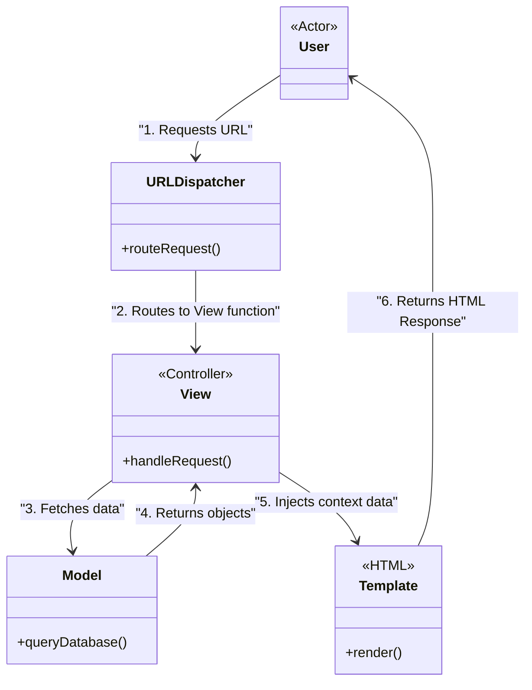

# Model-View-Template (MVT)

<CoverImage src="/covers/architectural/mvt.png" alt="Cover">
  <h1>MVT</h1>
  <p>A professional chef robot (View) taking a raw food package from a pantry (Model) and baking it perfectly into a beautiful heart-shaped geometric cake mold (Template).</p>
</CoverImage>

## Overview

The **Model-View-Template (MVT)** pattern is a specific variation of the MVC pattern popularized by the **Django** Python web framework. It exists because the creators of Django had a slightly different philosophical interpretation of what a "View" should be.

In traditional MVC:
- The **Controller** handles the HTTP request, processes logic, and selects a View.
- The **View** is the HTML template sent to the user.

In MVT (Django's architecture):
- The **Model** handles data and business logic (same as MVC).
- The **View** is the Python function/class that handles the HTTP request, processes logic, and selects a Template. (Effectively the **Controller** in MVC).
- The **Template** is the HTML file sent to the user. (Effectively the **View** in MVC).
- The **Framework** itself acts as the core Router/Controller that maps URLs to Views.

**Modern perspective**: MVT is essentially just MVC with different names. If you understand MVC, you understand MVT. It is primarily relevant for Python/Django developers.

## The Problem

When developers moving from MVC frameworks (like Ruby on Rails or Laravel) to Django first read the documentation, they are often confused by the terminology. They look for a "Controller" directory and can't find one. They see a "Views" directory and expect to find HTML files, but instead find Python logic. 

MVT exists as a naming convention to clarify Django's separation of concerns, emphasizing that the "Template" is just a dumb presentation layer, while the "View" decides *what* data should be presented.

## Structure and Naming Comparison

| Component Concept | Traditional MVC Name | Django MVT Name | Responsibility |
| :--- | :--- | :--- | :--- |
| **Data Layer** | Model | **Model** | Database schema, ORM queries, core business rules. |
| **Logic Layer** | Controller | **View** | Receives HTTP request, queries Model, passes data to presentation. |
| **Presentation Layer** | View | **Template** | HTML files with basic interpolation tags (<code v-pre>{{ user.name }}</code>). |
| **Routing / Glue** | Router / Front Controller | **URL Dispatcher** | Maps `https://example.com/users` to a specific logic layer function. |



## Step-by-Step Implementation (Django Style)

In a Django application, building a feature requires touching three specific files: `models.py`, `views.py`, and an HTML template.

::: code-group

```python [Python (Django MVT)]
# 1. THE MODEL (models.py)
# Maps to the database table and defines domain constraints
from django.db import models

class Article(models.Model):
    title = models.CharField(max_length=200)
    content = models.TextField()
    is_published = models.BooleanField(default=False)

    # Business logic belongs in the Model
    def publish(self):
        self.is_published = True
        self.save()

# 2. THE VIEW (views.py)
# Acts as the Controller: Handles HTTP Request, gets Model data, renders Template
from django.shortcuts import render, get_object_or_404
from .models import Article

def article_detail(request, article_id):
    # Fetch data from the Model
    article = get_object_or_404(Article, id=article_id, is_published=True)
    
    # Create the "context" dictionary to pass to the Template
    context = {
        'article': article,
        'user_is_authenticated': request.user.is_authenticated
    }
    
    # Return the rendered Template as an HTTP Response
    return render(request, 'blog/article_detail.html', context)

# 3. THE URL DISPATCHER (urls.py)
# The Framework's entry point that maps URLs to Views
from django.urls import path
from . import views

urlpatterns = [
    path('articles/<int:article_id>/', views.article_detail, name='article_detail'),
]
```

```html [HTML (Template)]
<!-- 4. THE TEMPLATE (article_detail.html) -->
<!-- Acts as the Presentation layer. Pure HTML + Template Tags -->
<!DOCTYPE html>
<html>
<head>
    <title>{{ article.title }}</title>
</head>
<body>
    <article>
        <!-- The double curly braces inject data from the View's context -->
        <h1>{{ article.title }}</h1>
        <div class="content">
            {{ article.content }}
        </div>
    </article>

    <!-- Basic presentation logic is allowed -->
    
        <button>Edit Article</button>
    
        <p>Please log in to edit.</p>
    
</body>
</html>
```

:::

## Pros and Cons

MVT shares the exact same pros and cons as **MVC**, because functionally, they are the same architectural pattern. 

### Advantages
- **Extremely Fast Development**: Because MVT frameworks (like Django) provide the Model ORM and the Template engine out of the box, building CRUD applications is lightning fast.
- **Clear Separation**: Database engineers can work on `models.py`, backend logic developers on `views.py`, and frontend designers on `.html` templates without stepping on each other's toes.

### Disadvantages
- **Fat Views**: Just like the "Fat Controller" anti-pattern in MVC, developers often get lazy and put 500 lines of complex business logic inside `views.py` instead of pushing it down into `models.py` or a dedicated Service layer.
- **Monolithic Bias**: MVT architectures heavily encourage building Server-Rendered Monoliths. If you need to build a React SPA or a mobile app later, your MVT templates are useless, and you have to rewrite your Views to return JSON (creating a REST API).

## When to Use

- **Building with Django**: If you are using Django, you are using MVT. Follow the framework's conventions.
- **Content-Heavy Websites**: Blogs, CMS platforms, and news sites where the server generates static HTML for SEO purposes.

## When NOT to Use

- **Single Page Applications (SPAs)**: If your frontend is React/Vue, you don't need Templates. Your backend should just be an API returning JSON, rendering MVT irrelevant.

## Related Patterns

- **MVC (Model-View-Controller)**: The exact same architectural concept, just using different terminology. 
- **MVVM (Model-View-ViewModel)**: The frontend equivalent. If you move away from MVT/Django templates to use Vue.js on the frontend, you are transitioning to MVVM.
