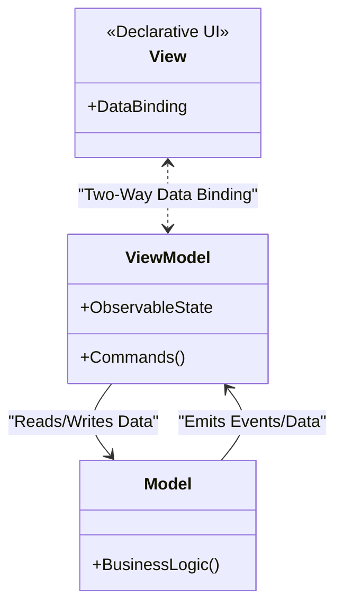

# Model-View-ViewModel (MVVM)

<CoverImage src="/covers/architectural/mvvm.png" alt="Cover">
  <h1>MVVM</h1>
  <p>A futuristic workstation where a View screen and a Model database safe are connected by bright, glowing neon threads that automatically pull and push values in real-time.</p>
</CoverImage>

## Overview

The **Model-View-ViewModel (MVVM)** pattern is the architectural standard for modern, reactive user interfaces. It was originally created by Microsoft for WPF (Windows Presentation Foundation) but has since become the underlying philosophy for almost all modern frontend frameworks (Vue.js, Angular, SwiftUI, Jetpack Compose).

It divides an application into:

- **Model**: Contains the domain data and business logic.
- **View**: The declarative UI layout (HTML, XAML, JSX). It has no logic of its own.
- **ViewModel**: A state-holding class/object that sits between the View and the Model. It exposes "Observable" data streams and Commands.

**The Magic of MVVM**: Unlike MVP or MVC, where a Controller/Presenter must _manually_ push updates to the UI (e.g., `textField.setText("Hello")`), MVVM uses **Data Binding**. The View automatically listens to the ViewModel. When the ViewModel's state changes, the View updates itself instantly and automatically.

## The Problem

In MVC/MVP, the programmer is responsible for manually synchronizing the UI with the data.

```javascript
// ❌ Bad: Manual DOM manipulation (JQuery/Vanilla JS style)
function updateUserName(newName) {
  user.name = newName; // Update data
  // Manually find the DOM element and update it
  document.getElementById("name-display").innerText = newName;
  document.getElementById("name-input").value = newName;
}
```

This causes massive bugs:

1. **Desync**: If you update the data but forget to update the DOM element, the UI shows stale data.
2. **Spaghetti Updates**: When 5 different buttons can change the User's name, you end up duplicating the DOM manipulation code 5 times.
3. **Boilerplate**: Manually reading from inputs and writing to labels accounts for 80% of UI code.

## The Solution

MVVM introduces a **Binder** (provided by frameworks like Vue, Angular, or React). The View _binds_ directly to properties on the ViewModel.

```html
<!-- ✅ Good: Declarative Data Binding (Vue.js style) -->
<template>
  <!-- The View automatically updates when ViewModel.userName changes -->
  <h1>{{ userName }}</h1>

  <!-- Two-way binding: Typing in the input automatically updates the ViewModel -->
  <input v-model="userName" />
</template>
```

When the user types in the input, the ViewModel updates automatically. When the ViewModel updates, the `<h1>` updates automatically. No manual DOM manipulation is required.

## Structure



## Flow

1. **User Action**: The user types in a text box.
2. **Two-Way Binding**: The Framework's binder automatically updates the variable inside the `ViewModel`.
3. **Logic Execution**: A button is clicked, triggering a Command on the `ViewModel`. The `ViewModel` processes the command and updates the `Model`.
4. **State Change**: The `ViewModel` updates its own Observable properties (e.g., `isLoading = false`).
5. **Auto-Render**: The Framework detects the property change and automatically re-renders the specific parts of the `View` that are bound to that property.

## Real-World Analogy

Think of a **Spreadsheet (like Excel)**.

- **The View**: The cell you see on the screen displaying the number "50".
- **The ViewModel**: The formula behind the cell `=A1+B1`.
- **The Model**: The actual data in cells A1 and B1.

If you change cell A1, you don't have to write a script commanding the total cell to redraw. Because the total cell is _bound_ to the formula, it updates automatically.

## Step-by-Step Implementation

Because MVVM relies heavily on a "Binder" engine, it is rarely built from scratch. You typically use a framework (Vue, Angular, Knockout, WPF, SwiftUI). However, we can simulate the pattern using modern proxies or simple observable classes to understand how it works under the hood.

## Code Examples

We will build a simple counter application. To demonstrate how MVVM works, we will implement the **Observable** pattern manually across our languages.

::: code-group

```typescript [TypeScript]
// 1. Model: Core business rules
class CounterModel {
  public value: number = 0;

  public increment() {
    this.value++;
  }
  public decrement() {
    this.value--;
  }
}

// Helper: A simple Observable wrapper (This is what Vue/React do under the hood)
class Observable<T> {
  private listeners: ((val: T) => void)[] = [];
  constructor(private _val: T) {}

  get value(): T {
    return this._val;
  }
  set value(v: T) {
    this._val = v;
    this.listeners.forEach((l) => l(v)); // Notify all bound UI elements
  }

  bind(listener: (val: T) => void) {
    this.listeners.push(listener);
    listener(this._val); // Initial sync
  }
}

// 2. ViewModel: Exposes observable state and commands
class CounterViewModel {
  // State is wrapped in Observables
  public count = new Observable<number>(0);
  public isNegative = new Observable<boolean>(false);

  constructor(private model: CounterModel) {}

  // Commands (triggered by the View)
  public onIncrement() {
    this.model.increment();
    this.syncState();
  }

  public onDecrement() {
    this.model.decrement();
    this.syncState();
  }

  private syncState() {
    // Update Observables. The View will react automatically.
    this.count.value = this.model.value;
    this.isNegative.value = this.model.value < 0;
  }
}

// 3. View: Pure UI that binds to the ViewModel
class CounterView {
  constructor(private viewModel: CounterViewModel) {
    // Declarative Binding

    // Bind to the "count" state
    this.viewModel.count.bind((newVal) => {
      console.log(`UI Update: Counter text changed to -> ${newVal}`);
    });

    // Bind to the "isNegative" state
    this.viewModel.isNegative.bind((isNeg) => {
      if (isNeg) console.log("UI Update: Text turned RED");
      else console.log("UI Update: Text turned BLACK");
    });
  }

  // Simulating user clicking buttons in the UI
  public simulateClickPlus() {
    this.viewModel.onIncrement();
  }
  public simulateClickMinus() {
    this.viewModel.onDecrement();
  }
}

// Execution
const vm = new CounterViewModel(new CounterModel());
const view = new CounterView(vm);

console.log("\n--- User clicks plus ---");
view.simulateClickPlus();

console.log("\n--- User clicks minus twice ---");
view.simulateClickMinus();
view.simulateClickMinus();
```

```python [Python]
from typing import Callable, Generic, TypeVar

T = TypeVar('T')

# Helper: Observable wrapper
class Observable(Generic[T]):
    def __init__(self, initial_value: T):
        self._value = initial_value
        self._listeners = []

    @property
    def value(self) -> T:
        return self._value

    @value.setter
    def value(self, new_val: T):
        self._value = new_val
        for listener in self._listeners:
            listener(new_val)

    def bind(self, listener: Callable[[T], None]):
        self._listeners.append(listener)
        listener(self._value) # initial sync

# 1. Model
class CounterModel:
    def __init__(self):
        self.value = 0

    def increment(self):
        self.value += 1

    def decrement(self):
        self.value -= 1

# 2. ViewModel
class CounterViewModel:
    def __init__(self, model: CounterModel):
        self.model = model
        self.count = Observable(0)
        self.is_negative = Observable(False)

    def on_increment(self):
        self.model.increment()
        self._sync_state()

    def on_decrement(self):
        self.model.decrement()
        self._sync_state()

    def _sync_state(self):
        self.count.value = self.model.value
        self.is_negative.value = self.model.value < 0

# 3. View
class CounterView:
    def __init__(self, viewmodel: CounterViewModel):
        self.viewmodel = viewmodel

        # Bind UI to ViewModel state
        self.viewmodel.count.bind(self.render_count)
        self.viewmodel.is_negative.bind(self.render_color)

    def render_count(self, new_val):
        print(f"UI Update: Counter text -> {new_val}")

    def render_color(self, is_neg):
        color = "RED" if is_neg else "BLACK"
        print(f"UI Update: Text turned {color}")

    def simulate_click_plus(self):
        self.viewmodel.on_increment()

    def simulate_click_minus(self):
        self.viewmodel.on_decrement()

if __name__ == "__main__":
    vm = CounterViewModel(CounterModel())
    view = CounterView(vm)
    print("\n--- User clicks plus ---")
    view.simulate_click_plus()
    print("\n--- User clicks minus twice ---")
    view.simulate_click_minus()
    view.simulate_click_minus()
```

```java [Java]
import java.util.ArrayList;
import java.util.List;
import java.util.function.Consumer;

// Helper: Observable Wrapper
class Observable<T> {
    private T value;
    private List<Consumer<T>> listeners = new ArrayList<>();

    public Observable(T initialValue) {
        this.value = initialValue;
    }

    public T getValue() { return value; }

    public void setValue(T value) {
        this.value = value;
        for (Consumer<T> listener : listeners) {
            listener.accept(value);
        }
    }

    public void bind(Consumer<T> listener) {
        listeners.add(listener);
        listener.accept(value); // Initial sync
    }
}

// 1. Model
class CounterModel {
    public int value = 0;
    public void increment() { value++; }
    public void decrement() { value--; }
}

// 2. ViewModel
class CounterViewModel {
    private CounterModel model;

    public Observable<Integer> count = new Observable<>(0);
    public Observable<Boolean> isNegative = new Observable<>(false);

    public CounterViewModel(CounterModel model) {
        this.model = model;
    }

    public void onIncrement() {
        model.increment();
        syncState();
    }

    public void onDecrement() {
        model.decrement();
        syncState();
    }

    private void syncState() {
        count.setValue(model.value);
        isNegative.setValue(model.value < 0);
    }
}

// 3. View
class CounterView {
    private CounterViewModel viewModel;

    public CounterView(CounterViewModel viewModel) {
        this.viewModel = viewModel;

        // Data binding!
        viewModel.count.bind(val -> {
            System.out.println("UI Update: Counter text -> " + val);
        });

        viewModel.isNegative.bind(isNeg -> {
            System.out.println("UI Update: Text turned " + (isNeg ? "RED" : "BLACK"));
        });
    }

    public void simulateClickPlus() { viewModel.onIncrement(); }
    public void simulateClickMinus() { viewModel.onDecrement(); }
}

public class MVVMDemo {
    public static void main(String[] args) {
        CounterViewModel vm = new CounterViewModel(new CounterModel());
        CounterView view = new CounterView(vm);

        System.out.println("\n--- User clicks plus ---");
        view.simulateClickPlus();

        System.out.println("\n--- User clicks minus twice ---");
        view.simulateClickMinus();
        view.simulateClickMinus();
    }
}
```

```go [Go]
package main

import "fmt"

// Helper: Observable
type Observer func(interface{})

type Observable struct {
	value     interface{}
	observers []Observer
}

func NewObservable(initVal interface{}) *Observable {
	return &Observable{value: initVal}
}

func (o *Observable) SetValue(val interface{}) {
	o.value = val
	for _, obs := range o.observers {
		obs(val)
	}
}

func (o *Observable) Bind(obs Observer) {
	o.observers = append(o.observers, obs)
	obs(o.value)
}

// 1. Model
type CounterModel struct {
	Value int
}

func (m *CounterModel) Increment() { m.Value++ }
func (m *CounterModel) Decrement() { m.Value-- }

// 2. ViewModel
type CounterViewModel struct {
	model      *CounterModel
	Count      *Observable
	IsNegative *Observable
}

func NewCounterViewModel(model *CounterModel) *CounterViewModel {
	return &CounterViewModel{
		model:      model,
		Count:      NewObservable(0),
		IsNegative: NewObservable(false),
	}
}

func (vm *CounterViewModel) OnIncrement() {
	vm.model.Increment()
	vm.syncState()
}

func (vm *CounterViewModel) OnDecrement() {
	vm.model.Decrement()
	vm.syncState()
}

func (vm *CounterViewModel) syncState() {
	vm.Count.SetValue(vm.model.Value)
	vm.IsNegative.SetValue(vm.model.Value < 0)
}

// 3. View
type CounterView struct {
	vm *CounterViewModel
}

func NewCounterView(vm *CounterViewModel) *CounterView {
	v := &CounterView{vm: vm}

	// Data Binding
	vm.Count.Bind(func(val interface{}) {
		fmt.Printf("UI Update: Counter text -> %v\n", val)
	})

	vm.IsNegative.Bind(func(val interface{}) {
		isNeg := val.(bool)
		if isNeg {
			fmt.Println("UI Update: Text turned RED")
		} else {
			fmt.Println("UI Update: Text turned BLACK")
		}
	})
	return v
}

func (v *CounterView) SimulateClickPlus()  { v.vm.OnIncrement() }
func (v *CounterView) SimulateClickMinus() { v.vm.OnDecrement() }

func main() {
	vm := NewCounterViewModel(&CounterModel{})
	view := NewCounterView(vm)

	fmt.Println("\n--- User clicks plus ---")
	view.SimulateClickPlus()

	fmt.Println("\n--- User clicks minus twice ---")
	view.SimulateClickMinus()
	view.SimulateClickMinus()
}
```

```rust [Rust]
use std::rc::Rc;
use std::cell::RefCell;

// Helper: Observable
struct Observable<T> {
    value: T,
    listeners: Vec<Box<dyn Fn(&T)>>,
}

impl<T: Clone> Observable<T> {
    fn new(initial: T) -> Self {
        Observable { value: initial, listeners: Vec::new() }
    }

    fn set_value(&mut self, new_val: T) {
        self.value = new_val.clone();
        for listener in &self.listeners {
            listener(&self.value);
        }
    }

    fn bind<F>(&mut self, listener: F)
    where
        F: Fn(&T) + 'static,
    {
        listener(&self.value);
        self.listeners.push(Box::new(listener));
    }
}

// 1. Model
struct CounterModel {
    value: i32,
}

impl CounterModel {
    fn increment(&mut self) { self.value += 1; }
    fn decrement(&mut self) { self.value -= 1; }
}

// 2. ViewModel
struct CounterViewModel {
    model: CounterModel,
    pub count: Observable<i32>,
    pub is_negative: Observable<bool>,
}

impl CounterViewModel {
    fn new(model: CounterModel) -> Self {
        CounterViewModel {
            model,
            count: Observable::new(0),
            is_negative: Observable::new(false),
        }
    }

    fn on_increment(&mut self) {
        self.model.increment();
        self.sync_state();
    }

    fn on_decrement(&mut self) {
        self.model.decrement();
        self.sync_state();
    }

    fn sync_state(&mut self) {
        self.count.set_value(self.model.value);
        self.is_negative.set_value(self.model.value < 0);
    }
}

// 3. View
struct CounterView {
    // We use Rc/RefCell because the View needs mutable access to trigger VM commands,
    // while also needing to setup initial bindings.
    vm: Rc<RefCell<CounterViewModel>>,
}

impl CounterView {
    fn new(vm: Rc<RefCell<CounterViewModel>>) -> Self {
        let view = CounterView { vm: Rc::clone(&vm) };

        // Setup data bindings
        let mut vm_mut = vm.borrow_mut();

        vm_mut.count.bind(|val| {
            println!("UI Update: Counter text -> {}", val);
        });

        vm_mut.is_negative.bind(|is_neg| {
            let color = if *is_neg { "RED" } else { "BLACK" };
            println!("UI Update: Text turned {}", color);
        });

        view
    }

    fn simulate_click_plus(&self) { self.vm.borrow_mut().on_increment(); }
    fn simulate_click_minus(&self) { self.vm.borrow_mut().on_decrement(); }
}

fn main() {
    let model = CounterModel { value: 0 };
    let vm = Rc::new(RefCell::new(CounterViewModel::new(model)));
    let view = CounterView::new(vm);

    println!("\n--- User clicks plus ---");
    view.simulate_click_plus();

    println!("\n--- User clicks minus twice ---");
    view.simulate_click_minus();
    view.simulate_click_minus();
}
```

:::

## Pros and Cons

### Advantages

- **Zero DOM Manipulation**: Developers no longer write `getElementById()` or deal with tracking which UI elements need updating. State changes automatically cascade to the UI.
- **Incredible Testability**: The ViewModel contains 100% of the UI state and logic, but has absolutely no reference to the DOM/View. You can test a React Hook or Vue composable instantly in a pure Node environment.
- **Designer/Developer Split**: A UX designer can write HTML/CSS (the View) while the developer writes the state logic (the ViewModel), and they just agree on variable names to bind.

### Disadvantages

- **Framework Dependent**: Implementing MVVM without a framework engine (Vue/React/Angular/WPF) is exhausting and requires writing tons of boilerplate Observable classes.
- **Memory Leaks (Ghost Listeners)**: If a View is destroyed but forgets to unsubscribe from the ViewModel's data streams, the ViewModel will keep a reference to the View, preventing Garbage Collection.
- **Debugging Magic**: Because data binding happens invisibly via the framework, if an input suddenly changes to an unexpected value, tracing exactly _which_ part of the code triggered the binding update can be difficult.

## When to Use

- **Modern Web Frontend**: Anytime you are building a Single Page Application (SPA). React (Component State), Vue, and Svelte are all variations of MVVM.
- **Modern Mobile**: Jetpack Compose (Android) and SwiftUI (iOS) are deeply rooted in MVVM principles.
- **Desktop Apps**: WPF, UWP, and .NET MAUI.

## When NOT to Use

- **Backend Development**: MVVM is purely a frontend/UI pattern. Backends should stick to MVC, Layered Architectures, or DDD.
- **Static Websites**: If you are building a simple landing page or blog using standard HTML/CSS, loading a 100kb Vue/React engine just to handle a hamburger menu is massive overkill.

## Common Mistakes

- **Fat ViewModels**: Creating massive ViewModels that do database connections and heavy HTTP requests instead of delegating to proper Service/Repository classes.
- **Binding to Models directly**: Exposing the raw Model directly to the View instead of mapping it through the ViewModel. This prevents you from adding UI-specific computed properties (like `isNegative = value < 0`).

## Related Patterns

- **MVC / MVP**: The predecessors. MVVM solves their "manual view update" problem by introducing automated Data Binding.
- **Observer Pattern**: The core mechanical pattern that makes MVVM work. The View _observes_ the ViewModel.
- **Command Pattern**: Used in MVVM to wrap UI interactions (like button clicks) into objects that the ViewModel can process without knowing about UI events.
