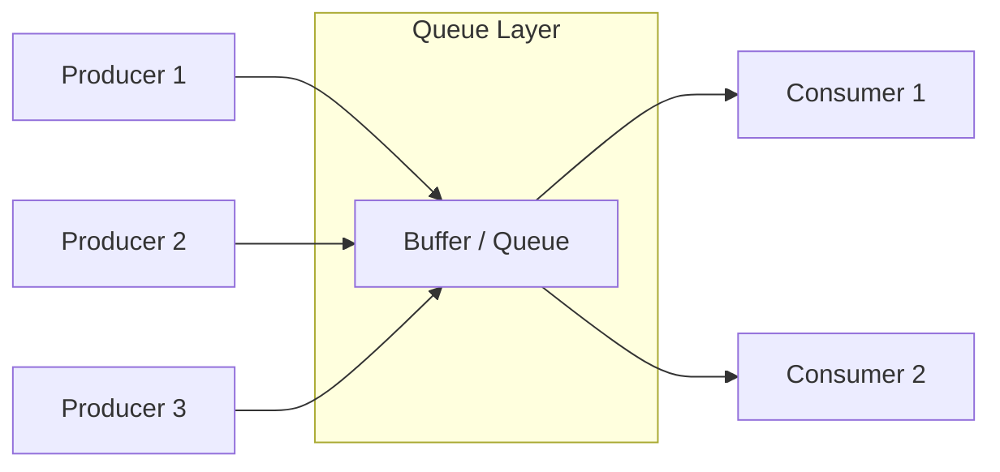

# Producer-Consumer Pattern

## Overview

The **Producer-Consumer** pattern is a fundamental concurrency and architectural design pattern. It separates the code that generates data (the **Producer**) from the code that processes that data (the **Consumer**) by placing an intermediate **Queue** or **Buffer** between them.

This allows both sides to run at completely different speeds, on different threads, or even on entirely different servers.

## The Problem

In a synchronous architecture, a process that creates a piece of work must wait for that work to be fully completed before it can move on to the next task.

```javascript
// ❌ Bad: Synchronous blocking architecture
function handleImageUpload(image) {
    saveToDisk(image);          // Takes 10ms
    generateThumbnails(image);  // Takes 5000ms (BLOCKS!)
    return "Upload Complete";   // User waits 5 seconds to see this
}
```

This creates severe bottlenecks:
1. **Timeouts**: If the processing takes too long, the incoming HTTP request will time out.
2. **Cascading Failures**: If the thumbnail generator crashes, the image upload fails entirely.
3. **Wasted Resources**: The fast producer is forced to idle while waiting for the slow consumer.
4. **Traffic Spikes**: If 1,000 users upload images at the exact same second, your server will try to process 1,000 thumbnails simultaneously, crashing the CPU.

## The Solution

Introduce a Buffer (Queue) between them.

1. The **Producer** receives the image, writes a message to the Queue ("Process Image 123"), and immediately returns success to the user.
2. The **Consumer** (running on a separate thread/server) constantly watches the Queue. It pops messages off one by one and processes them at its own pace.



## Real-World Analogy

Think of a **Fast Food Restaurant**.
- **The Cashier (Producer)**: Takes orders from customers very quickly. They don't cook the food. They just write the order on a ticket and slide it onto the rack.
- **The Ticket Rack (Buffer/Queue)**: Holds the orders in line.
- **The Cooks (Consumers)**: Take tickets off the rack one by one and cook the food. Cooking takes a long time. 

If a bus full of 50 people arrives, the cashier doesn't panic. They just fill the ticket rack. The cooks continue working at maximum speed without being overwhelmed, taking tickets as they finish previous ones.

## Step-by-Step Implementation

For local application concurrency, you implement this using thread-safe data structures (Channels, BlockingQueues). For distributed systems, you use message brokers (Kafka, RabbitMQ, Redis, SQS).

1. **The Buffer**: Create a thread-safe Queue. Optionally, give it a maximum capacity (Bounded Buffer) to prevent running out of memory.
2. **The Producer**: A loop or endpoint that generates items and pushes them to the Queue.
3. **The Consumer**: A loop running on a separate thread/process that pulls items from the Queue and does the heavy lifting.

## Code Examples

We will implement a local multithreaded (or async) Producer-Consumer system. Notice how different languages use distinct idiomatic primitives: Go uses `channels`, Rust uses `mpsc`, Java uses `BlockingQueue`, and JS uses async arrays.

::: code-group

```typescript [TypeScript (Async/Await)]
// TypeScript is single-threaded, so we use async/await to simulate the pattern
// allowing the event loop to yield execution.

class AsyncQueue<T> {
  private items: T[] = [];
  private resolvers: ((value: T) => void)[] = [];

  // Producer calls this
  enqueue(item: T) {
    if (this.resolvers.length > 0) {
      const resolve = this.resolvers.shift()!;
      resolve(item); // Hand directly to waiting consumer
    } else {
      this.items.push(item);
    }
  }

  // Consumer calls this and awaits
  async dequeue(): Promise<T> {
    if (this.items.length > 0) {
      return this.items.shift()!;
    }
    return new Promise<T>(resolve => {
      this.resolvers.push(resolve);
    });
  }
}

// 1. Setup
const queue = new AsyncQueue<string>();

// 2. Consumer Loop (runs continuously in background)
async function startConsumer(id: number) {
  while (true) {
    const job = await queue.dequeue();
    console.log(`Consumer ${id} processing: ${job}`);
    // Simulate heavy work
    await new Promise(r => setTimeout(r, 1000)); 
  }
}

// 3. Producer
function handleUpload(filename: string) {
  console.log(`Producer received: ${filename}`);
  queue.enqueue(filename);
}

// Execution
startConsumer(1);
startConsumer(2);

// Fast bursts of production are absorbed by the queue
handleUpload("img_01.jpg");
handleUpload("img_02.jpg");
handleUpload("img_03.jpg");
handleUpload("img_04.jpg");
```

```python [Python (Multithreading)]
import threading
import time
import queue

# 1. Thread-safe Buffer with Max Capacity of 5
buffer = queue.Queue(maxsize=5)

def producer():
    for i in range(1, 6):
        job = f"Job_{i}"
        print(f"Producer creating {job}")
        
        # Will block if the queue is full (Backpressure)
        buffer.put(job) 
        time.sleep(0.1) # Produces fast
        
    buffer.put(None) # Poison pill to shutdown consumer

def consumer():
    while True:
        # Will block until an item is available
        job = buffer.get()
        if job is None:
            break # Poison pill received
            
        print(f"  Consumer processing {job}")
        time.sleep(1) # Consumes slow (heavy work)
        buffer.task_done()

# Execution
if __name__ == "__main__":
    t_producer = threading.Thread(target=producer)
    t_consumer = threading.Thread(target=consumer)

    t_consumer.start()
    t_producer.start()

    t_producer.join()
    t_consumer.join()
```

```java [Java (Concurrency Package)]
import java.util.concurrent.BlockingQueue;
import java.util.concurrent.LinkedBlockingQueue;

public class ProducerConsumerDemo {
    public static void main(String[] args) throws InterruptedException {
        // 1. Thread-safe bounded buffer
        BlockingQueue<String> queue = new LinkedBlockingQueue<>(5);

        // 2. Producer Thread
        Thread producer = new Thread(() -> {
            try {
                for (int i = 1; i <= 5; i++) {
                    String job = "Job_" + i;
                    System.out.println("Producer creating " + job);
                    
                    // Blocks if queue is full
                    queue.put(job); 
                    Thread.sleep(100); // Fast
                }
                queue.put("EOF"); // Poison pill
            } catch (InterruptedException e) { Thread.currentThread().interrupt(); }
        });

        // 3. Consumer Thread
        Thread consumer = new Thread(() -> {
            try {
                while (true) {
                    // Blocks if queue is empty
                    String job = queue.take();
                    if (job.equals("EOF")) break;
                    
                    System.out.println("  Consumer processing " + job);
                    Thread.sleep(1000); // Slow
                }
            } catch (InterruptedException e) { Thread.currentThread().interrupt(); }
        });

        consumer.start();
        producer.start();

        producer.join();
        consumer.join();
    }
}
```

```go [Go (Channels)]
package main

import (
	"fmt"
	"time"
)

// In Go, Channels are the built-in idiomatic queue
func producer(ch chan<- string) {
	for i := 1; i <= 5; i++ {
		job := fmt.Sprintf("Job_%d", i)
		fmt.Println("Producer creating", job)
		
		ch <- job // Blocks if channel buffer is full
		time.Sleep(100 * time.Millisecond)
	}
	close(ch) // Safely signals consumers to stop
}

func consumer(id int, ch <-chan string, done chan<- bool) {
	// Range over channel automatically stops when closed
	for job := range ch {
		fmt.Printf("  Consumer %d processing %s\n", id, job)
		time.Sleep(1 * time.Second)
	}
	done <- true
}

func main() {
	// 1. Bounded buffer of size 3
	jobs := make(chan string, 3)
	done := make(chan bool)

	// Start two consumers (workers)
	go consumer(1, jobs, done)
	go consumer(2, jobs, done)

	// Start producer
	go producer(jobs)

	// Wait for both consumers to finish
	<-done
	<-done
}
```

```rust [Rust (MPSC Channels)]
use std::sync::mpsc;
use std::thread;
use std::time::Duration;

fn main() {
    // 1. Create a Multiple-Producer, Single-Consumer channel
    let (tx, rx) = mpsc::channel();

    // 2. Producer Thread
    let producer = thread::spawn(move || {
        for i in 1..=5 {
            let job = format!("Job_{}", i);
            println!("Producer creating {}", job);
            
            tx.send(job).unwrap();
            thread::sleep(Duration::from_millis(100)); // Fast
        }
        // Channel (tx) automatically drops and closes here
    });

    // 3. Consumer Thread
    let consumer = thread::spawn(move || {
        // Iterator safely blocks and ends when tx drops
        for job in rx {
            println!("  Consumer processing {}", job);
            thread::sleep(Duration::from_secs(1)); // Slow
        }
    });

    producer.join().unwrap();
    consumer.join().unwrap();
}
```

:::

## Pros and Cons

### Advantages
- **Traffic Smoothing**: If your application receives a massive spike in traffic (e.g., millions of events per second), the buffer absorbs the spike, protecting the backend database from crashing.
- **Independent Scaling**: If producing tasks is fast but consuming them is slow, you can spin up 10 Consumer threads (or servers) for every 1 Producer.
- **Fault Tolerance**: If the consumer crashes, the messages stay safely in the queue until the consumer reboots. No data is lost.

### Disadvantages
- **Eventual Consistency / Delayed Response**: The producer cannot tell the user "The result of your image generation is X". It can only say "Your request is in the queue".
- **Buffer Overflow (OOM)**: If the Producer is consistently faster than the Consumer, an unbound queue will grow indefinitely until the server runs out of RAM and crashes.
- **Increased Complexity**: Code logic is split, making tracing requests and debugging errors much harder.

## When to Use

- **Background Jobs**: Sending emails, generating PDFs, processing videos, or calling slow third-party APIs.
- **Event-Driven Microservices**: Services communicating asynchronously via message brokers (Kafka/RabbitMQ).
- **Log Aggregation**: Application logs are produced rapidly but written to disk/ElasticSearch in batches by a consumer.

## When NOT to Use

- **Synchronous User Flows**: If the user absolutely must see the final result of the operation before they can proceed to the next screen.
- **Simple Monoliths**: Don't add a message broker to a simple CRUD app. The operational overhead of managing RabbitMQ or Kafka is massive.

## Common Mistakes

- **Unbounded Queues**: Creating a queue with infinite capacity. Always use a **Bounded Queue** (a queue with a maximum size). If the queue gets full, the Producer must block or return an error (Applying Backpressure).
- **Silent Failures**: If a consumer encounters a fatal error while processing a job, it must either put the job in a "Dead Letter Queue" or log the failure. Simply discarding the job causes data loss.

## Related Patterns

- **Message Broker**: The distributed, infrastructure-level version of this pattern (e.g., Apache Kafka, RabbitMQ).
- **Thread Pool**: Typically implements the Producer-Consumer pattern internally. You submit tasks (produce) to a queue, and worker threads (consume) execute them.
- **Pub-Sub**: A variation where a single produced message is copied and delivered to *multiple* different consumers.
