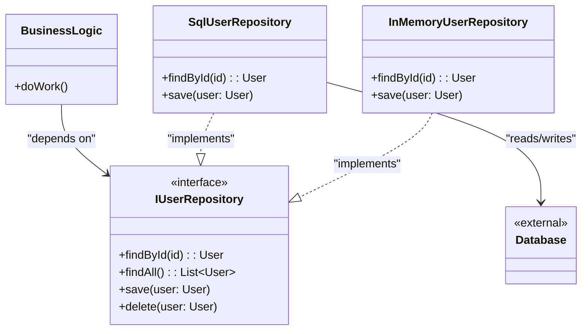

# Repository Pattern

<CoverImage src="/covers/architectural/repository.png" alt="Cover">
  <h1>Repository</h1>
  <p>A beautiful marble temple entrance labeled "Data" with a clean catalog desk; behind the desk, the database query monster and the API monster are kept completely out of sight.</p>
</CoverImage>

## Overview

The **Repository Pattern** is an architectural pattern that sits between the domain/business logic and the data mapping layer. It provides an abstraction of data access, allowing the business logic to treat the database as if it were a simple, in-memory collection of objects.

**Key advantage**: It completely decouples business logic from data access technology (SQL, NoSQL, external APIs), making the application highly testable and agnostic to infrastructure changes.

**Modern perspective**: The Repository pattern is arguably the most widely used architectural pattern in modern backend engineering (often paired with Data Mapper or Dependency Injection). It is the cornerstone of Clean Architecture, Hexagonal Architecture (Ports and Adapters), and Domain-Driven Design (DDD).

## The Problem

When business logic directly queries the database or relies directly on an ORM's Active Record implementation, the system becomes deeply coupled to that specific data source.

```typescript
// ❌ Bad: Business logic coupled to the database technology (e.g., SQL/ORM)
class UserService {
  public async deactivateInactiveUsers() {
    // Leaks SQL syntax into the business service
    const users = await db.query("SELECT * FROM users WHERE last_login < ?", [
      thirtyDaysAgo,
    ]);

    for (const user of users) {
      user.is_active = false;
      await db.execute("UPDATE users SET is_active = false WHERE id = ?", [
        user.id,
      ]);
    }
  }
}
```

This creates several issues:

1. **Testing is difficult**: You cannot unit test `UserService` without a running database or complex SQL mocks.
2. **Duplication**: The exact same SQL query might be written in `ReportService` and `AuthService`.
3. **Rigidity**: If you decide to move `users` to an external microservice or a Redis cache, you have to rewrite the core business logic.

## The Solution

The Repository pattern solves this by hiding the data access behind an interface (or a base class). The business logic only talks to the interface.

```typescript
// ✅ Good: Business logic uses a Repository interface
class UserService {
  constructor(private userRepository: IUserRepository) {} // Dependency Injection

  public async deactivateInactiveUsers() {
    // Pure domain logic, zero SQL
    const users = await this.userRepository.findInactiveSince(thirtyDaysAgo);

    for (const user of users) {
      user.deactivate();
      await this.userRepository.save(user);
    }
  }
}
```

## Structure



## Flow

1. **Definition**: Define an interface `IRepository` with methods like `findById`, `save`, and `delete`.
2. **Implementation**: Create concrete classes (e.g., `PostgresUserRepository`, `MongoUserRepository`, `MockUserRepository`) that implement the interface.
3. **Injection**: Pass the concrete repository into the business service via Dependency Injection.
4. **Execution**: The business service calls methods on the interface. The concrete implementation executes the actual data access logic.

## Real-World Analogy

Think of a **Librarian**.
When you want a specific book, you don't go into the archives, figure out the Dewey Decimal System, and operate the mechanical shelves yourself. You go to the Librarian (the Repository). You say, "Find me books by George Orwell."

The Librarian might look in the physical stacks, check an off-site storage facility, or download an eBook. You (the Business Logic) don't care _where_ or _how_ the book is retrieved, as long as you get the Book object back.

## Step-by-Step Implementation

1. **Define the Domain Entity**: Create the core domain object (e.g., `User`).
2. **Define the Interface**: Create an `IUserRepository` interface specifying the required operations.
3. **Create a Concrete Database Repository**: Implement the interface using real database calls (SQL, ORM, etc.).
4. **Create a Concrete In-Memory Repository**: Implement the interface using an array or Map (crucial for fast unit testing).
5. **Inject into Services**: Pass the repository into your use cases/services.

## Code Examples

::: code-group

```typescript [TypeScript]
// 1. Domain Entity
class User {
  constructor(
    public id: string,
    public name: string,
    public email: string,
  ) {}
}

// 2. Repository Interface
interface IUserRepository {
  findById(id: string): Promise<User | null>;
  findByEmail(email: string): Promise<User | null>;
  save(user: User): Promise<void>;
  delete(id: string): Promise<void>;
}

// 3. Concrete Implementation (In-Memory for Testing)
class InMemoryUserRepository implements IUserRepository {
  private users: Map<string, User> = new Map();

  async findById(id: string): Promise<User | null> {
    return this.users.get(id) || null;
  }

  async findByEmail(email: string): Promise<User | null> {
    for (const user of this.users.values()) {
      if (user.email === email) return user;
    }
    return null;
  }

  async save(user: User): Promise<void> {
    this.users.set(user.id, user);
    console.log(`[Mock DB] Saved user ${user.id}`);
  }

  async delete(id: string): Promise<void> {
    this.users.delete(id);
    console.log(`[Mock DB] Deleted user ${id}`);
  }
}

// 4. Concrete Implementation (PostgreSQL)
class PostgresUserRepository implements IUserRepository {
  // In reality, this would be an actual DB connection or ORM instance
  private db: any = { query: async () => [] };

  async findById(id: string): Promise<User | null> {
    console.log(
      `[Postgres DB] Executing: SELECT * FROM users WHERE id = ${id}`,
    );
    const rows = await this.db.query("SELECT * FROM users WHERE id = $1", [id]);
    return rows.length
      ? new User(rows[0].id, rows[0].name, rows[0].email)
      : null;
  }

  async findByEmail(email: string): Promise<User | null> {
    console.log(
      `[Postgres DB] Executing: SELECT * FROM users WHERE email = ${email}`,
    );
    return null; // Mock implementation
  }

  async save(user: User): Promise<void> {
    console.log(`[Postgres DB] Executing: INSERT/UPDATE for user ${user.id}`);
  }

  async delete(id: string): Promise<void> {
    console.log(`[Postgres DB] Executing: DELETE for user ${id}`);
  }
}

// 5. Business Logic (Service) using the Interface
class UserService {
  // Depends on the INTERFACE, not the concrete class
  constructor(private repo: IUserRepository) {}

  async registerUser(id: string, name: string, email: string): Promise<User> {
    const existing = await this.repo.findByEmail(email);
    if (existing) throw new Error("Email already registered");

    const newUser = new User(id, name, email);
    await this.repo.save(newUser);
    return newUser;
  }
}

// Client Code
async function run() {
  // We can easily swap out the Postgres repository for the InMemory one for testing!
  const repo = new InMemoryUserRepository();
  const service = new UserService(repo);

  await service.registerUser("u1", "Alice", "alice@example.com");

  const user = await repo.findById("u1");
  console.log("Found:", user);
}
run();
```

```python [Python]
from abc import ABC, abstractmethod
from typing import Optional, Dict

# 1. Domain Entity
class User:
    def __init__(self, user_id: str, name: str, email: str):
        self.id = user_id
        self.name = name
        self.email = email

# 2. Repository Interface
class UserRepository(ABC):
    @abstractmethod
    def find_by_id(self, user_id: str) -> Optional[User]: pass

    @abstractmethod
    def find_by_email(self, email: str) -> Optional[User]: pass

    @abstractmethod
    def save(self, user: User) -> None: pass

    @abstractmethod
    def delete(self, user_id: str) -> None: pass

# 3. Concrete Implementation (In-Memory for Testing)
class InMemoryUserRepository(UserRepository):
    def __init__(self):
        self.users: Dict[str, User] = {}

    def find_by_id(self, user_id: str) -> Optional[User]:
        return self.users.get(user_id)

    def find_by_email(self, email: str) -> Optional[User]:
        for user in self.users.values():
            if user.email == email:
                return user
        return None

    def save(self, user: User) -> None:
        self.users[user.id] = user
        print(f"[Mock DB] Saved user {user.id}")

    def delete(self, user_id: str) -> None:
        if user_id in self.users:
            del self.users[user_id]
            print(f"[Mock DB] Deleted user {user_id}")

# 4. Concrete Implementation (SQL Database mock)
class SqlUserRepository(UserRepository):
    def find_by_id(self, user_id: str) -> Optional[User]:
        print(f"[SQL DB] Executing: SELECT * FROM users WHERE id = {user_id}")
        return None

    def find_by_email(self, email: str) -> Optional[User]:
        print(f"[SQL DB] Executing: SELECT * FROM users WHERE email = {email}")
        return None

    def save(self, user: User) -> None:
        print(f"[SQL DB] Executing: INSERT/UPDATE for user {user.id}")

    def delete(self, user_id: str) -> None:
        print(f"[SQL DB] Executing: DELETE for user {user_id}")

# 5. Business Logic (Service)
class UserService:
    def __init__(self, repo: UserRepository):
        self.repo = repo

    def register_user(self, user_id: str, name: str, email: str) -> User:
        if self.repo.find_by_email(email):
            raise ValueError("Email already registered")

        new_user = User(user_id, name, email)
        self.repo.save(new_user)
        return new_user

# Client Code
if __name__ == "__main__":
    # Swap out SqlUserRepository for InMemoryUserRepository instantly
    repo = InMemoryUserRepository()
    service = UserService(repo)

    service.register_user("u1", "Alice", "alice@example.com")
    user = repo.find_by_id("u1")
    print(f"Found: {user.name}")
```

```java [Java]
import java.util.*;

// 1. Domain Entity
class User {
    private String id;
    private String name;
    private String email;

    public User(String id, String name, String email) {
        this.id = id; this.name = name; this.email = email;
    }
    public String getId() { return id; }
    public String getName() { return name; }
    public String getEmail() { return email; }
}

// 2. Repository Interface
interface UserRepository {
    Optional<User> findById(String id);
    Optional<User> findByEmail(String email);
    void save(User user);
    void delete(String id);
}

// 3. Concrete Implementation (In-Memory)
class InMemoryUserRepository implements UserRepository {
    private Map<String, User> users = new HashMap<>();

    @Override
    public Optional<User> findById(String id) {
        return Optional.ofNullable(users.get(id));
    }

    @Override
    public Optional<User> findByEmail(String email) {
        return users.values().stream()
                .filter(u -> u.getEmail().equals(email))
                .findFirst();
    }

    @Override
    public void save(User user) {
        users.put(user.getId(), user);
        System.out.println("[Mock DB] Saved user " + user.getId());
    }

    @Override
    public void delete(String id) {
        users.remove(id);
        System.out.println("[Mock DB] Deleted user " + id);
    }
}

// 4. Concrete Implementation (SQL)
class SqlUserRepository implements UserRepository {
    @Override
    public Optional<User> findById(String id) {
        System.out.println("[SQL DB] SELECT * FROM users WHERE id = " + id);
        return Optional.empty();
    }

    @Override
    public Optional<User> findByEmail(String email) {
        System.out.println("[SQL DB] SELECT * FROM users WHERE email = " + email);
        return Optional.empty();
    }

    @Override
    public void save(User user) {
        System.out.println("[SQL DB] INSERT/UPDATE user " + user.getId());
    }

    @Override
    public void delete(String id) {
        System.out.println("[SQL DB] DELETE user " + id);
    }
}

// 5. Business Logic
class UserService {
    private final UserRepository repo;

    public UserService(UserRepository repo) {
        this.repo = repo;
    }

    public User registerUser(String id, String name, String email) {
        if (repo.findByEmail(email).isPresent()) {
            throw new IllegalArgumentException("Email already registered");
        }
        User newUser = new User(id, name, email);
        repo.save(newUser);
        return newUser;
    }
}

// Client Code
public class RepositoryDemo {
    public static void main(String[] args) {
        // We can inject either SqlUserRepository or InMemoryUserRepository
        UserRepository repo = new InMemoryUserRepository();
        UserService service = new UserService(repo);

        service.registerUser("u1", "Alice", "alice@example.com");
        repo.findById("u1").ifPresent(u -> System.out.println("Found: " + u.getName()));
    }
}
```

```go [Go]
package main

import (
	"errors"
	"fmt"
)

// 1. Domain Entity
type User struct {
	ID    string
	Name  string
	Email string
}

// 2. Repository Interface
type UserRepository interface {
	FindByID(id string) (*User, error)
	FindByEmail(email string) (*User, error)
	Save(user *User) error
	Delete(id string) error
}

// 3. Concrete Implementation (In-Memory)
type InMemoryUserRepository struct {
	users map[string]*User
}

func NewInMemoryUserRepository() *InMemoryUserRepository {
	return &InMemoryUserRepository{users: make(map[string]*User)}
}

func (r *InMemoryUserRepository) FindByID(id string) (*User, error) {
	if user, ok := r.users[id]; ok {
		return user, nil
	}
	return nil, nil // Not found
}

func (r *InMemoryUserRepository) FindByEmail(email string) (*User, error) {
	for _, user := range r.users {
		if user.Email == email {
			return user, nil
		}
	}
	return nil, nil // Not found
}

func (r *InMemoryUserRepository) Save(user *User) error {
	r.users[user.ID] = user
	fmt.Printf("[Mock DB] Saved user %s\n", user.ID)
	return nil
}

func (r *InMemoryUserRepository) Delete(id string) error {
	delete(r.users, id)
	fmt.Printf("[Mock DB] Deleted user %s\n", id)
	return nil
}

// 4. Business Logic
type UserService struct {
	repo UserRepository
}

func NewUserService(repo UserRepository) *UserService {
	return &UserService{repo: repo}
}

func (s *UserService) RegisterUser(id, name, email string) (*User, error) {
	existing, _ := s.repo.FindByEmail(email)
	if existing != nil {
		return nil, errors.New("email already registered")
	}

	newUser := &User{ID: id, Name: name, Email: email}
	s.repo.Save(newUser)
	return newUser, nil
}

// Client Code
func main() {
	repo := NewInMemoryUserRepository()
	service := NewUserService(repo)

	service.RegisterUser("u1", "Alice", "alice@example.com")

	user, _ := repo.FindByID("u1")
	if user != nil {
		fmt.Printf("Found: %s\n", user.Name)
	}
}
```

```rust [Rust]
use std::collections::HashMap;

// 1. Domain Entity
#[derive(Clone)]
pub struct User {
    pub id: String,
    pub name: String,
    pub email: String,
}

// 2. Repository Trait (Interface)
pub trait UserRepository {
    fn find_by_id(&self, id: &str) -> Option<User>;
    fn find_by_email(&self, email: &str) -> Option<User>;
    fn save(&mut self, user: User);
    fn delete(&mut self, id: &str);
}

// 3. Concrete Implementation (In-Memory)
pub struct InMemoryUserRepository {
    users: HashMap<String, User>,
}

impl InMemoryUserRepository {
    pub fn new() -> Self {
        Self { users: HashMap::new() }
    }
}

impl UserRepository for InMemoryUserRepository {
    fn find_by_id(&self, id: &str) -> Option<User> {
        self.users.get(id).cloned()
    }

    fn find_by_email(&self, email: &str) -> Option<User> {
        self.users.values().find(|u| u.email == email).cloned()
    }

    fn save(&mut self, user: User) {
        println!("[Mock DB] Saved user {}", user.id);
        self.users.insert(user.id.clone(), user);
    }

    fn delete(&mut self, id: &str) {
        println!("[Mock DB] Deleted user {}", id);
        self.users.remove(id);
    }
}

// 4. Business Logic
pub struct UserService<T: UserRepository> {
    repo: T,
}

impl<T: UserRepository> UserService<T> {
    pub fn new(repo: T) -> Self {
        Self { repo }
    }

    pub fn register_user(&mut self, id: &str, name: &str, email: &str) -> Result<User, &'static str> {
        if self.repo.find_by_email(email).is_some() {
            return Err("Email already registered");
        }

        let new_user = User {
            id: id.to_string(),
            name: name.to_string(),
            email: email.to_string(),
        };

        self.repo.save(new_user.clone());
        Ok(new_user)
    }
}

// Client Code
fn main() {
    let repo = InMemoryUserRepository::new();
    let mut service = UserService::new(repo);

    let _ = service.register_user("u1", "Alice", "alice@example.com");

    if let Some(user) = service.repo.find_by_id("u1") {
        println!("Found: {}", user.name);
    }
}
```

:::

## Pros and Cons

### Advantages

- **Ultimate Testability**: By mocking the repository, you can unit test your business logic at lightning speed without spinning up a real database.
- **Data Source Agnosticism**: You can easily migrate from MongoDB to PostgreSQL. As long as the new `PostgresRepository` conforms to the `IRepository` interface, the business logic will not change.
- **Centralized Query Logic**: Common queries (e.g., `findActiveAdmins`) exist in one place, reducing SQL string duplication across the codebase.
- **Clean Architecture Foundation**: It forms the hard boundary between the "Application Core" and the "Infrastructure/Persistence" layers.

### Disadvantages

- **Over-Engineering for Small Apps**: If you are building a simple 3-page CRUD app, writing Interfaces, Concrete Repositories, and Dependency Injectors is incredibly verbose compared to just using an Active Record ORM.
- **The "Generic Repository" Anti-Pattern**: Developers sometimes try to create a single `BaseRepository<T>` for all entities. While it saves code, it often becomes a bloated God Class that leaks complex ORM query objects (like Entity Framework `IQueryable`) into the business logic.
- **N+1 Performance Issues**: If the repository only returns single aggregates, attempting to do complex joins or bulk reporting can be inefficient. (Repositories are for transactional data, not reporting/analytics).

## When to Use

- **Enterprise Systems**: Where business logic is complex and must be heavily unit tested.
- **Domain-Driven Design (DDD)**: Repositories are mandatory in DDD to load and save Domain Aggregates.
- **Microservices**: To isolate the internal logic of the service from whatever data store it happens to use.
- **Applications requiring multiple data sources**: When you need to transparently fetch data from a Database, fall back to a Redis cache, or call an external REST API.

## When NOT to Use

- **Simple CRUD Applications**: Use Active Record instead.
- **Analytics / Reporting / CQRS**: If you are just querying massive amounts of data for a dashboard, bypass the Repository entirely and run raw optimized SQL. Repositories are for _transactional_ business logic, not reporting.

## Common Mistakes

### 1. Leaking Infrastructure Details

If your repository interface looks like this: `findById(id: string, includeRelations: boolean, transactionContext: PostgresTx)`, you have failed. The interface is now coupled to Postgres. The interface must speak the language of the Domain, not the Database.

### 2. The God Repository

Putting hundreds of query methods in one repository (`findUserByAge`, `findUserByAgeAndName`, `findUserBy...`). _Solution: Use the Specification Pattern or a robust Query Object for complex filtering._

## Related Patterns

- **Data Mapper**: The Repository pattern often uses a Data Mapper internally to map the SQL rows into the Domain Objects before returning them.
- **Unit of Work**: Repositories are often coordinated by a Unit of Work, which tracks changes across multiple repositories and commits them in a single database transaction.
- **Active Record**: The simpler alternative to the Repository/Data Mapper combination.

## Modern Alternatives

- **CQRS (Command Query Responsibility Segregation)**: In modern high-scale architectures, the Repository is often kept _only_ for Writes (Commands). For Reads (Queries), developers bypass the repository entirely and use a thin Data Access Layer (like Dapper or raw SQL) to map directly to lightweight Data Transfer Objects (DTOs), optimizing performance.
