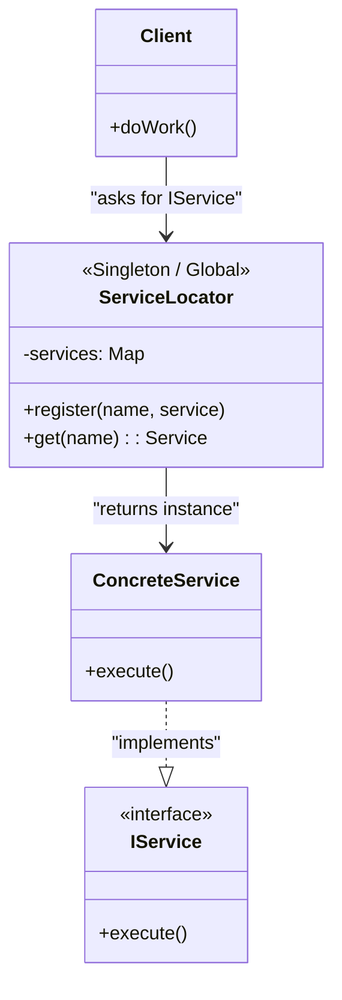

# Service Locator Pattern

<CoverImage src="/covers/architectural/service-locator.png" alt="Cover">
  <h1>Service Locator</h1>
  <p>A bright yellow "Information Desk" kiosk in a futuristic city where robots go to ask: "Where is the Database?" and the locator robot hands them a glowing card.</p>
</CoverImage>

## Overview

The **Service Locator** pattern introduces a centralized registry—the "Locator"—that knows how to create or retrieve all the services an application needs. Instead of classes having their dependencies handed to them (like in Dependency Injection), classes actively ask the Service Locator for the dependencies they need.

**Modern perspective**: While it was popular in early enterprise software (like early J2EE), the Service Locator is now widely considered an **anti-pattern** in modern application development. It hides a class's dependencies, making code harder to test, harder to maintain, and prone to runtime errors. However, understanding it is crucial because it still appears in legacy systems, game development architectures, and occasionally as a fallback in modern DI containers.

## The Problem

When you don't want components tightly coupled to concrete classes, you might try to centralize dependency management.

```typescript
// ❌ Bad: Tightly coupled to concrete classes
class OrderService {
  private paymentGateway = new StripeGateway(); // Hardcoded dependency
  private logger = new ConsoleLogger();         // Hardcoded dependency

  public process() { ... }
}
```

You want to decouple `OrderService` from `StripeGateway`, but perhaps you are working in a legacy codebase where implementing full Constructor Dependency Injection requires rewriting hundreds of files.

## The Solution

You create a global `ServiceLocator`. You register your services in one place, and the `OrderService` asks the Locator for them.

```typescript
// ⚠️ Service Locator (Often an anti-pattern, but solves the hardcoding issue)
class OrderService {
  private paymentGateway: IPaymentGateway;
  private logger: ILogger;

  constructor() {
    // Actively asking a global registry for dependencies
    this.paymentGateway = ServiceLocator.get("PaymentGateway");
    this.logger = ServiceLocator.get("Logger");
  }
}
```

Now, `OrderService` doesn't know about `StripeGateway` or `ConsoleLogger`. It only knows about the `ServiceLocator`.

## Structure



## Flow

1. **Registration phase**: At application startup, you register concrete instances or factory functions with the Service Locator.
2. **Resolution phase**: During execution, a client class needs a service. It calls `ServiceLocator.get('ServiceName')`.
3. **Execution phase**: The locator finds the service, instantiates it if necessary, and returns it to the client.

## Real-World Analogy

Think of a **Hotel Concierge**.
When you stay at a hotel and you need a taxi, a restaurant reservation, or extra towels, you don't contact the taxi company or the laundry department directly. You pick up the phone, call the Concierge (the Service Locator), and ask them to provide what you need. The Concierge knows where to get the taxi and who handles the laundry.

## Why is it considered an Anti-Pattern?

1. **Hidden Dependencies**: If I look at the API of `OrderService`, the constructor takes _zero_ arguments. It _looks_ like I can just instantiate `new OrderService()` and use it. But if I run it, it crashes because I forgot to register a `Logger` globally first. With Dependency Injection, the constructor `constructor(logger: ILogger)` explicitly forces me to provide the dependency.
2. **Global State**: The Service Locator is almost always implemented as a Singleton. This makes running tests in parallel extremely difficult because test A might overwrite the mocked Logger needed by test B.

## Step-by-Step Implementation

If you _must_ implement one (e.g., in game dev or legacy code):

1. **Create the Locator**: Create a Singleton class or a globally accessible object.
2. **Add Registration**: Create a method to add an object or a factory to an internal Dictionary/Map.
3. **Add Retrieval**: Create a method that looks up the key in the Dictionary and returns the object (or invokes the factory).
4. **Use in Clients**: Have clients call the locator's retrieval method instead of using the `new` keyword.

## Code Examples

::: code-group

```typescript [TypeScript]
// 1. Interfaces
interface ILogger {
  log(msg: string): void;
}
interface IDatabase {
  save(): void;
}

// 2. Concrete Classes
class ConsoleLogger implements ILogger {
  log(msg: string) {
    console.log(`[LOG] ${msg}`);
  }
}
class PostgresDatabase implements IDatabase {
  save() {
    console.log(`[DB] Saving to Postgres`);
  }
}

// 3. The Service Locator
class ServiceLocator {
  private static services = new Map<string, any>();

  // Register an instance
  public static register<T>(name: string, service: T): void {
    this.services.set(name, service);
  }

  // Retrieve an instance
  public static get<T>(name: string): T {
    if (!this.services.has(name)) {
      throw new Error(`Service '${name}' not found in Locator!`);
    }
    return this.services.get(name) as T;
  }
}

// 4. The Client (Using the Locator)
class UserService {
  private logger: ILogger;
  private db: IDatabase;

  constructor() {
    // WARNING: Hidden dependencies!
    this.logger = ServiceLocator.get<ILogger>("Logger");
    this.db = ServiceLocator.get<IDatabase>("Database");
  }

  public registerUser(name: string) {
    this.logger.log(`Registering ${name}`);
    this.db.save();
  }
}

// Client Code
console.log("--- Application Startup ---");
ServiceLocator.register("Logger", new ConsoleLogger());
ServiceLocator.register("Database", new PostgresDatabase());

console.log("\n--- Application Runtime ---");
// Looks like it requires no dependencies, but relies on global state
const service = new UserService();
service.registerUser("Alice");
```

```python [Python]
from abc import ABC, abstractmethod
from typing import Dict, Any

# 1. Interfaces
class ILogger(ABC):
    @abstractmethod
    def log(self, msg: str) -> None: pass

class IDatabase(ABC):
    @abstractmethod
    def save(self) -> None: pass

# 2. Concrete Classes
class ConsoleLogger(ILogger):
    def log(self, msg: str) -> None:
        print(f"[LOG] {msg}")

class PostgresDatabase(IDatabase):
    def save(self) -> None:
        print(f"[DB] Saving to Postgres")

# 3. The Service Locator
class ServiceLocator:
    _services: Dict[str, Any] = {}

    @classmethod
    def register(cls, name: str, service: Any) -> None:
        cls._services[name] = service

    @classmethod
    def get(cls, name: str) -> Any:
        if name not in cls._services:
            raise Exception(f"Service '{name}' not found in Locator!")
        return cls._services[name]

# 4. The Client (Using the Locator)
class UserService:
    def __init__(self):
        # WARNING: Hidden dependencies!
        self.logger: ILogger = ServiceLocator.get("Logger")
        self.db: IDatabase = ServiceLocator.get("Database")

    def register_user(self, name: str) -> None:
        self.logger.log(f"Registering {name}")
        self.db.save()

# Client Code
if __name__ == "__main__":
    print("--- Application Startup ---")
    ServiceLocator.register("Logger", ConsoleLogger())
    ServiceLocator.register("Database", PostgresDatabase())

    print("\n--- Application Runtime ---")
    # Instantiation looks clean, but hides the global state requirement
    service = UserService()
    service.register_user("Alice")
```

```java [Java]
import java.util.HashMap;
import java.util.Map;

// 1. Interfaces
interface ILogger { void log(String msg); }
interface IDatabase { void save(); }

// 2. Concrete Classes
class ConsoleLogger implements ILogger {
    public void log(String msg) { System.out.println("[LOG] " + msg); }
}
class PostgresDatabase implements IDatabase {
    public void save() { System.out.println("[DB] Saving to Postgres"); }
}

// 3. The Service Locator
class ServiceLocator {
    private static Map<String, Object> services = new HashMap<>();

    public static void register(String name, Object service) {
        services.put(name, service);
    }

    public static Object get(String name) {
        if (!services.containsKey(name)) {
            throw new RuntimeException("Service '" + name + "' not found in Locator!");
        }
        return services.get(name);
    }
}

// 4. The Client (Using the Locator)
class UserService {
    private ILogger logger;
    private IDatabase db;

    public UserService() {
        // WARNING: Hidden dependencies!
        this.logger = (ILogger) ServiceLocator.get("Logger");
        this.db = (IDatabase) ServiceLocator.get("Database");
    }

    public void registerUser(String name) {
        logger.log("Registering " + name);
        db.save();
    }
}

// Client Code
public class ServiceLocatorDemo {
    public static void main(String[] args) {
        System.out.println("--- Application Startup ---");
        ServiceLocator.register("Logger", new ConsoleLogger());
        ServiceLocator.register("Database", new PostgresDatabase());

        System.out.println("\n--- Application Runtime ---");
        UserService service = new UserService();
        service.registerUser("Alice");
    }
}
```

```go [Go]
package main

import (
	"fmt"
)

// 1. Interfaces
type ILogger interface {
	Log(msg string)
}
type IDatabase interface {
	Save()
}

// 2. Concrete Classes
type ConsoleLogger struct{}
func (l *ConsoleLogger) Log(msg string) { fmt.Printf("[LOG] %s\n", msg) }

type PostgresDatabase struct{}
func (d *PostgresDatabase) Save() { fmt.Printf("[DB] Saving to Postgres\n") }

// 3. The Service Locator
var locatorRegistry = make(map[string]interface{})

type ServiceLocator struct{}

func (s *ServiceLocator) Register(name string, service interface{}) {
	locatorRegistry[name] = service
}

func (s *ServiceLocator) Get(name string) interface{} {
	if service, ok := locatorRegistry[name]; ok {
		return service
	}
	panic(fmt.Sprintf("Service '%s' not found in Locator!", name))
}

// Global instance
var Locator = &ServiceLocator{}

// 4. The Client (Using the Locator)
type UserService struct {
	logger ILogger
	db     IDatabase
}

func NewUserService() *UserService {
	// WARNING: Hidden dependencies!
	return &UserService{
		logger: Locator.Get("Logger").(ILogger),
		db:     Locator.Get("Database").(IDatabase),
	}
}

func (s *UserService) RegisterUser(name string) {
	s.logger.Log(fmt.Sprintf("Registering %s", name))
	s.db.Save()
}

// Client Code
func main() {
	fmt.Println("--- Application Startup ---")
	Locator.Register("Logger", &ConsoleLogger{})
	Locator.Register("Database", &PostgresDatabase{})

	fmt.Println("\n--- Application Runtime ---")
	service := NewUserService()
	service.RegisterUser("Alice")
}
```

```rust [Rust]
use std::any::Any;
use std::collections::HashMap;
use std::sync::Mutex;
use lazy_static::lazy_static; // Requires `lazy_static` crate

// 1. Interfaces (Traits)
pub trait ILogger: Send + Sync {
    fn log(&self, msg: &str);
}
pub trait IDatabase: Send + Sync {
    fn save(&self);
}

// 2. Concrete Classes
pub struct ConsoleLogger;
impl ILogger for ConsoleLogger {
    fn log(&self, msg: &str) { println!("[LOG] {}", msg); }
}

pub struct PostgresDatabase;
impl IDatabase for PostgresDatabase {
    fn save(&self) { println!("[DB] Saving to Postgres"); }
}

// 3. The Service Locator (Using global state in Rust is intentionally difficult)
lazy_static! {
    static ref LOCATOR: Mutex<HashMap<&'static str, Box<dyn Any + Send + Sync>>> = Mutex::new(HashMap::new());
}

pub struct ServiceLocator;

impl ServiceLocator {
    pub fn register<T: Any + Send + Sync>(name: &'static str, service: T) {
        let mut map = LOCATOR.lock().unwrap();
        map.insert(name, Box::new(service));
    }

    // A simplified fetch for demonstration. In a real app, downcasting requires care.
    pub fn execute_logger(name: &'static str, msg: &str) {
        let map = LOCATOR.lock().unwrap();
        if let Some(service) = map.get(name) {
            if let Some(logger) = service.downcast_ref::<ConsoleLogger>() {
                logger.log(msg);
            }
        } else {
            panic!("Service not found");
        }
    }

    pub fn execute_db(name: &'static str) {
        let map = LOCATOR.lock().unwrap();
        if let Some(service) = map.get(name) {
            if let Some(db) = service.downcast_ref::<PostgresDatabase>() {
                db.save();
            }
        } else {
            panic!("Service not found");
        }
    }
}

// 4. The Client (Using the Locator)
pub struct UserService;

impl UserService {
    pub fn new() -> Self {
        // Dependencies are entirely hidden
        Self {}
    }

    pub fn register_user(&self, name: &str) {
        ServiceLocator::execute_logger("Logger", &format!("Registering {}", name));
        ServiceLocator::execute_db("Database");
    }
}

// Client Code
fn main() {
    println!("--- Application Startup ---");
    ServiceLocator::register("Logger", ConsoleLogger);
    ServiceLocator::register("Database", PostgresDatabase);

    println!("\n--- Application Runtime ---");
    let service = UserService::new();
    service.register_user("Alice");
}
```

:::

## Pros and Cons

### Advantages

- **Decoupling**: Like Dependency Injection, it decouples the client from concrete implementations. You can swap out the registered Logger for a MockLogger.
- **Convenience in Legacy Systems**: If you have a deep component tree (e.g., Component A creates B, which creates C, which creates D), passing a Logger through constructors A, B, and C just so D can use it is tedious. A Service Locator allows D to grab the Logger directly.

### Disadvantages

- **Hidden Dependencies (Liar API)**: The class API doesn't tell you what it needs to function. You only find out it needs a database when it throws a runtime exception.
- **Global State**: It introduces a global Singleton, which makes testing difficult, causes race conditions in concurrent environments, and makes application state unpredictable.
- **Maintenance Nightmare**: Refactoring is dangerous. If you remove a service from the locator, the compiler won't warn you. The app will just crash at runtime when a class tries to retrieve it.

## When to Use

- **Game Development**: Game engines (like Unity or Godot) often use Service Locators (like `Locator.getAudioService()`) because the extreme performance and deeply nested scene graphs make standard Constructor Injection impractical.
- **Refactoring Legacy Code**: When breaking apart a massive monolithic application, temporarily introducing a Service Locator is a valid stepping stone before fully implementing Dependency Injection.

## When NOT to Use

- **Modern Web / Enterprise Applications**: Use Dependency Injection instead. There is almost zero reason to use a Service Locator in modern Java, C#, Python, or TypeScript web backends.
- **Libraries/Packages**: If you are writing an open-source library, do not force consumers to use a Service Locator. Require dependencies via constructors.

## Related Patterns

- **Dependency Injection (DI)**: The "correct" modern alternative to Service Locator. Instead of classes _asking_ for dependencies, the framework _gives_ them via constructors.
- **Singleton**: The Service Locator itself is almost always implemented as a Singleton.
- **Factory**: The Service Locator acts as a generalized Factory for the entire application.
