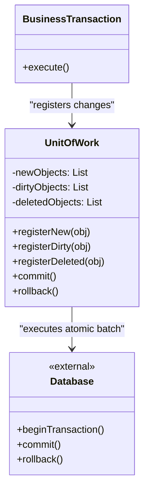

# Unit of Work Pattern

## Overview

The **Unit of Work** pattern is an architectural pattern that tracks all changes made to a set of objects during a business transaction. At the end of the transaction, it coordinates the writing out of all changes (inserts, updates, and deletes) to the database in one single, atomic batch.

**Key advantage**: It guarantees data integrity. If a complex business process modifies five different database tables, the Unit of Work ensures that either all five changes succeed, or all five fail and roll back.

**Modern perspective**: If you have used modern enterprise ORMs (Object-Relational Mappers) like Entity Framework (.NET), Hibernate/JPA (Java), SQLAlchemy (Python), or TypeORM/MikroORM (TypeScript), you are already using the Unit of Work pattern under the hood. It is an indispensable pattern for managing complex writes across distributed or heavily normalized domain models.

## The Problem

Consider an e-commerce checkout process. You need to:
1. Create a new `Order`.
2. Deduct inventory for each `OrderItem`.
3. Update the `Customer` loyalty points.
4. Insert a record into the `Shipping` table.

Without a Unit of Work, you might write code like this:

```typescript
// ❌ Bad: Immediate database writes without a transaction
class CheckoutService {
  public async checkout(cart: Cart, customer: Customer) {
    const order = new Order(cart);
    await orderRepository.save(order); // DB Write 1

    for (const item of cart.items) {
      const inventory = await inventoryRepo.get(item.productId);
      inventory.deduct(item.quantity);
      await inventoryRepo.save(inventory); // DB Writes 2, 3, 4... (What if one fails?)
    }

    customer.addLoyaltyPoints(100);
    await customerRepository.save(customer); // DB Write N
  }
}
```

This creates severe issues:
1. **Partial Failures**: If the system crashes after DB Write 2, the customer is charged, the order exists, but inventory wasn't fully deducted and loyalty points weren't added. The database is now corrupted.
2. **Performance (The "Chatty" DB problem)**: Making 50 separate database calls back-and-forth across the network for a single checkout is incredibly slow.

## The Solution

The Unit of Work pattern introduces a mediator. Instead of saving directly to the database, you register your intent to save, update, or delete with the Unit of Work. The database isn't touched until you call `.commit()`.

```typescript
// ✅ Good: Register changes in memory, commit atomically
class CheckoutService {
  constructor(private uow: IUnitOfWork) {}

  public async checkout(cart: Cart, customer: Customer) {
    const order = new Order(cart);
    this.uow.registerNew(order); // Memory only

    for (const item of cart.items) {
      const inventory = await this.uow.inventoryRepo.get(item.productId);
      inventory.deduct(item.quantity);
      this.uow.registerDirty(inventory); // Memory only
    }

    customer.addLoyaltyPoints(100);
    this.uow.registerDirty(customer); // Memory only

    // Atomically execute all SQL statements in a single DB Transaction
    await this.uow.commit(); 
  }
}
```

## Structure



## Flow

1. **Initialization**: A new Unit of Work is created at the start of a business transaction (e.g., at the beginning of an HTTP Request).
2. **Registration**: As the business logic runs, it creates, modifies, or deletes objects. These objects are registered with the Unit of Work (often automatically via proxies or Identity Maps).
3. **Commit**: The business logic completes. The application calls `commit()` on the Unit of Work.
4. **Execution**: The Unit of Work opens a database transaction, generates the necessary SQL (INSERTs, UPDATEs, DELETEs), executes them, and commits the database transaction.
5. **Rollback (on failure)**: If any SQL statement fails, the database transaction is rolled back, and the in-memory states can be reverted.

## Real-World Analogy

Think of a **Supermarket Checkout**.
When you walk through the aisles, you don't hand the cashier $3 for milk, then walk to the next aisle, get eggs, and hand the cashier $4. That would be chaotic and slow.

Instead, your shopping cart acts as the **Unit of Work**. You accumulate new items (registerNew). Maybe you put an item back on the shelf (registerDeleted). When you finally reach the register, all operations (scanning, bagging, paying) happen in one continuous, atomic batch (`commit()`). If your credit card is declined (`rollback()`), you take none of the groceries home.

## Step-by-Step Implementation

1. **Create the Trackers**: Create sets/lists to hold `new`, `dirty` (modified), and `deleted` objects.
2. **Create Registration Methods**: Create `registerNew()`, `registerDirty()`, and `registerDeleted()`.
3. **Create the Commit Method**: In `commit()`, open a Database Transaction. Loop through the `new` list and execute INSERTs. Loop through `dirty` and execute UPDATEs. Loop through `deleted` and execute DELETEs.
4. **Handle Concurrency (Optional)**: Check object version numbers to ensure no one else modified the row in the meantime.
5. **Cleanup**: Clear the lists after a successful commit or rollback.

## Code Examples

::: code-group

```typescript [TypeScript]
// 1. Domain Entities
abstract class Entity {
  constructor(public id: string) {}
}

class User extends Entity {
  constructor(id: string, public name: string) { super(id); }
}

// 2. The Unit of Work
class UnitOfWork {
  private newEntities: Set<Entity> = new Set();
  private dirtyEntities: Set<Entity> = new Set();
  private deletedEntities: Set<Entity> = new Set();

  public registerNew(entity: Entity): void {
    if (this.dirtyEntities.has(entity) || this.deletedEntities.has(entity)) {
      throw new Error("Invalid state: Entity already tracked");
    }
    this.newEntities.add(entity);
  }

  public registerDirty(entity: Entity): void {
    if (this.deletedEntities.has(entity)) {
      throw new Error("Cannot modify a deleted entity");
    }
    // If it's already in newEntities, it will just be inserted with the latest data,
    // so we don't need to add it to dirtyEntities.
    if (!this.newEntities.has(entity)) {
      this.dirtyEntities.add(entity);
    }
  }

  public registerDeleted(entity: Entity): void {
    if (this.newEntities.has(entity)) {
      // If it was created and deleted in the same transaction, do nothing!
      this.newEntities.delete(entity);
      return;
    }
    this.dirtyEntities.delete(entity);
    this.deletedEntities.add(entity);
  }

  public async commit(): Promise<void> {
    console.log("--- 🏁 BEGIN DB TRANSACTION ---");
    
    try {
      // Execute all INSERTS
      for (const entity of this.newEntities) {
        console.log(`[SQL] INSERT INTO table VALUES ('${entity.id}')`);
      }
      
      // Execute all UPDATES
      for (const entity of this.dirtyEntities) {
        console.log(`[SQL] UPDATE table SET ... WHERE id = '${entity.id}'`);
      }

      // Execute all DELETES
      for (const entity of this.deletedEntities) {
        console.log(`[SQL] DELETE FROM table WHERE id = '${entity.id}'`);
      }

      console.log("--- ✅ COMMIT DB TRANSACTION ---");
    } catch (error) {
      console.log("--- ❌ ROLLBACK DB TRANSACTION ---");
      throw error;
    } finally {
      this.clear(); // Reset state for the next transaction
    }
  }

  private clear(): void {
    this.newEntities.clear();
    this.dirtyEntities.clear();
    this.deletedEntities.clear();
  }
}

// 3. Client Code (Business Logic)
async function processBusinessTransaction() {
  const uow = new UnitOfWork();
  
  // Simulated domain logic
  const user1 = new User("u1", "Alice");
  const user2 = new User("u2", "Bob"); // Assume this was loaded from DB

  // Register intents
  uow.registerNew(user1);
  
  user2.name = "Robert";
  uow.registerDirty(user2);

  // Send everything to the DB atomically
  await uow.commit();
}

processBusinessTransaction();
```

```python [Python]
from typing import Set

# 1. Domain Entities
class Entity:
    def __init__(self, entity_id: str):
        self.id = entity_id

class User(Entity):
    def __init__(self, entity_id: str, name: str):
        super().__init__(entity_id)
        self.name = name

# 2. The Unit of Work
class UnitOfWork:
    def __init__(self):
        self.new_entities: Set[Entity] = set()
        self.dirty_entities: Set[Entity] = set()
        self.deleted_entities: Set[Entity] = set()

    def register_new(self, entity: Entity) -> None:
        if entity in self.dirty_entities or entity in self.deleted_entities:
            raise ValueError("Invalid state: Entity already tracked")
        self.new_entities.add(entity)

    def register_dirty(self, entity: Entity) -> None:
        if entity in self.deleted_entities:
            raise ValueError("Cannot modify a deleted entity")
        if entity not in self.new_entities:
            self.dirty_entities.add(entity)

    def register_deleted(self, entity: Entity) -> None:
        if entity in self.new_entities:
            self.new_entities.remove(entity)
            return
        self.dirty_entities.discard(entity)
        self.deleted_entities.add(entity)

    def commit(self) -> None:
        print("--- 🏁 BEGIN DB TRANSACTION ---")
        try:
            for e in self.new_entities:
                print(f"[SQL] INSERT INTO table VALUES ('{e.id}')")
                
            for e in self.dirty_entities:
                print(f"[SQL] UPDATE table SET ... WHERE id = '{e.id}'")
                
            for e in self.deleted_entities:
                print(f"[SQL] DELETE FROM table WHERE id = '{e.id}'")
                
            print("--- ✅ COMMIT DB TRANSACTION ---")
        except Exception as err:
            print("--- ❌ ROLLBACK DB TRANSACTION ---")
            raise err
        finally:
            self._clear()

    def _clear(self) -> None:
        self.new_entities.clear()
        self.dirty_entities.clear()
        self.deleted_entities.clear()

# 3. Client Code
if __name__ == "__main__":
    uow = UnitOfWork()
    
    user1 = User("u1", "Alice")
    user2 = User("u2", "Bob")
    
    uow.register_new(user1)
    
    user2.name = "Robert"
    uow.register_dirty(user2)
    
    uow.commit()
```

```java [Java]
import java.util.HashSet;
import java.util.Set;

// 1. Domain Entities
abstract class Entity {
    protected String id;
    public Entity(String id) { this.id = id; }
    public String getId() { return id; }
}

class User extends Entity {
    public String name;
    public User(String id, String name) { super(id); this.name = name; }
}

// 2. The Unit of Work
class UnitOfWork {
    private Set<Entity> newEntities = new HashSet<>();
    private Set<Entity> dirtyEntities = new HashSet<>();
    private Set<Entity> deletedEntities = new HashSet<>();

    public void registerNew(Entity entity) {
        if (dirtyEntities.contains(entity) || deletedEntities.contains(entity)) {
            throw new IllegalStateException("Invalid state: Entity already tracked");
        }
        newEntities.add(entity);
    }

    public void registerDirty(Entity entity) {
        if (deletedEntities.contains(entity)) {
            throw new IllegalStateException("Cannot modify a deleted entity");
        }
        if (!newEntities.contains(entity)) {
            dirtyEntities.add(entity);
        }
    }

    public void registerDeleted(Entity entity) {
        if (newEntities.contains(entity)) {
            newEntities.remove(entity);
            return;
        }
        dirtyEntities.remove(entity);
        deletedEntities.add(entity);
    }

    public void commit() throws Exception {
        System.out.println("--- 🏁 BEGIN DB TRANSACTION ---");
        try {
            for (Entity e : newEntities) {
                System.out.println("[SQL] INSERT INTO table VALUES ('" + e.getId() + "')");
            }
            for (Entity e : dirtyEntities) {
                System.out.println("[SQL] UPDATE table SET ... WHERE id = '" + e.getId() + "'");
            }
            for (Entity e : deletedEntities) {
                System.out.println("[SQL] DELETE FROM table WHERE id = '" + e.getId() + "'");
            }
            System.out.println("--- ✅ COMMIT DB TRANSACTION ---");
        } catch (Exception err) {
            System.out.println("--- ❌ ROLLBACK DB TRANSACTION ---");
            throw err;
        } finally {
            clear();
        }
    }

    private void clear() {
        newEntities.clear();
        dirtyEntities.clear();
        deletedEntities.clear();
    }
}

// 3. Client Code
public class UnitOfWorkDemo {
    public static void main(String[] args) {
        UnitOfWork uow = new UnitOfWork();
        
        User user1 = new User("u1", "Alice");
        User user2 = new User("u2", "Bob");
        
        uow.registerNew(user1);
        
        user2.name = "Robert";
        uow.registerDirty(user2);
        
        try {
            uow.commit();
        } catch (Exception e) {
            e.printStackTrace();
        }
    }
}
```

```go [Go]
package main

import (
	"fmt"
)

// 1. Domain Entities
type Entity interface {
	GetID() string
}

type User struct {
	ID   string
	Name string
}

func (u *User) GetID() string { return u.ID }

// 2. The Unit of Work
type UnitOfWork struct {
	newEntities     map[Entity]bool
	dirtyEntities   map[Entity]bool
	deletedEntities map[Entity]bool
}

func NewUnitOfWork() *UnitOfWork {
	return &UnitOfWork{
		newEntities:     make(map[Entity]bool),
		dirtyEntities:   make(map[Entity]bool),
		deletedEntities: make(map[Entity]bool),
	}
}

func (uow *UnitOfWork) RegisterNew(entity Entity) error {
	if uow.dirtyEntities[entity] || uow.deletedEntities[entity] {
		return fmt.Errorf("invalid state: Entity already tracked")
	}
	uow.newEntities[entity] = true
	return nil
}

func (uow *UnitOfWork) RegisterDirty(entity Entity) error {
	if uow.deletedEntities[entity] {
		return fmt.Errorf("cannot modify a deleted entity")
	}
	if !uow.newEntities[entity] {
		uow.dirtyEntities[entity] = true
	}
	return nil
}

func (uow *UnitOfWork) RegisterDeleted(entity Entity) {
	if uow.newEntities[entity] {
		delete(uow.newEntities, entity)
		return
	}
	delete(uow.dirtyEntities, entity)
	uow.deletedEntities[entity] = true
}

func (uow *UnitOfWork) Commit() error {
	fmt.Println("--- 🏁 BEGIN DB TRANSACTION ---")

	// In Go, map iteration is randomized, which is fine as long as 
	// inserts happen before updates (or order doesn't matter strictly here)
	for e := range uow.newEntities {
		fmt.Printf("[SQL] INSERT INTO table VALUES ('%s')\n", e.GetID())
	}
	for e := range uow.dirtyEntities {
		fmt.Printf("[SQL] UPDATE table SET ... WHERE id = '%s'\n", e.GetID())
	}
	for e := range uow.deletedEntities {
		fmt.Printf("[SQL] DELETE FROM table WHERE id = '%s'\n", e.GetID())
	}

	fmt.Println("--- ✅ COMMIT DB TRANSACTION ---")
	uow.clear()
	return nil
}

func (uow *UnitOfWork) clear() {
	uow.newEntities = make(map[Entity]bool)
	uow.dirtyEntities = make(map[Entity]bool)
	uow.deletedEntities = make(map[Entity]bool)
}

// 3. Client Code
func main() {
	uow := NewUnitOfWork()

	user1 := &User{ID: "u1", Name: "Alice"}
	user2 := &User{ID: "u2", Name: "Bob"}

	uow.RegisterNew(user1)

	user2.Name = "Robert"
	uow.RegisterDirty(user2)

	uow.Commit()
}
```

```rust [Rust]
use std::collections::HashSet;
use std::hash::{Hash, Hasher};

// 1. Domain Entities
#[derive(Clone, Debug)]
pub struct User {
    pub id: String,
    pub name: String,
}

// Implement Hash and PartialEq so User can be stored in a HashSet
impl Hash for User {
    fn hash<H: Hasher>(&self, state: &mut H) {
        self.id.hash(state);
    }
}
impl PartialEq for User {
    fn eq(&self, other: &Self) -> bool {
        self.id == other.id
    }
}
impl Eq for User {}

// 2. The Unit of Work
pub struct UnitOfWork {
    new_entities: HashSet<User>,
    dirty_entities: HashSet<User>,
    deleted_entities: HashSet<User>,
}

impl UnitOfWork {
    pub fn new() -> Self {
        Self {
            new_entities: HashSet::new(),
            dirty_entities: HashSet::new(),
            deleted_entities: HashSet::new(),
        }
    }

    pub fn register_new(&mut self, entity: User) -> Result<(), &'static str> {
        if self.dirty_entities.contains(&entity) || self.deleted_entities.contains(&entity) {
            return Err("Invalid state: Entity already tracked");
        }
        self.new_entities.insert(entity);
        Ok(())
    }

    pub fn register_dirty(&mut self, entity: User) -> Result<(), &'static str> {
        if self.deleted_entities.contains(&entity) {
            return Err("Cannot modify a deleted entity");
        }
        if !self.new_entities.contains(&entity) {
            self.dirty_entities.insert(entity);
        }
        Ok(())
    }

    pub fn register_deleted(&mut self, entity: User) {
        if self.new_entities.contains(&entity) {
            self.new_entities.remove(&entity);
            return;
        }
        self.dirty_entities.remove(&entity);
        self.deleted_entities.insert(entity);
    }

    pub fn commit(&mut self) {
        println!("--- 🏁 BEGIN DB TRANSACTION ---");
        
        for e in &self.new_entities {
            println!("[SQL] INSERT INTO table VALUES ('{}')", e.id);
        }
        for e in &self.dirty_entities {
            println!("[SQL] UPDATE table SET ... WHERE id = '{}'", e.id);
        }
        for e in &self.deleted_entities {
            println!("[SQL] DELETE FROM table WHERE id = '{}'", e.id);
        }
        
        println!("--- ✅ COMMIT DB TRANSACTION ---");
        self.clear();
    }

    fn clear(&mut self) {
        self.new_entities.clear();
        self.dirty_entities.clear();
        self.deleted_entities.clear();
    }
}

// 3. Client Code
fn main() {
    let mut uow = UnitOfWork::new();
    
    let user1 = User { id: "u1".to_string(), name: "Alice".to_string() };
    let mut user2 = User { id: "u2".to_string(), name: "Bob".to_string() };
    
    uow.register_new(user1).unwrap();
    
    user2.name = "Robert".to_string();
    uow.register_dirty(user2).unwrap();
    
    uow.commit();
}
```

:::

## Pros and Cons

### Advantages
- **Atomic Consistency**: Either the entire business transaction succeeds, or the entire transaction fails. The database is never left in a corrupted "half-saved" state.
- **Maximized Performance**: By batching operations and executing them only at the end, it minimizes database connections, reduces network latency overhead, and minimizes table locking time.
- **Simplifies Rollbacks**: Because it keeps track of what it planned to do, rolling back is as simple as dropping the in-memory lists rather than issuing reverse SQL statements.

### Disadvantages
- **Heavy Abstraction**: It is a notoriously difficult pattern to implement from scratch correctly (especially when tracking nested object relationships).
- **High Memory Usage**: Because the Unit of Work tracks every loaded, changed, and created object for the duration of the transaction, it can consume massive amounts of memory if you are processing a batch of millions of records.
- **Stale Data Risks**: If a transaction takes 5 minutes to complete, the data held in the Unit of Work memory might become hopelessly out of sync with the actual database.

## When to Use

- **Complex Domain Modifications**: Any enterprise application where a single user action touches multiple domain aggregates/tables.
- **Using Repositories**: Usually, Repositories do not `save()` immediately to the database. They add the object to the Unit of Work, which is injected into the Repositories or the Service layer.

## When NOT to Use

- **Simple CRUD Applications**: If every web request just updates one table, a Unit of Work is massive overkill. A simple Active Record `.save()` is enough.
- **Massive Batch Processing**: If you are parsing a 10GB CSV file and inserting it into the database, loading 10GB of objects into a Unit of Work will crash your server (OOM Error). You should use raw SQL Bulk Inserts instead.

## Common Mistakes

### 1. Manual Tracking instead of Proxies
In the code examples above, the client explicitly called `uow.registerDirty()`. In a true modern implementation (like Entity Framework), the ORM uses Proxy classes or an Identity Map to automatically detect when a property changes. Forcing developers to manually call `registerDirty()` often results in bugs where changes are forgotten.

### 2. Lifespan is too long
A Unit of Work should be short-lived. In a web application, it should live only for the duration of a single HTTP request. Keeping a Unit of Work alive across multiple requests (e.g., in user sessions) will lead to horrific memory leaks and stale data concurrency errors.

## Related Patterns

- **Identity Map**: The Unit of Work almost always relies on an Identity Map to track *which* object instances are currently loaded and being monitored.
- **Repository**: Acts as the collection interface to fetch objects into the Unit of Work, and often relies on the Unit of Work to eventually persist them.
- **Data Mapper**: Actually executes the final SQL commands against the database when the Unit of Work `commit()` is called.
