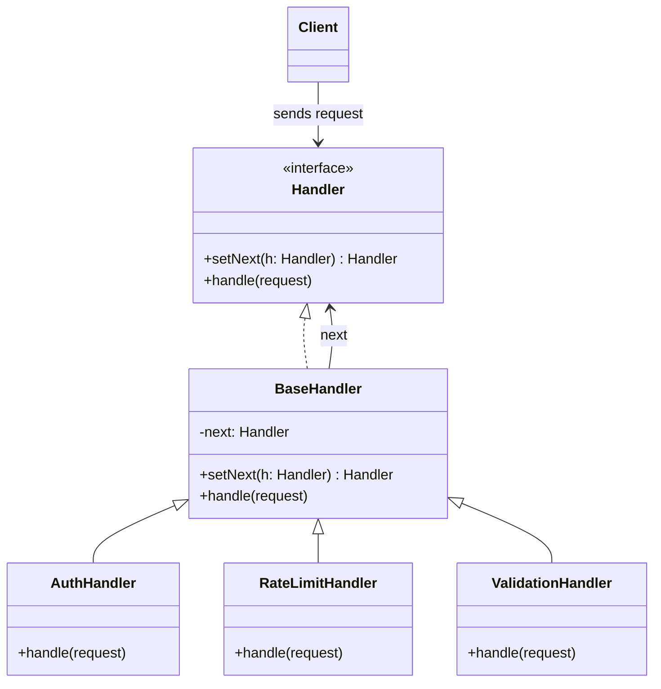

# Chain of Responsibility Pattern

## Overview

The **Chain of Responsibility** pattern is a behavioral design pattern that lets you pass requests along a chain of handlers. Upon receiving a request, each handler decides either to process the request or to pass it to the next handler in the chain.

**Key advantage**: The sender does not need to know which handler will process the request, and handlers don't need to know about the sender or the entire chain. This promotes loose coupling.

**Modern perspective**: Chain of Responsibility is ubiquitous in modern software engineering. It appears natively in middleware stacks (like Express.js or ASP.NET Core), validation pipelines, logging frameworks, UI event bubbling (DOM events), and event processing systems.

## The Problem

Imagine you are building an online ordering system. You want to restrict access to the system so only authenticated users can create orders. Moreover, you need to apply several other checks before an order is finally processed:

1. **Authentication**: Is the user logged in?
2. **Authorization**: Does the user have permission to place this specific order?
3. **Validation**: Is the payload format correct?
4. **Rate Limiting**: Has the user placed too many orders recently?
5. **Caching**: Can we serve this from a cache?

If you place all of this logic directly inside your controller or business service, you end up with a massive, hard-to-maintain `if/else` block:

```typescript
// ❌ Bad: Monolithic logic with tight coupling
function processOrder(request: Request): void {
  if (!isAuthenticated(request)) {
    throw new Error("Unauthenticated");
  }

  if (!hasPermission(request.user)) {
    throw new Error("Forbidden");
  }

  if (rateLimitExceeded(request.ip)) {
    throw new Error("Rate limited");
  }

  if (!isValid(request.body)) {
    throw new Error("Invalid payload");
  }

  // Actual business logic...
  console.log("Order processed");
}
```

This violates the Single Responsibility Principle. Testing this monolith is a nightmare, and adding a new check (like IP filtering) requires modifying the core business logic.

## The Solution

The Chain of Responsibility pattern suggests linking these behaviors into a chain. Each check is extracted into its own class called a **Handler**.

1. **Sequential Flow**: The request enters the first handler. If it passes the check, the handler forwards it to the next handler in the chain.
2. **Short-circuiting**: If a handler decides the request is invalid (e.g., rate limit exceeded), it can immediately return an error, preventing the rest of the chain from executing.
3. **Dynamic Composition**: You can reorder, add, or remove handlers at runtime without altering the core logic.

## Structure



## Flow

1. **Client** configures the chain (or it's configured via Dependency Injection) and passes the request to the first handler.
2. **AuthHandler** receives the request. If the user isn't authenticated, it throws an error. Otherwise, it calls `next.handle()`.
3. **RateLimitHandler** receives it. If the rate limit is exceeded, it short-circuits. Otherwise, it forwards.
4. **ValidationHandler** checks the payload.
5. Finally, if all handlers pass the request, the final action is executed.

## Real-World Analogy

Think of **Customer Support** via phone.
You call a company with an issue. First, an automated voice assistant (Handler 1) tries to answer common questions. If your issue is complex, it forwards you to a Level 1 Support Agent (Handler 2). If they can't solve it, they forward you to a Level 2 Technician (Handler 3), and finally to a specialized Engineer (Handler 4). Each person in the chain either handles the request completely or passes it along.

## Step-by-Step Implementation

1. **Declare the Handler Interface**: Create an interface with a method to handle requests and another to set the next handler.
2. **Create an Abstract Base Handler**: Implement the `setNext` logic to avoid duplicating it across all concrete handlers. The `handle` method in the base class should simply forward the request to the next handler if one exists.
3. **Create Concrete Handlers**: Subclass the base handler. In the `handle` method, perform the specific logic. Decide whether to process the request, reject it, or forward it using `super.handle()`.
4. **Construct the Chain**: In your client or application setup code, instantiate the handlers and link them together (`h1.setNext(h2).setNext(h3)`).
5. **Execute**: Send the request to the first handler in the chain.

## Code Examples

::: code-group

```typescript [TypeScript]
// 1. Context object carrying request data
interface RequestContext {
  userId?: string;
  ip: string;
  body: string;
  flags: string[];
}

// 2. The Handler interface
interface RequestHandler {
  setNext(handler: RequestHandler): RequestHandler;
  handle(request: RequestContext): void;
}

// 3. Abstract Base Handler to manage chaining
abstract class BaseRequestHandler implements RequestHandler {
  private nextHandler: RequestHandler | null = null;

  setNext(handler: RequestHandler): RequestHandler {
    this.nextHandler = handler;
    // Return the handler to allow chaining: h1.setNext(h2).setNext(h3)
    return handler;
  }

  handle(request: RequestContext): void {
    if (this.nextHandler) {
      this.nextHandler.handle(request);
    }
  }
}

// 4. Concrete Handlers
class AuthenticationHandler extends BaseRequestHandler {
  handle(request: RequestContext): void {
    if (!request.userId) {
      console.error(
        "AuthenticationHandler: Unauthenticated request from",
        request.ip,
      );
      return; // Short-circuit the chain
    }
    console.log("AuthenticationHandler: User verified. Passing to next.");
    super.handle(request); // Pass to the next handler
  }
}

class RateLimitHandler extends BaseRequestHandler {
  handle(request: RequestContext): void {
    if (request.flags.includes("rate_limited")) {
      console.error("RateLimitHandler: Too many requests from", request.ip);
      return; // Short-circuit
    }
    console.log("RateLimitHandler: Rate limit OK. Passing to next.");
    super.handle(request);
  }
}

class ModerationHandler extends BaseRequestHandler {
  handle(request: RequestContext): void {
    if (request.body.includes("spam")) {
      console.error("ModerationHandler: Blocked content detected.");
      return; // Short-circuit
    }
    console.log("ModerationHandler: Content clean. Passing to next.");
    super.handle(request);
  }
}

class FinalProcessingHandler extends BaseRequestHandler {
  handle(request: RequestContext): void {
    // This is typically the terminal node
    console.log(
      `FinalProcessingHandler: Successfully processed request for ${request.userId}: ${request.body}`,
    );
  }
}

// 5. Client Code
const auth = new AuthenticationHandler();
const rateLimit = new RateLimitHandler();
const moderation = new ModerationHandler();
const processor = new FinalProcessingHandler();

// Compose the chain
auth.setNext(rateLimit).setNext(moderation).setNext(processor);

console.log("--- Request 1 (Valid) ---");
auth.handle({
  userId: "user_42",
  ip: "203.0.113.10",
  body: "Hello, this is a clean message.",
  flags: [],
});

console.log("\n--- Request 2 (Spam) ---");
auth.handle({
  userId: "user_42",
  ip: "203.0.113.10",
  body: "Buy this spam product now!",
  flags: [],
});

console.log("\n--- Request 3 (Unauthenticated) ---");
auth.handle({
  ip: "192.168.1.1",
  body: "Valid message, but no user.",
  flags: [],
});
```

```python [Python]
from abc import ABC, abstractmethod
from typing import Optional, List

# 1. Request Context
class RequestContext:
    def __init__(self, user_id: Optional[str], ip: str, body: str, flags: List[str]):
        self.user_id = user_id
        self.ip = ip
        self.body = body
        self.flags = flags

# 2. Handler Interface
class RequestHandler(ABC):
    @abstractmethod
    def set_next(self, handler: 'RequestHandler') -> 'RequestHandler':
        pass

    @abstractmethod
    def handle(self, request: RequestContext) -> None:
        pass

# 3. Base Handler
class BaseRequestHandler(RequestHandler):
    def __init__(self):
        self._next_handler: Optional[RequestHandler] = None

    def set_next(self, handler: RequestHandler) -> RequestHandler:
        self._next_handler = handler
        return handler

    def handle(self, request: RequestContext) -> None:
        if self._next_handler:
            self._next_handler.handle(request)

# 4. Concrete Handlers
class AuthenticationHandler(BaseRequestHandler):
    def handle(self, request: RequestContext) -> None:
        if not request.user_id:
            print(f"AuthHandler: Unauthenticated request from {request.ip}")
            return
        print("AuthHandler: Verified. Passing.")
        super().handle(request)

class RateLimitHandler(BaseRequestHandler):
    def handle(self, request: RequestContext) -> None:
        if "rate_limited" in request.flags:
            print(f"RateLimitHandler: Blocked {request.ip}")
            return
        print("RateLimitHandler: OK. Passing.")
        super().handle(request)

class ModerationHandler(BaseRequestHandler):
    def handle(self, request: RequestContext) -> None:
        if "spam" in request.body.lower():
            print("ModerationHandler: Spam detected.")
            return
        print("ModerationHandler: Content clean. Passing.")
        super().handle(request)

class TerminalHandler(BaseRequestHandler):
    def handle(self, request: RequestContext) -> None:
        print(f"TerminalHandler: Processing request for {request.user_id}")

# 5. Client Code
if __name__ == "__main__":
    auth = AuthenticationHandler()
    rate = RateLimitHandler()
    mod = ModerationHandler()
    terminal = TerminalHandler()

    # Link the chain
    auth.set_next(rate).set_next(mod).set_next(terminal)

    print("--- Request 1 ---")
    req1 = RequestContext("u1", "127.0.0.1", "Good message", [])
    auth.handle(req1)

    print("\n--- Request 2 ---")
    req2 = RequestContext("u2", "127.0.0.1", "Buy SPAM today", [])
    auth.handle(req2)
```

```java [Java]
import java.util.List;

// 1. Request Context
record RequestContext(String userId, String ip, String body, List<String> flags) {}

// 2. Base Handler (Abstract Class acting as Interface + Base)
abstract class RequestHandler {
    private RequestHandler next;

    public RequestHandler setNext(RequestHandler next) {
        this.next = next;
        return next;
    }

    public void handle(RequestContext request) {
        if (next != null) {
            next.handle(request);
        }
    }
}

// 3. Concrete Handlers
class AuthHandler extends RequestHandler {
    @Override
    public void handle(RequestContext request) {
        if (request.userId() == null || request.userId().isEmpty()) {
            System.out.println("AuthHandler: Unauthenticated from " + request.ip());
            return;
        }
        System.out.println("AuthHandler: Passed");
        super.handle(request);
    }
}

class RateLimitHandler extends RequestHandler {
    @Override
    public void handle(RequestContext request) {
        if (request.flags().contains("rate_limited")) {
            System.out.println("RateLimitHandler: Blocked " + request.ip());
            return;
        }
        System.out.println("RateLimitHandler: Passed");
        super.handle(request);
    }
}

class ModerationHandler extends RequestHandler {
    @Override
    public void handle(RequestContext request) {
        if (request.body().toLowerCase().contains("spam")) {
            System.out.println("ModerationHandler: Spam detected");
            return;
        }
        System.out.println("ModerationHandler: Passed");
        super.handle(request);
    }
}

class TerminalHandler extends RequestHandler {
    @Override
    public void handle(RequestContext request) {
        System.out.println("TerminalHandler: Request processed successfully!");
    }
}

// 4. Client Code
public class ChainDemo {
    public static void main(String[] args) {
        RequestHandler chain = new AuthHandler();
        chain.setNext(new RateLimitHandler())
             .setNext(new ModerationHandler())
             .setNext(new TerminalHandler());

        System.out.println("--- Request 1 ---");
        chain.handle(new RequestContext("u1", "10.0.0.1", "Hello world", List.of()));

        System.out.println("\n--- Request 2 ---");
        chain.handle(new RequestContext(null, "10.0.0.2", "Hello", List.of()));
    }
}
```

```go [Go]
package main

import (
	"fmt"
	"strings"
)

// 1. Request Context
type RequestContext struct {
	UserID string
	IP     string
	Body   string
	Flags  []string
}

// 2. Handler Interface
type Handler interface {
	SetNext(Handler) Handler
	Handle(*RequestContext)
}

// 3. Base Handler
type BaseHandler struct {
	next Handler
}

func (h *BaseHandler) SetNext(next Handler) Handler {
	h.next = next
	return next
}

func (h *BaseHandler) Handle(req *RequestContext) {
	if h.next != nil {
		h.next.Handle(req)
	}
}

// 4. Concrete Handlers
// By embedding BaseHandler, we inherit SetNext and Handle, but we override Handle.
type AuthHandler struct {
	BaseHandler
}

func (h *AuthHandler) Handle(req *RequestContext) {
	if req.UserID == "" {
		fmt.Printf("AuthHandler: Unauthenticated %s\n", req.IP)
		return
	}
	fmt.Println("AuthHandler: Passed")
	h.BaseHandler.Handle(req) // Call parent to forward
}

type RateLimitHandler struct {
	BaseHandler
}

func (h *RateLimitHandler) Handle(req *RequestContext) {
	for _, flag := range req.Flags {
		if flag == "rate_limited" {
			fmt.Printf("RateLimitHandler: Blocked %s\n", req.IP)
			return
		}
	}
	fmt.Println("RateLimitHandler: Passed")
	h.BaseHandler.Handle(req)
}

type ModerationHandler struct {
	BaseHandler
}

func (h *ModerationHandler) Handle(req *RequestContext) {
	if strings.Contains(strings.ToLower(req.Body), "spam") {
		fmt.Println("ModerationHandler: Spam detected")
		return
	}
	fmt.Println("ModerationHandler: Passed")
	h.BaseHandler.Handle(req)
}

type TerminalHandler struct {
	BaseHandler
}

func (h *TerminalHandler) Handle(req *RequestContext) {
	fmt.Printf("TerminalHandler: Request processed for %s\n", req.UserID)
}

// 5. Client Code
func main() {
	auth := &AuthHandler{}
	rate := &RateLimitHandler{}
	mod := &ModerationHandler{}
	term := &TerminalHandler{}

	auth.SetNext(rate).SetNext(mod).SetNext(term)

	fmt.Println("--- Request 1 ---")
	req1 := &RequestContext{UserID: "u1", IP: "10.0.0.1", Body: "Hello"}
	auth.Handle(req1)

	fmt.Println("\n--- Request 2 ---")
	req2 := &RequestContext{UserID: "u2", IP: "10.0.0.2", Body: "Buy spam now", Flags: []string{}}
	auth.Handle(req2)
}
```

```rust [Rust]
// 1. Request Context
#[derive(Debug)]
struct RequestContext {
    user_id: Option<String>,
    ip: String,
    body: String,
    flags: Vec<String>,
}

// 2. Handler Trait
// Rust uses Box<dyn Trait> for dynamic dispatch in chains
trait RequestHandler {
    fn handle(&self, request: &RequestContext) -> Result<(), String>;
}

// 3. Concrete Handlers (In Rust, composition is often cleaner than inheritance for chains)
struct AuthHandler {
    next: Option<Box<dyn RequestHandler>>,
}

impl RequestHandler for AuthHandler {
    fn handle(&self, request: &RequestContext) -> Result<(), String> {
        if request.user_id.is_none() {
            return Err(format!("AuthHandler: Unauthenticated IP {}", request.ip));
        }
        println!("AuthHandler: Passed");
        if let Some(next_handler) = &self.next {
            next_handler.handle(request)
        } else {
            Ok(())
        }
    }
}

struct RateLimitHandler {
    next: Option<Box<dyn RequestHandler>>,
}

impl RequestHandler for RateLimitHandler {
    fn handle(&self, request: &RequestContext) -> Result<(), String> {
        if request.flags.contains(&"rate_limited".to_string()) {
            return Err(format!("RateLimitHandler: Blocked IP {}", request.ip));
        }
        println!("RateLimitHandler: Passed");
        if let Some(next_handler) = &self.next {
            next_handler.handle(request)
        } else {
            Ok(())
        }
    }
}

struct TerminalHandler;

impl RequestHandler for TerminalHandler {
    fn handle(&self, request: &RequestContext) -> Result<(), String> {
        println!("TerminalHandler: Processed successfully for IP {}", request.ip);
        Ok(())
    }
}

// 4. Client Code
fn main() {
    // Build the chain backwards in Rust due to ownership/Box mechanics
    let terminal = Box::new(TerminalHandler);
    let rate = Box::new(RateLimitHandler { next: Some(terminal) });
    let auth = Box::new(AuthHandler { next: Some(rate) });

    let req1 = RequestContext {
        user_id: Some("u1".into()),
        ip: "10.0.0.1".into(),
        body: "Hello".into(),
        flags: vec![],
    };

    println!("--- Request 1 ---");
    match auth.handle(&req1) {
        Ok(_) => println!("Chain completed successfully"),
        Err(e) => println!("Chain aborted: {}", e),
    }

    let req2 = RequestContext {
        user_id: None,
        ip: "10.0.0.2".into(),
        body: "Hello".into(),
        flags: vec![],
    };

    println!("\n--- Request 2 ---");
    match auth.handle(&req2) {
        Ok(_) => println!("Chain completed successfully"),
        Err(e) => println!("Chain aborted: {}", e),
    }
}
```

:::

## Pros and Cons

### Advantages

- **Single Responsibility Principle**: Each handler is responsible for exactly one condition.
- **Open/Closed Principle**: You can add or remove handlers without breaking existing client code.
- **Loose Coupling**: The client sending the request doesn't need to know how the chain is structured or who ultimately handles it.
- **Dynamic Chains**: Handlers can be rearranged dynamically at runtime.

### Disadvantages

- **Uncertain Guarantee**: Since the request drops off the end of the chain if no one handles it, an unhandled request might silently disappear (if no terminal fallback exists).
- **Hard to Trace**: Debugging a long chain can be difficult. Stack traces can become deep and confusing, especially in asynchronous chains.
- **Performance Overhead**: In highly sensitive performance paths, traversing a deep chain of objects might introduce unnecessary indirection.

## When to Use

- **Middleware Pipelines**: When handling HTTP requests in web frameworks (authentication, compression, parsing).
- **Event Handling**: When you have multiple listeners but only one should logically consume the event.
- **Configurable Workflows**: When the sequence of validations or transformations changes based on user configuration or runtime rules.

## When NOT to Use

- **Direct Method Calls Work Fine**: If the logic is simple, doesn't change, and lives in a tightly scoped module, a simple function call or `if/else` is much faster and easier to read.
- **Transactions Required**: If steps need to roll back when a later step fails, you should use the **Saga** or **Command** pattern. Chain of Responsibility usually does not handle two-way (undo) operations easily.

## Common Mistakes

### 1. Forgetting to Terminate the Chain

If a request is meant to be handled, failing to provide a default/terminal handler means the request falls into the void.

```typescript
// ❌ Bad: Request disappears silently if no one handles it
const chain = new CacheHandler();
chain.handle(request); // Nothing happens, no error thrown

// ✅ Good: Provide a terminal handler or throw an error in the base class if unhandled
class FallbackHandler extends BaseRequestHandler {
  handle(request: RequestContext): void {
    throw new Error("Unhandled request");
  }
}
chain.setNext(new FallbackHandler());
```

### 2. Handlers Doing Too Much

If one handler checks authentication, authorization, and rate limiting, the pattern is defeated.

```typescript
// ❌ Bad: God-handler
class SecurityHandler extends BaseRequestHandler {
  handle(req) {
    if (!req.user) return;
    if (!req.user.isAdmin) return;
    if (req.isBanned) return;
    super.handle(req);
  }
}
```

### 3. Modifying Request State Unpredictably

If handlers mutate the request payload in unpredictable ways, subsequent handlers will be hard to debug. Prefer immutability or clearly defined context mutations (like appending a `userId` to a `Context` object after authentication).

## Related Patterns

- **Decorator**: Also involves wrapping objects, but Decorator adds behavior to an object, whereas Chain of Responsibility passes requests until one is handled or short-circuited.
- **Command**: Often used together. A Command can be passed down a Chain of Responsibility.
- **Interceptor/Middleware**: Specific architectural manifestations of this pattern used in HTTP servers and gRPC clients.

## Interview Insights

- **Question**: "How is Chain of Responsibility different from Decorator?"
  - **Answer**: "A Decorator executes its behavior and _always_ delegates to the wrapped object to aggregate functionality. A Chain of Responsibility can _short-circuit_ and completely stop the chain from executing if a condition is met."
- **Question**: "What happens if no handler in the chain processes the request?"
  - **Answer**: "The request silently drops off the end of the chain. To prevent this, it's best practice to implement a 'catch-all' or terminal handler at the end of the chain that throws an exception or returns a default response."

## Modern Alternatives

- **Express/Koa/Fastify Middleware**: Modern web frameworks have standardized this pattern into function-based middleware arrays `(req, res, next) => { ... }` rather than heavy OOP classes.
- **Pipelines / Compose Functions**: In functional programming, composing functions `f(g(h(x)))` achieves the same result immutably.
- **Event Bus / PubSub**: If you need multiple handlers to react without necessarily short-circuiting each other, an Event Bus is preferable.
