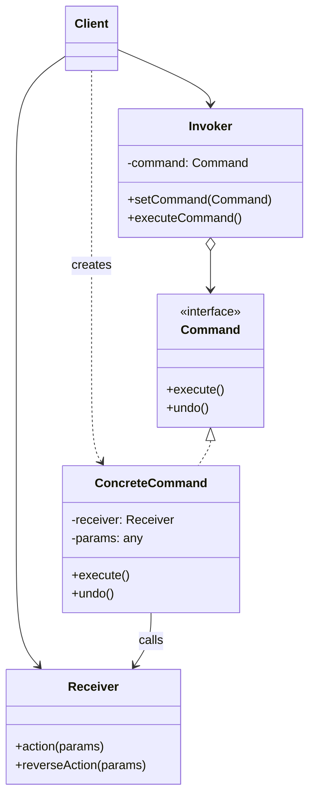

# Command Pattern

## Overview

The **Command** pattern is a behavioral design pattern that turns a request or an action into a standalone object. This transformation lets you parameterize methods with different requests, delay or queue a request's execution, and support undoable operations.

**Key advantage**: It decouples the object that _invokes_ the operation from the object that _performs_ the operation.

**Modern perspective**: The Command pattern is heavily used in modern GUI applications (undo/redo stacks), job queues (Redis/Celery workers), transactional systems (compensating transactions in distributed architectures), and CQRS (Command Query Responsibility Segregation).

## The Problem

Imagine you are building a modern Text Editor. You want to implement a toolbar with buttons for operations like `Copy`, `Paste`, `Undo`, and `Save`.

Initially, you might just write event listeners for each button that directly call methods on the `Document` object:

```typescript
// ❌ Bad: UI is tightly coupled to business logic
class SaveButton {
  constructor(private document: Document) {}

  onClick() {
    this.document.saveToFile();
  }
}
```

This seems fine until you realize:

1. You also want a keyboard shortcut (Ctrl+S) to save the document. Now you have to duplicate the save logic or awkwardly link the shortcut to the button.
2. You want to implement an "Undo" feature. But `onClick` executes immediately and leaves no trace. How do you remember what was changed?
3. You want to add macro support (recording a sequence of actions and playing them back).

Directly coupling the UI to the business logic makes it impossible to build complex features that treat actions as data.

## The Solution

The Command pattern suggests that instead of UI components calling business logic directly, you extract the request details into a separate **Command** object.

1. The UI component (the **Invoker**) just calls `execute()` on a Command interface.
2. The **Command** object knows exactly which method to call on the **Receiver** (the business logic object).
3. Because the command is an object, you can store it in an array (for history/undo), serialize it, or send it over a network.

## Structure



## Flow

1. **Client** configures the **Invoker** (e.g., a button) with a specific **ConcreteCommand** (e.g., `SaveCommand`).
2. The user clicks the button, causing the **Invoker** to call `command.execute()`.
3. The **ConcreteCommand** calls the actual business logic on the **Receiver** (e.g., `document.save()`).
4. (Optional) The **ConcreteCommand** saves its state before executing, allowing it to reverse the operation if `command.undo()` is called later.

## Real-World Analogy

Think of ordering food at a **Restaurant**.

1. You (the **Client**) tell the Waiter what you want.
2. The Waiter (the **Invoker**) writes your request on an order ticket (the **Command**).
3. The Waiter places the ticket on the kitchen counter. They don't cook the food; they just pass the ticket.
4. The Chef (the **Receiver**) picks up the ticket and reads the instructions to cook the meal.

The order ticket encapsulates all the details of the request. It can be queued, cancelled (undone), or logged for billing.

## Step-by-Step Implementation

1. **Declare the Command interface**: Define at least an `execute()` method. If you need undo functionality, add `undo()`.
2. **Create Concrete Commands**: Implement the interface. These classes should accept a Receiver object and any necessary parameters via their constructor.
3. **Implement the Receiver**: This is the core business logic class that actually performs the work.
4. **Create the Invoker**: The class that will trigger the command. It should hold a reference to a Command and call `execute()` on it. (e.g., a History stack for undo/redo).

## Code Examples

Here is a full implementation of a simple Text Editor that supports formatting commands with Undo/Redo functionality.

::: code-group

```typescript [TypeScript]
// 1. Receiver
class TextDocument {
  private content: string = "";

  getContent(): string {
    return this.content;
  }

  insert(position: number, text: string): void {
    this.content =
      this.content.slice(0, position) + text + this.content.slice(position);
  }

  delete(position: number, length: number): string {
    const deleted = this.content.slice(position, position + length);
    this.content =
      this.content.slice(0, position) + this.content.slice(position + length);
    return deleted;
  }
}

// 2. Command Interface
interface Command {
  execute(): void;
  undo(): void;
}

// 3. Concrete Commands
class InsertTextCommand implements Command {
  constructor(
    private doc: TextDocument,
    private position: number,
    private text: string,
  ) {}

  execute(): void {
    this.doc.insert(this.position, this.text);
  }

  undo(): void {
    // Reverse of insert is delete
    this.doc.delete(this.position, this.text.length);
  }
}

class DeleteTextCommand implements Command {
  private deletedText: string = "";

  constructor(
    private doc: TextDocument,
    private position: number,
    private length: number,
  ) {}

  execute(): void {
    // Store the deleted text so we can undo it later
    this.deletedText = this.doc.delete(this.position, this.length);
  }

  undo(): void {
    // Reverse of delete is insert
    this.doc.insert(this.position, this.deletedText);
  }
}

// 4. Invoker (History Manager)
class CommandHistory {
  private history: Command[] = [];
  private redoStack: Command[] = [];

  execute(cmd: Command): void {
    cmd.execute();
    this.history.push(cmd);
    this.redoStack = []; // Clearing redo stack on new action
  }

  undo(): void {
    const cmd = this.history.pop();
    if (cmd) {
      cmd.undo();
      this.redoStack.push(cmd);
    }
  }

  redo(): void {
    const cmd = this.redoStack.pop();
    if (cmd) {
      cmd.execute();
      this.history.push(cmd);
    }
  }
}

// 5. Client
const doc = new TextDocument();
const history = new CommandHistory();

// "Type" some text
history.execute(new InsertTextCommand(doc, 0, "Hello World"));
console.log(doc.getContent()); // Output: Hello World

// Insert more text
history.execute(new InsertTextCommand(doc, 5, " Beautiful"));
console.log(doc.getContent()); // Output: Hello Beautiful World

// Undo the last insertion
history.undo();
console.log(doc.getContent()); // Output: Hello World

// Redo it
history.redo();
console.log(doc.getContent()); // Output: Hello Beautiful World

// Delete " Beautiful"
history.execute(new DeleteTextCommand(doc, 5, 10));
console.log(doc.getContent()); // Output: Hello World
```

```python [Python]
from abc import ABC, abstractmethod
from typing import List

# 1. Receiver
class TextDocument:
    def __init__(self):
        self._content = ""

    def get_content(self) -> str:
        return self._content

    def insert(self, position: int, text: str):
        self._content = self._content[:position] + text + self._content[position:]

    def delete(self, position: int, length: int) -> str:
        deleted = self._content[position:position + length]
        self._content = self._content[:position] + self._content[position + length:]
        return deleted

# 2. Command Interface
class Command(ABC):
    @abstractmethod
    def execute(self):
        pass

    @abstractmethod
    def undo(self):
        pass

# 3. Concrete Commands
class InsertTextCommand(Command):
    def __init__(self, doc: TextDocument, position: int, text: str):
        self.doc = doc
        self.position = position
        self.text = text

    def execute(self):
        self.doc.insert(self.position, self.text)

    def undo(self):
        self.doc.delete(self.position, len(self.text))


class DeleteTextCommand(Command):
    def __init__(self, doc: TextDocument, position: int, length: int):
        self.doc = doc
        self.position = position
        self.length = length
        self.deleted_text = ""

    def execute(self):
        self.deleted_text = self.doc.delete(self.position, self.length)

    def undo(self):
        self.doc.insert(self.position, self.deleted_text)

# 4. Invoker
class CommandHistory:
    def __init__(self):
        self.history: List[Command] = []
        self.redo_stack: List[Command] = []

    def execute(self, cmd: Command):
        cmd.execute()
        self.history.append(cmd)
        self.redo_stack.clear()

    def undo(self):
        if self.history:
            cmd = self.history.pop()
            cmd.undo()
            self.redo_stack.append(cmd)

    def redo(self):
        if self.redo_stack:
            cmd = self.redo_stack.pop()
            cmd.execute()
            self.history.append(cmd)

# 5. Client
if __name__ == "__main__":
    doc = TextDocument()
    invoker = CommandHistory()

    invoker.execute(InsertTextCommand(doc, 0, "Hello World"))
    print(doc.get_content())  # Hello World

    invoker.execute(InsertTextCommand(doc, 5, " Beautiful"))
    print(doc.get_content())  # Hello Beautiful World

    invoker.undo()
    print(doc.get_content())  # Hello World

    invoker.redo()
    print(doc.get_content())  # Hello Beautiful World
```

```java [Java]
import java.util.Stack;

// 1. Receiver
class TextDocument {
    private StringBuilder content = new StringBuilder();

    public String getContent() {
        return content.toString();
    }

    public void insert(int position, String text) {
        content.insert(position, text);
    }

    public String delete(int position, int length) {
        String deleted = content.substring(position, position + length);
        content.delete(position, position + length);
        return deleted;
    }
}

// 2. Command Interface
interface Command {
    void execute();
    void undo();
}

// 3. Concrete Commands
class InsertTextCommand implements Command {
    private TextDocument doc;
    private int position;
    private String text;

    public InsertTextCommand(TextDocument doc, int position, String text) {
        this.doc = doc;
        this.position = position;
        this.text = text;
    }

    @Override
    public void execute() {
        doc.insert(position, text);
    }

    @Override
    public void undo() {
        doc.delete(position, text.length());
    }
}

class DeleteTextCommand implements Command {
    private TextDocument doc;
    private int position;
    private int length;
    private String deletedText;

    public DeleteTextCommand(TextDocument doc, int position, int length) {
        this.doc = doc;
        this.position = position;
        this.length = length;
    }

    @Override
    public void execute() {
        deletedText = doc.delete(position, length);
    }

    @Override
    public void undo() {
        doc.insert(position, deletedText);
    }
}

// 4. Invoker
class CommandHistory {
    private Stack<Command> history = new Stack<>();
    private Stack<Command> redoStack = new Stack<>();

    public void execute(Command cmd) {
        cmd.execute();
        history.push(cmd);
        redoStack.clear();
    }

    public void undo() {
        if (!history.isEmpty()) {
            Command cmd = history.pop();
            cmd.undo();
            redoStack.push(cmd);
        }
    }

    public void redo() {
        if (!redoStack.isEmpty()) {
            Command cmd = redoStack.pop();
            cmd.execute();
            history.push(cmd);
        }
    }
}

// 5. Client
public class CommandDemo {
    public static void main(String[] args) {
        TextDocument doc = new TextDocument();
        CommandHistory invoker = new CommandHistory();

        invoker.execute(new InsertTextCommand(doc, 0, "Hello World"));
        System.out.println(doc.getContent()); // Hello World

        invoker.execute(new InsertTextCommand(doc, 5, " Beautiful"));
        System.out.println(doc.getContent()); // Hello Beautiful World

        invoker.undo();
        System.out.println(doc.getContent()); // Hello World

        invoker.redo();
        System.out.println(doc.getContent()); // Hello Beautiful World
    }
}
```

```go [Go]
package main

import "fmt"

// 1. Receiver
type TextDocument struct {
	content string
}

func (d *TextDocument) Insert(position int, text string) {
	d.content = d.content[:position] + text + d.content[position:]
}

func (d *TextDocument) Delete(position int, length int) string {
	deleted := d.content[position : position+length]
	d.content = d.content[:position] + d.content[position+length:]
	return deleted
}

// 2. Command Interface
type Command interface {
	Execute()
	Undo()
}

// 3. Concrete Commands
type InsertTextCommand struct {
	doc      *TextDocument
	position int
	text     string
}

func (c *InsertTextCommand) Execute() {
	c.doc.Insert(c.position, c.text)
}

func (c *InsertTextCommand) Undo() {
	c.doc.Delete(c.position, len(c.text))
}

type DeleteTextCommand struct {
	doc         *TextDocument
	position    int
	length      int
	deletedText string
}

func (c *DeleteTextCommand) Execute() {
	c.deletedText = c.doc.Delete(c.position, c.length)
}

func (c *DeleteTextCommand) Undo() {
	c.doc.Insert(c.position, c.deletedText)
}

// 4. Invoker
type CommandHistory struct {
	history   []Command
	redoStack []Command
}

func (h *CommandHistory) Execute(cmd Command) {
	cmd.Execute()
	h.history = append(h.history, cmd)
	h.redoStack = []Command{} // clear redo stack
}

func (h *CommandHistory) Undo() {
	if len(h.history) > 0 {
		lastIdx := len(h.history) - 1
		cmd := h.history[lastIdx]
		h.history = h.history[:lastIdx] // pop

		cmd.Undo()
		h.redoStack = append(h.redoStack, cmd)
	}
}

func (h *CommandHistory) Redo() {
	if len(h.redoStack) > 0 {
		lastIdx := len(h.redoStack) - 1
		cmd := h.redoStack[lastIdx]
		h.redoStack = h.redoStack[:lastIdx] // pop

		cmd.Execute()
		h.history = append(h.history, cmd)
	}
}

// 5. Client
func main() {
	doc := &TextDocument{}
	invoker := &CommandHistory{}

	invoker.Execute(&InsertTextCommand{doc, 0, "Hello World"})
	fmt.Println(doc.content) // Hello World

	invoker.Execute(&InsertTextCommand{doc, 5, " Beautiful"})
	fmt.Println(doc.content) // Hello Beautiful World

	invoker.Undo()
	fmt.Println(doc.content) // Hello World

	invoker.Redo()
	fmt.Println(doc.content) // Hello Beautiful World
}
```

```rust [Rust]
// 1. Receiver
struct TextDocument {
    content: String,
}

impl TextDocument {
    fn new() -> Self {
        Self { content: String::new() }
    }

    fn insert(&mut self, position: usize, text: &str) {
        self.content.insert_str(position, text);
    }

    fn delete(&mut self, position: usize, length: usize) -> String {
        let deleted: String = self.content.chars().skip(position).take(length).collect();
        // Delete byte range requires careful char boundaries in Rust,
        // simplified here assuming ASCII for demonstration
        self.content.drain(position..position + length);
        deleted
    }
}

// 2. Command Trait
trait Command {
    fn execute(&mut self, doc: &mut TextDocument);
    fn undo(&mut self, doc: &mut TextDocument);
}

// 3. Concrete Commands
struct InsertTextCommand {
    position: usize,
    text: String,
}

impl Command for InsertTextCommand {
    fn execute(&mut self, doc: &mut TextDocument) {
        doc.insert(self.position, &self.text);
    }

    fn undo(&mut self, doc: &mut TextDocument) {
        doc.delete(self.position, self.text.len());
    }
}

struct DeleteTextCommand {
    position: usize,
    length: usize,
    deleted_text: String,
}

impl Command for DeleteTextCommand {
    fn execute(&mut self, doc: &mut TextDocument) {
        self.deleted_text = doc.delete(self.position, self.length);
    }

    fn undo(&mut self, doc: &mut TextDocument) {
        doc.insert(self.position, &self.deleted_text);
    }
}

// 4. Invoker
struct CommandHistory {
    history: Vec<Box<dyn Command>>,
    redo_stack: Vec<Box<dyn Command>>,
}

impl CommandHistory {
    fn new() -> Self {
        Self {
            history: Vec::new(),
            redo_stack: Vec::new(),
        }
    }

    fn execute(&mut self, mut cmd: Box<dyn Command>, doc: &mut TextDocument) {
        cmd.execute(doc);
        self.history.push(cmd);
        self.redo_stack.clear();
    }

    fn undo(&mut self, doc: &mut TextDocument) {
        if let Some(mut cmd) = self.history.pop() {
            cmd.undo(doc);
            self.redo_stack.push(cmd);
        }
    }

    fn redo(&mut self, doc: &mut TextDocument) {
        if let Some(mut cmd) = self.redo_stack.pop() {
            cmd.execute(doc);
            self.history.push(cmd);
        }
    }
}

// 5. Client
fn main() {
    let mut doc = TextDocument::new();
    let mut invoker = CommandHistory::new();

    invoker.execute(Box::new(InsertTextCommand { position: 0, text: "Hello World".to_string() }), &mut doc);
    println!("{}", doc.content);

    invoker.execute(Box::new(InsertTextCommand { position: 5, text: " Beautiful".to_string() }), &mut doc);
    println!("{}", doc.content);

    invoker.undo(&mut doc);
    println!("{}", doc.content);

    invoker.redo(&mut doc);
    println!("{}", doc.content);
}
```

:::

## Pros and Cons

### Advantages

- **Single Responsibility Principle**: Decouples classes that invoke operations from classes that perform them.
- **Open/Closed Principle**: You can introduce new commands without breaking existing client code.
- **Undo/Redo**: By storing commands, you natively support traversing back and forth through history.
- **Delayed Execution**: You can queue, schedule, or serialize commands for later execution (perfect for Job Queues).
- **Macro Commands**: You can assemble simple commands into complex macro commands (e.g., Composite pattern combined with Command).

### Disadvantages

- **Class Explosion**: For every possible action, you create a new concrete command class. This can severely bloat the codebase.
- **Added Complexity**: Instead of a simple function call, you introduce an entirely new layer of indirection (Invoker -> Command -> Receiver).
- **Memory Overhead**: Storing a long history of stateful objects (for undo/redo) can consume significant RAM.

## When to Use

- **Undo/Redo functionality**: When building applications where users expect to reverse their actions (text editors, graphic software, CAD systems).
- **Job Queues / Task Scheduling**: When you need to parameterize an object with an action, serialize it to a database/Redis, and execute it later inside a worker thread.
- **GUI Buttons and Shortcuts**: When you want multiple UI elements (a menu item, a button, a shortcut) to trigger the exact same action without duplicating logic.
- **Transactions / Sagas**: When building distributed systems where a failure in Step C requires you to run compensating transactions for Steps B and A. (You call `.undo()` on the commands).

## When NOT to Use

- **Simple CRUD applications**: If an operation is a simple database write and will never need to be undone or scheduled, creating command objects is massive overkill. Direct method calls are better.
- **High-performance loops**: Allocating command objects inside a tight loop or real-time simulation (like game physics) can cause garbage collection spikes.

## Common Mistakes

### 1. Putting Business Logic Inside the Command

Commands should _delegate_ to the Receiver, not do the heavy lifting themselves.

```typescript
// ❌ Bad: Command handles database writing, validation, and email sending
class ProcessOrderCommand implements Command {
  execute() {
    // 100 lines of complex business logic here...
  }
}

// ✅ Good: Command merely calls the OrderService
class ProcessOrderCommand implements Command {
  constructor(private orderService: OrderService) {}
  execute() {
    this.orderService.process();
  }
}
```

### 2. Forgetting State for Undo

An `undo()` method must restore the exact state prior to `execute()`. If you don't save the overwritten state inside the Command object during `execute()`, undo becomes impossible.

## Related Patterns

- **Memento**: Often used _with_ Command. If a command modifies a massive object, instead of trying to figure out the reverse operation, the Command just saves a Memento (snapshot) of the object before execution, and restores the Memento during undo.
- **Composite**: You can compose multiple commands into a `MacroCommand` which itself implements the Command interface.
- **Strategy**: Similar in that both parameterize an object with behavior. But a Strategy specifies _how_ to do something (algorithm), while a Command specifies _what_ to do (action).

## Interview Insights

- **Question**: "How do you implement Undo functionality using the Command pattern?"
  - **Answer**: "You keep a Stack of executed Command objects. Each command implements an `undo()` method. When the user clicks Undo, you pop the top command off the stack and call its `undo()` method, optionally pushing it onto a Redo stack."
- **Question**: "What is CQRS, and how does it relate to the Command pattern?"
  - **Answer**: "CQRS (Command Query Responsibility Segregation) separates read operations (Queries) from write operations (Commands). While related in naming and philosophy—both treat writes as distinct intention objects—CQRS is an architectural pattern for scaling databases and microservices, whereas the Command design pattern is a behavioral pattern for object-oriented memory structures."

## Modern Alternatives

- **Functional Closures**: In languages with first-class functions (JS/TS, Python, Go, Rust), you don't necessarily need an entire `Command` interface. A simple callback or closure `() => { ... }` can encapsulate an action and its closure scope acts as the stored parameters. (Though closures make undo/redo harder to standardise than objects).
- **Redux / Flux Architecture**: In frontend frameworks, "Actions" and "Reducers" serve the exact same purpose as the Command pattern. An Action is a command payload, the Dispatcher is the Invoker, and the Reducer is the Receiver.
