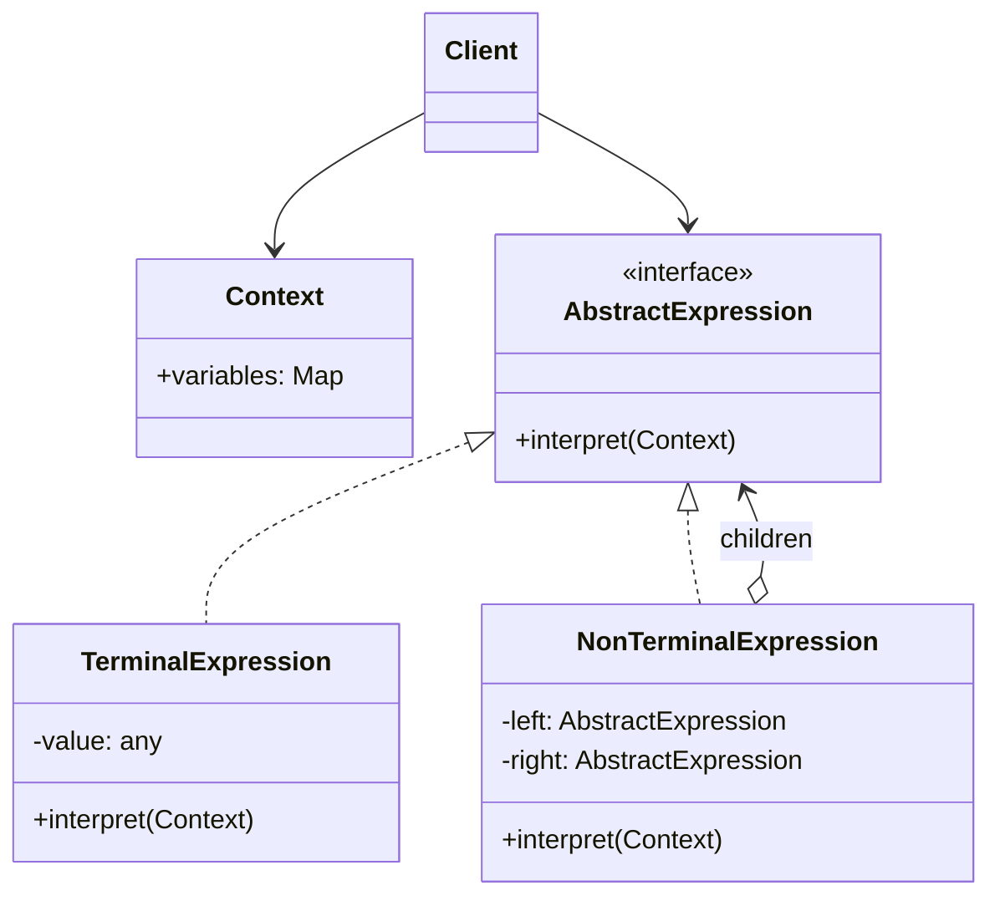

# Interpreter Pattern

<CoverImage src="/covers/behavioral/interpreter.png" alt="Cover">
  <h1>Interpreter</h1>
  <p>A cute translator robot sitting between an alien speaking in star-shaped speech bubbles and a human, translating the star bubbles into standard geometric math equations on a chalkboard.</p>
</CoverImage>

## Overview

The **Interpreter** pattern is a behavioral design pattern that defines a grammatical representation for a language and provides an interpreter to deal with this grammar. It is primarily used to evaluate sentences or expressions in a language by representing them as an Abstract Syntax Tree (AST).

**Key advantage**: It provides a structured way to evaluate domain-specific languages (DSLs) or evaluate complex rules, configurations, or mathematical expressions.

**Modern perspective**: While classical Interpreter is rarely used for building fully-fledged general-purpose programming languages (where compiler-generator tools like ANTLR or LLVM are preferred), it remains highly relevant for lightweight DSLs, configuration evaluation, rule engines, SQL builders, and dynamic search query parsers.

## The Problem

Imagine you are building a system that allows users to filter products using a custom query language. The user types:

`"price < 100 AND (category = 'electronics' OR category = 'books')"`

If you try to parse and evaluate this string using purely procedural code and massive regex or `if/else` blocks, the code becomes unmaintainable quickly:

```typescript
// ❌ Bad: Procedural string parsing is brittle and complex
function evaluate(query: string, product: Product): boolean {
  if (query.includes("AND")) {
    const parts = query.split(" AND ");
    return evaluate(parts[0], product) && evaluate(parts[1], product);
  }
  // This quickly spirals into a nightmare with parentheses, ORs, <, >, =
}
```

The string representation is flat, but the evaluation logic is inherently hierarchical. You need a way to map the flat string into an executable tree structure.

## The Solution

The Interpreter pattern solves this by mapping grammatical rules to objects.

1. **Context**: A shared state (e.g., the `Product` object) passed to interpreters.
2. **AbstractExpression**: An interface with an `interpret(context)` method.
3. **TerminalExpression**: A leaf node in the tree (e.g., a constant value, a specific field name).
4. **NonTerminalExpression**: An internal node in the tree that combines other expressions (e.g., `AndExpression`, `OrExpression`, `LessThanExpression`).

The parser translates the flat string into an Abstract Syntax Tree (AST) of these expression objects. Evaluating the rule is then as simple as calling `tree.interpret(context)`, which recursively evaluates down to the leaves.

## Structure



## Flow

1. The **Client** initializes a **Context** with data (e.g., a specific user, document, or environment variable map).
2. A parser (or the client directly) builds the AST made of **Terminal** and **NonTerminal** expressions.
3. The **Client** calls `interpret(context)` on the root of the AST.
4. The root expression evaluates its children.
5. The **Terminal** expressions return concrete values from the **Context**.
6. The final result bubbles back up to the **Client**.

## Real-World Analogy

Think of **Translating a Sentence**.
If you read the sentence `"El gato bebe leche"`, your brain maps it to a grammar tree:

- Subject: "El gato" (Terminal)
- Action: "bebe" (Terminal)
- Object: "leche" (Terminal)
- Sentence: Subject + Action + Object (NonTerminal)

You interpret the whole sentence by recursively translating and evaluating the smaller grammatical parts.

## Step-by-Step Implementation

1. **Define the Context**: Create a class or data structure that holds the global state during interpretation.
2. **Define the Expression Interface**: Create an interface with the `interpret(context)` method.
3. **Create Terminal Expressions**: Implement expressions that represent the base building blocks (numbers, strings, variable lookups).
4. **Create Non-Terminal Expressions**: Implement expressions that aggregate others (Add, Subtract, And, Or).
5. _(Optional but usually required)_ **Build a Parser**: Write logic that turns a string into the tree of Expressions.

## Code Examples

We will build a simple logic evaluator capable of evaluating boolean expressions based on a dynamic set of variables (e.g., `(A AND B) OR C`).

::: code-group

```typescript [TypeScript]
// 1. Context
class Context {
  private variables = new Map<string, boolean>();

  set(name: string, value: boolean) {
    this.variables.set(name, value);
  }

  get(name: string): boolean {
    if (!this.variables.has(name)) {
      throw new Error(`Variable ${name} not found`);
    }
    return this.variables.get(name)!;
  }
}

// 2. Abstract Expression
interface Expression {
  interpret(context: Context): boolean;
}

// 3. Terminal Expression
class VariableExpression implements Expression {
  constructor(private name: string) {}

  interpret(context: Context): boolean {
    return context.get(this.name);
  }
}

// 4. Non-Terminal Expressions
class AndExpression implements Expression {
  constructor(
    private left: Expression,
    private right: Expression,
  ) {}

  interpret(context: Context): boolean {
    return this.left.interpret(context) && this.right.interpret(context);
  }
}

class OrExpression implements Expression {
  constructor(
    private left: Expression,
    private right: Expression,
  ) {}

  interpret(context: Context): boolean {
    return this.left.interpret(context) || this.right.interpret(context);
  }
}

class NotExpression implements Expression {
  constructor(private expr: Expression) {}

  interpret(context: Context): boolean {
    return !this.expr.interpret(context);
  }
}

// 5. Client Usage
const context = new Context();
context.set("isPremium", true);
context.set("isAdmin", false);
context.set("isActive", true);

// AST for: (isPremium AND isActive) OR isAdmin
const isPremium = new VariableExpression("isPremium");
const isActive = new VariableExpression("isActive");
const isAdmin = new VariableExpression("isAdmin");

const premiumAndActive = new AndExpression(isPremium, isActive);
const finalExpression = new OrExpression(premiumAndActive, isAdmin);

console.log("Evaluation Result:", finalExpression.interpret(context)); // Output: true
```

```python [Python]
from abc import ABC, abstractmethod
from typing import Dict

# 1. Context
class Context:
    def __init__(self):
        self._variables: Dict[str, bool] = {}

    def set(self, name: str, value: bool):
        self._variables[name] = value

    def get(self, name: str) -> bool:
        if name not in self._variables:
            raise ValueError(f"Variable {name} not found")
        return self._variables[name]

# 2. Abstract Expression
class Expression(ABC):
    @abstractmethod
    def interpret(self, context: Context) -> bool:
        pass

# 3. Terminal Expression
class VariableExpression(Expression):
    def __init__(self, name: str):
        self.name = name

    def interpret(self, context: Context) -> bool:
        return context.get(self.name)

# 4. Non-Terminal Expressions
class AndExpression(Expression):
    def __init__(self, left: Expression, right: Expression):
        self.left = left
        self.right = right

    def interpret(self, context: Context) -> bool:
        return self.left.interpret(context) and self.right.interpret(context)

class OrExpression(Expression):
    def __init__(self, left: Expression, right: Expression):
        self.left = left
        self.right = right

    def interpret(self, context: Context) -> bool:
        return self.left.interpret(context) or self.right.interpret(context)

class NotExpression(Expression):
    def __init__(self, expr: Expression):
        self.expr = expr

    def interpret(self, context: Context) -> bool:
        return not self.expr.interpret(context)

# 5. Client Usage
if __name__ == "__main__":
    context = Context()
    context.set("isPremium", True)
    context.set("isAdmin", False)
    context.set("isActive", True)

    # AST: (isPremium AND isActive) OR isAdmin
    is_premium = VariableExpression("isPremium")
    is_active = VariableExpression("isActive")
    is_admin = VariableExpression("isAdmin")

    premium_and_active = AndExpression(is_premium, is_active)
    final_expression = OrExpression(premium_and_active, is_admin)

    print(f"Evaluation Result: {final_expression.interpret(context)}") # True
```

```java [Java]
import java.util.HashMap;
import java.util.Map;

// 1. Context
class Context {
    private Map<String, Boolean> variables = new HashMap<>();

    public void set(String name, boolean value) {
        variables.put(name, value);
    }

    public boolean get(String name) {
        if (!variables.containsKey(name)) {
            throw new IllegalArgumentException("Variable " + name + " not found");
        }
        return variables.get(name);
    }
}

// 2. Abstract Expression
interface Expression {
    boolean interpret(Context context);
}

// 3. Terminal Expression
class VariableExpression implements Expression {
    private String name;

    public VariableExpression(String name) {
        this.name = name;
    }

    @Override
    public boolean interpret(Context context) {
        return context.get(name);
    }
}

// 4. Non-Terminal Expressions
class AndExpression implements Expression {
    private Expression left;
    private Expression right;

    public AndExpression(Expression left, Expression right) {
        this.left = left;
        this.right = right;
    }

    @Override
    public boolean interpret(Context context) {
        return left.interpret(context) && right.interpret(context);
    }
}

class OrExpression implements Expression {
    private Expression left;
    private Expression right;

    public OrExpression(Expression left, Expression right) {
        this.left = left;
        this.right = right;
    }

    @Override
    public boolean interpret(Context context) {
        return left.interpret(context) || right.interpret(context);
    }
}

class NotExpression implements Expression {
    private Expression expr;

    public NotExpression(Expression expr) {
        this.expr = expr;
    }

    @Override
    public boolean interpret(Context context) {
        return !expr.interpret(context);
    }
}

// 5. Client
public class InterpreterDemo {
    public static void main(String[] args) {
        Context context = new Context();
        context.set("isPremium", true);
        context.set("isAdmin", false);
        context.set("isActive", true);

        // AST: (isPremium AND isActive) OR isAdmin
        Expression isPremium = new VariableExpression("isPremium");
        Expression isActive = new VariableExpression("isActive");
        Expression isAdmin = new VariableExpression("isAdmin");

        Expression premiumAndActive = new AndExpression(isPremium, isActive);
        Expression finalExpr = new OrExpression(premiumAndActive, isAdmin);

        System.out.println("Result: " + finalExpr.interpret(context)); // Result: true
    }
}
```

```go [Go]
package main

import "fmt"

// 1. Context
type Context struct {
	variables map[string]bool
}

func NewContext() *Context {
	return &Context{variables: make(map[string]bool)}
}

func (c *Context) Set(name string, value bool) {
	c.variables[name] = value
}

func (c *Context) Get(name string) bool {
	if val, ok := c.variables[name]; ok {
		return val
	}
	panic(fmt.Sprintf("Variable %s not found", name))
}

// 2. Expression Interface
type Expression interface {
	Interpret(ctx *Context) bool
}

// 3. Terminal Expression
type VariableExpression struct {
	name string
}

func (v *VariableExpression) Interpret(ctx *Context) bool {
	return ctx.Get(v.name)
}

// 4. Non-Terminal Expressions
type AndExpression struct {
	left  Expression
	right Expression
}

func (a *AndExpression) Interpret(ctx *Context) bool {
	return a.left.Interpret(ctx) && a.right.Interpret(ctx)
}

type OrExpression struct {
	left  Expression
	right Expression
}

func (o *OrExpression) Interpret(ctx *Context) bool {
	return o.left.Interpret(ctx) || o.right.Interpret(ctx)
}

// 5. Client
func main() {
	ctx := NewContext()
	ctx.Set("isPremium", true)
	ctx.Set("isAdmin", false)
	ctx.Set("isActive", true)

	// AST: (isPremium AND isActive) OR isAdmin
	isPremium := &VariableExpression{"isPremium"}
	isActive := &VariableExpression{"isActive"}
	isAdmin := &VariableExpression{"isAdmin"}

	premiumAndActive := &AndExpression{isPremium, isActive}
	finalExpr := &OrExpression{premiumAndActive, isAdmin}

	fmt.Printf("Result: %v\n", finalExpr.Interpret(ctx)) // true
}
```

```rust [Rust]
use std::collections::HashMap;

// 1. Context
struct Context {
    variables: HashMap<String, bool>,
}

impl Context {
    fn new() -> Self {
        Self {
            variables: HashMap::new(),
        }
    }

    fn set(&mut self, name: &str, value: bool) {
        self.variables.insert(name.to_string(), value);
    }

    fn get(&self, name: &str) -> bool {
        *self.variables.get(name).expect("Variable not found")
    }
}

// 2. Abstract Expression
trait Expression {
    fn interpret(&self, context: &Context) -> bool;
}

// 3. Terminal Expression
struct VariableExpression {
    name: String,
}

impl Expression for VariableExpression {
    fn interpret(&self, context: &Context) -> bool {
        context.get(&self.name)
    }
}

// 4. Non-Terminal Expressions
struct AndExpression {
    left: Box<dyn Expression>,
    right: Box<dyn Expression>,
}

impl Expression for AndExpression {
    fn interpret(&self, context: &Context) -> bool {
        self.left.interpret(context) && self.right.interpret(context)
    }
}

struct OrExpression {
    left: Box<dyn Expression>,
    right: Box<dyn Expression>,
}

impl Expression for OrExpression {
    fn interpret(&self, context: &Context) -> bool {
        self.left.interpret(context) || self.right.interpret(context)
    }
}

// 5. Client
fn main() {
    let mut context = Context::new();
    context.set("isPremium", true);
    context.set("isAdmin", false);
    context.set("isActive", true);

    // AST: (isPremium AND isActive) OR isAdmin
    let is_premium = Box::new(VariableExpression { name: "isPremium".to_string() });
    let is_active = Box::new(VariableExpression { name: "isActive".to_string() });
    let is_admin = Box::new(VariableExpression { name: "isAdmin".to_string() });

    let premium_and_active = Box::new(AndExpression {
        left: is_premium,
        right: is_active,
    });

    let final_expr = OrExpression {
        left: premium_and_active,
        right: is_admin,
    };

    println!("Result: {}", final_expr.interpret(&context)); // Result: true
}
```

:::

## Pros and Cons

### Advantages

- **Extensibility**: It's very easy to change or extend the grammar. You just create a new `Expression` class.
- **Separation of Concerns**: Evaluative logic for different grammar rules is neatly separated into discrete classes.
- **Implementing Grammar as Objects**: Makes traversing, formatting, or optimizing the AST relatively straightforward (often combined with the Visitor pattern).

### Disadvantages

- **Class Explosion**: Complex grammars require hundreds of tiny classes.
- **Maintenance**: Extremely hard to maintain for large or changing languages.
- **Performance**: Recursive interpretation is inherently slow. Compiling an AST to bytecode or machine code is dramatically faster than traversing object trees at runtime.
- **Missing Parser**: The pattern does _not_ address how the AST is constructed. You still need to write a string parser (Lexer/Parser) to turn raw text into the objects.

## When to Use

- **Domain-Specific Languages (DSLs)**: Building rule engines, configuration evaluators, or mathematical equation solvers.
- **Dynamic Queries**: Converting user UI query filters into SQL or NoSQL database queries (e.g., MongoDB query builders).
- **Simple Grammars**: The grammar is simple and efficiency is less critical than flexibility.

## When NOT to Use

- **Performance-Critical Code**: If the expression is evaluated thousands of times in a tight loop, interpreter overhead is a bottleneck. Consider a compiler or JIT instead.
- **Complex Languages**: If you are trying to implement Python or Java, do not write hundreds of classes. Use formal tools like ANTLR, Bison, or LLVM.

## Common Mistakes

### 1. Hardcoding the Parser into the Interpreter

The Interpreter pattern is for _evaluating_ the tree, not _building_ it. String parsing (Lexing/Parsing) should be a completely separate module that outputs the `Expression` AST.

### 2. Mutating the Context Improperly

If a non-terminal node modifies the context unexpectedly during `interpret()`, it creates side-effects that make subsequent rule evaluations unpredictable. Treat the context as read-only during interpretation if possible.

## Related Patterns

- **Composite**: The AST is basically a Composite pattern where Non-Terminals are composites and Terminals are leaves.
- **Visitor**: Often used alongside Interpreter to add new behaviors (like formatting, optimizing, or type-checking) without modifying the `Expression` classes.
- **Iterator**: Can be used to traverse the AST.
- **Command**: Similar in structure but Command executes actions, whereas Interpreter evaluates values against a grammar.

## Interview Insights

- **Question**: "What is the difference between the Interpreter pattern and the Composite pattern?"
  - **Answer**: "The structural implementation is nearly identical—both use trees of objects with leaves and composites. The difference is intent. Composite is meant to represent part-whole hierarchies. Interpreter applies that hierarchy specifically to evaluate a linguistic grammar or mathematical expression."
- **Question**: "How do you actually build the tree?"
  - **Answer**: "The pattern itself doesn't specify. In the real world, you build the AST using a Parser (like Recursive Descent) or a parser generator tool, which outputs the Interpreter tree for evaluation."

## Modern Alternatives

- **Compiler Compilers (ANTLR, Bison, Yacc)**: Industrial-grade tools for parsing text and generating syntax trees natively.
- **Functional Combinators**: In languages like Haskell, Scala, or F# (or TS libraries like `fp-ts`), Parser Combinators are favored over OOP class hierarchies for building parsers and interpreters.
- **`eval()`**: For extremely simple cases, native `eval` functions can evaluate strings, though they come with massive security risks if handling user input.
