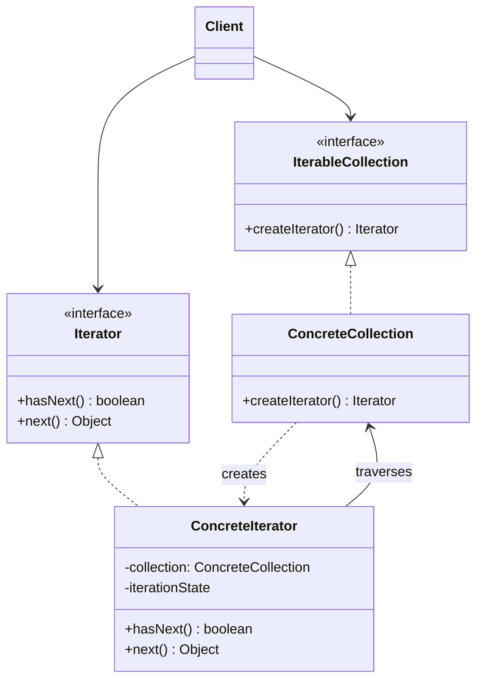

# Iterator Pattern


## Overview

The **Iterator** pattern is a behavioral design pattern that allows you to traverse elements of a collection without exposing its underlying representation (e.g., list, stack, tree, graph).

**Key advantage**: It extracts the traversal behavior of a collection into a separate object called an iterator.

**Modern perspective**: The Iterator pattern is built into almost every modern programming language natively (`for...of` loops, `IEnumerable`, `Iterable` protocols). While implementing custom iterators from scratch is rarer today, understanding the pattern is crucial for working with streams, generators, asynchronous data, and functional programming constructs.

## The Problem

Collections store groups of objects. While an array is the most common collection, others include trees, graphs, lists, and hash maps.

No matter how a collection is structured, it must provide a way for client code to access its elements sequentially.

```typescript
// ❌ Bad: The client must know the internal structure of every collection
class SocialGraph {
  public users: Map<string, User> = new Map();
  // Client has to know it's a Map to iterate it
}

class LinkedList {
  public head: Node | null;
  // Client has to know how to traverse a linked list
}
```

If the client code needs to traverse an Array, a Linked List, and a Binary Tree, the traversal logic is drastically different for each. This forces the client to be tightly coupled to the data structure. If you switch your internal data representation, you break all the client code that iterates over it.

## The Solution

The Iterator pattern suggests encapsulating the traversal logic into a separate object.

1. **The Iterator Interface**: Defines operations for traversing a collection, like `next()`, `hasNext()`, and sometimes `current()`.
2. **The Collection Interface**: Defines a factory method for producing an Iterator (e.g., `createIterator()`).

Because all Iterators implement the same interface, client code can traverse _any_ collection in the exact same way, without knowing if it's an array, a tree, or a remote API cursor.

## Structure



## Flow

1. The **Client** requests an **Iterator** from the **IterableCollection** by calling `createIterator()`.
2. The **ConcreteCollection** instantiates a **ConcreteIterator**, passing a reference to itself.
3. The **Client** uses a `while (iterator.hasNext())` loop to traverse.
4. With each call to `iterator.next()`, the iterator returns the next element and updates its internal state.

## Real-World Analogy

Think of **exploring a new city**.
You could grab a raw map and try to traverse every street yourself (direct collection access).
Or, you could hire a **Tour Guide** (the Iterator).
The Tour Guide handles the complex navigation. You simply tell the guide: "Take me to the next sight." You don't need to know the optimal path, the streets, or the bus routes; the Guide encapsulates all traversal logic. Different guides might traverse the city differently (e.g., Food Tour, History Tour), just like different iterators can traverse the same tree (e.g., Depth-First, Breadth-First).

## Step-by-Step Implementation

1. **Define the Iterator Interface**: Create an interface with `hasNext(): boolean` and `next(): T` methods.
2. **Define the Iterable Collection Interface**: Create an interface with `createIterator(): Iterator<T>`.
3. **Implement Concrete Iterators**: Create classes that implement the Iterator interface for your specific data structure. They need to track the current traversal state (like an index or a pointer).
4. **Implement Concrete Collections**: Implement the Iterable interface on your data structures to return the appropriate iterators.

## Code Examples

We will implement a custom `SocialNetwork` (a Graph) and provide two different iterators: one for traversing friends directly, and another for iterating over an entire community.

_Note: In modern languages, you often implement the language's native Iterable protocol instead of creating standalone interfaces. We show the classic OOP approach here, followed by idiomatic usage._

::: code-group

```typescript [TypeScript]
// 1. Iterator Interface
interface MyIterator<T> {
  hasNext(): boolean;
  next(): T;
}

// 2. Iterable Interface
interface IterableCollection<T> {
  createIterator(): MyIterator<T>;
}

// 3. Concrete Collection
class UserNode {
  constructor(
    public id: string,
    public name: string,
  ) {}
}

class UserCollection implements IterableCollection<UserNode> {
  private users: UserNode[] = [];

  addUser(user: UserNode) {
    this.users.push(user);
  }

  getUsers(): UserNode[] {
    return this.users;
  }

  // Factory method
  createIterator(): MyIterator<UserNode> {
    return new AlphabeticalIterator(this);
  }
}

// 4. Concrete Iterator
class AlphabeticalIterator implements MyIterator<UserNode> {
  private collection: UserCollection;
  private position: number = 0;
  private sortedCache: UserNode[] | null = null;

  constructor(collection: UserCollection) {
    this.collection = collection;
  }

  private lazyInit() {
    if (this.sortedCache === null) {
      // Create a sorted copy
      this.sortedCache = [...this.collection.getUsers()].sort((a, b) =>
        a.name.localeCompare(b.name),
      );
    }
  }

  hasNext(): boolean {
    this.lazyInit();
    return this.position < this.sortedCache!.length;
  }

  next(): UserNode {
    this.lazyInit();
    if (!this.hasNext()) {
      throw new Error("Out of bounds");
    }
    const result = this.sortedCache![this.position];
    this.position++;
    return result;
  }
}

// 5. Client
const network = new UserCollection();
network.addUser(new UserNode("1", "Charlie"));
network.addUser(new UserNode("2", "Alice"));
network.addUser(new UserNode("3", "Bob"));

const iterator = network.createIterator();
while (iterator.hasNext()) {
  console.log(iterator.next().name);
}
// Output: Alice, Bob, Charlie

// --- MODERN TYPESCRIPT EQUIVALENT (Generators/Iterables) ---
class ModernCollection {
  private users = ["Charlie", "Alice", "Bob"];

  // Implementing JS Symbol.iterator
  *[Symbol.iterator]() {
    const sorted = [...this.users].sort();
    for (const user of sorted) {
      yield user;
    }
  }
}

const modern = new ModernCollection();
for (const user of modern) {
  console.log(user); // Output: Alice, Bob, Charlie
}
```

```python [Python]
from typing import List, Iterator, Iterable

# In Python, we rarely build custom Iterator interfaces because
# the standard library provides __iter__ and __next__ magic methods.

class UserNode:
    def __init__(self, uid: str, name: str):
        self.uid = uid
        self.name = name

# 1. Concrete Collection
class UserCollection(Iterable):
    def __init__(self):
        self._users: List[UserNode] = []

    def add_user(self, user: UserNode):
        self._users.append(user)

    def get_users(self) -> List[UserNode]:
        return self._users

    # Returning our custom iterator
    def __iter__(self) -> Iterator[UserNode]:
        return AlphabeticalIterator(self)

# 2. Concrete Iterator
class AlphabeticalIterator(Iterator):
    def __init__(self, collection: UserCollection):
        self._collection = collection
        self._position = 0
        self._sorted_cache: List[UserNode] = None

    def _lazy_init(self):
        if self._sorted_cache is None:
            self._sorted_cache = sorted(self._collection.get_users(), key=lambda u: u.name)

    def __next__(self) -> UserNode:
        self._lazy_init()
        if self._position >= len(self._sorted_cache):
            raise StopIteration()

        result = self._sorted_cache[self._position]
        self._position += 1
        return result

# 3. Client
if __name__ == "__main__":
    network = UserCollection()
    network.add_user(UserNode("1", "Charlie"))
    network.add_user(UserNode("2", "Alice"))
    network.add_user(UserNode("3", "Bob"))

    # Because we implemented __iter__ and __next__, Python's for-loop works natively!
    for user in network:
        print(user.name)
    # Output: Alice, Bob, Charlie

# --- MODERN PYTHON EQUIVALENT (Generators) ---
class ModernCollection:
    def __init__(self):
        self.users = ["Charlie", "Alice", "Bob"]

    def __iter__(self):
        # A generator function returns an iterator automatically
        for user in sorted(self.users):
            yield user

modern = ModernCollection()
for user in modern:
    print(user) # Output: Alice, Bob, Charlie
```

```java [Java]
import java.util.ArrayList;
import java.util.Collections;
import java.util.Comparator;
import java.util.List;
import java.util.Iterator;

class UserNode {
    String id;
    String name;

    public UserNode(String id, String name) {
        this.id = id;
        this.name = name;
    }
}

// 1. Concrete Collection implementing java.lang.Iterable
class UserCollection implements Iterable<UserNode> {
    private List<UserNode> users = new ArrayList<>();

    public void addUser(UserNode user) {
        users.add(user);
    }

    public List<UserNode> getUsers() {
        return users;
    }

    @Override
    public Iterator<UserNode> iterator() {
        return new AlphabeticalIterator(this);
    }
}

// 2. Concrete Iterator implementing java.util.Iterator
class AlphabeticalIterator implements Iterator<UserNode> {
    private UserCollection collection;
    private int position = 0;
    private List<UserNode> sortedCache = null;

    public AlphabeticalIterator(UserCollection collection) {
        this.collection = collection;
    }

    private void lazyInit() {
        if (sortedCache == null) {
            sortedCache = new ArrayList<>(collection.getUsers());
            sortedCache.sort(Comparator.comparing(u -> u.name));
        }
    }

    @Override
    public boolean hasNext() {
        lazyInit();
        return position < sortedCache.size();
    }

    @Override
    public UserNode next() {
        lazyInit();
        if (!hasNext()) {
            throw new java.util.NoSuchElementException();
        }
        UserNode result = sortedCache.get(position);
        position++;
        return result;
    }
}

// 3. Client
public class IteratorDemo {
    public static void main(String[] args) {
        UserCollection network = new UserCollection();
        network.addUser(new UserNode("1", "Charlie"));
        network.addUser(new UserNode("2", "Alice"));
        network.addUser(new UserNode("3", "Bob"));

        // Thanks to Iterable, we can use the enhanced for-loop!
        for (UserNode user : network) {
            System.out.println(user.name);
        }
        // Output: Alice, Bob, Charlie
    }
}
```

```go [Go]
package main

import (
	"fmt"
	"sort"
)

// 1. Domain Object
type UserNode struct {
	ID   string
	Name string
}

// 2. Interfaces
type Iterator interface {
	HasNext() bool
	Next() *UserNode
}

type IterableCollection interface {
	CreateIterator() Iterator
}

// 3. Concrete Collection
type UserCollection struct {
	users []*UserNode
}

func (c *UserCollection) AddUser(user *UserNode) {
	c.users = append(c.users, user)
}

func (c *UserCollection) CreateIterator() Iterator {
	return &AlphabeticalIterator{
		collection: c,
	}
}

// 4. Concrete Iterator
type AlphabeticalIterator struct {
	collection  *UserCollection
	position    int
	sortedCache []*UserNode
}

func (i *AlphabeticalIterator) lazyInit() {
	if i.sortedCache == nil {
		// Clone and sort
		i.sortedCache = make([]*UserNode, len(i.collection.users))
		copy(i.sortedCache, i.collection.users)
		sort.Slice(i.sortedCache, func(a, b int) bool {
			return i.sortedCache[a].Name < i.sortedCache[b].Name
		})
	}
}

func (i *AlphabeticalIterator) HasNext() bool {
	i.lazyInit()
	return i.position < len(i.sortedCache)
}

func (i *AlphabeticalIterator) Next() *UserNode {
	i.lazyInit()
	if !i.HasNext() {
		return nil
	}
	result := i.sortedCache[i.position]
	i.position++
	return result
}

// 5. Client
func main() {
	network := &UserCollection{}
	network.AddUser(&UserNode{"1", "Charlie"})
	network.AddUser(&UserNode{"2", "Alice"})
	network.AddUser(&UserNode{"3", "Bob"})

	iterator := network.CreateIterator()
	for iterator.HasNext() {
		user := iterator.Next()
		fmt.Println(user.Name)
	}
	// Output: Alice, Bob, Charlie
}
```

```rust [Rust]
// Rust provides deep native support for Iterators. Building custom iterators
// usually means implementing the standard `std::iter::Iterator` trait.

#[derive(Clone, Debug)]
struct UserNode {
    id: String,
    name: String,
}

// 1. Concrete Collection
struct UserCollection {
    users: Vec<UserNode>,
}

impl UserCollection {
    fn new() -> Self {
        Self { users: Vec::new() }
    }

    fn add_user(&mut self, user: UserNode) {
        self.users.push(user);
    }
}

// Standard Rust approach: implement `IntoIterator`
impl IntoIterator for UserCollection {
    type Item = UserNode;
    type IntoIter = std::vec::IntoIter<Self::Item>;

    fn into_iter(self) -> Self::IntoIter {
        // If we want alphabetical sorting in the iterator:
        let mut sorted_users = self.users;
        sorted_users.sort_by(|a, b| a.name.cmp(&b.name));
        sorted_users.into_iter()
    }
}

// Alternative: A borrowing iterator (yielding references instead of consuming)
struct UserCollectionRefIterator<'a> {
    sorted_cache: Vec<&'a UserNode>,
    position: usize,
}

impl<'a> Iterator for UserCollectionRefIterator<'a> {
    type Item = &'a UserNode;

    fn next(&mut self) -> Option<Self::Item> {
        if self.position < self.sorted_cache.len() {
            let result = self.sorted_cache[self.position];
            self.position += 1;
            Some(result)
        } else {
            None
        }
    }
}

impl UserCollection {
    // Factory for the borrowing iterator
    fn iter(&self) -> UserCollectionRefIterator {
        let mut cache: Vec<&UserNode> = self.users.iter().collect();
        cache.sort_by(|a, b| a.name.cmp(&b.name));

        UserCollectionRefIterator {
            sorted_cache: cache,
            position: 0,
        }
    }
}

// Client
fn main() {
    let mut network = UserCollection::new();
    network.add_user(UserNode { id: "1".into(), name: "Charlie".into() });
    network.add_user(UserNode { id: "2".into(), name: "Alice".into() });
    network.add_user(UserNode { id: "3".into(), name: "Bob".into() });

    // Using our custom borrowing iterator
    for user in network.iter() {
        println!("{}", user.name);
    }
    // Output: Alice, Bob, Charlie

    // Using the consuming IntoIterator
    for user in network {
        println!("{}", user.name);
    }
}
```

:::

## Pros and Cons

### Advantages

- **Single Responsibility Principle**: You can clean up the client code and the collections by extracting bulky traversal algorithms into separate classes.
- **Open/Closed Principle**: You can implement new types of collections and iterators and pass them to existing code without breaking anything.
- **Multiple Iterations**: You can iterate over the same collection in parallel because each iterator object contains its own iteration state.
- **Different Traversals**: A single tree collection can offer Depth-First, Breadth-First, and Filtered iterators simultaneously.

### Disadvantages

- **Overhead**: Applying the pattern to extremely simple collections (like basic arrays) is overkill.
- **Inefficiency**: Custom iterators can sometimes be less efficient than traversing elements directly, especially when memory localization (CPU caching) is considered.
- **Concurrent Modification**: Modifying a collection while an iterator is traversing it can cause catastrophic errors. Handling concurrent modification (e.g., throwing a `ConcurrentModificationException` in Java) adds complexity.

## When to Use

- **Complex Data Structures**: When your collection has a complex data structure under the hood (like a Tree or Graph), but you want to hide its complexity from clients.
- **Multiple Traversal Algorithms**: When you want to provide multiple ways to traverse a collection (e.g., chronological vs. priority-based).
- **Generic Algorithms**: When you want to write a single generic function that can process data from lists, sets, streams, or trees interchangeably.

## When NOT to Use

- **Simple Data**: If you are just looping over a basic Array, a raw `for` loop is faster, clearer, and idiomatic.
- **Performance-Critical Loops**: In high-performance systems (like game engines or high-frequency trading), creating Iterator objects and invoking virtual methods (`next()`) adds unnecessary heap allocations and pointer indirections. Array indexing is superior here.

## Common Mistakes

### 1. Re-implementing the Wheel

Most modern languages have robust, standardized Iterator interfaces (`java.util.Iterator`, TS `Iterable`, Python `__iter__`, Rust `std::iter::Iterator`). Always implement the native language interface instead of creating custom `MyIterator` interfaces. Doing so allows your custom collections to work with the language's native `for...in` / `for...of` loops and standard library utilities.

### 2. Modifying Collections During Iteration

If the underlying collection changes (an item is deleted) while an Iterator is traversing it, the Iterator's internal `index` or `pointer` may become invalid, leading to out-of-bounds errors or skipping elements.
**Solution**: The Iterator should either work on a snapshot of the data, or the collection must track "modification counts" and make the iterator fail-fast if modifications occur.

## Related Patterns

- **Composite**: Iterators are frequently used to traverse Composite trees.
- **Factory Method**: A collection uses a Factory Method (`createIterator()`) to instantiate the correct Iterator.
- **Memento**: You can use Memento along with Iterator to capture the current state of an iteration and roll it back if necessary.
- **Visitor**: You can use Visitor alongside Iterator to execute an operation over every element in a complex collection.

## Interview Insights

- **Question**: "What is the difference between an Iterator and a Generator?"
  - **Answer**: "An Iterator is an object that implements a specific interface (`next()`). A Generator is a special language feature (like `yield` in Python/JS) that _automatically creates_ an Iterator for you. Generators are syntactic sugar for writing Iterators without manually maintaining internal state."
- **Question**: "How do you handle traversing a massive, infinitely scrolling API endpoint?"
  - **Answer**: "With a custom Iterator. Instead of reading an array from memory, the `next()` method makes an HTTP request to fetch the next page of data, completely hiding the pagination logic from the client."

## Modern Alternatives

- **Generators (`yield`)**: In JavaScript, Python, C#, and PHP, `yield` makes writing iterators trivial by automatically suspending and resuming function state.
- **Streams / LINQ**: Functional programming pipelines (like Java Streams or C# LINQ) often wrap Iterators to provide declarative traversal (`.map()`, `.filter()`).
- **Asynchronous Iterators**: Modern JS and Python support `for await...of` to iterate over asynchronous streams of data (like WebSockets or database cursors).
