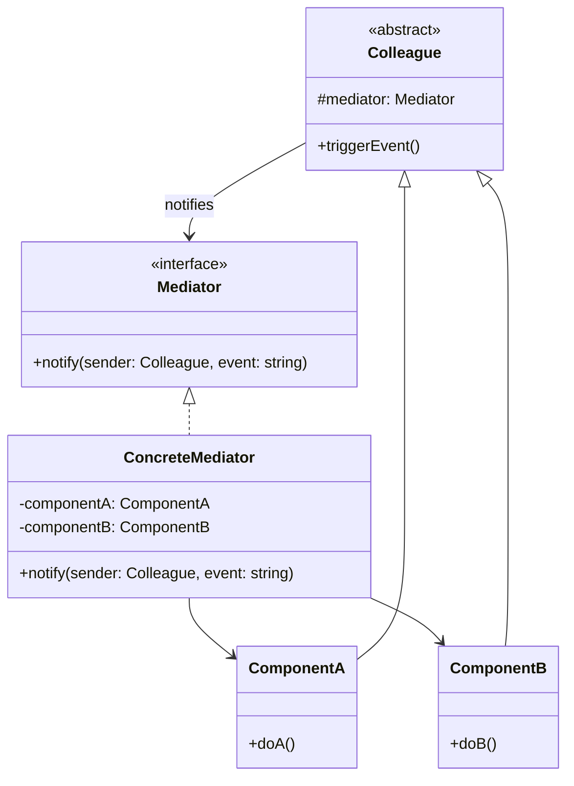

# Mediator Pattern

## Overview

The **Mediator** pattern is a behavioral design pattern that reduces chaotic dependencies between objects. It restricts direct communications between objects and forces them to collaborate only via a central mediator object.

**Key advantage**: It replaces a "many-to-many" communication web with a "one-to-many" star topology, vastly reducing the coupling between system components.

**Modern perspective**: The Mediator pattern is fundamentally embedded in modern UI frameworks (where a Controller or ViewModel mediates between views and models), Event Buses, API Gateways, and CQRS implementations (like the popular MediatR library in C#).

## The Problem

Imagine building a complex user interface for a flight booking system. You have various UI components:

- A dropdown for selecting departure dates.
- A checkbox for "Flexible Dates".
- A text field for the return date.
- A "Search" button.

When the user checks the "Flexible Dates" checkbox, the return date text field needs to be disabled. When the departure date is cleared, the "Search" button must be disabled.

```typescript
// ❌ Bad: Components depend directly on each other
class Checkbox {
  constructor(private returnDateField: TextField) {}

  onCheck() {
    this.returnDateField.disable();
  }
}

class DateDropdown {
  constructor(private searchButton: Button) {}

  onChange() {
    if (this.isEmpty()) this.searchButton.disable();
  }
}
```

If every component needs a direct reference to every other component to trigger state changes, you end up with spaghetti code. Reusing the `Checkbox` or `TextField` in another form is impossible because they are hard-coupled to the specific elements of this form.

## The Solution

The Mediator pattern suggests that components (called **Colleagues**) should not communicate directly. Instead, they should send events or messages to a **Mediator** object.

1. **The Mediator** knows about all the components.
2. **The Colleagues** only know about the Mediator.
3. When a Colleague's state changes, it notifies the Mediator. The Mediator contains the business logic to decide which _other_ Colleagues need to be updated.

By extracting the interaction logic into a single class, you make the components independent, reusable, and much easier to test.

## Structure



## Flow

1. A **Component** (Colleague) performs an action (e.g., user clicks a checkbox).
2. The **Component** calls `this.mediator.notify(this, "checkbox_clicked")`.
3. The **Mediator** receives the notification.
4. The **Mediator** executes the appropriate business logic and directly calls methods on other components (e.g., `componentB.disable()`).

## Real-World Analogy

Think of an **Air Traffic Controller** at a busy airport.
Planes (the Colleagues) do not talk directly to each other to decide who lands next. If they did, it would be chaos. Instead, all planes communicate exclusively with the Air Traffic Controller (the Mediator). The Controller knows the overall state of the airport, the runway availability, and the weather. The Controller tells plane A to land and plane B to circle the airport.

## Step-by-Step Implementation

1. **Define the Mediator Interface**: Create an interface with a notification method (e.g., `notify(sender, event)`).
2. **Define the Colleague Base Class**: Create a base class or interface for components that stores a reference to the Mediator.
3. **Implement Concrete Colleagues**: Build your independent components. Whenever they do something that affects others, call the mediator's `notify` method.
4. **Implement the Concrete Mediator**: Create the class that implements the Mediator interface. It should hold references to all concrete colleagues. Implement the `notify` method to route logic based on the `sender` and `event`.

## Code Examples

We will implement an **Incident Response Room**. Various services (Alert Monitor, Commander, Status Page) need to coordinate during an outage, but they shouldn't depend directly on one another.

::: code-group

```typescript [TypeScript]
// 1. Mediator Interface
interface IncidentMediator {
  notify(sender: Colleague, event: string, payload?: any): void;
}

// 2. Colleague Base Class
abstract class Colleague {
  constructor(
    protected mediator: IncidentMediator,
    public readonly name: string,
  ) {}
}

// 3. Concrete Colleagues
class AlertMonitor extends Colleague {
  detectIssue(serviceName: string): void {
    console.log(`[${this.name}] detected issue in: ${serviceName}`);
    this.mediator.notify(this, "issue_detected", serviceName);
  }
}

class IncidentCommander extends Colleague {
  acknowledge(): void {
    console.log(`[${this.name}] acknowledged the incident.`);
    this.mediator.notify(this, "incident_acknowledged");
  }

  declareResolved(): void {
    console.log(`[${this.name}] declared the incident resolved.`);
    this.mediator.notify(this, "incident_resolved");
  }
}

class StatusPageUpdater extends Colleague {
  updateStatus(message: string): void {
    console.log(`[${this.name}] Status Page Updated: ${message}`);
  }
}

class PagerService extends Colleague {
  pageEngineer(team: string): void {
    console.log(`[${this.name}] Paging on-call engineer for ${team}...`);
  }
}

// 4. Concrete Mediator
class IncidentRoom implements IncidentMediator {
  private monitor!: AlertMonitor;
  private commander!: IncidentCommander;
  private statusPage!: StatusPageUpdater;
  private pager!: PagerService;

  // Registration
  register(
    monitor: AlertMonitor,
    commander: IncidentCommander,
    status: StatusPageUpdater,
    pager: PagerService,
  ) {
    this.monitor = monitor;
    this.commander = commander;
    this.statusPage = status;
    this.pager = pager;
  }

  notify(sender: Colleague, event: string, payload?: any): void {
    if (event === "issue_detected") {
      this.statusPage.updateStatus(`Investigating issues with ${payload}`);
      this.pager.pageEngineer("BackendOps");
    } else if (event === "incident_acknowledged") {
      this.statusPage.updateStatus(
        "Engineers are currently investigating the issue.",
      );
    } else if (event === "incident_resolved") {
      this.statusPage.updateStatus("All systems operational.");
    }
  }
}

// 5. Client
const room = new IncidentRoom();

const monitor = new AlertMonitor(room, "Datadog");
const commander = new IncidentCommander(room, "Alice");
const statusPage = new StatusPageUpdater(room, "StatusIO");
const pager = new PagerService(room, "PagerDuty");

room.register(monitor, commander, statusPage, pager);

// The monitor detects an issue. It knows NOTHING about PagerDuty or StatusIO.
monitor.detectIssue("Payments API");
console.log("---");
commander.acknowledge();
console.log("---");
commander.declareResolved();
```

```python [Python]
from abc import ABC, abstractmethod

# 1. Mediator Interface
class IncidentMediator(ABC):
    @abstractmethod
    def notify(self, sender: 'Colleague', event: str, payload: str = None) -> None:
        pass

# 2. Colleague Base Class
class Colleague(ABC):
    def __init__(self, mediator: IncidentMediator, name: str):
        self.mediator = mediator
        self.name = name

# 3. Concrete Colleagues
class AlertMonitor(Colleague):
    def detect_issue(self, service_name: str) -> None:
        print(f"[{self.name}] detected issue in: {service_name}")
        self.mediator.notify(self, "issue_detected", service_name)

class IncidentCommander(Colleague):
    def acknowledge(self) -> None:
        print(f"[{self.name}] acknowledged the incident.")
        self.mediator.notify(self, "incident_acknowledged")

    def declare_resolved(self) -> None:
        print(f"[{self.name}] declared the incident resolved.")
        self.mediator.notify(self, "incident_resolved")

class StatusPageUpdater(Colleague):
    def update_status(self, message: str) -> None:
        print(f"[{self.name}] Status Page Updated: {message}")

class PagerService(Colleague):
    def page_engineer(self, team: str) -> None:
        print(f"[{self.name}] Paging on-call engineer for {team}...")

# 4. Concrete Mediator
class IncidentRoom(IncidentMediator):
    def __init__(self):
        self.monitor = None
        self.commander = None
        self.status_page = None
        self.pager = None

    def register(self, monitor, commander, status_page, pager) -> None:
        self.monitor = monitor
        self.commander = commander
        self.status_page = status_page
        self.pager = pager

    def notify(self, sender: Colleague, event: str, payload: str = None) -> None:
        if event == "issue_detected":
            self.status_page.update_status(f"Investigating issues with {payload}")
            self.pager.page_engineer("BackendOps")
        elif event == "incident_acknowledged":
            self.status_page.update_status("Engineers are currently investigating the issue.")
        elif event == "incident_resolved":
            self.status_page.update_status("All systems operational.")

# 5. Client
if __name__ == "__main__":
    room = IncidentRoom()

    monitor = AlertMonitor(room, "Datadog")
    commander = IncidentCommander(room, "Alice")
    status_page = StatusPageUpdater(room, "StatusIO")
    pager = PagerService(room, "PagerDuty")

    room.register(monitor, commander, status_page, pager)

    monitor.detect_issue("Payments API")
    print("---")
    commander.acknowledge()
    print("---")
    commander.declare_resolved()
```

```java [Java]
// 1. Mediator Interface
interface IncidentMediator {
    void notify(Colleague sender, String event, String payload);
}

// 2. Colleague Base Class
abstract class Colleague {
    protected IncidentMediator mediator;
    protected String name;

    public Colleague(IncidentMediator mediator, String name) {
        this.mediator = mediator;
        this.name = name;
    }
    public String getName() { return name; }
}

// 3. Concrete Colleagues
class AlertMonitor extends Colleague {
    public AlertMonitor(IncidentMediator mediator, String name) { super(mediator, name); }
    public void detectIssue(String serviceName) {
        System.out.println("[" + name + "] detected issue in: " + serviceName);
        mediator.notify(this, "issue_detected", serviceName);
    }
}

class IncidentCommander extends Colleague {
    public IncidentCommander(IncidentMediator mediator, String name) { super(mediator, name); }
    public void acknowledge() {
        System.out.println("[" + name + "] acknowledged the incident.");
        mediator.notify(this, "incident_acknowledged", null);
    }
    public void declareResolved() {
        System.out.println("[" + name + "] declared the incident resolved.");
        mediator.notify(this, "incident_resolved", null);
    }
}

class StatusPageUpdater extends Colleague {
    public StatusPageUpdater(IncidentMediator mediator, String name) { super(mediator, name); }
    public void updateStatus(String message) {
        System.out.println("[" + name + "] Status Page Updated: " + message);
    }
}

class PagerService extends Colleague {
    public PagerService(IncidentMediator mediator, String name) { super(mediator, name); }
    public void pageEngineer(String team) {
        System.out.println("[" + name + "] Paging on-call engineer for " + team + "...");
    }
}

// 4. Concrete Mediator
class IncidentRoom implements IncidentMediator {
    private AlertMonitor monitor;
    private IncidentCommander commander;
    private StatusPageUpdater statusPage;
    private PagerService pager;

    public void register(AlertMonitor m, IncidentCommander c, StatusPageUpdater s, PagerService p) {
        this.monitor = m;
        this.commander = c;
        this.statusPage = s;
        this.pager = p;
    }

    @Override
    public void notify(Colleague sender, String event, String payload) {
        if ("issue_detected".equals(event)) {
            statusPage.updateStatus("Investigating issues with " + payload);
            pager.pageEngineer("BackendOps");
        } else if ("incident_acknowledged".equals(event)) {
            statusPage.updateStatus("Engineers are currently investigating the issue.");
        } else if ("incident_resolved".equals(event)) {
            statusPage.updateStatus("All systems operational.");
        }
    }
}

// 5. Client
public class MediatorDemo {
    public static void main(String[] args) {
        IncidentRoom room = new IncidentRoom();

        AlertMonitor monitor = new AlertMonitor(room, "Datadog");
        IncidentCommander commander = new IncidentCommander(room, "Alice");
        StatusPageUpdater statusPage = new StatusPageUpdater(room, "StatusIO");
        PagerService pager = new PagerService(room, "PagerDuty");

        room.register(monitor, commander, statusPage, pager);

        monitor.detectIssue("Payments API");
        System.out.println("---");
        commander.acknowledge();
        System.out.println("---");
        commander.declareResolved();
    }
}
```

```go [Go]
package main

import "fmt"

// 1. Mediator Interface
type IncidentMediator interface {
	Notify(sender string, event string, payload string)
}

// 2. Concrete Colleagues
type AlertMonitor struct {
	mediator IncidentMediator
	name     string
}

func (m *AlertMonitor) DetectIssue(serviceName string) {
	fmt.Printf("[%s] detected issue in: %s\n", m.name, serviceName)
	m.mediator.Notify(m.name, "issue_detected", serviceName)
}

type IncidentCommander struct {
	mediator IncidentMediator
	name     string
}

func (c *IncidentCommander) Acknowledge() {
	fmt.Printf("[%s] acknowledged the incident.\n", c.name)
	c.mediator.Notify(c.name, "incident_acknowledged", "")
}

func (c *IncidentCommander) DeclareResolved() {
	fmt.Printf("[%s] declared the incident resolved.\n", c.name)
	c.mediator.Notify(c.name, "incident_resolved", "")
}

type StatusPageUpdater struct {
	name string
}

func (s *StatusPageUpdater) UpdateStatus(message string) {
	fmt.Printf("[%s] Status Page Updated: %s\n", s.name, message)
}

type PagerService struct {
	name string
}

func (p *PagerService) PageEngineer(team string) {
	fmt.Printf("[%s] Paging on-call engineer for %s...\n", p.name, team)
}

// 3. Concrete Mediator
type IncidentRoom struct {
	statusPage *StatusPageUpdater
	pager      *PagerService
}

func (r *IncidentRoom) Notify(sender string, event string, payload string) {
	switch event {
	case "issue_detected":
		r.statusPage.UpdateStatus("Investigating issues with " + payload)
		r.pager.PageEngineer("BackendOps")
	case "incident_acknowledged":
		r.statusPage.UpdateStatus("Engineers are currently investigating the issue.")
	case "incident_resolved":
		r.statusPage.UpdateStatus("All systems operational.")
	}
}

// 4. Client
func main() {
	statusPage := &StatusPageUpdater{name: "StatusIO"}
	pager := &PagerService{name: "PagerDuty"}

	room := &IncidentRoom{statusPage: statusPage, pager: pager}

	monitor := &AlertMonitor{mediator: room, name: "Datadog"}
	commander := &IncidentCommander{mediator: room, name: "Alice"}

	monitor.DetectIssue("Payments API")
	fmt.Println("---")
	commander.Acknowledge()
	fmt.Println("---")
	commander.DeclareResolved()
}
```

```rust [Rust]
use std::cell::RefCell;
use std::rc::Rc;

// 1. Mediator Trait
trait IncidentMediator {
    fn notify(&self, sender: &str, event: &str, payload: &str);
}

// 2. Concrete Colleagues
struct StatusPageUpdater {
    name: String,
}

impl StatusPageUpdater {
    fn update_status(&self, message: &str) {
        println!("[{}] Status Page Updated: {}", self.name, message);
    }
}

struct PagerService {
    name: String,
}

impl PagerService {
    fn page_engineer(&self, team: &str) {
        println!("[{}] Paging on-call engineer for {}...", self.name, team);
    }
}

// 3. Concrete Mediator
// We use Rc and RefCell because the mediator holds mutable/shared state in Rust
struct IncidentRoom {
    status_page: Rc<RefCell<StatusPageUpdater>>,
    pager: Rc<RefCell<PagerService>>,
}

impl IncidentMediator for IncidentRoom {
    fn notify(&self, _sender: &str, event: &str, payload: &str) {
        match event {
            "issue_detected" => {
                let msg = format!("Investigating issues with {}", payload);
                self.status_page.borrow().update_status(&msg);
                self.pager.borrow().page_engineer("BackendOps");
            }
            "incident_acknowledged" => {
                self.status_page.borrow().update_status("Engineers are currently investigating the issue.");
            }
            "incident_resolved" => {
                self.status_page.borrow().update_status("All systems operational.");
            }
            _ => {}
        }
    }
}

// Weak reference to the mediator for the Colleagues
struct AlertMonitor {
    mediator: Rc<dyn IncidentMediator>,
    name: String,
}

impl AlertMonitor {
    fn detect_issue(&self, service_name: &str) {
        println!("[{}] detected issue in: {}", self.name, service_name);
        self.mediator.notify(&self.name, "issue_detected", service_name);
    }
}

struct IncidentCommander {
    mediator: Rc<dyn IncidentMediator>,
    name: String,
}

impl IncidentCommander {
    fn acknowledge(&self) {
        println!("[{}] acknowledged the incident.", self.name);
        self.mediator.notify(&self.name, "incident_acknowledged", "");
    }

    fn declare_resolved(&self) {
        println!("[{}] declared the incident resolved.", self.name);
        self.mediator.notify(&self.name, "incident_resolved", "");
    }
}

// 4. Client
fn main() {
    let status_page = Rc::new(RefCell::new(StatusPageUpdater { name: "StatusIO".into() }));
    let pager = Rc::new(RefCell::new(PagerService { name: "PagerDuty".into() }));

    let room = Rc::new(IncidentRoom {
        status_page: Rc::clone(&status_page),
        pager: Rc::clone(&pager),
    });

    let monitor = AlertMonitor {
        mediator: Rc::clone(&room) as Rc<dyn IncidentMediator>,
        name: "Datadog".into(),
    };

    let commander = IncidentCommander {
        mediator: Rc::clone(&room) as Rc<dyn IncidentMediator>,
        name: "Alice".into(),
    };

    monitor.detect_issue("Payments API");
    println!("---");
    commander.acknowledge();
    println!("---");
    commander.declare_resolved();
}
```

:::

## Pros and Cons

### Advantages

- **Single Responsibility Principle**: You can extract the communication logic into a single place, making it easier to comprehend and maintain.
- **Open/Closed Principle**: You can introduce new mediators or colleagues without having to change the actual components.
- **Loose Coupling**: It drastically reduces coupling between various components. Components can be reused in different parts of the application.
- **Centralized Control**: Makes the overarching workflow of a complex system visible in one class, rather than scattered across dozens.

### Disadvantages

- **God Object Risk**: The Mediator class can easily become a "God Object" (a massive, all-knowing class) if you stuff too much business logic into it.
- **Performance bottleneck**: If the mediator is handling high-frequency events, it can become a performance bottleneck.
- **Hard to trace**: In heavy event-driven systems, tracing the source of a state change back through a mediator can be tricky.

## When to Use

- **Complex UIs**: When UI components need to react to each other's state changes, but shouldn't be tightly coupled.
- **Orchestration Layers**: When integrating multiple microservices or internal systems where a single "Saga" or "Workflow" coordinator is needed.
- **CQRS**: In the Command Query Responsibility Segregation pattern, a Mediator (like MediatR) acts as the central hub routing commands to their specific handlers.

## When NOT to Use

- **Simple interactions**: If only two objects need to talk to each other, a direct reference or a simple callback is much clearer.
- **Pipeline Processing**: If data just flows sequentially from step A -> B -> C, the **Chain of Responsibility** or **Pipes and Filters** pattern is more appropriate.

## Common Mistakes

### 1. Putting Data Logic in the Mediator

The Mediator should _coordinate_ behavior, not _store_ the core business state.

```typescript
// ❌ Bad: Mediator owns the database logic
class BadMediator {
  notify(sender, event) {
    if (event === "save") {
      db.query("INSERT INTO..."); // Mediator is doing data layer work
    }
  }
}
```

### 2. Creating a God Object

If your Mediator is 3,000 lines long and imports every file in your project, you've gone too far. Split the Mediator into smaller, domain-specific coordinators.

## Related Patterns

- **Observer**: Mediator and Observer are often used interchangeably. In Observer, an object broadcasts events and doesn't care who listens. In Mediator, the central object knows exactly who needs to respond. (Mediators often use the Observer pattern under the hood).
- **Facade**: A Facade provides a simplified interface to a subsystem of classes. Facade goes strictly one-way (Client -> Facade -> Subsystem). Mediator handles multi-directional communication between components.
- **Command**: Often, the Mediator delegates actual work to Commands.

## Interview Insights

- **Question**: "What is the difference between Mediator and Observer?"
  - **Answer**: "Observer is a broadcast mechanism (Pub/Sub). The publisher doesn't know who the subscribers are. Mediator is a centralized coordinator. The Mediator explicitly knows about the components it's coordinating and orchestrates their specific workflows."
- **Question**: "Can Mediator cause memory leaks?"
  - **Answer**: "Yes. Because the Mediator holds references to all Colleagues, and Colleagues hold a reference to the Mediator, you can easily create circular references. In memory-managed languages, you often need to unregister components when they are destroyed to allow garbage collection."

## Modern Alternatives

- **Pub/Sub (Event Bus)**: Tools like Kafka, RabbitMQ, or simple Node.js `EventEmitter` are decoupled, purely reactive alternatives to strict Mediators.
- **Redux / State Management**: In frontend engineering, global state stores (like Redux, Vuex, or Zustand) act as Mediators. Components dispatch actions, and the Store updates and triggers re-renders.
- **MediatR (C#)**: A hugely popular library that implements the Mediator pattern to decouple HTTP Controllers from business logic Handlers.
