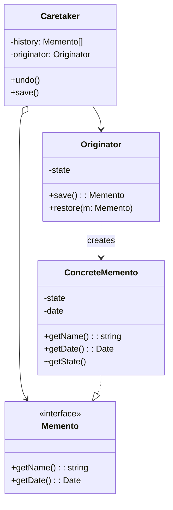

# Memento Pattern

## Overview

The **Memento** pattern is a behavioral design pattern that allows you to capture and save the internal state of an object so that you can restore it later. Crucially, it does this *without violating the encapsulation* of that object.

**Key advantage**: You can create snapshots of a complex object's state without exposing its private fields or internal structure to the rest of the application.

**Modern perspective**: Memento is the architectural backbone of "Undo/Redo" stacks, save-game files, browser history, and time-travel debugging tools (like Redux DevTools). In modern functional programming, immutability largely replaces the need for classic OOP Mementos, as state snapshots are generated naturally.

## The Problem

Imagine you are building a modern Text Editor or a Graphics Canvas. Naturally, you need an "Undo" feature.

To implement Undo, you need to record the state of the editor before making a change. 

```typescript
// ❌ Bad: Violating encapsulation to save state
class Editor {
  private text: string = "";
  private cursorX: number = 0;
  private cursorY: number = 0;
  private selectionWidth: number = 0;

  // The history manager needs to save this data. 
  // Should we make these fields public?
}
```

If you make all internal fields `public`, any other class can modify the editor's state unexpectedly, violating the principles of OOP. Furthermore, if you refactor the `Editor` later to use a different data structure (like a `Rope` instead of a `String`), you break the history manager that relies on the old fields.

You need a way to save the state, securely, without exposing *how* the state is structured.

## The Solution

The Memento pattern delegates the creation of the state snapshots to the object itself (the **Originator**), because the object has full access to its own private fields.

1. **Originator**: The object whose state needs to be saved (e.g., `Editor`).
2. **Memento**: A value object that acts as a snapshot of the Originator's state. It is strictly read-only and immutable.
3. **Caretaker**: The object that manages the "when" and "why" of saving/restoring (e.g., `HistoryManager`). It holds a list of Mementos but *never* inspects their contents.

When the Caretaker needs to save state, it asks the Originator for a Memento. When it needs to undo, it passes that Memento back to the Originator.

## Structure



## Flow

1. The **Caretaker** decides it's time to save state (e.g., before executing a user command).
2. The **Caretaker** calls `originator.save()`.
3. The **Originator** creates a **ConcreteMemento** containing a deep copy of its internal state and returns it.
4. The **Caretaker** pushes the Memento onto a stack. It only interacts with the Memento through a restricted interface (like `getName()`).
5. Upon "Undo", the **Caretaker** pops the Memento off the stack and calls `originator.restore(memento)`.

## Real-World Analogy

Think of a **Video Game Save File**.
You are playing an RPG (the **Originator**). You walk into a boss room and manually save the game. The game serializes your health, inventory, and location into a Save File (the **Memento**). 

The hard drive or operating system (the **Caretaker**) manages these save files. It knows when they were created and what they are called, but it doesn't understand the internal binary format of your RPG inventory. If you die, the OS gives the Save File back to the game, and the game restores its internal state to exactly where you were.

## Step-by-Step Implementation

1. **Create the Memento Interface**: It should only expose metadata (like `getTimestamp()` or `getName()`). It should explicitly hide the actual state data.
2. **Create the Concrete Memento**: Implement the interface. This class will store the actual state data. In many languages, you can make this a nested or package-private class so only the Originator can access the raw state.
3. **Implement the Originator**: Add `save(): Memento` (which packages state into a new ConcreteMemento) and `restore(memento: Memento)` (which unpacks the state and applies it).
4. **Implement the Caretaker**: This class holds an array/stack of Mementos and coordinates the save/undo process.

## Code Examples

We will build a simple `GameEditor` with a `History` manager. The Memento will hold the position and health of the player securely.

::: code-group

```typescript [TypeScript]
// 1. Memento Interface (Restricted interface for Caretaker)
interface Memento {
  getName(): string;
  getDate(): string;
}

// 2. Concrete Memento (Holds the secret state)
// In TypeScript, we can't restrict method access perfectly, but we can convention it.
class ConcreteMemento implements Memento {
  private readonly date: string;

  constructor(
    private readonly state: string,
    private readonly health: number,
    private readonly position: { x: number; y: number }
  ) {
    this.date = new Date().toISOString();
  }

  // The Originator will use these methods, but the Caretaker shouldn't.
  getState(): string { return this.state; }
  getHealth(): number { return this.health; }
  getPosition(): { x: number; y: number } { return this.position; }

  // Interface methods
  getName(): string {
    return `${this.date} / State: ${this.state}`;
  }

  getDate(): string {
    return this.date;
  }
}

// 3. Originator
class GameEditor {
  private state: string = "Idle";
  private health: number = 100;
  private position: { x: number; y: number } = { x: 0, y: 0 };

  // Mutators
  play(action: string, healthChange: number, x: number, y: number) {
    this.state = action;
    this.health += healthChange;
    this.position = { x, y };
    console.log(`GameEditor: Changed state to [${this.state}] HP: ${this.health}`);
  }

  // Saves state inside a Memento
  save(): Memento {
    console.log("GameEditor: Saving state...");
    return new ConcreteMemento(this.state, this.health, { ...this.position });
  }

  // Restores state from a Memento
  restore(m: Memento): void {
    if (!(m instanceof ConcreteMemento)) {
      throw new Error("Unknown memento class");
    }
    console.log("GameEditor: Restoring state...");
    this.state = m.getState();
    this.health = m.getHealth();
    this.position = { ...m.getPosition() };
    console.log(`GameEditor: Restored to [${this.state}] HP: ${this.health}`);
  }
}

// 4. Caretaker
class HistoryManager {
  private mementos: Memento[] = [];

  constructor(private originator: GameEditor) {}

  backup(): void {
    console.log("History: Performing backup...");
    this.mementos.push(this.originator.save());
  }

  undo(): void {
    if (!this.mementos.length) return;
    
    const memento = this.mementos.pop();
    console.log(`History: Restoring memento: ${memento?.getName()}`);
    this.originator.restore(memento!);
  }

  showHistory(): void {
    console.log("History: Here's the list of mementos:");
    for (const m of this.mementos) {
      console.log(m.getName());
    }
  }
}

// 5. Client
const game = new GameEditor();
const history = new HistoryManager(game);

history.backup();
game.play("Running", -10, 10, 0);

history.backup();
game.play("Fighting Boss", -50, 10, 20);

history.showHistory();

console.log("\nClient: Now, let's rollback!");
history.undo();

console.log("\nClient: Rollback again!");
history.undo();
```

```python [Python]
from __future__ import annotations
from abc import ABC, abstractmethod
from datetime import datetime
import copy

# 1. Memento Interface
class Memento(ABC):
    @abstractmethod
    def get_name(self) -> str:
        pass

    @abstractmethod
    def get_date(self) -> str:
        pass

# 2. Concrete Memento
class ConcreteMemento(Memento):
    def __init__(self, state: str, health: int, position: dict):
        # We deepcopy to ensure immutability
        self._state = state
        self._health = health
        self._position = copy.deepcopy(position)
        self._date = str(datetime.now())

    # Originator methods
    def get_state(self) -> str:
        return self._state
        
    def get_health(self) -> int:
        return self._health
        
    def get_position(self) -> dict:
        return self._position

    # Interface methods
    def get_name(self) -> str:
        return f"{self._date} / State: {self._state}"

    def get_date(self) -> str:
        return self._date

# 3. Originator
class GameEditor:
    def __init__(self):
        self._state = "Idle"
        self._health = 100
        self._position = {"x": 0, "y": 0}

    def play(self, action: str, health_change: int, x: int, y: int):
        self._state = action
        self._health += health_change
        self._position = {"x": x, "y": y}
        print(f"GameEditor: Changed state to [{self._state}] HP: {self._health}")

    def save(self) -> Memento:
        print("GameEditor: Saving state...")
        return ConcreteMemento(self._state, self._health, self._position)

    def restore(self, memento: Memento):
        # In Python, we rely on duck typing or isinstance
        if not isinstance(memento, ConcreteMemento):
            return
        
        print("GameEditor: Restoring state...")
        self._state = memento.get_state()
        self._health = memento.get_health()
        self._position = copy.deepcopy(memento.get_position())
        print(f"GameEditor: Restored to [{self._state}] HP: {self._health}")

# 4. Caretaker
class HistoryManager:
    def __init__(self, originator: GameEditor):
        self._mementos = []
        self._originator = originator

    def backup(self) -> None:
        print("History: Performing backup...")
        self._mementos.append(self._originator.save())

    def undo(self) -> None:
        if not len(self._mementos):
            return

        memento = self._mementos.pop()
        print(f"History: Restoring memento: {memento.get_name()}")
        self._originator.restore(memento)

    def show_history(self) -> None:
        print("History: Here's the list of mementos:")
        for m in self._mementos:
            print(m.get_name())

# 5. Client
if __name__ == "__main__":
    game = GameEditor()
    history = HistoryManager(game)

    history.backup()
    game.play("Running", -10, 10, 0)

    history.backup()
    game.play("Fighting Boss", -50, 10, 20)

    history.show_history()

    print("\nClient: Now, let's rollback!")
    history.undo()

    print("\nClient: Rollback again!")
    history.undo()
```

```java [Java]
import java.util.Stack;

// 1. Memento Interface
interface Memento {
    String getName();
}

// 3. Originator (Java allows nested classes, which is perfect for Memento!)
class GameEditor {
    private String state = "Idle";
    private int health = 100;

    public void play(String action, int healthChange) {
        this.state = action;
        this.health += healthChange;
        System.out.println("GameEditor: Changed state to [" + state + "] HP: " + health);
    }

    public Memento save() {
        System.out.println("GameEditor: Saving state...");
        return new ConcreteMemento(this.state, this.health);
    }

    public void restore(Memento m) {
        // Because ConcreteMemento is private to GameEditor, 
        // only GameEditor can cast it and read its fields.
        ConcreteMemento memento = (ConcreteMemento) m;
        this.state = memento.savedState;
        this.health = memento.savedHealth;
        System.out.println("GameEditor: Restored to [" + state + "] HP: " + health);
    }

    // 2. Concrete Memento (Nested class hides fields from Caretaker)
    private static class ConcreteMemento implements Memento {
        private final String savedState;
        private final int savedHealth;

        private ConcreteMemento(String state, int health) {
            this.savedState = state;
            this.savedHealth = health;
        }

        @Override
        public String getName() {
            return "State: " + savedState;
        }
    }
}

// 4. Caretaker
class HistoryManager {
    private Stack<Memento> mementos = new Stack<>();
    private GameEditor originator;

    public HistoryManager(GameEditor originator) {
        this.originator = originator;
    }

    public void backup() {
        System.out.println("History: Performing backup...");
        mementos.push(originator.save());
    }

    public void undo() {
        if (!mementos.isEmpty()) {
            Memento m = mementos.pop();
            System.out.println("History: Restoring memento: " + m.getName());
            originator.restore(m);
        }
    }
}

// 5. Client
public class MementoDemo {
    public static void main(String[] args) {
        GameEditor game = new GameEditor();
        HistoryManager history = new HistoryManager(game);

        history.backup();
        game.play("Running", -10);

        history.backup();
        game.play("Fighting Boss", -50);

        System.out.println("\nClient: Now, let's rollback!");
        history.undo();

        System.out.println("\nClient: Rollback again!");
        history.undo();
    }
}
```

```go [Go]
package main

import "fmt"

// 1. Memento Interface
type Memento interface {
	GetName() string
}

// 2. Concrete Memento
// In Go, lowercase fields are unexported outside the package.
// If Caretaker is in a different package, it cannot touch these fields!
type concreteMemento struct {
	state  string
	health int
}

func (m *concreteMemento) GetName() string {
	return fmt.Sprintf("State: %s", m.state)
}

// 3. Originator
type GameEditor struct {
	state  string
	health int
}

func (g *GameEditor) Play(action string, healthChange int) {
	g.state = action
	g.health += healthChange
	fmt.Printf("GameEditor: Changed state to [%s] HP: %d\n", g.state, g.health)
}

func (g *GameEditor) Save() Memento {
	fmt.Println("GameEditor: Saving state...")
	return &concreteMemento{
		state:  g.state,
		health: g.health,
	}
}

func (g *GameEditor) Restore(m Memento) {
	cm, ok := m.(*concreteMemento)
	if !ok {
		return
	}
	fmt.Println("GameEditor: Restoring state...")
	g.state = cm.state
	g.health = cm.health
	fmt.Printf("GameEditor: Restored to [%s] HP: %d\n", g.state, g.health)
}

// 4. Caretaker
type HistoryManager struct {
	mementos   []Memento
	originator *GameEditor
}

func (h *HistoryManager) Backup() {
	fmt.Println("History: Performing backup...")
	h.mementos = append(h.mementos, h.originator.Save())
}

func (h *HistoryManager) Undo() {
	if len(h.mementos) == 0 {
		return
	}
	// Pop
	lastIdx := len(h.mementos) - 1
	m := h.mementos[lastIdx]
	h.mementos = h.mementos[:lastIdx]

	fmt.Printf("History: Restoring memento: %s\n", m.GetName())
	h.originator.Restore(m)
}

// 5. Client
func main() {
	game := &GameEditor{state: "Idle", health: 100}
	history := &HistoryManager{originator: game}

	history.Backup()
	game.Play("Running", -10)

	history.Backup()
	game.Play("Fighting Boss", -50)

	fmt.Println("\nClient: Now, let's rollback!")
	history.Undo()

	fmt.Println("\nClient: Rollback again!")
	history.Undo()
}
```

```rust [Rust]
// 1. Memento Trait
trait Memento {
    fn get_name(&self) -> String;
}

// 2. Concrete Memento
// Struct fields are private to the module by default in Rust
#[derive(Clone)]
struct ConcreteMemento {
    state: String,
    health: i32,
}

impl Memento for ConcreteMemento {
    fn get_name(&self) -> String {
        format!("State: {}", self.state)
    }
}

// 3. Originator
struct GameEditor {
    state: String,
    health: i32,
}

impl GameEditor {
    fn new() -> Self {
        Self {
            state: "Idle".to_string(),
            health: 100,
        }
    }

    fn play(&mut self, action: &str, health_change: i32) {
        self.state = action.to_string();
        self.health += health_change;
        println!("GameEditor: Changed state to [{}] HP: {}", self.state, self.health);
    }

    fn save(&self) -> Box<dyn Memento> {
        println!("GameEditor: Saving state...");
        Box::new(ConcreteMemento {
            state: self.state.clone(),
            health: self.health,
        })
    }

    fn restore(&mut self, memento: &Box<dyn Memento>) {
        // We downcast using Any, or we keep it simple by implementing a specific struct approach.
        // Rust prefers enum states or specific generics. To mimic OOP here we downcast:
        // *But for simplicity*, let's just assume we return the concrete struct 
        // if Caretaker and Originator are in different modules. 
        // Below is the idiomatic Rust workaround.
    }
}

// Idiomatic Rust Memento Implementation (Avoiding Box<dyn> downcasting overhead)
struct RustConcreteMemento {
    state: String,
    health: i32,
}

impl GameEditor {
    fn save_idiomatic(&self) -> RustConcreteMemento {
        println!("GameEditor: Saving state...");
        RustConcreteMemento {
            state: self.state.clone(),
            health: self.health,
        }
    }

    fn restore_idiomatic(&mut self, memento: &RustConcreteMemento) {
        println!("GameEditor: Restoring state...");
        self.state = memento.state.clone();
        self.health = memento.health;
        println!("GameEditor: Restored to [{}] HP: {}", self.state, self.health);
    }
}

// 4. Caretaker
struct HistoryManager {
    mementos: Vec<RustConcreteMemento>,
}

impl HistoryManager {
    fn new() -> Self {
        Self {
            mementos: Vec::new(),
        }
    }

    fn backup(&mut self, originator: &GameEditor) {
        println!("History: Performing backup...");
        self.mementos.push(originator.save_idiomatic());
    }

    fn undo(&mut self, originator: &mut GameEditor) {
        if let Some(m) = self.mementos.pop() {
            println!("History: Restoring memento: {}", m.state);
            originator.restore_idiomatic(&m);
        }
    }
}

// 5. Client
fn main() {
    let mut game = GameEditor::new();
    let mut history = HistoryManager::new();

    history.backup(&game);
    game.play("Running", -10);

    history.backup(&game);
    game.play("Fighting Boss", -50);

    println!("\nClient: Now, let's rollback!");
    history.undo(&mut game);

    println!("\nClient: Rollback again!");
    history.undo(&mut game);
}
```

:::

## Pros and Cons

### Advantages
- **Encapsulation**: You can save an object's internal state without exposing its fields or internal implementation to the rest of the application.
- **Single Responsibility Principle**: You extract the logic for managing state history away from the Originator and place it in the Caretaker.
- **Easy Checkpoints**: Extremely useful for features like Drafts, Save points, or crash recovery.

### Disadvantages
- **Memory Consumption**: If the Originator's state is massive (like a large canvas image) and you create a Memento every second, you will rapidly exhaust your RAM.
- **Performance Overhead**: Deep copying complex object graphs to create Mementos takes CPU time.
- **Garbage Collection Pressure**: Continually creating and destroying Memento objects puts heavy load on the Garbage Collector in languages like Java, C#, or JS.

## When to Use

- **Undo/Redo Functionality**: The classic use case. 
- **Database Transactions**: When you want to roll back an in-memory object graph if a database transaction fails.
- **Wizards and Multi-step Forms**: If a user hits "Back" in a complex UI wizard, restoring a Memento is much easier than manually undoing UI state changes.

## When NOT to Use

- **Huge Memory Footprints**: If the object state involves gigabytes of data, you cannot use classical Mementos. You must use "diffs" or "deltas" (saving only what changed).
- **Immutable Architectures**: If your architecture natively relies on immutable data structures (like Redux or Clojure), every state transition naturally generates a new independent state object. The Memento pattern is natively fulfilled.

## Common Mistakes

### 1. Shallow Copying
If your object state contains references to arrays or objects, and you only shallow-copy them into the Memento, modifying the original object will modify the Memento too! You *must* deep clone the state.

```typescript
// ❌ Bad: Shallow copy
save() { return new Memento(this.itemsArray); }

// ✅ Good: Deep copy
save() { return new Memento(structuredClone(this.itemsArray)); }
```

### 2. Violating Encapsulation in the Caretaker
The Caretaker should NEVER read or alter the state inside the Memento. It should treat the Memento as an opaque black box.

## Related Patterns

- **Command**: Almost always used together. A Command represents an action, and it holds a Memento representing the state *before* the action occurred. Calling `command.undo()` restores the Memento.
- **Iterator**: You can use Iterators to traverse the history of Mementos stored in a Caretaker.
- **Prototype**: Often used under the hood to generate the deep copy snapshot required by the Memento.

## Interview Insights

- **Question**: "If Mementos take up too much RAM, how can we optimize the Undo system?"
  - **Answer**: "Instead of storing full state snapshots (Mementos), you store the *inverse Command* (delta). If the user types 'A', you store a command to 'Delete 1 character'. This uses drastically less memory but makes the code much more complex."
- **Question**: "How does Java enforce the 'Restricted Interface' of a Memento?"
  - **Answer**: "Java allows nested classes. By making the `ConcreteMemento` a private nested class inside the `Originator`, only the Originator can access its fields. The Caretaker is only given the public `Memento` interface which exposes nothing."

## Modern Alternatives

- **Immutability (Redux / Event Sourcing)**: If the application state is completely immutable, every modification creates a brand new State tree. A "Memento" is just a reference to the previous immutable tree. There is no need for copying.
- **JSON Serialization**: A very quick and dirty way to implement Memento in JS/Python is to serialize the object to a JSON string and store it, then parse it to restore. It guarantees a deep copy and zero encapsulation leakage.
