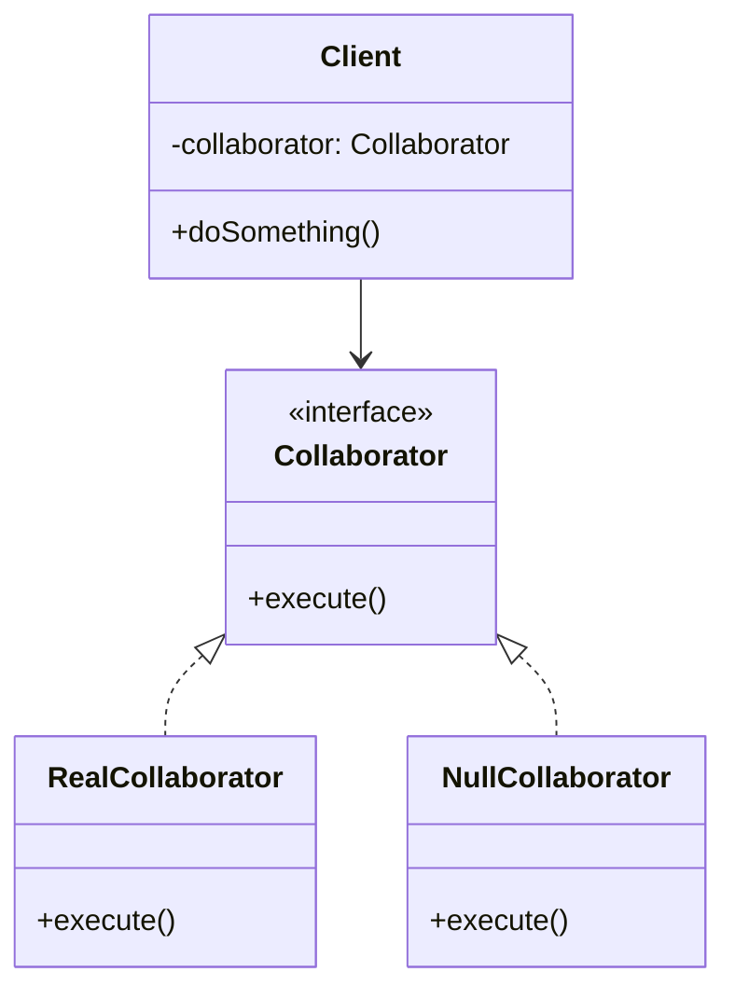

# Null Object Pattern

## Overview

The **Null Object** pattern is a behavioral design pattern that provides a safe, no-op (no operation) surrogate for a missing collaborator. Instead of relying on `null` or `nil` values and scattering defensive `if (object != null)` checks throughout your codebase, you inject a Null Object that implements the exact same interface as the real object but does nothing.

**Key advantage**: It completely eliminates `null` reference exceptions and simplifies business logic by treating the absence of an object as just another valid behavior.

**Modern perspective**: While still useful, modern languages with strict null-safety (like Kotlin, Rust, and TypeScript with `strictNullChecks`) or native `Option`/`Maybe` monads have reduced the absolute necessity of the Null Object pattern. However, for dependency injection (like a dummy Logger or Analytics sender), it remains the cleanest architectural choice.

## The Problem

Imagine a robust application that logs various events. Sometimes, during local development or in a testing environment, you might want to disable logging.

```typescript
// ❌ Bad: Scattered null checks
class OrderService {
  constructor(private logger: Logger | null) {}

  completeOrder(orderId: string) {
    // Core business logic
    database.save(orderId);

    // Defensive check
    if (this.logger !== null) {
      this.logger.info(`Order ${orderId} completed.`);
    }

    // More logic...
    if (this.logger !== null) {
      this.logger.debug("Routing to shipping subsystem.");
    }
  }
}
```

The business logic is now polluted with `if` statements. If you forget even one `if (logger != null)` check, your application crashes with a `NullReferenceException`. 

Furthermore, having to test `OrderService` requires passing a mock logger, configuring the mock, and verifying the mock, or intentionally passing `null` and hoping it doesn't crash.

## The Solution

Instead of passing `null`, we create a `NullLogger` class that implements the `Logger` interface but has empty methods.

1. **The Client** expects an object implementing the `Logger` interface.
2. **The Client** does not accept `null`.
3. We pass a **Null Object** when we want to disable the behavior.

```typescript
// ✅ Good: No null checks
class OrderService {
  // It is guaranteed to be a Logger, never null
  constructor(private logger: Logger) {}

  completeOrder(orderId: string) {
    database.save(orderId);
    
    // Always safe to call
    this.logger.info(`Order ${orderId} completed.`);
    this.logger.debug("Routing to shipping subsystem.");
  }
}
```

## Structure



## Flow

1. The **Client** is initialized with a **Collaborator** (via Dependency Injection).
2. The injected dependency is either a **RealCollaborator** or a **NullCollaborator**.
3. The **Client** calls `collaborator.execute()`.
4. If it's the **RealCollaborator**, actual work is done (e.g., writing to a file).
5. If it's the **NullCollaborator**, the method executes and returns immediately, doing absolutely nothing, safely.

## Real-World Analogy

Think of a **Mute Button** on a television. 
When you press the mute button, the television does not disconnect the speakers or start throwing errors because the audio stream is missing. Instead, it routes the audio to a "Null Speaker" (or zero-volume amplifier). The TV's internal systems continue to decode and "play" the audio track exactly as before, but the output is effectively nothing. The TV system doesn't need "if volume is not muted" checks at every audio pipeline step.

## Step-by-Step Implementation

1. **Identify the Optional Dependency**: Find the interface that is frequently `null` checked (e.g., `Metrics`, `Logger`, `Cache`).
2. **Implement the Null Class**: Create a class that implements this interface.
3. **Implement No-Op Methods**: For methods returning `void`, do nothing. For methods returning numbers, return `0`. For methods returning lists, return empty lists. For booleans, return `false` (or whatever makes semantic sense as a safe default).
4. **Use a Singleton**: Null objects carry no state. To save memory, instantiate the Null Object as a Singleton.
5. **Enforce Non-Nullability**: Update the Client's constructor to explicitly reject `null` values.

## Code Examples

Let's implement an Analytics tracking system. Users can opt out of analytics. Instead of checking `if (user.analyticsAllowed())` everywhere, we will inject a Null Object.

::: code-group

```typescript [TypeScript]
// 1. Collaborator Interface
interface AnalyticsTracker {
  trackEvent(eventName: string, properties?: Record<string, any>): void;
  trackPageView(pageUrl: string): void;
}

// 2. Real Collaborator
class MixpanelTracker implements AnalyticsTracker {
  trackEvent(eventName: string, properties?: Record<string, any>): void {
    console.log(`[Mixpanel] Tracking Event: ${eventName}`, properties || "");
  }

  trackPageView(pageUrl: string): void {
    console.log(`[Mixpanel] Page View: ${pageUrl}`);
  }
}

// 3. Null Collaborator (Singleton)
class NullTracker implements AnalyticsTracker {
  private static instance: NullTracker = new NullTracker();

  private constructor() {} // Prevent manual instantiation

  static getInstance(): NullTracker {
    return this.instance;
  }

  // Do absolutely nothing
  trackEvent(eventName: string, properties?: Record<string, any>): void {}
  trackPageView(pageUrl: string): void {}
}

// 4. Client
class CheckoutFlow {
  // TypeScript's strict mode ensures tracker cannot be null here
  constructor(private tracker: AnalyticsTracker) {}

  processPayment(amount: number) {
    console.log(`Processing payment of $${amount}...`);
    // No null checks!
    this.tracker.trackEvent("Payment Processed", { amount });
  }
}

// 5. Usage / Composition Root
const userOptedOut = true;

// Decide at the composition root which dependency to pass
const tracker = userOptedOut ? NullTracker.getInstance() : new MixpanelTracker();

const flow = new CheckoutFlow(tracker);
flow.processPayment(50.00); 
// Output: Processing payment of $50.00...
// (No Mixpanel logs are printed, and no errors are thrown!)
```

```python [Python]
from typing import Protocol, Dict, Optional

# 1. Collaborator Interface (Protocol)
class AnalyticsTracker(Protocol):
    def track_event(self, event_name: str, properties: Optional[Dict] = None) -> None:
        pass

    def track_page_view(self, page_url: str) -> None:
        pass

# 2. Real Collaborator
class MixpanelTracker:
    def track_event(self, event_name: str, properties: Optional[Dict] = None) -> None:
        props = properties or {}
        print(f"[Mixpanel] Tracking Event: {event_name} {props}")

    def track_page_view(self, page_url: str) -> None:
        print(f"[Mixpanel] Page View: {page_url}")

# 3. Null Collaborator
class NullTracker:
    # Python Singleton pattern via module-level instance or Borg, 
    # but a simple class is often enough as it has no state.
    def track_event(self, event_name: str, properties: Optional[Dict] = None) -> None:
        pass

    def track_page_view(self, page_url: str) -> None:
        pass

# Global Singleton Instance
NULL_TRACKER = NullTracker()

# 4. Client
class CheckoutFlow:
    def __init__(self, tracker: AnalyticsTracker):
        self.tracker = tracker

    def process_payment(self, amount: float) -> None:
        print(f"Processing payment of ${amount}...")
        # No 'if self.tracker is not None:' checks!
        self.tracker.track_event("Payment Processed", {"amount": amount})

# 5. Usage
user_opted_out = True

tracker = NULL_TRACKER if user_opted_out else MixpanelTracker()

flow = CheckoutFlow(tracker)
flow.process_payment(50.00)
```

```java [Java]
import java.util.Map;

// 1. Collaborator Interface
interface AnalyticsTracker {
    void trackEvent(String eventName, Map<String, Object> properties);
    void trackPageView(String pageUrl);
}

// 2. Real Collaborator
class MixpanelTracker implements AnalyticsTracker {
    @Override
    public void trackEvent(String eventName, Map<String, Object> properties) {
        System.out.println("[Mixpanel] Tracking Event: " + eventName + " " + properties);
    }

    @Override
    public void trackPageView(String pageUrl) {
        System.out.println("[Mixpanel] Page View: " + pageUrl);
    }
}

// 3. Null Collaborator (Best implemented as an Enum Singleton in Java)
enum NullTracker implements AnalyticsTracker {
    INSTANCE;

    @Override
    public void trackEvent(String eventName, Map<String, Object> properties) {
        // No-op
    }

    @Override
    public void trackPageView(String pageUrl) {
        // No-op
    }
}

// 4. Client
class CheckoutFlow {
    private final AnalyticsTracker tracker;

    public CheckoutFlow(AnalyticsTracker tracker) {
        // Fail fast if someone actually tries to pass a raw null
        if (tracker == null) throw new IllegalArgumentException("Tracker cannot be null");
        this.tracker = tracker;
    }

    public void processPayment(double amount) {
        System.out.println("Processing payment of $" + amount + "...");
        tracker.trackEvent("Payment Processed", Map.of("amount", amount));
    }
}

// 5. Usage
public class NullObjectDemo {
    public static void main(String[] args) {
        boolean userOptedOut = true;

        AnalyticsTracker tracker = userOptedOut ? NullTracker.INSTANCE : new MixpanelTracker();

        CheckoutFlow flow = new CheckoutFlow(tracker);
        flow.processPayment(50.00);
    }
}
```

```go [Go]
package main

import "fmt"

// 1. Collaborator Interface
type AnalyticsTracker interface {
	TrackEvent(eventName string, properties map[string]interface{})
	TrackPageView(pageUrl string)
}

// 2. Real Collaborator
type MixpanelTracker struct{}

func (m *MixpanelTracker) TrackEvent(eventName string, properties map[string]interface{}) {
	fmt.Printf("[Mixpanel] Tracking Event: %s %v\n", eventName, properties)
}

func (m *MixpanelTracker) TrackPageView(pageUrl string) {
	fmt.Printf("[Mixpanel] Page View: %s\n", pageUrl)
}

// 3. Null Collaborator
// Zero-sized struct, costs zero memory
type NullTracker struct{}

func (n NullTracker) TrackEvent(eventName string, properties map[string]interface{}) {}
func (n NullTracker) TrackPageView(pageUrl string)                                 {}

// 4. Client
type CheckoutFlow struct {
	tracker AnalyticsTracker
}

func (c *CheckoutFlow) ProcessPayment(amount float64) {
	fmt.Printf("Processing payment of $%.2f...\n", amount)
	c.tracker.TrackEvent("Payment Processed", map[string]interface{}{"amount": amount})
}

// 5. Usage
func main() {
	userOptedOut := true

	var tracker AnalyticsTracker
	if userOptedOut {
		tracker = NullTracker{} // Inject zero-cost Null Object
	} else {
		tracker = &MixpanelTracker{}
	}

	flow := &CheckoutFlow{tracker: tracker}
	flow.ProcessPayment(50.00)
}
```

```rust [Rust]
use std::collections::HashMap;

// 1. Collaborator Trait
trait AnalyticsTracker {
    fn track_event(&self, event_name: &str, properties: Option<&HashMap<String, String>>);
    fn track_page_view(&self, page_url: &str);
}

// 2. Real Collaborator
struct MixpanelTracker;

impl AnalyticsTracker for MixpanelTracker {
    fn track_event(&self, event_name: &str, _properties: Option<&HashMap<String, String>>) {
        println!("[Mixpanel] Tracking Event: {}", event_name);
    }

    fn track_page_view(&self, page_url: &str) {
        println!("[Mixpanel] Page View: {}", page_url);
    }
}

// 3. Null Collaborator
struct NullTracker;

impl AnalyticsTracker for NullTracker {
    fn track_event(&self, _event_name: &str, _properties: Option<&HashMap<String, String>>) {}
    fn track_page_view(&self, _page_url: &str) {}
}

// 4. Client
// Using dynamic dispatch (Box<dyn>) to allow swapping implementations
struct CheckoutFlow {
    tracker: Box<dyn AnalyticsTracker>,
}

impl CheckoutFlow {
    fn new(tracker: Box<dyn AnalyticsTracker>) -> Self {
        Self { tracker }
    }

    fn process_payment(&self, amount: f64) {
        println!("Processing payment of ${}...", amount);
        self.tracker.track_event("Payment Processed", None);
    }
}

// 5. Usage
fn main() {
    let user_opted_out = true;

    let tracker: Box<dyn AnalyticsTracker> = if user_opted_out {
        Box::new(NullTracker)
    } else {
        Box::new(MixpanelTracker)
    };

    let flow = CheckoutFlow::new(tracker);
    flow.process_payment(50.00);
}
```

:::

## Pros and Cons

### Advantages
- **Cleaner Code**: Eliminates boilerplate `null` checks across the application.
- **Fail-Safe**: Prevents `NullReferenceExceptions`.
- **Simplifies Testing**: Passing a `NullObject` to a constructor in a unit test is often much easier than setting up a mocking framework to ignore method calls.
- **Open/Closed Principle**: The client doesn't need to change if you decide to disable the behavior.

### Disadvantages
- **Can hide bugs**: If an object *should* be present, passing a Null Object silently swallows the error, making it incredibly hard to debug why data isn't saving.
- **Return Value Issues**: It is easy to implement `void` methods on a Null Object. But if the interface requires returning data (e.g., `getUser()`), the Null Object has to return "Null" variants of that data too, leading to a cascade of Null Objects.
- **Code Bloat**: Requires creating an entirely new class for every interface that might be null.

## When to Use

- **Optional Behaviors**: Perfect for logging, metrics, caching, or analytics, where doing "nothing" is a perfectly valid architectural decision.
- **Dependency Injection**: When you want to provide a safe default collaborator so your DI container doesn't throw errors when an optional module isn't installed.

## When NOT to Use

- **When absence is an error**: If a `DatabaseConnection` is missing, you *want* the app to crash. A `NullDatabaseConnection` that silently drops data would be a catastrophe.
- **When utilizing modern Monads**: If your language supports robust `Option<T>` or `Result<T>` types (like Rust or Scala), the language naturally handles absence explicitly and safely, making Null Objects redundant.

## Common Mistakes

### 1. Complex Null Objects
A Null object should do *nothing*. 
```typescript
// ❌ Bad: Null Object trying to be smart
class NullLogger {
  log(msg) {
    if (env.DEBUG) console.log(msg); // No! Null means NULL.
  }
}
```

### 2. Returning Null from a Null Object
If your Null Object has to return something, it should return sensible defaults (empty arrays, `0`, empty strings). If it returns `null`, you've just deferred the `NullReferenceException` back to the client!

## Related Patterns

- **Strategy**: The Null Object is effectively a Strategy pattern where the chosen strategy is "Do Nothing".
- **Singleton**: Null objects are entirely stateless. There is no reason to instantiate them multiple times. They are almost always implemented as Singletons.
- **Proxy**: A Proxy controls access to a real subject; a Null Object acts like a Proxy where the real subject simply doesn't exist.

## Interview Insights

- **Question**: "Is the Null Object Pattern obsolete in languages like Kotlin or TypeScript with strict null checks?"
  - **Answer**: "It is less critical for memory safety, but still incredibly valuable architecturally. Even with strict null checks, handling an `Optional` or nullable type requires writing `if (tracker != null)` or using safe-calls `tracker?.track()`. The Null Object pattern removes the need for those conditionals entirely, pushing the decision to the composition root."
- **Question**: "What should a Null Object return if a method expects a list?"
  - **Answer**: "It should return an empty list (`[]`), not `null`. The point of the pattern is to maintain a predictable, safe contract that the client doesn't have to defend against."

## Modern Alternatives

- **Optional Chaining**: In JS/TS, C#, and Kotlin, `logger?.log()` is a native language feature that effectively executes "do nothing if null" in one line. This heavily reduces the need for the Null Object pattern.
- **Option / Maybe Monads**: Functional programming languages return an `Option` wrapper. You map over the option, and if it's `None`, the operation naturally does nothing.
