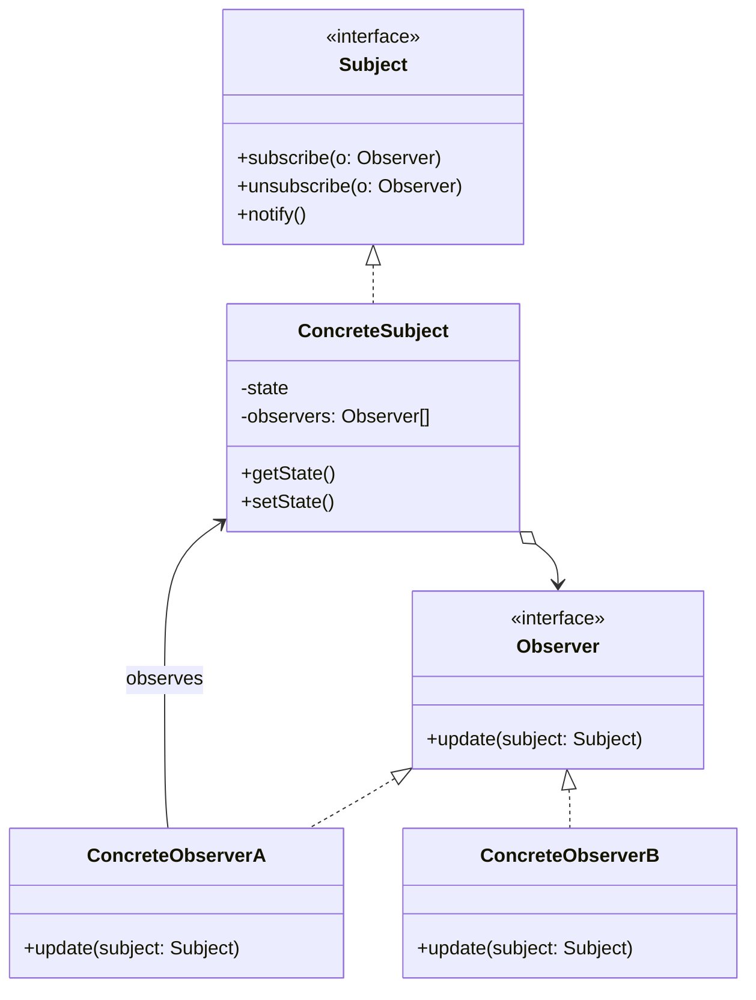

# Observer Pattern

## Overview

The **Observer** pattern is a behavioral design pattern that establishes a one-to-many subscription mechanism between objects. When the object being observed (the **Subject** or Publisher) changes its state, it automatically notifies all registered dependents (the **Observers** or Subscribers).

**Key advantage**: It enables dynamic, loose coupling. The Subject doesn't need to know anything about the classes that observe it, allowing you to add or remove listeners at runtime without altering the core logic.

**Modern perspective**: The Observer pattern is the undisputed foundation of modern reactive programming, UI frameworks (React, Vue, Swift UI), Event Buses, WebSockets, and Pub/Sub messaging systems (Kafka, RabbitMQ). 

## The Problem

Imagine you are building a Stock Market application. You have a `Stock` object representing the price of Apple (AAPL). 
You also have several UI components: a Portfolio Dashboard, a Line Chart, and an Email Alert system.

How do the UI components know when the stock price changes?

```typescript
// ❌ Bad: Tightly coupled, polling, and hardcoded
class LineChart {
  constructor(private stock: Stock) {
    // Inefficient polling: checking every second
    setInterval(() => {
      this.draw(stock.getPrice());
    }, 1000);
  }
}

class Stock {
  private price: number;
  // If we try to push data, we tightly couple to specific classes
  constructor(private chart: LineChart, private emailer: EmailAlert) {}

  updatePrice(newPrice: number) {
    this.price = newPrice;
    this.chart.draw(this.price);    // Hardcoded!
    this.emailer.send(this.price);  // Hardcoded!
    // Every time we add a new feature, we must modify the Stock class.
  }
}
```

If we use polling, we waste CPU cycles. If we hardcode the updates into the `Stock` class, we violate the Open/Closed Principle. The `Stock` class should handle financial data, not UI rendering and emails.

## The Solution

The Observer pattern dictates that the Subject should maintain a list of Observers and provide methods to `subscribe` and `unsubscribe`.

1. **The Subject** keeps an array of references to objects that implement a common `Observer` interface.
2. Whenever the Subject's state changes, it iterates over this array and calls a specific notification method (e.g., `update()`) on each Observer.
3. **The Observers** contain the actual business logic for how to react to the change.

## Structure



## Flow

1. **ConcreteObserver** registers itself with the **ConcreteSubject** via `subject.subscribe(this)`.
2. Some internal or external event causes the **ConcreteSubject**'s state to change.
3. The **ConcreteSubject** calls its own `notify()` method.
4. The `notify()` method loops through the list of registered observers and calls `observer.update(this)`.
5. The **ConcreteObserver** extracts the new state from the subject and reacts accordingly.

## Real-World Analogy

Think of a **YouTube Channel Subscription**.
When a creator (the **Subject**) uploads a new video, they do not manually send a personal email to every single viewer. Instead, viewers (the **Observers**) click the "Subscribe" button. 
YouTube maintains the list of subscribers. When a new video is published, the system automatically sends a notification to everyone on that list. Viewers can unsubscribe at any time if they no longer wish to receive updates.

## Step-by-Step Implementation

1. **Define the Observer Interface**: Typically contains a single method like `update(context)`.
2. **Define the Subject Interface**: Contains methods for adding, removing, and notifying observers.
3. **Implement Concrete Subject**: Needs a list to store observers and a state to monitor. When state changes, loop over the list and call `update`.
4. **Implement Concrete Observers**: Implement the `update` method to execute the desired reaction.

## Code Examples

We will build a simple `Newsletter` publisher. Various subscribers (a generic User, and a Corporate Archiver) will listen for new articles.

::: code-group

```typescript [TypeScript]
// 1. Observer Interface
interface Subscriber {
  update(publisher: Newsletter): void;
}

// 2. Subject Interface
interface Publisher {
  subscribe(s: Subscriber): void;
  unsubscribe(s: Subscriber): void;
  notifySubscribers(): void;
}

// 3. Concrete Subject
class Newsletter implements Publisher {
  private subscribers: Subscriber[] = [];
  private latestArticle: string = "";

  subscribe(s: Subscriber): void {
    if (!this.subscribers.includes(s)) {
      this.subscribers.push(s);
    }
  }

  unsubscribe(s: Subscriber): void {
    const index = this.subscribers.indexOf(s);
    if (index > -1) {
      this.subscribers.splice(index, 1);
    }
  }

  notifySubscribers(): void {
    for (const sub of this.subscribers) {
      sub.update(this);
    }
  }

  // Business Logic
  publishArticle(title: string): void {
    console.log(`\n📰 Newsletter: Publishing new article - "${title}"`);
    this.latestArticle = title;
    this.notifySubscribers();
  }

  getLatestArticle(): string {
    return this.latestArticle;
  }
}

// 4. Concrete Observers
class EmailSubscriber implements Subscriber {
  constructor(private email: string) {}

  update(publisher: Newsletter): void {
    console.log(`[Email to ${this.email}]: Read our new article "${publisher.getLatestArticle()}"`);
  }
}

class CorporateArchive implements Subscriber {
  update(publisher: Newsletter): void {
    console.log(`[Archive System]: Saving "${publisher.getLatestArticle()}" to database.`);
  }
}

// 5. Client
const techNewsletter = new Newsletter();

const alice = new EmailSubscriber("alice@example.com");
const bob = new EmailSubscriber("bob@example.com");
const archiver = new CorporateArchive();

techNewsletter.subscribe(alice);
techNewsletter.subscribe(bob);
techNewsletter.subscribe(archiver);

// Trigger updates
techNewsletter.publishArticle("The Future of AI");

console.log("\n(Bob unsubscribes)\n");
techNewsletter.unsubscribe(bob);

techNewsletter.publishArticle("TypeScript 6.0 Released");
```

```python [Python]
from abc import ABC, abstractmethod
from typing import List

# 1. Observer Interface
class Subscriber(ABC):
    @abstractmethod
    def update(self, publisher: 'Newsletter') -> None:
        pass

# 2. Subject Interface
class Publisher(ABC):
    @abstractmethod
    def subscribe(self, s: Subscriber) -> None:
        pass

    @abstractmethod
    def unsubscribe(self, s: Subscriber) -> None:
        pass

    @abstractmethod
    def notify_subscribers(self) -> None:
        pass

# 3. Concrete Subject
class Newsletter(Publisher):
    def __init__(self):
        self._subscribers: List[Subscriber] = []
        self._latest_article: str = ""

    def subscribe(self, s: Subscriber) -> None:
        if s not in self._subscribers:
            self._subscribers.append(s)

    def unsubscribe(self, s: Subscriber) -> None:
        if s in self._subscribers:
            self._subscribers.remove(s)

    def notify_subscribers(self) -> None:
        for sub in self._subscribers:
            sub.update(self)

    # Business Logic
    def publish_article(self, title: str) -> None:
        print(f"\n📰 Newsletter: Publishing new article - \"{title}\"")
        self._latest_article = title
        self.notify_subscribers()

    def get_latest_article(self) -> str:
        return self._latest_article

# 4. Concrete Observers
class EmailSubscriber(Subscriber):
    def __init__(self, email: str):
        self.email = email

    def update(self, publisher: Newsletter) -> None:
        print(f"[Email to {self.email}]: Read our new article \"{publisher.get_latest_article()}\"")

class CorporateArchive(Subscriber):
    def update(self, publisher: Newsletter) -> None:
        print(f"[Archive System]: Saving \"{publisher.get_latest_article()}\" to database.")

# 5. Client
if __name__ == "__main__":
    tech_newsletter = Newsletter()

    alice = EmailSubscriber("alice@example.com")
    bob = EmailSubscriber("bob@example.com")
    archiver = CorporateArchive()

    tech_newsletter.subscribe(alice)
    tech_newsletter.subscribe(bob)
    tech_newsletter.subscribe(archiver)

    tech_newsletter.publish_article("The Future of AI")

    print("\n(Bob unsubscribes)\n")
    tech_newsletter.unsubscribe(bob)

    tech_newsletter.publish_article("Python 4.0 Released")
```

```java [Java]
import java.util.ArrayList;
import java.util.List;

// 1. Observer Interface
interface Subscriber {
    void update(Newsletter publisher);
}

// 2. Subject Interface
interface Publisher {
    void subscribe(Subscriber s);
    void unsubscribe(Subscriber s);
    void notifySubscribers();
}

// 3. Concrete Subject
class Newsletter implements Publisher {
    private List<Subscriber> subscribers = new ArrayList<>();
    private String latestArticle = "";

    @Override
    public void subscribe(Subscriber s) {
        if (!subscribers.contains(s)) {
            subscribers.add(s);
        }
    }

    @Override
    public void unsubscribe(Subscriber s) {
        subscribers.remove(s);
    }

    @Override
    public void notifySubscribers() {
        // Create a copy to avoid ConcurrentModificationException if someone unsubscribes during iteration
        List<Subscriber> copy = new ArrayList<>(subscribers);
        for (Subscriber sub : copy) {
            sub.update(this);
        }
    }

    public void publishArticle(String title) {
        System.out.println("\n📰 Newsletter: Publishing new article - \"" + title + "\"");
        this.latestArticle = title;
        notifySubscribers();
    }

    public String getLatestArticle() {
        return latestArticle;
    }
}

// 4. Concrete Observers
class EmailSubscriber implements Subscriber {
    private String email;

    public EmailSubscriber(String email) {
        this.email = email;
    }

    @Override
    public void update(Newsletter publisher) {
        System.out.println("[Email to " + email + "]: Read our new article \"" + publisher.getLatestArticle() + "\"");
    }
}

class CorporateArchive implements Subscriber {
    @Override
    public void update(Newsletter publisher) {
        System.out.println("[Archive System]: Saving \"" + publisher.getLatestArticle() + "\" to database.");
    }
}

// 5. Client
public class ObserverDemo {
    public static void main(String[] args) {
        Newsletter techNewsletter = new Newsletter();

        Subscriber alice = new EmailSubscriber("alice@example.com");
        Subscriber bob = new EmailSubscriber("bob@example.com");
        Subscriber archiver = new CorporateArchive();

        techNewsletter.subscribe(alice);
        techNewsletter.subscribe(bob);
        techNewsletter.subscribe(archiver);

        techNewsletter.publishArticle("The Future of AI");

        System.out.println("\n(Bob unsubscribes)\n");
        techNewsletter.unsubscribe(bob);

        techNewsletter.publishArticle("Java 25 Released");
    }
}
```

```go [Go]
package main

import "fmt"

// 1. Observer Interface
type Subscriber interface {
	Update(publisher *Newsletter)
}

// 2. Concrete Subject
type Newsletter struct {
	subscribers   []Subscriber
	latestArticle string
}

func (n *Newsletter) Subscribe(s Subscriber) {
	n.subscribers = append(n.subscribers, s)
}

func (n *Newsletter) Unsubscribe(s Subscriber) {
	for i, sub := range n.subscribers {
		if sub == s {
			n.subscribers = append(n.subscribers[:i], n.subscribers[i+1:]...)
			break
		}
	}
}

func (n *Newsletter) NotifySubscribers() {
	for _, sub := range n.subscribers {
		sub.Update(n)
	}
}

func (n *Newsletter) PublishArticle(title string) {
	fmt.Printf("\n📰 Newsletter: Publishing new article - \"%s\"\n", title)
	n.latestArticle = title
	n.NotifySubscribers()
}

func (n *Newsletter) GetLatestArticle() string {
	return n.latestArticle
}

// 3. Concrete Observers
type EmailSubscriber struct {
	email string
}

func (e *EmailSubscriber) Update(publisher *Newsletter) {
	fmt.Printf("[Email to %s]: Read our new article \"%s\"\n", e.email, publisher.GetLatestArticle())
}

type CorporateArchive struct{}

func (c *CorporateArchive) Update(publisher *Newsletter) {
	fmt.Printf("[Archive System]: Saving \"%s\" to database.\n", publisher.GetLatestArticle())
}

// 4. Client
func main() {
	techNewsletter := &Newsletter{}

	alice := &EmailSubscriber{email: "alice@example.com"}
	bob := &EmailSubscriber{email: "bob@example.com"}
	archiver := &CorporateArchive{}

	techNewsletter.Subscribe(alice)
	techNewsletter.Subscribe(bob)
	techNewsletter.Subscribe(archiver)

	techNewsletter.PublishArticle("The Future of AI")

	fmt.Println("\n(Bob unsubscribes)")
	techNewsletter.Unsubscribe(bob)

	techNewsletter.PublishArticle("Go 1.30 Released")
}
```

```rust [Rust]
use std::cell::RefCell;
use std::rc::Rc;

// 1. Observer Trait
trait Subscriber {
    fn update(&self, latest_article: &str);
}

// 2. Concrete Subject
struct Newsletter {
    // We use Rc to hold references to Observers.
    // In multithreaded Rust, you'd use Arc<Mutex<dyn Subscriber + Send + Sync>>
    subscribers: Vec<Rc<dyn Subscriber>>,
    latest_article: String,
}

impl Newsletter {
    fn new() -> Self {
        Self {
            subscribers: Vec::new(),
            latest_article: String::new(),
        }
    }

    fn subscribe(&mut self, s: Rc<dyn Subscriber>) {
        self.subscribers.push(s);
    }

    // Unsubscribing in Rust via pointers requires unique IDs or Rc::ptr_eq
    // For simplicity, we omit unsubscribe in this basic trait setup, 
    // but in production you would hand out subscription IDs.

    fn notify_subscribers(&self) {
        for sub in &self.subscribers {
            // Note: We pass the state directly to avoid borrowing issues (Push model)
            sub.update(&self.latest_article);
        }
    }

    fn publish_article(&mut self, title: &str) {
        println!("\n📰 Newsletter: Publishing new article - \"{}\"", title);
        self.latest_article = title.to_string();
        self.notify_subscribers();
    }
}

// 3. Concrete Observers
struct EmailSubscriber {
    email: String,
}

impl Subscriber for EmailSubscriber {
    fn update(&self, latest_article: &str) {
        println!("[Email to {}]: Read our new article \"{}\"", self.email, latest_article);
    }
}

struct CorporateArchive;

impl Subscriber for CorporateArchive {
    fn update(&self, latest_article: &str) {
        println!("[Archive System]: Saving \"{}\" to database.", latest_article);
    }
}

// 4. Client
fn main() {
    let mut tech_newsletter = Newsletter::new();

    let alice = Rc::new(EmailSubscriber { email: "alice@example.com".into() });
    let bob = Rc::new(EmailSubscriber { email: "bob@example.com".into() });
    let archiver = Rc::new(CorporateArchive);

    tech_newsletter.subscribe(alice);
    tech_newsletter.subscribe(bob);
    tech_newsletter.subscribe(archiver);

    tech_newsletter.publish_article("The Future of AI");
    tech_newsletter.publish_article("Rust 2.0 Released");
}
```

:::

## Pros and Cons

### Advantages
- **Open/Closed Principle**: You can introduce new subscriber classes without having to change the publisher's code.
- **Loose Coupling**: The publisher only knows that an observer implements a specific interface. It doesn't know the concrete class.
- **Dynamic Subscriptions**: You can establish relations between objects at runtime.

### Disadvantages
- **Memory Leaks (The Lapsed Listener Problem)**: If an observer is subscribed but never unsubscribed, the publisher holds a strong reference to it, preventing garbage collection. This is a notorious cause of memory leaks in Java/C#/UI programming.
- **Unpredictable Order**: Observers are notified in a random/sequential order. If observers depend on each other, this leads to chaos.
- **Cascade Updates**: If an observer updates the subject in response to an update, you can easily trigger an infinite loop of notifications.

## When to Use

- **Event-Driven Architectures**: When changes to the state of one object may need to change other objects, and the actual set of objects is unknown beforehand or changes dynamically.
- **UI Data Binding**: When binding a Model to a View, the View should observe the Model and re-render when the Model changes.
- **Pub/Sub Messaging**: When you need to broadcast a message to multiple parts of an application simultaneously.

## When NOT to Use

- **Sequential Data Pipelines**: If you need strict control over the execution order (Step A -> Step B -> Step C), use the **Chain of Responsibility** or a dedicated workflow engine.
- **Complex Coordination**: If multiple publishers and subscribers are getting tangled, you should upgrade to the **Mediator** pattern to centralize the logic.

## Common Mistakes

### 1. The Lapsed Listener Problem (Memory Leak)
Failing to unsubscribe an observer when it is destroyed. 
**Fix**: Use Weak References (like `WeakReference` in Java or `WeakMap`/`WeakRef` in JS) for storing observers, or ensure components explicitly unsubscribe in their teardown/destructor lifecycle methods (e.g., `useEffect` cleanup in React).

### 2. Pushing Too Much Data (or Too Little)
- **Push Model**: The subject passes all its data to the observer (`update(data)`). This couples the observer to the exact data structure.
- **Pull Model**: The subject passes a reference to itself (`update(this)`), and the observer queries what it needs. This is usually preferred, but requires the subject to expose public getter methods.

## Related Patterns

- **Mediator**: Centralizes communication. Instead of objects observing each other directly, they observe the Mediator.
- **Singleton**: Often, the Subject (like an Event Bus) is implemented as a Singleton so it can be accessed globally.
- **Command**: Observers often execute Commands in response to receiving a notification.

## Interview Insights

- **Question**: "What is the difference between Observer and Pub/Sub?"
  - **Answer**: "In the classic Observer pattern, the Subject and Observer are aware of each other (the Subject holds a list of Observers). In Publish/Subscribe, there is a third component—the Event Bus or Message Broker. Publishers push to the Broker, and Subscribers pull from the Broker. They are completely decoupled."
- **Question**: "How do you prevent memory leaks in the Observer pattern?"
  - **Answer**: "Ensure that the `unsubscribe()` method is called when an observer is destroyed, or use Weak References in the Subject's observer list so the Garbage Collector can clean up dead observers."

## Modern Alternatives

- **Reactive Extensions (RxJS, RxJava)**: Advanced, composable implementations of the Observer pattern that allow filtering, mapping, and merging streams of events.
- **Event Emitters / Event Targets**: Built into Node.js (`EventEmitter`) and the Browser DOM (`EventTarget`), these are highly optimized native implementations.
- **Signals / Observables (Vue, SolidJS, Angular, MobX)**: Modern frontend frameworks use reactive primitives (Signals) that automatically track subscriptions when read, removing the need for manual `subscribe`/`unsubscribe` calls entirely.
