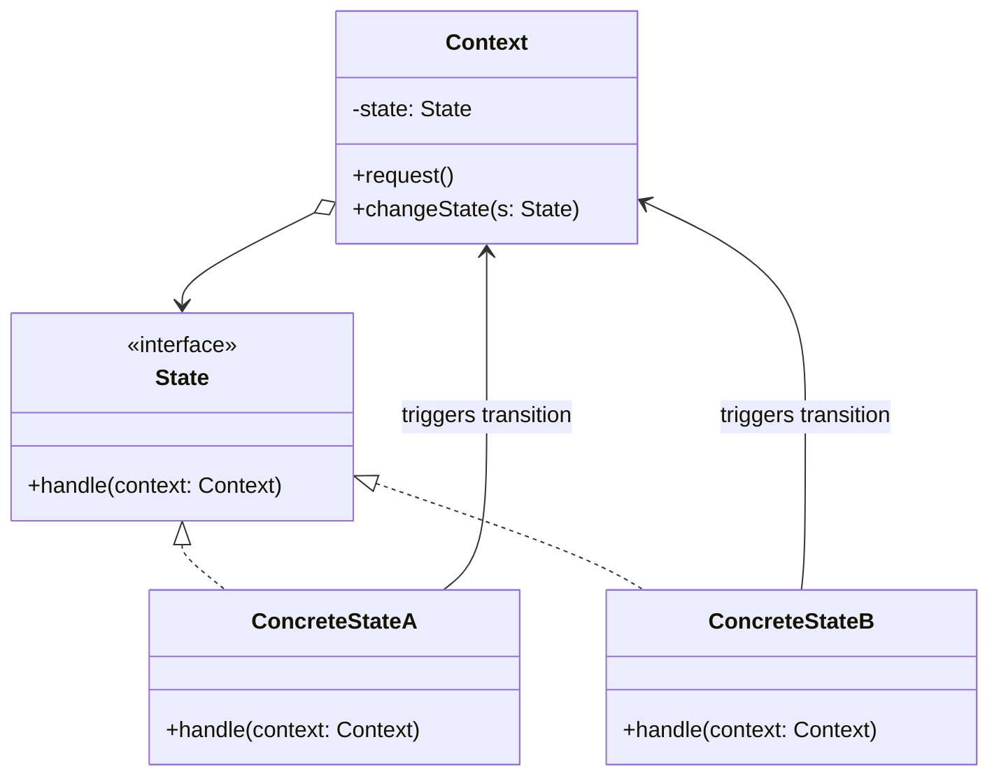

# State Pattern

## Overview

The **State** pattern is a behavioral design pattern that allows an object to alter its behavior when its internal state changes. It appears as if the object has changed its class.

**Key advantage**: It extracts state-specific behaviors from massive `switch/case` or `if/else` conditionals into separate, dedicated State classes.

**Modern perspective**: The classic Object-Oriented State pattern is an implementation of a Finite State Machine (FSM). While UI frameworks (like React or Vue) often use functional or declarative state management (e.g., XState, Redux), the underlying concept—that an entity's response to an event strictly depends on its current state—remains universally applicable.

## The Problem

Imagine you are building the software for a **Vending Machine**.

A Vending Machine has distinct states: `Idle`, `HasCoin`, `Dispensing`, and `OutOfStock`.
When a user presses the "Dispense" button, the machine's behavior depends entirely on its state:

- If `Idle`: "Please insert a coin."
- If `HasCoin`: "Dispensing your item."
- If `Dispensing`: "Please wait, already dispensing."
- If `OutOfStock`: "Cannot dispense, out of stock."

```typescript
// ❌ Bad: Massive switch statements everywhere
class VendingMachine {
  private state = "IDLE";

  insertCoin() {
    switch (this.state) {
      case "IDLE":
        this.state = "HAS_COIN";
        break;
      case "HAS_COIN":
        console.log("Coin already inserted.");
        break;
      // ... more cases ...
    }
  }

  dispense() {
    switch (this.state) {
      case "IDLE":
        console.log("Insert coin first.");
        break;
      case "HAS_COIN":
        this.state = "DISPENSING";
        // dispense logic
        break;
      // ... more cases ...
    }
  }
}
```

This code is fragile. If you add a new state (e.g., `MaintenanceMode`), you must hunt down every single `switch` statement in the `VendingMachine` class and add a new `case`. This violates the Open/Closed Principle.

## The Solution

The State pattern suggests that you should create new classes for all possible states of an object and extract all state-specific behaviors into these classes.

1. **Context**: The original object (`VendingMachine`). It maintains a reference to a `State` object.
2. **State Interface**: Defines the methods that every concrete state must implement (e.g., `insertCoin()`, `dispense()`).
3. **Concrete States**: Classes representing each state (`IdleState`, `HasCoinState`, etc.). They implement the behavior specific to that state.

When the `Context` receives a request, it delegates the work to its current `State` object.

## Structure



## Flow

1. The **Context** is initialized with an initial **ConcreteState**.
2. The client calls a method on the **Context** (e.g., `vendingMachine.dispense()`).
3. The **Context** delegates this to the current state: `this.state.dispense(this)`.
4. The **ConcreteState** performs the action.
5. If a state transition is required, the **ConcreteState** calls `context.changeState(new NextState())`.

## Real-World Analogy

Think of a **Smartphone**.
If your phone is in the **Unlocked** state, pressing the Home button goes to the home screen.
If your phone is in the **Locked** state, pressing the Home button wakes up the screen to show the unlock prompt.
If your phone is in the **Camera** state, pressing the Home button exits the camera.
The hardware button (the action) is exactly the same, but the behavior changes completely based on the internal state of the OS.

## Step-by-Step Implementation

1. **Define the State Interface**: Mirror the methods of the Context that depend on state.
2. **Create Concrete State Classes**: Implement the interface for every specific state.
3. **Modify the Context**: Add a private field to hold the current State. Add a `changeState(State)` method.
4. **Delegate to the State**: In the Context's methods, delegate execution to `this.state.method(this)`.
5. **Implement Transitions**: Decide whether the Context or the Concrete States initiate transitions. Usually, the Concrete States handle transitions by calling `context.changeState()`.

## Code Examples

Let's implement a **Document Publishing Workflow**. A Document can be `Draft`, `Moderation`, or `Published`. Only admins can publish directly; authors must go through moderation.

::: code-group

```typescript [TypeScript]
// 1. Context
class Document {
  private state!: State;
  public currentUserRole: string;

  constructor(role: string) {
    this.currentUserRole = role;
    this.changeState(new DraftState());
  }

  changeState(state: State): void {
    this.state = state;
    this.state.setContext(this);
  }

  // Delegation
  publish(): void {
    this.state.publish();
  }

  reject(): void {
    this.state.reject();
  }
}

// 2. State Base / Interface
abstract class State {
  protected context!: Document;

  setContext(context: Document) {
    this.context = context;
  }

  abstract publish(): void;
  abstract reject(): void;
}

// 3. Concrete States
class DraftState extends State {
  publish(): void {
    if (this.context.currentUserRole === "admin") {
      console.log("Draft -> Published (Admin override)");
      this.context.changeState(new PublishedState());
    } else {
      console.log("Draft -> Moderation");
      this.context.changeState(new ModerationState());
    }
  }

  reject(): void {
    console.log("Drafts cannot be rejected.");
  }
}

class ModerationState extends State {
  publish(): void {
    if (this.context.currentUserRole === "admin") {
      console.log("Moderation -> Published");
      this.context.changeState(new PublishedState());
    } else {
      console.log("Only admins can approve documents in moderation.");
    }
  }

  reject(): void {
    if (this.context.currentUserRole === "admin") {
      console.log("Moderation -> Draft (Rejected by admin)");
      this.context.changeState(new DraftState());
    } else {
      console.log("Only admins can reject documents.");
    }
  }
}

class PublishedState extends State {
  publish(): void {
    console.log("Document is already published.");
  }

  reject(): void {
    console.log("Published -> Draft (Retracted)");
    this.context.changeState(new DraftState());
  }
}

// 4. Client
const doc = new Document("author");

console.log("\n--- Author Actions ---");
doc.publish(); // Draft -> Moderation
doc.publish(); // Fails: Only admins can approve

doc.currentUserRole = "admin";
console.log("\n--- Admin Actions ---");
doc.reject(); // Moderation -> Draft
doc.publish(); // Draft -> Published (Admin override)
```

```python [Python]
from __future__ import annotations
from abc import ABC, abstractmethod

# 1. State Interface
class State(ABC):
    @property
    def context(self) -> Document:
        return self._context

    @context.setter
    def context(self, context: Document) -> None:
        self._context = context

    @abstractmethod
    def publish(self) -> None:
        pass

    @abstractmethod
    def reject(self) -> None:
        pass

# 2. Context
class Document:
    def __init__(self, role: str):
        self.current_user_role = role
        # Initialize state
        self.change_state(DraftState())

    def change_state(self, state: State) -> None:
        self._state = state
        self._state.context = self

    def publish(self) -> None:
        self._state.publish()

    def reject(self) -> None:
        self._state.reject()

# 3. Concrete States
class DraftState(State):
    def publish(self) -> None:
        if self.context.current_user_role == "admin":
            print("Draft -> Published (Admin override)")
            self.context.change_state(PublishedState())
        else:
            print("Draft -> Moderation")
            self.context.change_state(ModerationState())

    def reject(self) -> None:
        print("Drafts cannot be rejected.")

class ModerationState(State):
    def publish(self) -> None:
        if self.context.current_user_role == "admin":
            print("Moderation -> Published")
            self.context.change_state(PublishedState())
        else:
            print("Only admins can approve documents in moderation.")

    def reject(self) -> None:
        if self.context.current_user_role == "admin":
            print("Moderation -> Draft (Rejected by admin)")
            self.context.change_state(DraftState())
        else:
            print("Only admins can reject documents.")

class PublishedState(State):
    def publish(self) -> None:
        print("Document is already published.")

    def reject(self) -> None:
        print("Published -> Draft (Retracted)")
        self.context.change_state(DraftState())

# 4. Client
if __name__ == "__main__":
    doc = Document("author")

    print("\n--- Author Actions ---")
    doc.publish() # Draft -> Moderation
    doc.publish() # Fails

    doc.current_user_role = "admin"
    print("\n--- Admin Actions ---")
    doc.reject()  # Moderation -> Draft
    doc.publish() # Draft -> Published
```

```java [Java]
// 1. Context
class Document {
    private State state;
    private String currentUserRole;

    public Document(String role) {
        this.currentUserRole = role;
        changeState(new DraftState());
    }

    public void changeState(State state) {
        this.state = state;
        this.state.setContext(this);
    }

    public String getCurrentUserRole() { return currentUserRole; }
    public void setCurrentUserRole(String role) { this.currentUserRole = role; }

    public void publish() { state.publish(); }
    public void reject() { state.reject(); }
}

// 2. State Base
abstract class State {
    protected Document context;

    public void setContext(Document context) {
        this.context = context;
    }

    public abstract void publish();
    public abstract void reject();
}

// 3. Concrete States
class DraftState extends State {
    @Override
    public void publish() {
        if ("admin".equals(context.getCurrentUserRole())) {
            System.out.println("Draft -> Published (Admin override)");
            context.changeState(new PublishedState());
        } else {
            System.out.println("Draft -> Moderation");
            context.changeState(new ModerationState());
        }
    }

    @Override
    public void reject() {
        System.out.println("Drafts cannot be rejected.");
    }
}

class ModerationState extends State {
    @Override
    public void publish() {
        if ("admin".equals(context.getCurrentUserRole())) {
            System.out.println("Moderation -> Published");
            context.changeState(new PublishedState());
        } else {
            System.out.println("Only admins can approve documents in moderation.");
        }
    }

    @Override
    public void reject() {
        if ("admin".equals(context.getCurrentUserRole())) {
            System.out.println("Moderation -> Draft (Rejected by admin)");
            context.changeState(new DraftState());
        } else {
            System.out.println("Only admins can reject documents.");
        }
    }
}

class PublishedState extends State {
    @Override
    public void publish() {
        System.out.println("Document is already published.");
    }

    @Override
    public void reject() {
        System.out.println("Published -> Draft (Retracted)");
        context.changeState(new DraftState());
    }
}

// 4. Client
public class StateDemo {
    public static void main(String[] args) {
        Document doc = new Document("author");

        System.out.println("\n--- Author Actions ---");
        doc.publish(); // Draft -> Moderation
        doc.publish(); // Fails

        doc.setCurrentUserRole("admin");
        System.out.println("\n--- Admin Actions ---");
        doc.reject();  // Moderation -> Draft
        doc.publish(); // Draft -> Published
    }
}
```

```go [Go]
package main

import "fmt"

// 1. State Interface
type State interface {
	Publish(doc *Document)
	Reject(doc *Document)
}

// 2. Context
type Document struct {
	state           State
	CurrentUserRole string
}

func NewDocument(role string) *Document {
	doc := &Document{
		CurrentUserRole: role,
	}
	// Initial state
	doc.SetState(&DraftState{})
	return doc
}

func (d *Document) SetState(s State) {
	d.state = s
}

func (d *Document) Publish() {
	d.state.Publish(d)
}

func (d *Document) Reject() {
	d.state.Reject(d)
}

// 3. Concrete States
type DraftState struct{}

func (s *DraftState) Publish(doc *Document) {
	if doc.CurrentUserRole == "admin" {
		fmt.Println("Draft -> Published (Admin override)")
		doc.SetState(&PublishedState{})
	} else {
		fmt.Println("Draft -> Moderation")
		doc.SetState(&ModerationState{})
	}
}

func (s *DraftState) Reject(doc *Document) {
	fmt.Println("Drafts cannot be rejected.")
}

type ModerationState struct{}

func (s *ModerationState) Publish(doc *Document) {
	if doc.CurrentUserRole == "admin" {
		fmt.Println("Moderation -> Published")
		doc.SetState(&PublishedState{})
	} else {
		fmt.Println("Only admins can approve documents in moderation.")
	}
}

func (s *ModerationState) Reject(doc *Document) {
	if doc.CurrentUserRole == "admin" {
		fmt.Println("Moderation -> Draft (Rejected by admin)")
		doc.SetState(&DraftState{})
	} else {
		fmt.Println("Only admins can reject documents.")
	}
}

type PublishedState struct{}

func (s *PublishedState) Publish(doc *Document) {
	fmt.Println("Document is already published.")
}

func (s *PublishedState) Reject(doc *Document) {
	fmt.Println("Published -> Draft (Retracted)")
	doc.SetState(&DraftState{})
}

// 4. Client
func main() {
	doc := NewDocument("author")

	fmt.Println("\n--- Author Actions ---")
	doc.Publish() // Draft -> Moderation
	doc.Publish() // Fails

	doc.CurrentUserRole = "admin"
	fmt.Println("\n--- Admin Actions ---")
	doc.Reject()  // Moderation -> Draft
	doc.Publish() // Draft -> Published
}
```

```rust [Rust]
// 1. State Trait
// In Rust, using Option<Box<dyn State>> allows us to take ownership of the State
// during a transition, moving out of the Context.
trait State {
    fn publish(self: Box<Self>, doc: &mut Document) -> Box<dyn State>;
    fn reject(self: Box<Self>, doc: &mut Document) -> Box<dyn State>;
}

// 2. Context
struct Document {
    state: Option<Box<dyn State>>,
    pub current_user_role: String,
}

impl Document {
    fn new(role: &str) -> Self {
        Self {
            state: Some(Box::new(DraftState)),
            current_user_role: role.to_string(),
        }
    }

    fn publish(&mut self) {
        if let Some(state) = self.state.take() {
            self.state = Some(state.publish(self));
        }
    }

    fn reject(&mut self) {
        if let Some(state) = self.state.take() {
            self.state = Some(state.reject(self));
        }
    }
}

// 3. Concrete States
struct DraftState;

impl State for DraftState {
    fn publish(self: Box<Self>, doc: &mut Document) -> Box<dyn State> {
        if doc.current_user_role == "admin" {
            println!("Draft -> Published (Admin override)");
            Box::new(PublishedState)
        } else {
            println!("Draft -> Moderation");
            Box::new(ModerationState)
        }
    }

    fn reject(self: Box<Self>, _doc: &mut Document) -> Box<dyn State> {
        println!("Drafts cannot be rejected.");
        self // Stay in DraftState
    }
}

struct ModerationState;

impl State for ModerationState {
    fn publish(self: Box<Self>, doc: &mut Document) -> Box<dyn State> {
        if doc.current_user_role == "admin" {
            println!("Moderation -> Published");
            Box::new(PublishedState)
        } else {
            println!("Only admins can approve documents in moderation.");
            self // Stay in ModerationState
        }
    }

    fn reject(self: Box<Self>, doc: &mut Document) -> Box<dyn State> {
        if doc.current_user_role == "admin" {
            println!("Moderation -> Draft (Rejected by admin)");
            Box::new(DraftState)
        } else {
            println!("Only admins can reject documents.");
            self // Stay in ModerationState
        }
    }
}

struct PublishedState;

impl State for PublishedState {
    fn publish(self: Box<Self>, _doc: &mut Document) -> Box<dyn State> {
        println!("Document is already published.");
        self // Stay in PublishedState
    }

    fn reject(self: Box<Self>, _doc: &mut Document) -> Box<dyn State> {
        println!("Published -> Draft (Retracted)");
        Box::new(DraftState)
    }
}

// 4. Client
fn main() {
    let mut doc = Document::new("author");

    println!("\n--- Author Actions ---");
    doc.publish(); // Draft -> Moderation
    doc.publish(); // Fails

    doc.current_user_role = "admin".into();
    println!("\n--- Admin Actions ---");
    doc.reject();  // Moderation -> Draft
    doc.publish(); // Draft -> Published
}
```

:::

## Pros and Cons

### Advantages

- **Single Responsibility Principle**: Organizes code related to particular states into separate classes.
- **Open/Closed Principle**: Introduce new states without changing existing state classes or the context.
- **Simplifies Context**: Eliminates massive `switch/case` or `if/else` conditional logic in the Context class.

### Disadvantages

- **Class Explosion**: If you only have two simple states that rarely change, creating a full State hierarchy is severe overengineering.
- **State Transition Logic**: Deciding _where_ state transitions occur (in Context vs. State classes) can lead to tightly coupled State classes if they are forced to know about each other.

## When to Use

- **Object Behavior Changes Based on State**: An object behaves differently depending on its current state, the number of states is large, and the state-specific code changes frequently.
- **Massive Conditionals**: When you have a class cluttered with massive conditionals that alter how the class behaves based on the values of the class's fields.

## When NOT to Use

- **Simple States**: If you only have two or three simple states (e.g., `isOn` true/false), stick to basic boolean flags.
- **Strict Linear Workflows**: If transitions are strictly linear and process data in steps, the **Chain of Responsibility** or **Pipes and Filters** pattern might be more appropriate.

## Common Mistakes

### 1. Hardcoding Transitions in the Context

If the Context determines the next state (using conditionals), you haven't fully utilized the pattern. Transitions are usually best managed by the Concrete States themselves.

### 2. Creating State Instances Repeatedly

If state objects have no fields (they rely entirely on the Context for data), they can be implemented as Singletons or static instances to avoid excessive memory allocation during transitions. (Note: Our Rust example moves states to avoid allocations entirely).

## Related Patterns

- **Strategy**: Strategy and State share an identical class structure. The difference is intent: Strategy provides completely different ways to do the _same_ thing, while State allows an object to do _different_ things depending on its state. Strategies usually don't know about each other; States often instantiate other states to transition.
- **Singleton**: Concrete states are often implemented as Singletons if they carry no instance data.
- **State Machine**: The State pattern is an object-oriented way to implement a Finite State Machine (FSM).

## Interview Insights

- **Question**: "What is the structural difference between Strategy and State?"
  - **Answer**: "Structurally, they are identical (a Context delegates to an Interface). Semantically, they are opposite. Strategies are independent and unaware of each other. States represent the lifecycle of an object and are intimately aware of each other, constantly triggering transitions from one State to the next."
- **Question**: "How do you handle state data?"
  - **Answer**: "State data should remain in the Context object. The State classes should ideally be stateless behavioral wrappers. They accept the Context as an argument to read or modify the data."

## Modern Alternatives

- **Functional State Machines (XState)**: In the modern frontend ecosystem (JavaScript/TypeScript), object-oriented State patterns are often replaced by dedicated State Machine libraries like XState, which declare transitions, guards, and actions in a pure, functional JSON configuration.
- **Union Types / Algebraic Data Types**: In languages like Rust, TypeScript, and Swift, you can represent states as an Enum or Union type, and use exhaustive Pattern Matching (`match` or `switch`) instead of polymorphism. For many teams, this is cleaner than creating dozens of classes.
