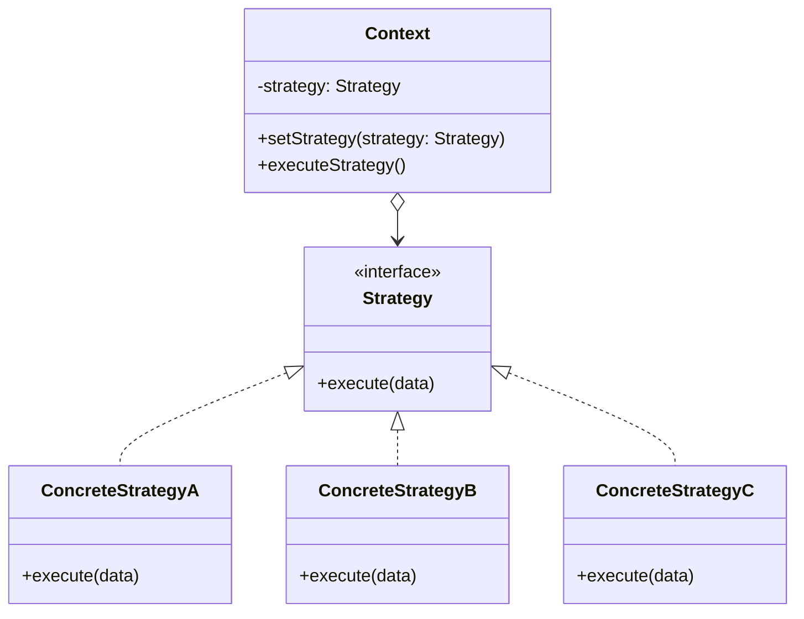

# Strategy Pattern


## Overview

The **Strategy** pattern is a behavioral design pattern that lets you define a family of algorithms, put each of them into a separate class, and make their objects interchangeable.

**Key advantage**: It isolates the business logic of a class from the implementation details of algorithms that may not be that important in the context of that logic.

**Modern perspective**: The Strategy pattern is incredibly common. In modern functional languages, Strategy is often simplified by simply passing "First-Class Functions" (callbacks/closures) instead of full classes. However, in complex enterprise architectures, encapsulating strategies into classes provides necessary structure, dependency injection capabilities, and testability.

## The Problem

Imagine you are building a Navigation app. At first, it only provides routing for cars. It works great.

Then, you decide to add walking routes. The code grows.
Then, you add public transport. The code grows more.
Then, you add cycling routes.

```typescript
// ❌ Bad: Massive conditional logic
class Navigator {
  buildRoute(start: Point, end: Point, transportType: string) {
    if (transportType === "car") {
      // 500 lines of complex car routing logic
    } else if (transportType === "walking") {
      // 400 lines of walking logic
    } else if (transportType === "transit") {
      // 600 lines of transit logic
    } else if (transportType === "cycling") {
      // 300 lines of cycling logic
    }
  }
}
```

Every time you add a new routing algorithm, the `Navigator` class doubles in size. Merge conflicts become a daily nightmare. The `Navigator` class, which should just be responsible for rendering the map and managing the UI, becomes an unmaintainable God Object holding the logic for every mathematical routing algorithm in existence.

## The Solution

The Strategy pattern suggests that you take a class that does something specific in a lot of different ways and extract all of these algorithms into separate classes called **Strategies**.

1. **Context**: The original class (`Navigator`). It must have a field for storing a reference to one of the strategies.
2. **Strategy Interface**: A common interface that all routing algorithms must implement.
3. **Concrete Strategies**: Independent classes that implement the specific routing logic (`CarStrategy`, `WalkStrategy`, etc.).

The `Context` delegates the work to a linked strategy object instead of executing it on its own. The Context isn't responsible for selecting an appropriate algorithm—the client passes the desired strategy to the Context.

## Structure



## Flow

1. The client creates a specific **ConcreteStrategy**.
2. The client passes this strategy to the **Context** (via constructor or setter).
3. The client calls a business method on the **Context**.
4. The **Context** delegates the work to `strategy.execute()`.

## Real-World Analogy

Think of **Traveling to the Airport**.
You need to get to the airport (the Context). You have several strategies to get there:

1. Drive your own car.
2. Order a Taxi / Uber.
3. Take the city bus.

The result is the same (you arrive at the airport), but the execution, cost, and time vary wildly. Depending on your current constraints (budget vs. time), you dynamically select the strategy that fits best.

## Step-by-Step Implementation

1. **Identify an Algorithm Family**: Find code in your app that frequently changes depending on variants of an algorithm (e.g., sorting, payment processing, file compression, routing).
2. **Declare the Strategy Interface**: Create an interface that makes all variants interchangeable.
3. **Extract the Algorithms**: Move the logic into separate classes implementing the interface.
4. **Modify the Context**: Add a field to store a reference to a strategy. Add a setter to replace the strategy dynamically.
5. **Client Configuration**: The client code associates the Context with the desired strategy.

## Code Examples

We will build an **E-Commerce Checkout System**. We need to calculate discounts, but we have different discount strategies (No Discount, Percentage Discount, Fixed Amount Discount).

::: code-group

```typescript [TypeScript]
// 1. Strategy Interface
interface DiscountStrategy {
  calculateDiscount(amount: number): number;
}

// 2. Concrete Strategies
class NoDiscount implements DiscountStrategy {
  calculateDiscount(amount: number): number {
    return 0;
  }
}

class PercentageDiscount implements DiscountStrategy {
  constructor(private percentage: number) {} // e.g., 20 for 20%

  calculateDiscount(amount: number): number {
    return amount * (this.percentage / 100);
  }
}

class FixedDiscount implements DiscountStrategy {
  constructor(private discountAmount: number) {}

  calculateDiscount(amount: number): number {
    return Math.min(amount, this.discountAmount); // Can't discount more than total
  }
}

// 3. Context
class ShoppingCart {
  private items: { name: string; price: number }[] = [];

  // Context maintains a reference to a Strategy
  constructor(private discountStrategy: DiscountStrategy = new NoDiscount()) {}

  // Allows swapping the strategy at runtime!
  setDiscountStrategy(strategy: DiscountStrategy): void {
    this.discountStrategy = strategy;
  }

  addItem(name: string, price: number): void {
    this.items.push({ name, price });
  }

  checkout(): void {
    const subtotal = this.items.reduce((sum, item) => sum + item.price, 0);

    // Context delegates the complex calculation to the Strategy
    const discount = this.discountStrategy.calculateDiscount(subtotal);

    const total = subtotal - discount;

    console.log(`Subtotal: $${subtotal.toFixed(2)}`);
    console.log(`Discount: -$${discount.toFixed(2)}`);
    console.log(`Total:    $${total.toFixed(2)}\n`);
  }
}

// 4. Client
const cart = new ShoppingCart();
cart.addItem("Mechanical Keyboard", 120.0);
cart.addItem("Mousepad", 30.0);

console.log("--- Normal Checkout ---");
cart.checkout();

console.log("--- Black Friday (20% off) ---");
cart.setDiscountStrategy(new PercentageDiscount(20));
cart.checkout();

console.log("--- Loyalty Voucher ($50 off) ---");
cart.setDiscountStrategy(new FixedDiscount(50));
cart.checkout();
```

```python [Python]
from abc import ABC, abstractmethod
from typing import List, Dict

# 1. Strategy Interface
class DiscountStrategy(ABC):
    @abstractmethod
    def calculate_discount(self, amount: float) -> float:
        pass

# 2. Concrete Strategies
class NoDiscount(DiscountStrategy):
    def calculate_discount(self, amount: float) -> float:
        return 0.0

class PercentageDiscount(DiscountStrategy):
    def __init__(self, percentage: float):
        self.percentage = percentage

    def calculate_discount(self, amount: float) -> float:
        return amount * (self.percentage / 100)

class FixedDiscount(DiscountStrategy):
    def __init__(self, discount_amount: float):
        self.discount_amount = discount_amount

    def calculate_discount(self, amount: float) -> float:
        return min(amount, self.discount_amount)

# 3. Context
class ShoppingCart:
    def __init__(self, discount_strategy: DiscountStrategy = NoDiscount()):
        self._items: List[Dict[str, float]] = []
        self._discount_strategy = discount_strategy

    def set_discount_strategy(self, strategy: DiscountStrategy) -> None:
        self._discount_strategy = strategy

    def add_item(self, name: str, price: float) -> None:
        self._items.append({"name": name, "price": price})

    def checkout(self) -> None:
        subtotal = sum(item["price"] for item in self._items)
        discount = self._discount_strategy.calculate_discount(subtotal)
        total = subtotal - discount

        print(f"Subtotal: ${subtotal:.2f}")
        print(f"Discount: -${discount:.2f}")
        print(f"Total:    ${total:.2f}\n")

# 4. Client
if __name__ == "__main__":
    cart = ShoppingCart()
    cart.add_item("Mechanical Keyboard", 120.00)
    cart.add_item("Mousepad", 30.00)

    print("--- Normal Checkout ---")
    cart.checkout()

    print("--- Black Friday (20% off) ---")
    cart.set_discount_strategy(PercentageDiscount(20))
    cart.checkout()

    print("--- Loyalty Voucher ($50 off) ---")
    cart.set_discount_strategy(FixedDiscount(50))
    cart.checkout()
```

```java [Java]
import java.util.ArrayList;
import java.util.List;

// 1. Strategy Interface
interface DiscountStrategy {
    double calculateDiscount(double amount);
}

// 2. Concrete Strategies
class NoDiscount implements DiscountStrategy {
    public double calculateDiscount(double amount) {
        return 0.0;
    }
}

class PercentageDiscount implements DiscountStrategy {
    private double percentage;

    public PercentageDiscount(double percentage) {
        this.percentage = percentage;
    }

    public double calculateDiscount(double amount) {
        return amount * (percentage / 100.0);
    }
}

class FixedDiscount implements DiscountStrategy {
    private double discountAmount;

    public FixedDiscount(double discountAmount) {
        this.discountAmount = discountAmount;
    }

    public double calculateDiscount(double amount) {
        return Math.min(amount, discountAmount);
    }
}

// Item helper
class Item {
    String name;
    double price;
    Item(String name, double price) { this.name = name; this.price = price; }
}

// 3. Context
class ShoppingCart {
    private List<Item> items = new ArrayList<>();
    private DiscountStrategy discountStrategy;

    public ShoppingCart() {
        this.discountStrategy = new NoDiscount();
    }

    public void setDiscountStrategy(DiscountStrategy strategy) {
        this.discountStrategy = strategy;
    }

    public void addItem(String name, double price) {
        items.add(new Item(name, price));
    }

    public void checkout() {
        double subtotal = items.stream().mapToDouble(i -> i.price).sum();
        double discount = discountStrategy.calculateDiscount(subtotal);
        double total = subtotal - discount;

        System.out.printf("Subtotal: $%.2f%n", subtotal);
        System.out.printf("Discount: -$%.2f%n", discount);
        System.out.printf("Total:    $%.2f%n%n", total);
    }
}

// 4. Client
public class StrategyDemo {
    public static void main(String[] args) {
        ShoppingCart cart = new ShoppingCart();
        cart.addItem("Mechanical Keyboard", 120.00);
        cart.addItem("Mousepad", 30.00);

        System.out.println("--- Normal Checkout ---");
        cart.checkout();

        System.out.println("--- Black Friday (20% off) ---");
        cart.setDiscountStrategy(new PercentageDiscount(20));
        cart.checkout();

        System.out.println("--- Loyalty Voucher ($50 off) ---");
        cart.setDiscountStrategy(new FixedDiscount(50));
        cart.checkout();
    }
}
```

```go [Go]
package main

import (
	"fmt"
	"math"
)

// 1. Strategy Interface
type DiscountStrategy interface {
	CalculateDiscount(amount float64) float64
}

// 2. Concrete Strategies
type NoDiscount struct{}

func (s *NoDiscount) CalculateDiscount(amount float64) float64 {
	return 0.0
}

type PercentageDiscount struct {
	percentage float64
}

func (s *PercentageDiscount) CalculateDiscount(amount float64) float64 {
	return amount * (s.percentage / 100.0)
}

type FixedDiscount struct {
	discountAmount float64
}

func (s *FixedDiscount) CalculateDiscount(amount float64) float64 {
	return math.Min(amount, s.discountAmount)
}

// 3. Context
type Item struct {
	name  string
	price float64
}

type ShoppingCart struct {
	items            []Item
	discountStrategy DiscountStrategy
}

func NewShoppingCart() *ShoppingCart {
	return &ShoppingCart{
		discountStrategy: &NoDiscount{},
	}
}

func (c *ShoppingCart) SetDiscountStrategy(strategy DiscountStrategy) {
	c.discountStrategy = strategy
}

func (c *ShoppingCart) AddItem(name string, price float64) {
	c.items = append(c.items, Item{name, price})
}

func (c *ShoppingCart) Checkout() {
	var subtotal float64
	for _, item := range c.items {
		subtotal += item.price
	}

	discount := c.discountStrategy.CalculateDiscount(subtotal)
	total := subtotal - discount

	fmt.Printf("Subtotal: $%.2f\n", subtotal)
	fmt.Printf("Discount: -$%.2f\n", discount)
	fmt.Printf("Total:    $%.2f\n\n", total)
}

// 4. Client
func main() {
	cart := NewShoppingCart()
	cart.AddItem("Mechanical Keyboard", 120.00)
	cart.AddItem("Mousepad", 30.00)

	fmt.Println("--- Normal Checkout ---")
	cart.Checkout()

	fmt.Println("--- Black Friday (20% off) ---")
	cart.SetDiscountStrategy(&PercentageDiscount{percentage: 20})
	cart.Checkout()

	fmt.Println("--- Loyalty Voucher ($50 off) ---")
	cart.SetDiscountStrategy(&FixedDiscount{discountAmount: 50})
	cart.Checkout()
}
```

```rust [Rust]
// 1. Strategy Trait
trait DiscountStrategy {
    fn calculate_discount(&self, amount: f64) -> f64;
}

// 2. Concrete Strategies
struct NoDiscount;
impl DiscountStrategy for NoDiscount {
    fn calculate_discount(&self, _amount: f64) -> f64 {
        0.0
    }
}

struct PercentageDiscount {
    percentage: f64,
}
impl DiscountStrategy for PercentageDiscount {
    fn calculate_discount(&self, amount: f64) -> f64 {
        amount * (self.percentage / 100.0)
    }
}

struct FixedDiscount {
    discount_amount: f64,
}
impl DiscountStrategy for FixedDiscount {
    fn calculate_discount(&self, amount: f64) -> f64 {
        amount.min(self.discount_amount)
    }
}

// 3. Context
struct Item {
    _name: String,
    price: f64,
}

// We use Box<dyn Trait> for dynamic dispatch (swapping algorithms at runtime)
struct ShoppingCart {
    items: Vec<Item>,
    discount_strategy: Box<dyn DiscountStrategy>,
}

impl ShoppingCart {
    fn new() -> Self {
        Self {
            items: Vec::new(),
            discount_strategy: Box::new(NoDiscount),
        }
    }

    fn set_discount_strategy(&mut self, strategy: Box<dyn DiscountStrategy>) {
        self.discount_strategy = strategy;
    }

    fn add_item(&mut self, name: &str, price: f64) {
        self.items.push(Item {
            _name: name.to_string(),
            price,
        });
    }

    fn checkout(&self) {
        let subtotal: f64 = self.items.iter().map(|i| i.price).sum();
        let discount = self.discount_strategy.calculate_discount(subtotal);
        let total = subtotal - discount;

        println!("Subtotal: ${:.2}", subtotal);
        println!("Discount: -${:.2}", discount);
        println!("Total:    ${:.2}\n", total);
    }
}

// 4. Client
fn main() {
    let mut cart = ShoppingCart::new();
    cart.add_item("Mechanical Keyboard", 120.00);
    cart.add_item("Mousepad", 30.00);

    println!("--- Normal Checkout ---");
    cart.checkout();

    println!("--- Black Friday (20% off) ---");
    cart.set_discount_strategy(Box::new(PercentageDiscount { percentage: 20.0 }));
    cart.checkout();

    println!("--- Loyalty Voucher ($50 off) ---");
    cart.set_discount_strategy(Box::new(FixedDiscount { discount_amount: 50.0 }));
    cart.checkout();
}
```

:::

## Pros and Cons

### Advantages

- **Open/Closed Principle**: You can introduce new strategies without having to change the Context class.
- **Isolates Algorithm Internals**: The complicated math/logic of an algorithm is hidden from the Context.
- **Swapping Algorithms at Runtime**: The strategy can be easily changed at runtime based on user input or environmental conditions.
- **Composition over Inheritance**: Replaces rigid inheritance hierarchies with flexible object composition.

### Disadvantages

- **Client Must Be Aware of Strategies**: The client code must understand the differences between the strategies so that it can select the correct one.
- **Increased Object Count**: Introduces many new classes/interfaces into the codebase. If the algorithms are simple, this is overkill.
- **Data Passing**: The Context must either pass a lot of data to the Strategy, or pass a reference to itself. If the Context passes itself, the Strategy is suddenly tightly coupled to the Context's interface.

## When to Use

- **Multiple Variants of an Algorithm**: Sorting (QuickSort vs. MergeSort), Routing (Walking vs. Driving), Payment (CreditCard vs. PayPal), Image Compression (PNG vs. JPEG).
- **Massive Conditionals**: When you have a class cluttered with massive `if/else` statements solely to switch between different variations of the same behavior.

## When NOT to Use

- **Only a few, static algorithms**: If you only have two algorithms and they rarely change, putting them in the same class as separate methods or behind a simple boolean is often more readable.
- **Functional Contexts**: In languages with First-Class Functions, using full Strategy classes is often an anti-pattern. You can just pass an anonymous function/closure.

## Functional Strategy Approach

In modern TypeScript/JavaScript, Python, or Go, passing a function is usually superior to creating a full Strategy class structure, unless you need Dependency Injection.

```typescript
// Modern TypeScript (Functional Strategy)
type DiscountStrategy = (amount: number) => number;

const noDiscount: DiscountStrategy = () => 0;
const percentDiscount =
  (pct: number): DiscountStrategy =>
  (amt) =>
    amt * (pct / 100);

class ShoppingCart {
  constructor(private discountFn: DiscountStrategy = noDiscount) {}

  setDiscount(fn: DiscountStrategy) {
    this.discountFn = fn;
  }

  checkout(subtotal: number) {
    const total = subtotal - this.discountFn(subtotal);
  }
}

const cart = new ShoppingCart();
cart.setDiscount(percentDiscount(20)); // Extremely clean
```

## Related Patterns

- **State**: The twin of Strategy. Structure is identical. Intent is different. Strategy handles completely different ways to do the _same_ thing. State handles _different_ behaviors entirely based on the object's life cycle.
- **Template Method**: Strategy is based on Composition (swapping out the whole algorithm object). Template Method is based on Inheritance (overriding specific steps of a base algorithm).
- **Command**: Strategy provides _how_ an action is performed. Command encapsulates _the action itself_ (what, who, when).

## Interview Insights

- **Question**: "What is the difference between Strategy and Template Method?"
  - **Answer**: "Strategy relies on Composition. You extract the algorithm into a separate object and pass it to the Context. Template Method relies on Inheritance. You define an algorithm skeleton in a base class, and subclasses override specific steps. Strategy modifies the entire algorithm; Template Method modifies parts of it."
- **Question**: "Can Strategy Pattern violate the Interface Segregation Principle?"
  - **Answer**: "Yes, if the Strategy Interface requires data that some concrete strategies don't need. If the Context blindly passes all its state to the Strategy, you couple them tightly. It's better to pass only the specific data needed as method arguments."
