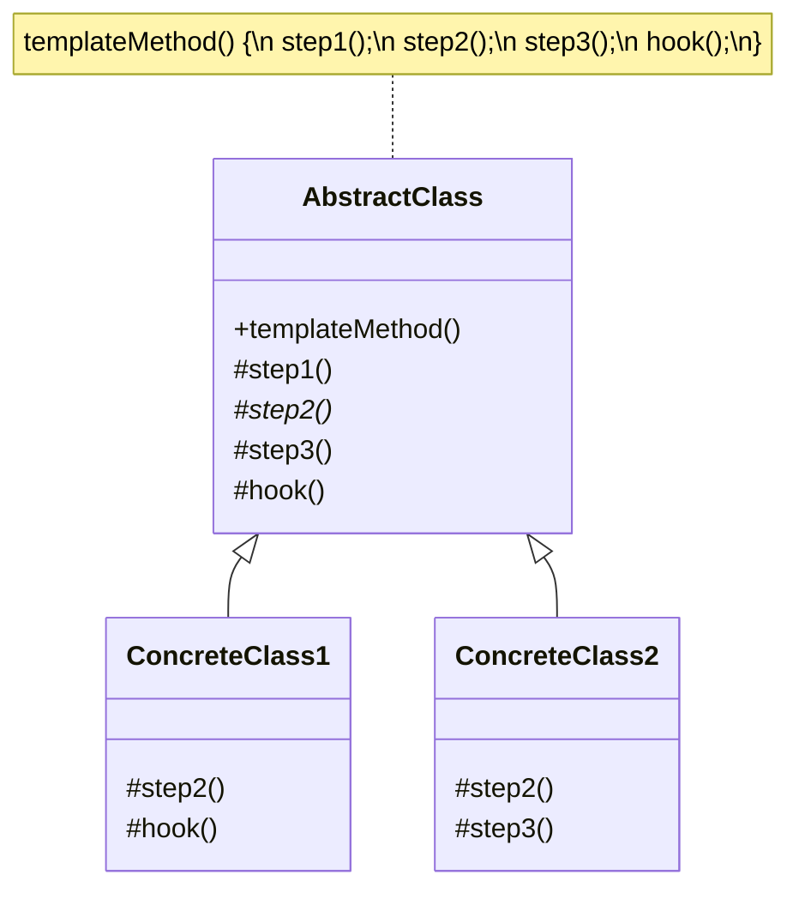

# Template Method Pattern

## Overview

The **Template Method** pattern is a behavioral design pattern that defines the skeleton of an algorithm in a base class but lets subclasses override specific steps of the algorithm without changing its overall structure. 

**Key advantage**: It eliminates code duplication by pulling the invariant parts of an algorithm into a base class while allowing the variant parts to be customized by subclasses.

**Modern perspective**: While Template Method is historically based on heavy class inheritance, its core concept remains vital. In modern functional programming, this is often achieved by passing higher-order functions (callbacks) into a "template function." In OOP, it is still heavily used in frameworks (e.g., component lifecycles like `ngOnInit` in Angular or `componentDidMount` in legacy React) where the framework dictates the *when* (the template) and the developer defines the *what* (the overridden step).

## The Problem

Imagine you are building an application that mines data from various document formats: PDF, DOC, and CSV.

For each format, the overall data mining process is identical:
1. Open the file.
2. Extract the raw data.
3. Parse the data into a standardized format.
4. Analyze the parsed data.
5. Send the analysis report.
6. Close the file.

```typescript
// ❌ Bad: Duplicated workflow control flow across multiple classes
class PDFDataMiner {
  mine(path: string) {
    const file = this.openFile(path);
    const rawData = this.extractData(file); // Unique to PDF
    const data = this.parseData(rawData);   // Unique to PDF
    this.analyzeData(data);                 // Same for all
    this.sendReport(data);                  // Same for all
    this.closeFile(file);                   // Same for all
  }
  // ... methods ...
}

class CSVDataMiner {
  mine(path: string) {
    const file = this.openFile(path);
    const rawData = this.extractData(file); // Unique to CSV
    const data = this.parseData(rawData);   // Unique to CSV
    this.analyzeData(data);                 // Same for all
    this.sendReport(data);                  // Same for all
    this.closeFile(file);                   // Same for all
  }
  // ... methods ...
}
```

If you need to add a new step (e.g., "compress the report before sending"), you must manually update the `mine()` method in *every single miner class*.

## The Solution

The Template Method pattern suggests that you declare an algorithm as a series of steps inside a base class.

1. **Abstract Base Class**: Defines a "template method" (e.g., `mine()`) containing the sequence of method calls that make up the algorithm. 
2. **Steps**: The methods called by the template method.
    - *Abstract steps*: Must be implemented by every subclass.
    - *Optional steps (Hooks)*: Have a default implementation in the base class, but can be overridden.
    - *Concrete steps*: Fully implemented in the base class and shared by all subclasses.
3. **Concrete Classes**: Subclasses that inherit from the base class and implement the abstract steps.

By making the template method `final` (or read-only), you enforce the algorithm's structure, ensuring no subclass can accidentally change the order of execution.

## Structure



## Flow

1. The client instantiates a **ConcreteClass**.
2. The client calls the `templateMethod()` on that instance.
3. The base class's `templateMethod()` executes.
4. When the base class method reaches an abstract step or an overridden hook, dynamic dispatch routes the call to the subclass's implementation.

## Real-World Analogy

Think of **building a mass-produced house**.
The construction company has a strict sequence (the template method):
1. Lay the foundation.
2. Build the frame.
3. Add the roof.
4. Install plumbing.
5. Add finishing touches.

You cannot build the roof before the foundation. The *order* is fixed. However, the *details* of specific steps can vary depending on the model of the house you bought (e.g., Wooden frame vs. Steel frame, Shingle roof vs. Tile roof).

## Step-by-Step Implementation

1. **Identify the Algorithm**: Find an algorithm that is duplicated across multiple classes with only minor variations.
2. **Create the Base Class**: Move the algorithm into a single template method in an abstract base class.
3. **Define the Steps**: Break the algorithm down into helper methods.
4. **Identify Variations**: Make the methods that vary `abstract`. 
5. **Identify Shared Logic**: Implement the shared methods in the base class.
6. **Add Hooks (Optional)**: Add empty or default-behavior methods at crucial points in the algorithm to allow subclasses to "hook" into the process if needed.

## Code Examples

Let's implement a **CI/CD Build Pipeline**. Every project (Node.js, Rust, Go) must go through the same phases: Checkout, Install Dependencies, Build, Test, and Deploy. However, the exact commands for installing dependencies or building vary wildly between languages.

::: code-group

```typescript [TypeScript]
// 1. Abstract Base Class
abstract class BuildPipeline {
  // The Template Method. It defines the exact sequence.
  // We use `readonly` or conceptually mark it as final so it cannot be overridden.
  public buildProject(): void {
    this.checkout();
    this.installDependencies();
    this.compile();
    this.test();
    
    // Hook: Only deploy if the subclass allows it
    if (this.shouldDeploy()) {
      this.deploy();
    }
    
    this.notifySuccess();
  }

  // Common steps (Concrete)
  private checkout(): void {
    console.log("-> Checking out code from Git repository...");
  }

  private notifySuccess(): void {
    console.log("-> Build pipeline completed successfully!\n");
  }

  // Abstract steps (Must be implemented by subclasses)
  protected abstract installDependencies(): void;
  protected abstract compile(): void;
  protected abstract test(): void;
  protected abstract deploy(): void;

  // Hook method (Optional to override)
  protected shouldDeploy(): boolean {
    return true; // Default behavior
  }
}

// 2. Concrete Classes
class NodeBuildPipeline extends BuildPipeline {
  protected installDependencies(): void {
    console.log("Node: Running 'npm install'...");
  }

  protected compile(): void {
    console.log("Node: Running 'npm run build' (tsc)...");
  }

  protected test(): void {
    console.log("Node: Running 'npm run test' (Jest)...");
  }

  protected deploy(): void {
    console.log("Node: Deploying to Vercel...");
  }
}

class RustBuildPipeline extends BuildPipeline {
  protected installDependencies(): void {
    console.log("Rust: Fetching crates via 'cargo fetch'...");
  }

  protected compile(): void {
    console.log("Rust: Running 'cargo build --release'...");
  }

  protected test(): void {
    console.log("Rust: Running 'cargo test'...");
  }

  protected deploy(): void {
    console.log("Rust: Uploading binary to AWS S3...");
  }

  // Overriding the hook
  protected shouldDeploy(): boolean {
    // Imagine we check an environment variable here
    console.log("Rust: Skipping deployment for this branch.");
    return false;
  }
}

// 3. Client Code
console.log("=== Running Node.js Pipeline ===");
const nodePipeline = new NodeBuildPipeline();
nodePipeline.buildProject();

console.log("=== Running Rust Pipeline ===");
const rustPipeline = new RustBuildPipeline();
rustPipeline.buildProject();
```

```python [Python]
from abc import ABC, abstractmethod

# 1. Abstract Base Class
class BuildPipeline(ABC):
    # The Template Method
    def build_project(self) -> None:
        self._checkout()
        self._install_dependencies()
        self._compile()
        self._test()
        
        if self._should_deploy():
            self._deploy()
            
        self._notify_success()

    # Common steps
    def _checkout(self) -> None:
        print("-> Checking out code from Git repository...")

    def _notify_success(self) -> None:
        print("-> Build pipeline completed successfully!\n")

    # Abstract steps
    @abstractmethod
    def _install_dependencies(self) -> None:
        pass

    @abstractmethod
    def _compile(self) -> None:
        pass

    @abstractmethod
    def _test(self) -> None:
        pass

    @abstractmethod
    def _deploy(self) -> None:
        pass

    # Hook method
    def _should_deploy(self) -> bool:
        return True

# 2. Concrete Classes
class PythonBuildPipeline(BuildPipeline):
    def _install_dependencies(self) -> None:
        print("Python: Running 'pip install -r requirements.txt'...")

    def _compile(self) -> None:
        print("Python: Skipping compilation (interpreted language)...")

    def _test(self) -> None:
        print("Python: Running 'pytest'...")

    def _deploy(self) -> None:
        print("Python: Deploying to Heroku...")

class RustBuildPipeline(BuildPipeline):
    def _install_dependencies(self) -> None:
        print("Rust: Fetching crates via 'cargo fetch'...")

    def _compile(self) -> None:
        print("Rust: Running 'cargo build --release'...")

    def _test(self) -> None:
        print("Rust: Running 'cargo test'...")

    def _deploy(self) -> None:
        print("Rust: Uploading binary to AWS S3...")

    # Overriding the hook
    def _should_deploy(self) -> bool:
        print("Rust: Skipping deployment for this branch.")
        return False

# 3. Client Code
if __name__ == "__main__":
    print("=== Running Python Pipeline ===")
    py_pipeline = PythonBuildPipeline()
    py_pipeline.build_project()

    print("=== Running Rust Pipeline ===")
    rust_pipeline = RustBuildPipeline()
    rust_pipeline.build_project()
```

```java [Java]
// 1. Abstract Base Class
abstract class BuildPipeline {
    
    // The Template Method is marked final to prevent subclasses from altering the sequence
    public final void buildProject() {
        checkout();
        installDependencies();
        compile();
        test();
        
        if (shouldDeploy()) {
            deploy();
        }
        
        notifySuccess();
    }

    private void checkout() {
        System.out.println("-> Checking out code from Git repository...");
    }

    private void notifySuccess() {
        System.out.println("-> Build pipeline completed successfully!\n");
    }

    // Abstract steps
    protected abstract void installDependencies();
    protected abstract void compile();
    protected abstract void test();
    protected abstract void deploy();

    // Hook
    protected boolean shouldDeploy() {
        return true;
    }
}

// 2. Concrete Classes
class JavaBuildPipeline extends BuildPipeline {
    @Override
    protected void installDependencies() {
        System.out.println("Java: Running 'mvn clean install' (downloads dependencies)...");
    }

    @Override
    protected void compile() {
        System.out.println("Java: Compiling via Maven...");
    }

    @Override
    protected void test() {
        System.out.println("Java: Running JUnit tests...");
    }

    @Override
    protected void deploy() {
        System.out.println("Java: Publishing JAR to Nexus Repository...");
    }
}

class RustBuildPipeline extends BuildPipeline {
    @Override
    protected void installDependencies() {
        System.out.println("Rust: Fetching crates via 'cargo fetch'...");
    }

    @Override
    protected void compile() {
        System.out.println("Rust: Running 'cargo build --release'...");
    }

    @Override
    protected void test() {
        System.out.println("Rust: Running 'cargo test'...");
    }

    @Override
    protected void deploy() {
        System.out.println("Rust: Uploading binary to AWS S3...");
    }

    @Override
    protected boolean shouldDeploy() {
        System.out.println("Rust: Skipping deployment for this branch.");
        return false;
    }
}

// 3. Client Code
public class TemplateMethodDemo {
    public static void main(String[] args) {
        System.out.println("=== Running Java Pipeline ===");
        BuildPipeline javaPipeline = new JavaBuildPipeline();
        javaPipeline.buildProject();

        System.out.println("=== Running Rust Pipeline ===");
        BuildPipeline rustPipeline = new RustBuildPipeline();
        rustPipeline.buildProject();
    }
}
```

```go [Go]
package main

import "fmt"

// Go does not have classes or traditional inheritance.
// To implement Template Method, we use composition and an interface for the varying steps.

// 1. Interface for the varying steps
type PipelineSteps interface {
	InstallDependencies()
	Compile()
	Test()
	Deploy()
	ShouldDeploy() bool
}

// 2. Base "Class" (The Template)
type BuildPipeline struct {
	steps PipelineSteps // Embed the interface
}

// The Template Method
func (b *BuildPipeline) BuildProject() {
	b.checkout()
	b.steps.InstallDependencies()
	b.steps.Compile()
	b.steps.Test()

	if b.steps.ShouldDeploy() {
		b.steps.Deploy()
	}

	b.notifySuccess()
}

func (b *BuildPipeline) checkout() {
	fmt.Println("-> Checking out code from Git repository...")
}

func (b *BuildPipeline) notifySuccess() {
	fmt.Println("-> Build pipeline completed successfully!\n")
}

// 3. Concrete Implementation: Go
type GoPipeline struct{}

func (g *GoPipeline) InstallDependencies() {
	fmt.Println("Go: Running 'go mod download'...")
}

func (g *GoPipeline) Compile() {
	fmt.Println("Go: Running 'go build'...")
}

func (g *GoPipeline) Test() {
	fmt.Println("Go: Running 'go test ./...'...")
}

func (g *GoPipeline) Deploy() {
	fmt.Println("Go: Deploying binary to Server...")
}

func (g *GoPipeline) ShouldDeploy() bool {
	return true
}

// 4. Concrete Implementation: Rust
type RustPipeline struct{}

func (r *RustPipeline) InstallDependencies() {
	fmt.Println("Rust: Fetching crates via 'cargo fetch'...")
}

func (r *RustPipeline) Compile() {
	fmt.Println("Rust: Running 'cargo build --release'...")
}

func (r *RustPipeline) Test() {
	fmt.Println("Rust: Running 'cargo test'...")
}

func (r *RustPipeline) Deploy() {
	fmt.Println("Rust: Uploading binary to AWS S3...")
}

func (r *RustPipeline) ShouldDeploy() bool {
	fmt.Println("Rust: Skipping deployment for this branch.")
	return false
}

// Constructor helper
func NewBuildPipeline(steps PipelineSteps) *BuildPipeline {
	return &BuildPipeline{steps: steps}
}

// 5. Client
func main() {
	fmt.Println("=== Running Go Pipeline ===")
	goPipeline := NewBuildPipeline(&GoPipeline{})
	goPipeline.BuildProject()

	fmt.Println("=== Running Rust Pipeline ===")
	rustPipeline := NewBuildPipeline(&RustPipeline{})
	rustPipeline.BuildProject()
}
```

```rust [Rust]
// Rust favors Traits and Composition over inheritance.
// We can achieve the Template Method using a Trait with provided methods.

// 1. The Trait (Base Template + Abstract Steps)
trait BuildPipeline {
    // The Template Method (Provided implementation)
    fn build_project(&self) {
        self.checkout();
        self.install_dependencies();
        self.compile();
        self.test();
        
        if self.should_deploy() {
            self.deploy();
        }
        
        self.notify_success();
    }

    // Concrete steps (Provided implementations)
    fn checkout(&self) {
        println!("-> Checking out code from Git repository...");
    }

    fn notify_success(&self) {
        println!("-> Build pipeline completed successfully!\n");
    }

    // Abstract steps (Must be implemented by structs)
    fn install_dependencies(&self);
    fn compile(&self);
    fn test(&self);
    fn deploy(&self);

    // Hook (Provided default implementation that can be overridden)
    fn should_deploy(&self) -> bool {
        true
    }
}

// 2. Concrete Implementation: Rust
struct RustBuildPipeline;

impl BuildPipeline for RustBuildPipeline {
    fn install_dependencies(&self) {
        println!("Rust: Fetching crates via 'cargo fetch'...");
    }

    fn compile(&self) {
        println!("Rust: Running 'cargo build --release'...");
    }

    fn test(&self) {
        println!("Rust: Running 'cargo test'...");
    }

    fn deploy(&self) {
        println!("Rust: Uploading binary to AWS S3...");
    }

    fn should_deploy(&self) -> bool {
        println!("Rust: Skipping deployment for this branch.");
        false
    }
}

// 3. Concrete Implementation: Node
struct NodeBuildPipeline;

impl BuildPipeline for NodeBuildPipeline {
    fn install_dependencies(&self) {
        println!("Node: Running 'npm install'...");
    }

    fn compile(&self) {
        println!("Node: Running 'npm run build' (tsc)...");
    }

    fn test(&self) {
        println!("Node: Running 'npm run test' (Jest)...");
    }

    fn deploy(&self) {
        println!("Node: Deploying to Vercel...");
    }
}

// 4. Client
fn main() {
    println!("=== Running Node Pipeline ===");
    let node_pipeline = NodeBuildPipeline;
    node_pipeline.build_project();

    println!("=== Running Rust Pipeline ===");
    let rust_pipeline = RustBuildPipeline;
    rust_pipeline.build_project();
}
```

:::

## Pros and Cons

### Advantages
- **Reduces Code Duplication**: Pulls identical logic (the workflow control) into a superclass.
- **Enforces Algorithm Structure**: Ensures that subclasses do not break the critical sequence of operations.
- **The Hollywood Principle**: "Don't call us, we'll call you." The base class controls the flow and calls the subclass methods when needed, reversing traditional dependency structures.
- **Provides Hooks**: Allows subclasses to insert themselves at specific, safe points in the algorithm.

### Disadvantages
- **Rigid Structure**: Subclasses are bound to the skeleton provided. If a subclass needs to significantly alter the flow, the pattern breaks down.
- **Liskov Substitution Principle Risks**: Subclasses might suppress a default step by overriding it with an empty method, which can violate expected behaviors.
- **Hard to Maintain**: Templates with too many steps or hooks become exceptionally difficult to read and maintain. 

## When to Use

- **Shared Algorithm with Minor Variants**: When you have multiple classes implementing almost identical algorithms with only small differences in specific steps.
- **Framework Development**: When building a framework or library, you want to provide a core execution loop while allowing users to inject their custom code via hooks. (e.g., React's class-based components, or Angular's directives).

## When NOT to Use

- **High Volatility**: If the sequence of steps changes frequently, fixing it in a base class will cause massive headaches. Use **Strategy** instead.
- **Few Variations**: If you only have one or two variations, the overhead of creating abstract classes and subclasses might not be worth it.
- **Composition-Heavy Codebases**: If your architecture strictly avoids inheritance (e.g., Go, modern React, Rust), you usually implement this via Higher-Order Functions or interface injection rather than classic inheritance.

## Common Mistakes

### 1. Forgetting to Make the Template Method Final
In languages like Java or C#, if you don't explicitly mark the template method as `final` / `sealed`, a subclass could override the template method itself, entirely destroying the purpose of the pattern.

### 2. Creating a "God Template"
If your template method calls 15 different abstract steps, creating a subclass becomes a nightmare because the developer must implement 15 disjointed methods. Keep the steps cohesive and minimal.

## Related Patterns

- **Strategy**: The biggest rival to Template Method. Strategy changes the *entire* algorithm via object composition. Template Method changes *parts* of an algorithm via inheritance.
- **Factory Method**: A Factory Method is often called from within a Template Method to instantiate objects needed for the algorithm.
- **Builder**: Both define steps, but Builder focuses on creating a complex object step-by-step, while Template Method executes a behavioral algorithm step-by-step.

## Interview Insights

- **Question**: "What is the 'Hollywood Principle' and how does it relate to Template Method?"
  - **Answer**: "The Hollywood Principle is 'Don't call us, we'll call you.' In the Template Method, the subclass doesn't call the base class to figure out what to do next. Instead, the base class defines the workflow and calls the subclass's overridden methods at the correct time."
- **Question**: "What is a 'Hook' in the Template Method?"
  - **Answer**: "A hook is a method in the abstract class with an empty or default implementation. It provides an optional extension point for subclasses, unlike abstract methods which *must* be overridden."

## Modern Alternatives

- **Higher-Order Functions**: In TypeScript, Python, and modern languages, passing callback functions to a generic pipeline function is often preferred over creating a rigid class inheritance hierarchy. 
- **Middleware Chains**: In web frameworks (Express, ASP.NET Core), request pipelines are defined as chains of middleware rather than a single hardcoded template class. This allows dynamic composition of the algorithm steps at runtime.
