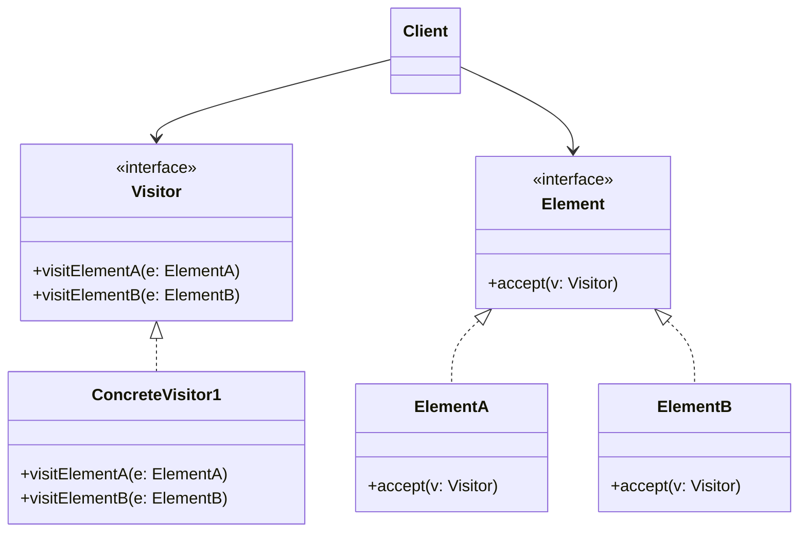

# Visitor Pattern

## Overview

The **Visitor** pattern is a behavioral design pattern that allows you to add new operations to existing classes without modifying them. It achieves this by separating an algorithm from the object structure on which it operates.

**Key advantage**: It implements "Double Dispatch," allowing a program to execute different logic based on both the type of the receiver _and_ the type of the argument.

**Modern perspective**: The Visitor pattern was designed to solve a problem inherent to older Object-Oriented languages (Java, C++, C#): they only support _Single Dispatch_ (polymorphism based purely on the object you call the method on). In modern languages that support **Pattern Matching** (Rust, Scala, Swift, modern C#, modern Java) or Union Types (TypeScript), the classic Visitor pattern is largely obsolete and considered overly verbose. However, understanding it is critical for legacy systems, Compiler design (AST traversal), and languages lacking advanced pattern matching.

## The Problem

Imagine you are building an application that works with a geographic map consisting of a complex graph of different nodes: `City`, `Industry`, and `Sightseeing`.

Your boss asks you to export the map data into an XML format.

```typescript
// ❌ Bad: Violates Single Responsibility and Open/Closed principles
class City implements MapNode {
  exportToXML() {
    /* ... XML logic ... */
  }
}

class Industry implements MapNode {
  exportToXML() {
    /* ... XML logic ... */
  }
}

class Sightseeing implements MapNode {
  exportToXML() {
    /* ... XML logic ... */
  }
}
```

This seems fine at first. But what happens next week when the boss asks for JSON export? What about CSV export?
Every time a new operation is needed, you have to modify _every single node class_. These classes are supposed to represent geographic data, not deal with parsing, formatting, or exporting.

If you try to move the logic outside the classes into an `Exporter` class, you hit a snag:

```typescript
class Exporter {
  export(node: MapNode) {
    // ❌ Bad: Huge instanceof chains (Code Smell)
    if (node instanceof City) {
      // export city
    } else if (node instanceof Industry) {
      // export industry
    }
  }
}
```

## The Solution

The Visitor pattern suggests placing the new behavior into a separate class called a `Visitor`, instead of integrating it into existing classes.

The trick to making this work without `instanceof` checks is **Double Dispatch**.

1. We ask the `Visitor` to execute the operation, but how does the Visitor know which node it's dealing with?
2. We add a single method `accept(visitor)` to the `MapNode` interface.
3. Every concrete node implements `accept(visitor)` by simply calling `visitor.visit(this)`.

Because the code is executed _inside_ the concrete node (e.g., `City`), `this` is explicitly known to be of type `City`. The compiler binds the call to the correct overloaded method on the Visitor.

## Structure



## Flow

1. The client creates a `ConcreteVisitor` object.
2. The client iterates over a complex object structure (e.g., an array of `Element`s).
3. The client calls `element.accept(visitor)` on each item.
4. Inside `accept`, the concrete `Element` calls back into the visitor: `visitor.visitElementA(this)`.
5. The `Visitor` executes the logic specific to `ElementA`.

## Real-World Analogy

Think of an **Insurance Agent** visiting clients.
The Agent (Visitor) visits a residential building, a bank, and a coffee shop (Elements).
Depending on the building they visit, the Agent performs a different operation:

- At the residential building, they pitch medical insurance.
- At the bank, they pitch theft insurance.
- At the coffee shop, they pitch fire insurance.
  The buildings don't care _how_ the insurance is calculated; they just "accept" the agent into their building, and the agent does the appropriate work.

## Step-by-Step Implementation

1. **Declare the Visitor Interface**: Create an interface with a set of "visiting" methods, one for each concrete element class.
2. **Declare the Element Interface**: Add an `accept(visitor)` method to the base interface of your element hierarchy.
3. **Implement Acceptance**: In every concrete element, implement `accept(visitor)` by calling the visitor method that matches the element's class.
4. **Create Concrete Visitors**: Create classes implementing the Visitor interface. Each visitor represents a different operation (Export, Render, Validate, etc.).
5. **Client Execution**: The client creates visitor objects and passes them into the elements via the `accept` method.

## Code Examples

Let's implement a system for an **Abstract Syntax Tree (AST)** used in a compiler. We have different node types (`NumberNode`, `AdditionNode`). We want to be able to compile the AST, evaluate it, and print it—without stuffing all that logic into the nodes themselves.

::: code-group

```typescript [TypeScript]
// 1. Visitor Interface
interface ASTVisitor {
  visitNumber(node: NumberNode): void;
  visitAddition(node: AdditionNode): void;
}

// 2. Element Interface
interface ASTNode {
  accept(visitor: ASTVisitor): void;
}

// 3. Concrete Elements
class NumberNode implements ASTNode {
  constructor(public value: number) {}

  accept(visitor: ASTVisitor): void {
    // Double dispatch: we pass 'this' (type NumberNode) back to the visitor
    visitor.visitNumber(this);
  }
}

class AdditionNode implements ASTNode {
  constructor(
    public left: ASTNode,
    public right: ASTNode,
  ) {}

  accept(visitor: ASTVisitor): void {
    // Double dispatch
    visitor.visitAddition(this);
  }
}

// 4. Concrete Visitors
class EvaluateVisitor implements ASTVisitor {
  public result: number = 0;

  visitNumber(node: NumberNode): void {
    this.result = node.value;
  }

  visitAddition(node: AdditionNode): void {
    // Evaluate left
    node.left.accept(this);
    const leftVal = this.result;

    // Evaluate right
    node.right.accept(this);
    const rightVal = this.result;

    this.result = leftVal + rightVal;
  }
}

class PrintVisitor implements ASTVisitor {
  public output: string = "";

  visitNumber(node: NumberNode): void {
    this.output += node.value.toString();
  }

  visitAddition(node: AdditionNode): void {
    this.output += "(";
    node.left.accept(this);
    this.output += " + ";
    node.right.accept(this);
    this.output += ")";
  }
}

// 5. Client Code
const tree = new AdditionNode(
  new NumberNode(5),
  new AdditionNode(new NumberNode(2), new NumberNode(3)),
);

console.log("=== Printing AST ===");
const printer = new PrintVisitor();
tree.accept(printer);
console.log(printer.output); // Output: (5 + (2 + 3))

console.log("=== Evaluating AST ===");
const evaluator = new EvaluateVisitor();
tree.accept(evaluator);
console.log(evaluator.result); // Output: 10
```

```python [Python]
from abc import ABC, abstractmethod

# 1. Visitor Interface
class ASTVisitor(ABC):
    @abstractmethod
    def visit_number(self, node: 'NumberNode') -> None:
        pass

    @abstractmethod
    def visit_addition(self, node: 'AdditionNode') -> None:
        pass

# 2. Element Interface
class ASTNode(ABC):
    @abstractmethod
    def accept(self, visitor: ASTVisitor) -> None:
        pass

# 3. Concrete Elements
class NumberNode(ASTNode):
    def __init__(self, value: float):
        self.value = value

    def accept(self, visitor: ASTVisitor) -> None:
        visitor.visit_number(self)

class AdditionNode(ASTNode):
    def __init__(self, left: ASTNode, right: ASTNode):
        self.left = left
        self.right = right

    def accept(self, visitor: ASTVisitor) -> None:
        visitor.visit_addition(self)

# 4. Concrete Visitors
class EvaluateVisitor(ASTVisitor):
    def __init__(self):
        self.result: float = 0

    def visit_number(self, node: NumberNode) -> None:
        self.result = node.value

    def visit_addition(self, node: AdditionNode) -> None:
        node.left.accept(self)
        left_val = self.result

        node.right.accept(self)
        right_val = self.result

        self.result = left_val + right_val

class PrintVisitor(ASTVisitor):
    def __init__(self):
        self.output: str = ""

    def visit_number(self, node: NumberNode) -> None:
        self.output += str(node.value)

    def visit_addition(self, node: AdditionNode) -> None:
        self.output += "("
        node.left.accept(self)
        self.output += " + "
        node.right.accept(self)
        self.output += ")"

# 5. Client Code
if __name__ == "__main__":
    # AST: 5 + (2 + 3)
    tree = AdditionNode(
        NumberNode(5),
        AdditionNode(NumberNode(2), NumberNode(3))
    )

    print("=== Printing AST ===")
    printer = PrintVisitor()
    tree.accept(printer)
    print(printer.output)

    print("=== Evaluating AST ===")
    evaluator = EvaluateVisitor()
    tree.accept(evaluator)
    print(evaluator.result)
```

```java [Java]
// 1. Visitor Interface
interface ASTVisitor {
    void visit(NumberNode node);
    void visit(AdditionNode node);
}

// 2. Element Interface
interface ASTNode {
    void accept(ASTVisitor visitor);
}

// 3. Concrete Elements
class NumberNode implements ASTNode {
    final double value;

    NumberNode(double value) { this.value = value; }

    @Override
    public void accept(ASTVisitor visitor) {
        visitor.visit(this); // Resolves to visit(NumberNode)
    }
}

class AdditionNode implements ASTNode {
    final ASTNode left;
    final ASTNode right;

    AdditionNode(ASTNode left, ASTNode right) {
        this.left = left;
        this.right = right;
    }

    @Override
    public void accept(ASTVisitor visitor) {
        visitor.visit(this); // Resolves to visit(AdditionNode)
    }
}

// 4. Concrete Visitors
class EvaluateVisitor implements ASTVisitor {
    private double result = 0;

    public double getResult() { return result; }

    @Override
    public void visit(NumberNode node) {
        this.result = node.value;
    }

    @Override
    public void visit(AdditionNode node) {
        node.left.accept(this);
        double leftVal = this.result;

        node.right.accept(this);
        double rightVal = this.result;

        this.result = leftVal + rightVal;
    }
}

class PrintVisitor implements ASTVisitor {
    private StringBuilder output = new StringBuilder();

    public String getOutput() { return output.toString(); }

    @Override
    public void visit(NumberNode node) {
        output.append(node.value);
    }

    @Override
    public void visit(AdditionNode node) {
        output.append("(");
        node.left.accept(this);
        output.append(" + ");
        node.right.accept(this);
        output.append(")");
    }
}

// 5. Client Code
public class VisitorDemo {
    public static void main(String[] args) {
        ASTNode tree = new AdditionNode(
            new NumberNode(5),
            new AdditionNode(new NumberNode(2), new NumberNode(3))
        );

        System.out.println("=== Printing AST ===");
        PrintVisitor printer = new PrintVisitor();
        tree.accept(printer);
        System.out.println(printer.getOutput());

        System.out.println("=== Evaluating AST ===");
        EvaluateVisitor evaluator = new EvaluateVisitor();
        tree.accept(evaluator);
        System.out.println(evaluator.getResult());
    }
}
```

```go [Go]
package main

import (
	"fmt"
	"strconv"
)

// 1. Visitor Interface
type ASTVisitor interface {
	VisitNumber(node *NumberNode)
	VisitAddition(node *AdditionNode)
}

// 2. Element Interface
type ASTNode interface {
	Accept(visitor ASTVisitor)
}

// 3. Concrete Elements
type NumberNode struct {
	Value float64
}

func (n *NumberNode) Accept(visitor ASTVisitor) {
	visitor.VisitNumber(n)
}

type AdditionNode struct {
	Left  ASTNode
	Right ASTNode
}

func (a *AdditionNode) Accept(visitor ASTVisitor) {
	visitor.VisitAddition(a)
}

// 4. Concrete Visitors
type EvaluateVisitor struct {
	Result float64
}

func (v *EvaluateVisitor) VisitNumber(node *NumberNode) {
	v.Result = node.Value
}

func (v *EvaluateVisitor) VisitAddition(node *AdditionNode) {
	node.Left.Accept(v)
	leftVal := v.Result

	node.Right.Accept(v)
	rightVal := v.Result

	v.Result = leftVal + rightVal
}

type PrintVisitor struct {
	Output string
}

func (v *PrintVisitor) VisitNumber(node *NumberNode) {
	v.Output += strconv.FormatFloat(node.Value, 'f', -1, 64)
}

func (v *PrintVisitor) VisitAddition(node *AdditionNode) {
	v.Output += "("
	node.Left.Accept(v)
	v.Output += " + "
	node.Right.Accept(v)
	v.Output += ")"
}

// 5. Client
func main() {
	tree := &AdditionNode{
		Left: &NumberNode{Value: 5},
		Right: &AdditionNode{
			Left:  &NumberNode{Value: 2},
			Right: &NumberNode{Value: 3},
		},
	}

	fmt.Println("=== Printing AST ===")
	printer := &PrintVisitor{}
	tree.Accept(printer)
	fmt.Println(printer.Output)

	fmt.Println("=== Evaluating AST ===")
	evaluator := &EvaluateVisitor{}
	tree.Accept(evaluator)
	fmt.Println(evaluator.Result)
}
```

```rust [Rust]
// In Rust, Pattern Matching entirely replaces the classic OOP Visitor pattern.
// Instead of creating Interfaces and Double Dispatch, we define an Enum
// representing the Node Types, and use `match` blocks.
// This is exactly what the Visitor Pattern tries (and struggles) to emulate in OOP.

// 1. The "Elements" (An Algebraic Data Type / Enum)
enum ASTNode {
    Number(f64),
    Addition(Box<ASTNode>, Box<ASTNode>),
}

// 2. The "Visitors" (Just normal functions using Pattern Matching)

// "Print Visitor" equivalent
fn print_ast(node: &ASTNode) -> String {
    match node {
        ASTNode::Number(val) => val.to_string(),
        ASTNode::Addition(left, right) => {
            format!("({} + {})", print_ast(left), print_ast(right))
        }
    }
}

// "Evaluate Visitor" equivalent
fn evaluate_ast(node: &ASTNode) -> f64 {
    match node {
        ASTNode::Number(val) => *val,
        ASTNode::Addition(left, right) => evaluate_ast(left) + evaluate_ast(right),
    }
}

// 3. Client Code
fn main() {
    // AST: 5 + (2 + 3)
    let tree = ASTNode::Addition(
        Box::new(ASTNode::Number(5.0)),
        Box::new(ASTNode::Addition(
            Box::new(ASTNode::Number(2.0)),
            Box::new(ASTNode::Number(3.0)),
        )),
    );

    println!("=== Printing AST ===");
    println!("{}", print_ast(&tree));

    println!("=== Evaluating AST ===");
    println!("{}", evaluate_ast(&tree));
}
```

:::

## Pros and Cons

### Advantages

- **Open/Closed Principle**: You can introduce a new behavior that can work with objects of different classes without changing those classes.
- **Single Responsibility Principle**: You can gather multiple versions of the same behavior into a single class.
- **Type Safety**: Unlike massive `if (node instanceof City)` blocks, double dispatch ensures at compile-time that every element type is handled.
- **State Accumulation**: A visitor can accumulate state as it traverses various objects (useful for calculating totals or generating reports).

### Disadvantages

- **Fragile Base Class Hierarchy**: The biggest flaw of the Visitor pattern is that if a new class is added to the Element hierarchy (e.g., `SubtractionNode`), you MUST update the `Visitor` interface and EVERY SINGLE concrete visitor class.
- **Encapsulation Breakdown**: Visitors usually need access to the private or protected fields of the elements they visit. This forces you to expose internal state via public getters.
- **Complexity**: The double-dispatch mechanism (`accept` calls `visit` which operates on the data) creates a mental loop that is notoriously difficult for junior developers to follow.

## When to Use

- **Stable Hierarchy, Unstable Operations**: You have a complex object structure (like an Abstract Syntax Tree or Document Object Model) whose classes rarely change, but you need to frequently perform new and unrelated operations on them.
- **Cleaning up Business Logic**: You want to extract auxiliary behaviors (like exporting, printing, or rendering) out of primary domain classes to respect the Single Responsibility Principle.

## When NOT to Use

- **Volatile Hierarchies**: If the classes making up the object structure change frequently (adding new node types), the Visitor pattern will cause infinite maintenance headaches.
- **Languages with Pattern Matching**: If you are using Rust, Scala, F#, or even modern C#/TypeScript with Discriminated Unions, do not use the Visitor pattern. Use native pattern matching.

## Common Mistakes

### 1. Trying to Return Values directly from `visit()`

In strongly typed languages, standardizing the return type of `visit()` across all visitors is difficult (some visitors might want to return `int`, others `string`). Typically, the Visitor interface returns `void`, and the concrete visitor accumulates the result in a local field which is queried later (as seen in our TS/Java examples).

### 2. Confusing Visitor with Iterator

Iterator simply walks through a collection. Visitor executes operations on the items. However, Visitor does _not_ know how to traverse complex graphs (like trees) by itself. Traversal logic must either exist inside the Visitor (as seen in our AST example where `visitAddition` calls `accept` on children) or be handled by an external Iterator/Object Structure class.

## Related Patterns

- **Composite**: Visitor is almost always used in conjunction with Composite. The Composite pattern builds the tree, and the Visitor walks it to perform operations.
- **Iterator**: Can be used alongside Visitor to traverse the data structure while the Visitor applies the logic.
- **Command**: Visitor can be seen as a powerful Command pattern that knows how to execute itself on different types of receivers.

## Interview Insights

- **Question**: "What is Double Dispatch?"
  - **Answer**: "Double dispatch is a mechanism that dispatches a function call to different concrete functions depending on the runtime types of TWO objects involved in the call (the receiver and the argument). Visitor simulates this in languages that only support single dispatch by using `element.accept(visitor)` (dispatch 1) which immediately calls `visitor.visit(this)` (dispatch 2)."
- **Question**: "What is the biggest drawback of the Visitor pattern?"
  - **Answer**: "Adding a new element type. If I add a new node to my tree, I have to update the Visitor interface and literally every single Visitor implementation in my codebase to handle the new node. Visitor is only good if the element hierarchy is frozen."

## Modern Alternatives

- **Pattern Matching**: The ultimate replacement for Visitor. Found in Rust, Scala, Swift, F#, and increasingly in C# and Java (via switch expressions and record patterns). It allows you to match against the exact type and extract values in a single, readable block of code without touching the original classes.
- **Discriminated Unions**: In TypeScript, you can define a union type of interfaces (each with a unique `type` literal string) and use a `switch` statement. TS will enforce exhaustiveness checking, giving you compile-time safety without the boilerplate of double dispatch.
