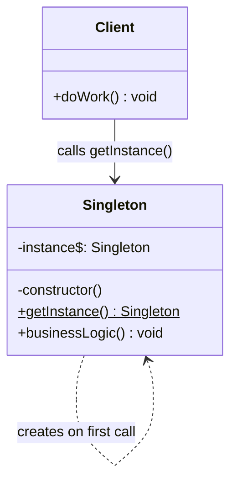
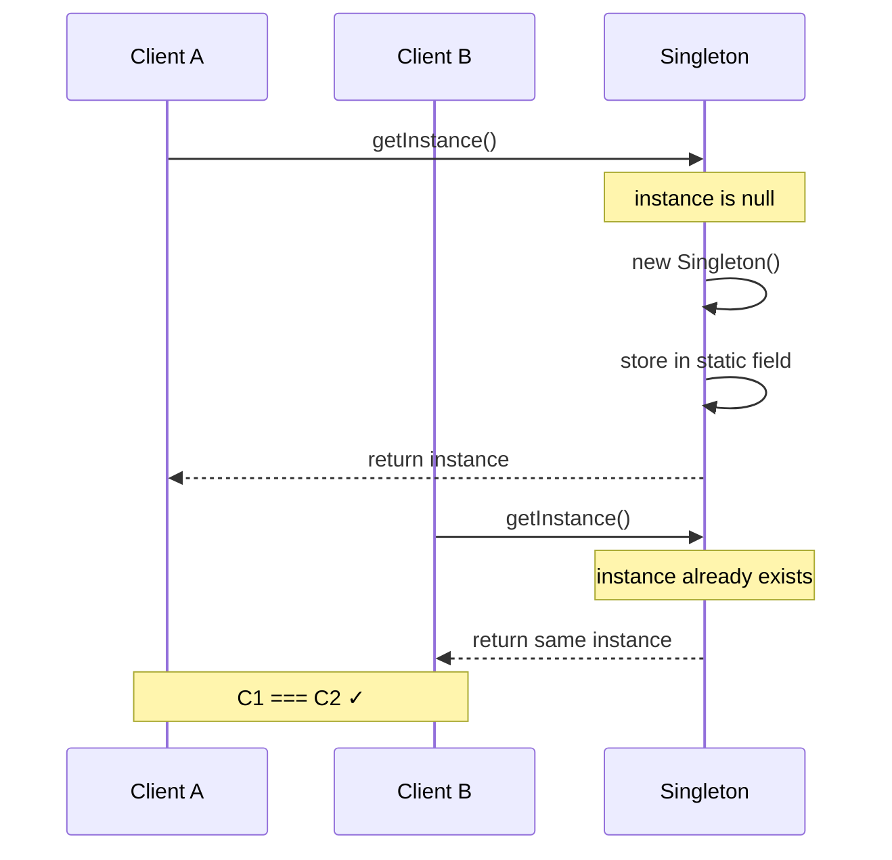
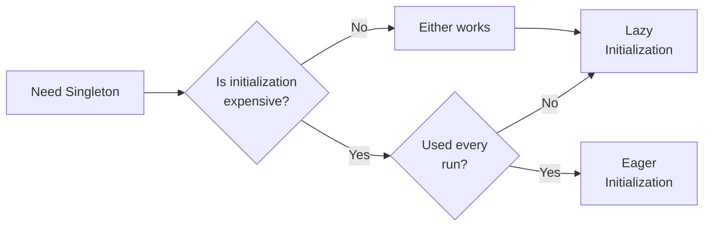
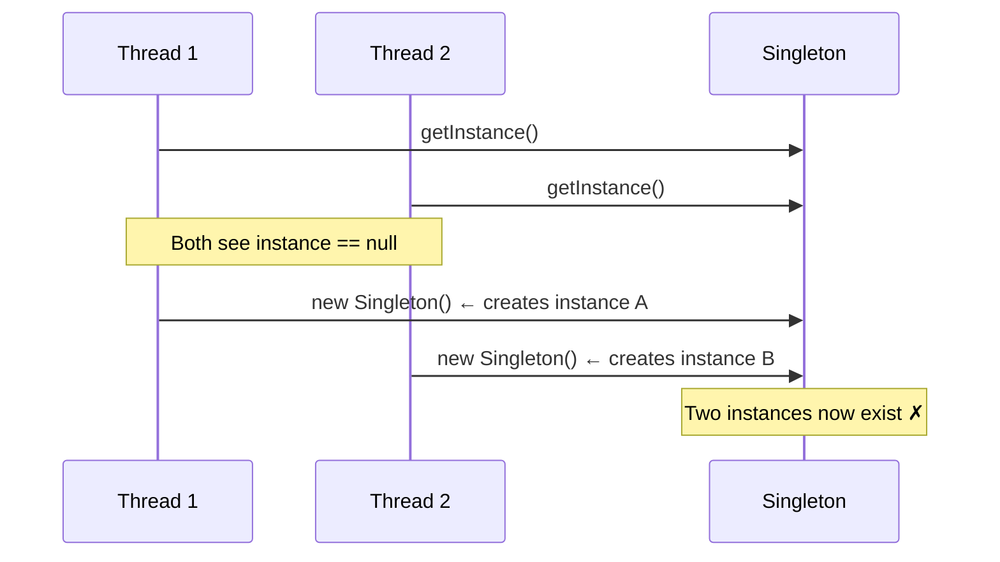
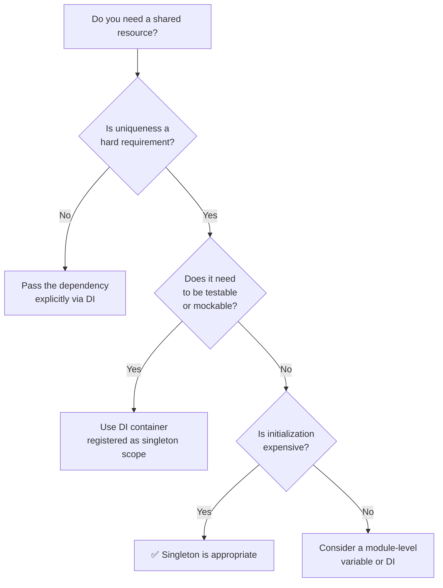

# Singleton Pattern

<CoverImage src="/covers/creational/singleton.png" alt="Cover">
  <h1>Singleton</h1>
  <p>One single, giant golden egg sitting in a carton of regular white eggs, guarded by a cute tiny security-guard robot with a flashlight.</p>
</CoverImage>

## Overview

The **Singleton** pattern ensures a class has exactly one instance and provides a global access point to it. It is one of the simplest patterns to understand and one of the easiest to misuse.

A Singleton solves two problems simultaneously — which is already a warning sign:

1. **Controlled instantiation**: Only one instance ever exists, preventing duplicate resources or inconsistent state.
2. **Global access**: Any part of the system can reach the instance without passing it through constructors or function arguments.

The second point is where most problems arise. Global access is convenient, but it hides dependencies and makes testing significantly harder. In most modern codebases, Dependency Injection is a better fit. Use Singleton only when uniqueness is a genuine architectural requirement — not just a convenient shortcut.

## Real-World Analogy

A country has one official capital. Every institution that needs to reference government affairs points to the same city — there is no ambiguity, no duplication, and creating a second capital would cause chaos. The capital is effectively a singleton.

But notice: institutions don't hardcode "Washington D.C." into every internal document. They accept it as a parameter, a configuration value, or a dependency. The _concept_ is singular. The _reference_ is still passed explicitly where needed.

That distinction — between a thing being unique and being globally accessed — is the core tension of the Singleton pattern.

## Structure



### Participants

| Participant | Role                                                                                                                                                    |
| ----------- | ------------------------------------------------------------------------------------------------------------------------------------------------------- |
| `Singleton` | Declares the static `getInstance()` method and owns the private static `instance` field. The constructor is private, preventing external instantiation. |
| `Client`    | Accesses the instance exclusively via `getInstance()`. Never calls `new Singleton()` directly.                                                          |

## The Problem

Without controlled instantiation, independent code paths can create separate instances of the same conceptual resource — leading to inconsistent state, resource exhaustion, or concurrency bugs.

### Inconsistent State

```typescript
// ❌ Two modules load config independently
const config1 = new AppConfig();
const config2 = new AppConfig();

config1.set("theme", "dark");
console.log(config2.get("theme")); // "light" — out of sync
```

### Resource Exhaustion

```typescript
// ❌ Each module spins up its own pool
const pool1 = new ConnectionPool(10); // 10 connections
const pool2 = new ConnectionPool(10); // 10 more
// System is now holding 20 connections, designed for 10
```

Both problems share the same root cause: the calling code controls construction, so nothing enforces uniqueness.

## The Solution

Move construction control into the class itself:

1. Make the constructor **private** — nothing outside can call `new`.
2. Store the instance in a **private static field**.
3. Expose a **public static `getInstance()` method** that creates the instance on first call and returns the cached instance on every subsequent call.

```typescript
// ✅ One authoritative instance
const config1 = AppConfig.getInstance();
const config2 = AppConfig.getInstance();

config1.set("theme", "dark");
console.log(config2.get("theme")); // "dark" — consistent
console.log(config1 === config2); // true
```

## How Lazy Initialization Works

The first call to `getInstance()` pays the construction cost. Every subsequent call returns the existing instance immediately.



## Implementation

### Core Steps

1. Add a **private static field** to hold the single instance.
2. Make the **constructor private**.
3. Expose a **public static `getInstance()` method** with lazy initialization.
4. Replace all `new ClassName()` call sites with `ClassName.getInstance()`.

::: code-group

```typescript [TypeScript]
/**
 * Lazy initialization — safe in single-threaded JavaScript environments.
 */
class Database {
  private static instance: Database;
  private connected = false;

  private constructor() {
    console.log("Database: creating instance");
  }

  static getInstance(): Database {
    if (!Database.instance) {
      Database.instance = new Database();
      Database.instance.connect();
    }
    return Database.instance;
  }

  private connect(): void {
    this.connected = true;
    console.log("Database: connection established");
  }

  query(sql: string): void {
    if (!this.connected) throw new Error("Not connected");
    console.log(`Database: ${sql}`);
  }
}

// Usage
const db1 = Database.getInstance(); // "creating instance" + "connection established"
const db2 = Database.getInstance(); // silent — already exists

console.log(db1 === db2); // true
db1.query("SELECT * FROM users");
```

```python [Python]
from threading import Lock

class SingletonMeta(type):
    """
    Thread-safe singleton metaclass.
    Double-checked locking minimises lock contention after first creation.
    """
    _instances = {}
    _lock: Lock = Lock()

    def __call__(cls, *args, **kwargs):
        if cls not in cls._instances:
            with cls._lock:
                if cls not in cls._instances:
                    instance = super().__call__(*args, **kwargs)
                    cls._instances[cls] = instance
        return cls._instances[cls]


class Database(metaclass=SingletonMeta):
    def __init__(self):
        self.connected = False
        print("Database: creating instance")
        self._connect()

    def _connect(self) -> None:
        self.connected = True
        print("Database: connection established")

    def query(self, sql: str) -> None:
        if not self.connected:
            raise RuntimeError("Not connected")
        print(f"Database: {sql}")


# Usage
db1 = Database()  # "creating instance" + "connection established"
db2 = Database()  # silent

print(db1 is db2)  # True
db1.query("SELECT * FROM users")
```

```java [Java]
/**
 * Thread-safe via double-checked locking + volatile.
 * volatile ensures all threads see the fully initialised instance.
 */
public final class Database {
    private static volatile Database instance;
    private boolean connected;

    private Database() {
        System.out.println("Database: creating instance");
        connect();
    }

    public static Database getInstance() {
        if (instance == null) {
            synchronized (Database.class) {
                if (instance == null) {
                    instance = new Database();
                }
            }
        }
        return instance;
    }

    private void connect() {
        connected = true;
        System.out.println("Database: connection established");
    }

    public void query(String sql) {
        if (!connected) throw new RuntimeException("Not connected");
        System.out.println("Database: " + sql);
    }
}
```

```go [Go]
package main

import (
    "fmt"
    "sync"
)

type Database struct {
    connected bool
}

var (
    instance *Database
    once     sync.Once
)

// GetInstance is goroutine-safe via sync.Once.
func GetInstance() *Database {
    once.Do(func() {
        fmt.Println("Database: creating instance")
        instance = &Database{}
        instance.connect()
    })
    return instance
}

func (db *Database) connect() {
    db.connected = true
    fmt.Println("Database: connection established")
}

func (db *Database) Query(sql string) {
    if !db.connected {
        panic("not connected")
    }
    fmt.Printf("Database: %s\n", sql)
}
```

```rust [Rust]
use std::sync::{Arc, Mutex, OnceLock};

pub struct Database {
    connected: bool,
}

static INSTANCE: OnceLock<Arc<Mutex<Database>>> = OnceLock::new();

impl Database {
    /// Returns the singleton instance. Thread-safe via OnceLock.
    pub fn get() -> Arc<Mutex<Database>> {
        INSTANCE.get_or_init(|| {
            println!("Database: creating instance");
            let mut db = Database { connected: false };
            db.connect();
            Arc::new(Mutex::new(db))
        }).clone()
    }

    fn connect(&mut self) {
        self.connected = true;
        println!("Database: connection established");
    }

    pub fn query(&self, sql: &str) {
        if !self.connected { panic!("not connected"); }
        println!("Database: {}", sql);
    }
}
```

:::

## Lazy vs. Eager Initialization



|                     | Lazy                                       | Eager                                |
| ------------------- | ------------------------------------------ | ------------------------------------ |
| **When created**    | On first `getInstance()` call              | At class load time                   |
| **Memory**          | Saved if never used                        | Always allocated                     |
| **Thread safety**   | Requires synchronisation                   | Inherently safe                      |
| **First-call cost** | Yes — initialisation happens here          | No — already done                    |
| **Best for**        | Expensive resources that may not be needed | Lightweight, always-needed instances |

### Lazy (most common)

```typescript
class Logger {
  private static instance: Logger;

  static getInstance(): Logger {
    if (!Logger.instance) {
      Logger.instance = new Logger();
    }
    return Logger.instance;
  }
}
```

### Eager

```typescript
class Logger {
  // Created when the class is first loaded
  private static readonly instance: Logger = new Logger();

  static getInstance(): Logger {
    return Logger.instance;
  }
}
```

## Thread Safety by Language

In JavaScript/TypeScript, the event loop is single-threaded — basic lazy initialization is safe. In multi-threaded environments, unguarded lazy initialization creates a race condition where two threads both see `null` and both call `new`.



The fix differs by language. Each idiom below guarantees the constructor runs exactly once:

| Language            | Mechanism                                | Notes                                  |
| ------------------- | ---------------------------------------- | -------------------------------------- |
| **TypeScript / JS** | Plain `if (!instance)`                   | Safe — single-threaded event loop      |
| **Java**            | `volatile` + `synchronized` double-check | Standard enterprise approach           |
| **Python**          | `threading.Lock` in metaclass            | Needed for multi-threaded apps         |
| **Go**              | `sync.Once`                              | Idiomatic; cleaner than manual locking |
| **Rust**            | `OnceLock<T>` (std) or `Arc<Mutex<T>>`   | Enforced at compile time               |

::: tip Go and Rust
`sync.Once` and `OnceLock` are the cleanest solutions available in any mainstream language. If you're writing Singleton-like initialization in Go or Rust, there is almost no reason to reach for manual locking.
:::

## Singleton vs. Static Class

A common confusion: why not just use a class full of static methods?

|                              | Singleton                    | Static Class                  |
| ---------------------------- | ---------------------------- | ----------------------------- |
| **Has state**                | Yes — stored in the instance | No — or only in static fields |
| **Can implement interfaces** | Yes                          | No (in most languages)        |
| **Can be subclassed**        | Yes                          | Rarely                        |
| **Lazy initialization**      | Yes                          | Depends on language           |
| **Testable / mockable**      | With effort (see below)      | Harder                        |
| **Best for**                 | Stateful shared resources    | Stateless utilities           |

Use a static class for pure utilities (math helpers, formatters). Use Singleton when the resource has lifecycle, state, or needs to be replaced in tests.

## Advantages and Disadvantages

### ✅ Advantages

- **Guaranteed uniqueness** — impossible to have two instances by accident.
- **Lazy initialization** — resource is created only when first needed.
- **Shared state** — all callers see the same data without explicit coordination.
- **Memory efficiency** — one object instead of many identical ones.

### ❌ Disadvantages

- **Testing difficulty** — the private constructor blocks test doubles; `getInstance()` hardcodes the dependency.
- **Hidden coupling** — callers depend on a global reference they never declare as a dependency.
- **Violates Single Responsibility** — the class manages both its instance lifecycle and its own business logic.
- **Irreversible design** — retrofitting a Singleton to support multiple instances means touching every call site.
- **Thread complexity** — lazy initialization in multi-threaded environments requires careful synchronisation.
- **Masks design problems** — Singleton is often used to avoid properly threading a dependency through an architecture.

## When to Use

::: tip Use Singleton when...

- There is a **genuine uniqueness constraint** — two instances would produce incorrect behaviour (not just inconvenience).
- The resource is **expensive to create** and must be shared — connection pools, thread pools, hardware interfaces.
- You are working on **infrastructure code** where the coupling is acceptable and testing the Singleton in isolation is not a requirement.

:::

::: warning Avoid Singleton when...

- **Testability matters** — prefer Dependency Injection. Passing the dependency explicitly costs little and pays back immediately in tests.
- **You might need multiple instances later** — multi-tenancy, parallel test runs, and plugin isolation all break Singleton assumptions.
- **The dependency is business logic** — anything domain-specific should be injected, not global.

**The testability comparison:**

```typescript
// ❌ Tightly coupled — cannot swap Database in tests
class UserService {
  private db = Database.getInstance();

  find(id: string) {
    return this.db.query(`SELECT * FROM users WHERE id = '${id}'`);
  }
}

// ✅ Explicit dependency — swap a mock in tests
class UserService {
  constructor(private db: Database) {}

  find(id: string) {
    return this.db.query(`SELECT * FROM users WHERE id = '${id}'`);
  }
}
```

:::

## Should You Use Singleton?



## Common Mistakes

### ❌ Using Singleton to avoid passing a dependency

```typescript
// ❌ Hidden dependency
class PaymentService {
  private config = AppConfig.getInstance();

  charge(amount: number) {
    const key = this.config.get("stripe_key");
    // ...
  }
}

// ✅ Explicit dependency — easy to test, easy to reason about
class PaymentService {
  constructor(private config: AppConfig) {}

  charge(amount: number) {
    const key = this.config.get("stripe_key");
    // ...
  }
}
```

### ❌ Mutable shared state

```typescript
// ❌ Any code anywhere can mutate this
class Settings {
  private static instance: Settings;
  public darkMode = false; // public + mutable = unpredictable

  static getInstance(): Settings { ... }
}

// ✅ Expose controlled mutation only
class Settings {
  private static instance: Settings;
  private _darkMode = false;

  get darkMode() { return this._darkMode; }

  setDarkMode(value: boolean): void {
    this._darkMode = value;
    this.emit("change", { darkMode: value }); // notify dependents
  }

  static getInstance(): Settings { ... }
}
```

### ❌ Forgetting thread safety in multi-threaded environments

```typescript
// ❌ Race condition — two threads may both enter the if block
static getInstance(): Logger {
  if (!Logger.instance) {
    Logger.instance = new Logger(); // created twice
  }
  return Logger.instance;
}
```

Fix: use language-appropriate synchronization (see the thread safety table above).

### ❌ Circular initialization between Singletons

```typescript
// ❌ Stack overflow: Logger needs Config, Config needs Logger
class Logger {
  static getInstance() {
    return Config.getInstance().logger;
  }
}

class Config {
  constructor() {
    this.logger = Logger.getInstance();
  }
}

// ✅ Break the cycle: inject one into the other after both are created
const logger = new Logger();
const config = new Config(logger);
```

## Real-World Use Cases

### Logger

```typescript
class Logger {
  private static instance: Logger;
  private logs: string[] = [];

  private constructor() {}

  static getInstance(): Logger {
    if (!Logger.instance) Logger.instance = new Logger();
    return Logger.instance;
  }

  log(level: "info" | "warn" | "error", message: string): void {
    const entry = `[${new Date().toISOString()}] [${level.toUpperCase()}] ${message}`;
    this.logs.push(entry);
    console.log(entry);
  }

  getLogs(): readonly string[] {
    return this.logs;
  }
}

// All modules share one log stream
Logger.getInstance().log("info", "Application started");
Logger.getInstance().log("warn", "Config missing, using defaults");
```

::: warning Production note
In production applications, inject the logger via DI so individual components can be tested with a mock logger or a no-op logger. Global log state between tests causes false positives and ordering-dependent failures.
:::

### Database Connection Pool

```typescript
class ConnectionPool {
  private static instance: ConnectionPool;
  private pool: Connection[] = [];
  private readonly capacity = 10;

  private constructor() {
    console.log("ConnectionPool: initialising");
    for (let i = 0; i < this.capacity; i++) {
      this.pool.push(new Connection());
    }
  }

  static getInstance(): ConnectionPool {
    if (!ConnectionPool.instance) {
      ConnectionPool.instance = new ConnectionPool();
    }
    return ConnectionPool.instance;
  }

  acquire(): Connection {
    const conn = this.pool.pop();
    if (!conn) throw new Error("Pool exhausted");
    return conn;
  }

  release(conn: Connection): void {
    this.pool.push(conn);
  }
}

// Usage anywhere in the application
const pool = ConnectionPool.getInstance();
const conn = pool.acquire();
try {
  conn.query("SELECT * FROM orders WHERE status = 'pending'");
} finally {
  pool.release(conn);
}
```

### ❌ Antipattern: Global Application State

```typescript
// ❌ Singleton misused as a state bag — this is a global variable with extra steps
class AppState {
  private static instance: AppState;

  user: User | null = null;
  theme = "light";
  notifications: Notification[] = [];

  static getInstance(): AppState { ... }
}

// Components reach into global state directly — untestable, unpredictable

// ✅ Use a proper state management solution
const store = createStore({
  user: null,
  theme: "light",
  setUser: (user) => ({ user }),
  setTheme: (theme) => ({ theme }),
});
```

## Modern Alternatives

### Dependency Injection Container

Most modern frameworks (NestJS, Spring, ASP.NET Core, Angular) provide DI containers that support singleton-scoped registrations. This gives you uniqueness without global access — the container manages the lifecycle, and each class declares its dependencies explicitly.

```typescript
// NestJS example — registered as singleton by default
@Injectable()
class DatabaseService {
  private connected = false;

  connect() {
    this.connected = true;
  }
  query(sql: string) {
    /* ... */
  }
}

@Injectable()
class UserService {
  // NestJS injects the same DatabaseService instance everywhere
  constructor(private db: DatabaseService) {}

  findAll() {
    return this.db.query("SELECT * FROM users");
  }
}
```

This is almost always the right approach in applications of any meaningful size.

### Module-Level Singleton (Node.js / TypeScript)

Node.js caches `require`/`import` results. A module that exports a single instance is effectively a singleton within a process — and it's testable because you can reset the module cache in tests.

```typescript
// database.ts
let instance: Database | null = null;

export function getDatabase(): Database {
  if (!instance) instance = new Database();
  return instance;
}

// For testing: reset between tests
export function resetDatabase(): void {
  instance = null;
}
```

## Related Patterns

- **Dependency Injection** — the modern, testable alternative. Prefer this unless uniqueness is a hard constraint, not just a convenience.
- **Factory Method** — can be implemented as a Singleton to centralize object creation.
- **Abstract Factory** — often uses Singleton instances as the concrete factory.
- **Facade** — Facade objects are frequently Singletons since only one interface to a subsystem is typically needed.
- **Service Locator** — shares the same global-access problem as Singleton. Both should be replaced with DI in new code.

## Interview Insights

::: details When would you choose Singleton over Dependency Injection?

Rarely. DI is almost always preferable for testable, maintainable code. Choose Singleton when:

- The resource has a genuine uniqueness constraint (two instances would break correctness, not just be wasteful).
- You are writing infrastructure-level code (connection pools, hardware interfaces) where the coupling is acceptable.
- You are in a legacy codebase where DI is not feasible to introduce.

In application-level code, prefer DI and let the container manage singleton scope.

:::

::: details How do you test code that depends on a Singleton?

With difficulty — this is Singleton's biggest practical cost.

Options in roughly increasing order of quality:

1. **Add a static reset method** (`Logger.reset()`) so tests can clear state between runs. Fragile, but quick.
2. **Use a seam** (Martin Fowler) — a static setter that swaps the instance for a test double.
3. **Refactor to DI** — the cleanest solution. Accept the dependency in the constructor and inject a mock in tests.

```typescript
// Seam approach — not ideal, but workable in legacy code
class Logger {
  private static instance: Logger = new Logger();

  // Allow tests to replace the instance
  static setInstance(mock: Logger): void {
    Logger.instance = mock;
  }

  static getInstance(): Logger {
    return Logger.instance;
  }
}
```

:::

::: details What is the difference between a Singleton and a static class?

A static class (a class with only static methods and fields) is stateless or holds only class-level state. A Singleton is an instantiated object — it can implement interfaces, be passed as a value, support lazy initialization, and be subclassed.

Use a static class for stateless utilities (formatters, math helpers). Use Singleton when you need an object with lifecycle and state that happens to be unique.

:::

::: details What makes lazy Singleton initialization unsafe in multi-threaded code?

If two threads both call `getInstance()` simultaneously and both see `instance === null`, both will execute `new Singleton()` — creating two instances. The second one typically overwrites the first, but during the window between checks, both callers hold references to different objects.

The fix is synchronization: Java uses `volatile` + `synchronized` double-check, Go uses `sync.Once`, Rust uses `OnceLock`. JavaScript avoids the problem entirely because it has no true thread concurrency.

:::
